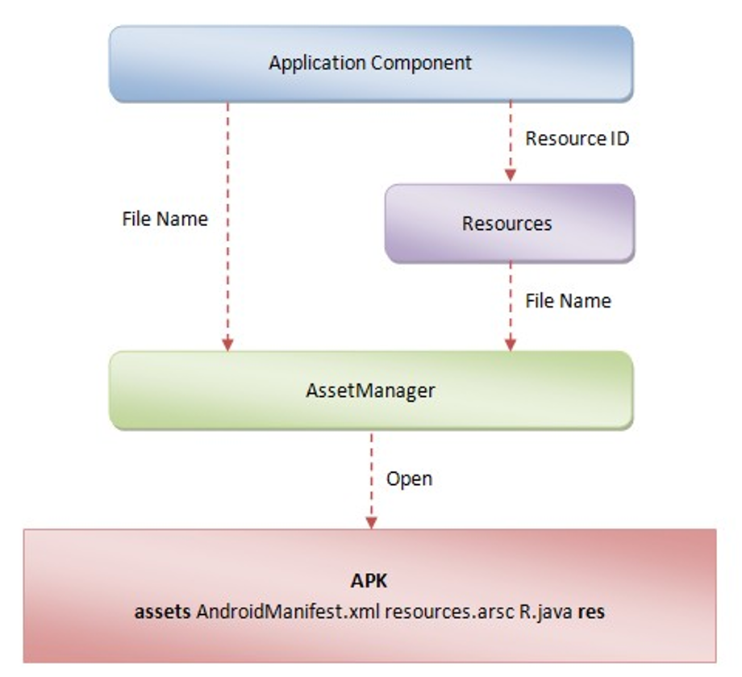

# App 主题切换与动态换肤

动态换肤的需求：

- App 能够支持替换资源（文字、颜色、图片）等资源
- 满足用户新鲜感，提升增值业务产品吸引力。

换肤的方法：

- 最传统的方法就是定义多套 theme，theme 中定义对应的资源属性，控件引用 theme 中的定义的资源引用，然后在 Activity 启动时应用对应的 theme，在 AppCompat 23.2.0 中，官方也提供了 DayNight 模式切换。一般用于没有其他需求的日间/夜间模式app。
- 动态换肤：通过运行时动态加载皮肤包，比如网易云音乐。

---
## 1 使用 AppCompat 实现主题切换

AppCompat 23.2.0 开始提供了主题切换的功能，应用这个模式，我们只要准备两套颜色、图片资源等资源放在对应的文件夹，调用切换代码即可轻松实现模式切换。总的来说，步骤如下：

- 主题继承 Theme.AppCompat.DayNight
- 对于 night 主题资源，放在 xxx-night 资源目录下，与默认资源目录一一对于即可
- xml 中直接引用资源即可
- 调用 AppCompatDelegate 切换模式，然后 recreate Activity 即可

具体可以参考：

- [Android Developers Blog](https://android-developers.googleblog.com/2016/02/android-support-library-232.html)
- [android-support-23.2-sample](https://github.com/liaohuqiu/android-support-23.2-sample)
- [AppCompat v23.2 - 夜间模式，你所不知道的坑](https://www.jianshu.com/p/7cf714311304)
- [「译」AppCompat v23.2 - 夜间模式最佳实践](http://kingideayou.github.io/2016/03/07/appcompat_23.2_day_night/)
- [AppCompat v23.2 - 夜间模式最佳实践](http://kingideayou.github.io/2016/03/07/appcompat_23.2_day_night/)

---
## 2 定义多套 theme 来实现主题切换

- 定义多套主题
- 在 xml 中不直接引用 `color.xml` 中的颜色，而是使用`android:textColor="?android:textColorPrimaryInverse"` 和 `"?attr/sideBarBackground"`引用演示和 drawable 等资源
- 在 Activity 的 onCreate 方法中调用 setContentView 之前调用 setTheme 方法，设置对于的主题

除此之外，还存在一些遇到的问题：

- `vector.xml 在 api 21 之前不支持引用 style 中的属性`：对于 imageview 可以使用 `tint`
- `api 21 之前只支持 tint 属性，大部分控件不支持 backgroundTint 等属性`，参考 ViewCompat.setBackgroundTintList 方法让自定义 View 支持在代码中设置 backgroundTint 属性，两外 AppCompatButton 支持在 xml 中设置 backgroundTint，参考其源码可以让自定义 View 也支持在 xml 中设置 backgroundTint。
- `xml 中定义的 drawable 不支持引用 style 中的颜色`：这种情况，必须定义多套 drawable，然后在不同的 theme 中引用对于的 drwable，然后 xml 中引用 theme 中定义的 drawable。

---
## 3 动态换肤

动态换肤需求：

- 支持一键切换。
- 支持远程下载皮肤包。
- 无需重启。

动态换肤流程：

- 每次打开一个 Activity，都采集需要换肤的控件。
- 在需要换肤的时候，加载皮肤资源包，对所有收集到的控件应用新的资源样式，从而避免 Activity 重启。

### 如何采集控件

获得 Activity 的 LayoutInflater，设置 Factory/Factory2，实现 onCreateView 获得所有的 View，判断是否包含对应属性。

### 如果定义皮肤包

首先要理清 Android 加载资源的流程：

通过流程图可以看出，最终资源都是通过 AssetManager 进行加载的。于是可以 hook 掉资源加载的过程，根据对应的皮肤包创建 AssetManager。

所有一点非常重要，**资源的命名一定要规范，皮肤包的资源命名要与默认皮肤的资源命名保持一致**。

### 具体代码实现

参考：[DNSkin](../../00-Code/DNSkin/README.md)

## 4 第三方库

[Android-skin-support](https://github.com/ximsfei/Android-skin-support)
