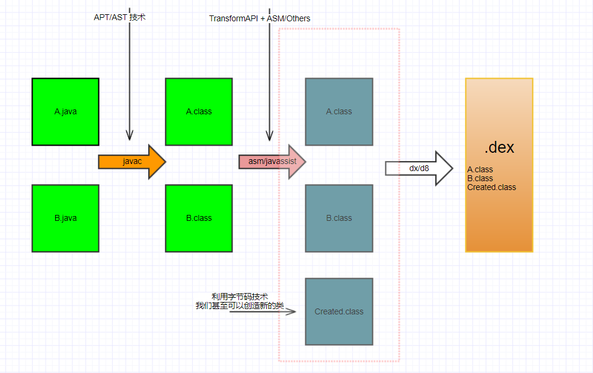

# Android AOP 编程概述

在 OOP 的实践中，发现有些问题是 OOP 无法解决的，OOP 强调的是封装、继承。但是有一类代码不属于特定的某个模块而又要参与到每个模块当中，这类代码不影响核心业务流程，但是在项目架构中又是必须的，比如日志、统计、性能监控、安全能代码。使用 AOP 可以把这些烦人的代码划分为切面模块，相对于纵向的业务流程来讲，它们横切入业务流程的各个流程之中，而又不影响具体的业务(业务代码对此毫无感知)，这就是 AOP 编程思想。

## 1 AOP 可选方案

在 Android 平台上，实施 AOP 编程的可选方案：

1. 动态（运行时） AOP：
   - Dexposed
   - Xposed
   - [Epic](https://github.com/tiann/epic) 等
2. 静态（编译时） AOP：
   - apt、ast(抽象语法树)
   - aspactJ
   - javassist
   - asm
   - ByteBuddy

受限于 Android 平台的虚拟机实现，实施动态（运行时） AOP 是比较复杂的，部分框架需要获取 root 权限，除此之外，客户端系统版本碎片化也比较严重，所以静态（编译时） AOP 是相对靠谱的选择。

## 2 AOP 入口

Android 平台的虚拟机运行的是 dex 文件，dex 文件的生成需要下面两个步骤：

- `.java -> .class/.jar`
- `.class/.jar -> .dex`

这两个过程都可以被用来插入代码，但使用的技术不一样。

- 对于 `.java -> .class/.jar` 过程，可以使用 apt、ast 技术。
- 对于 `.class/.jar` 转换为 `.dex` 过程，可以通过 asm/javassist 等字节码遍及框架对字节码进行修改，插入切面代码，从而实现 AOP。

可选方案：

- 使用 APT，在编译器使用 APT 可以生成一些模板代码，但是不能修改已有源码。
- 使用 AST，利用 AST 抽象语法树 API 可以修改源码，但是使用起来比较复杂。
- 编辑字节码：
  - Android Gradle Plugin 1.5 之前可能需要特定的 hook 手段，比如修改 dex 等构建工具 或 java 的 Instumentation 机制。（不过现在已不需要再考虑这种情况）
  - Android Gradle Plugin 1.5 之后提供了 Transform API，我们可以利用 Transform API 对转换为 dex 之前的 class 做一些处理，比如插入/替换一些代码，基于这种方式，可供选择的字节码编辑库有：aspactJ、javassist、asm 等。这种方式的好处在于可以做到对业务代码完全无侵入。

## 3 掌握字节码结构

既然涉及到字节码编辑，熟悉字节码结构是必不可少的，而 Java 平台和 Android 平台所运行的字节码又是不同的，具体参考下面链接：

Java：

- [The Java® Virtual Machine Specification](https://docs.oracle.com/javase/specs/jvms/se11/html/index.html)

Android：

- [Dalvik 字节码](https://source.android.com/devices/tech/dalvik/dalvik-bytecode)
- [Dalvik 可执行文件格式](https://source.android.com/devices/tech/dalvik/dex-format)
- [Dalvik and ART](07-Dalvik%20and%20ART.pdf)
- [Understanding the Davlik Virtual Machine](07-Understanding%20the%20Davlik%20Virtual%20Machine.pdf)

## 4 AOP 应用

- 代码生成与删除：比如业务逻辑跳转时，校验是否已经登录；点击事件防抖；日志代码去除。
- 无痕埋点
- 代码质量监控与分析
- 性能监控
- 动态权限控制

## 5 Gradle 插件

Android Gradle Plugin 1.5 之后提供了 Transform API，我们可以利用 Transform API 对转换为 dex 之前的 class 做一些处理，但是想要写好一个高效的 Transform 并不是易的事，具体参考 [Gradle-TransformAPI](../../Gradle/Android-TransformAPI.md)。

## 6 AOP 相关学习资料

### AOP 入门

- [极客时间《Android开发高手课》编译插桩的三种方法：AspectJ、ASM、ReDex](https://time.geekbang.org/column/article/82761)
  - [ASM Sample](https://github.com/AndroidAdvanceWithGeektime/Chapter07)
  - [Chapter-ASM](https://github.com/AndroidAdvanceWithGeektime/Chapter-ASM)
  - [AspectJ Sample](https://github.com/AndroidAdvanceWithGeektime/Chapter27)
- [安卓AOP三剑客:APT, AspectJ, Javassist](https://www.jianshu.com/p/dca3e2c8608a)
- [Android AOP编程的四种策略探讨：Aspectj，cglib+dexmaker，Javassist，epic+dexposed](https://blog.csdn.net/weelyy/article/details/78987087)

### AOP 系列博客

- [一文读懂 AOP | 你想要的最全面 AOP 方法探讨](https://www.jianshu.com/p/0799aa19ada1)
- [一文应用 AOP | 最全选型考量 + 边剖析经典开源库边实践，美滋滋](https://www.jianshu.com/p/42ce95450adb)
- [AOP 最后一块拼图 | AST 抽象语法树 —— 最轻量级的AOP方法](https://juejin.im/post/5c45bce5f265da612c5e2d3f)
- [会用就行了？你知道 AOP 框架的原理吗？](https://www.jianshu.com/p/cfa16f4cf375)

### AST

- [安卓AOP之AST:抽象语法树](https://www.jianshu.com/p/5514cf705666)
- [基于AST的组件化自动插桩方案](https://www.jianshu.com/p/a827a95fde17)

### ASM

- [一起玩转Android项目中的字节码](https://juejin.im/entry/5c0cc7c15188257d5e39647d)、[Hunter：A fast, incremental, concurrent framework to develop compile plugin for android project to manipulate bytecode](https://github.com/Leaking/Hunter)
- [字节码插桩--你也可以轻松掌握](https://juejin.im/entry/5c886d786fb9a049f1550d65)
- [capt 全称 Class Annotation Processor Tool，是作者基于 ASM 和 Android Transform API 打造的 Android 平台的字节码的注解处理工具。](https://mp.weixin.qq.com/s/8_88oUB2MJi27BJJOb-2_Q)
- [ByteX：字节码插件开发平台](https://github.com/bytedance/ByteX)
- [hibeaver](https://github.com/BryanSharp/hibeaver)
- [360线上移动性能检测平台：ArgusAPM](https://github.com/Qihoo360/ArgusAPM)，ArgusAPM 刚开始是基于 AspectJ，后面提供了 ASM 插件。
- [使用ASM Core API修改类](https://smallsoho.com/android/2017/08/07/%E8%AF%91-%E4%BD%BF%E7%94%A8ASM-Core-API%E4%BF%AE%E6%94%B9%E7%B1%BB/)
- [ASM-clickdebounce](https://github.com/SmartDengg/asm-clickdebounce)

### Javassist

- [Android动态编译技术 Plugin Transform Javassist操作Class文件](https://www.jianshu.com/p/a6be7cdcfc65)，基于 Javassist
- [DroidAssist 是一个轻量级的 Android 字节码编辑插件，基于 Javassist 对字节码操作，根据 xml 配置处理 class 文件，以达到对 class 文件进行动态修改的效果](https://github.com/didi/DroidAssist)
- [sdk-editor-plugin](https://github.com/iwhys/sdk-editor-plugin)

### 无痕埋点

- [网易HubbleData之Android无埋点实践](https://neyoufan.github.io/2017/07/11/android/%E7%BD%91%E6%98%93HubbleData%E4%B9%8BAndroid%E6%97%A0%E5%9F%8B%E7%82%B9%E5%AE%9E%E8%B7%B5/)
- [51 信用卡 Android 自动埋点实践](https://mp.weixin.qq.com/s/P95ATtgT2pgx4bSLCAzi3Q)
- [Android AOP之字节码插桩](https://www.jianshu.com/p/c202853059b4)
- [应用于Android无埋点的Gradle插件解析](https://github.com/nailperry-zd/LazierTracker/wiki/%E5%BA%94%E7%94%A8%E4%BA%8EAndroid%E6%97%A0%E5%9F%8B%E7%82%B9%E7%9A%84Gradle%E6%8F%92%E4%BB%B6%E8%A7%A3%E6%9E%90)，基于 ASM

### 笔记

注解：

- [Java-注解01：运行时注解](../../Java/01-Java-Basic/注解01-运行时注解.md)
- [Java-注解02：APT](../../Java/01-Java-Basic/注解02-APT.md)
- [Java-注解03：AST](../../Java/01-Java-Basic/注解03-AST.md)

AspectJ：

- [AspectJ-01](../../Java/02-Advance-Java/AspectJ-01.md)
- [AspectJ-02](../../Java/02-Advance-Java/AspectJ-02.md)

ASM：

- [ASM 入门](../../Java/02-Advance-Java/ASM入门.md)

Javassist：

- [Javassist 入门](../../Java/02-Advance-Java/Javassist入门.md)
