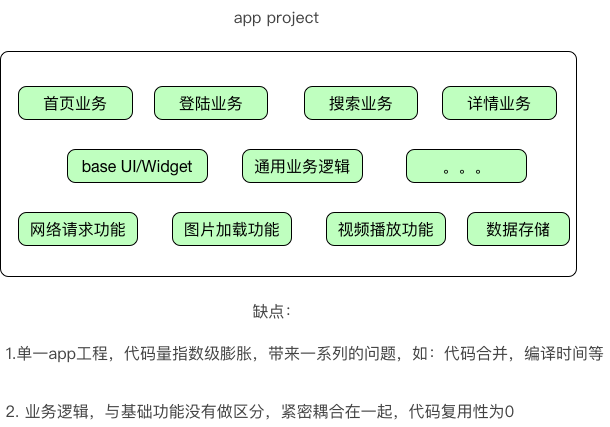
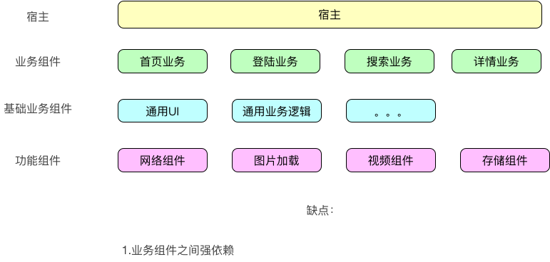
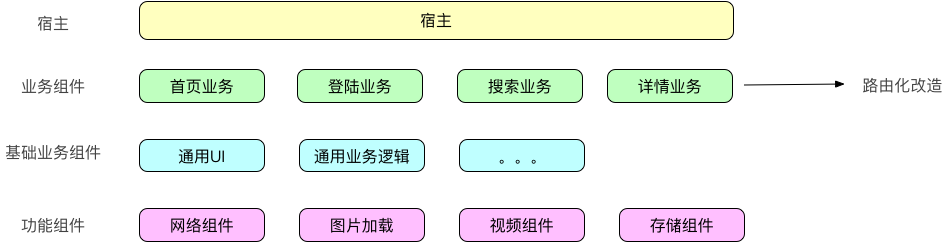
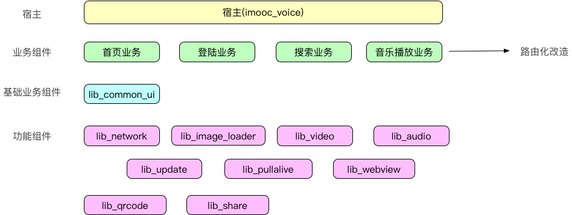

# [企业级架构设计课程](https://coding.imooc.com/class/364.html)笔记

[项目源码](../00-Code/imooc_music_app/README.md)

## 第2章 企业级工程架构分析

传统架构

模块化架构

组件化架构

## 第3章 实战项目需求分析

模块划分

## 第4章 maven私服搭建

- 什么是Maven私服
  - 本地参考
  - 远程仓库
    - mavenCenter
    - jCenter
  - 私服：部署在局域网
- 如何搭建Maven私服
  - nexus

## 第5章 首页框架搭建

略

## 第6章 网络请求组件开发

略

## 第7章 图片加载组件开发

略

## 第8章 登录功能实现

略

## 第9章 音乐播放组件设计与开发（上）【核心、难点】

略

## 第10章 音乐播放组件设计与开发（下）【核心、难点】

略

## 第11章 分享组件设计与开发

略

## 第12章 保活组件设计与开发

- 一像素 Activity 播放无声音乐（不建议使用，破坏生态）
- 前台 Service
- JobService

## 第13章 朋友功能模块开发

略

## 第14章 视频播放组件设计与开发

略

## 第15章 工程组件化改造

略

## 第16章 Android9.0适配及androidx迁移

略

## 第17章 课程总结

略
