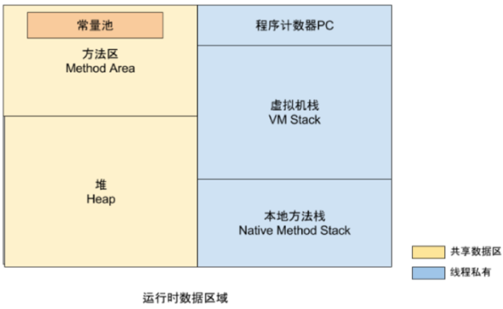
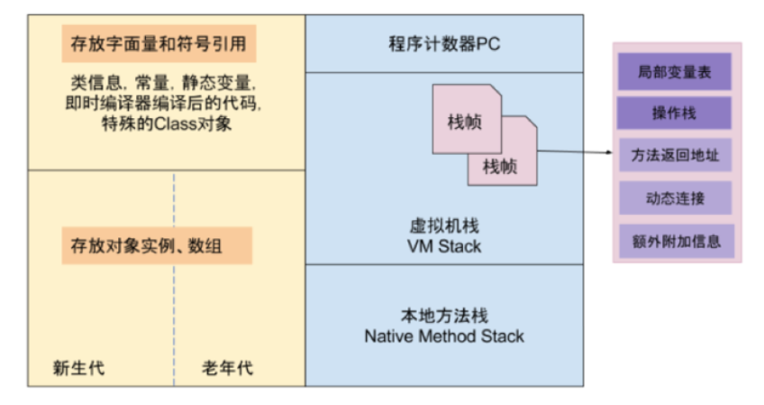
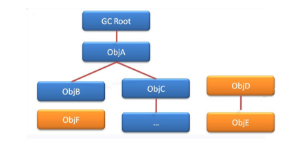
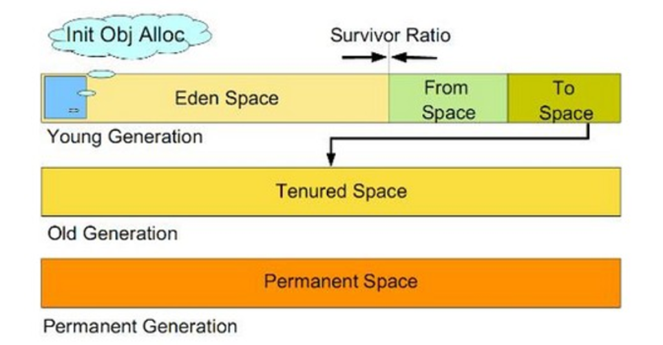
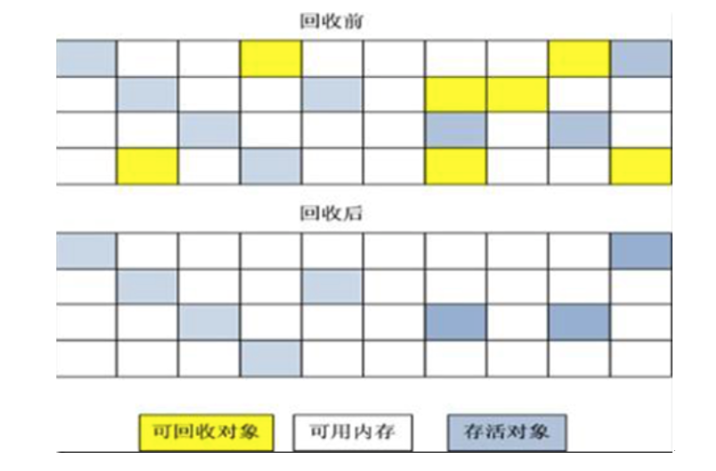
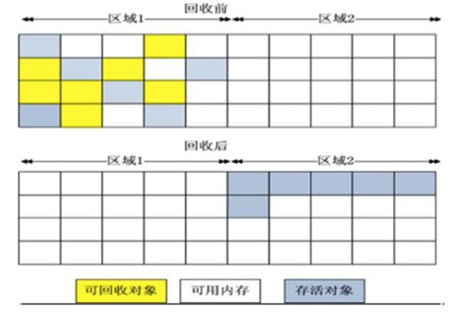
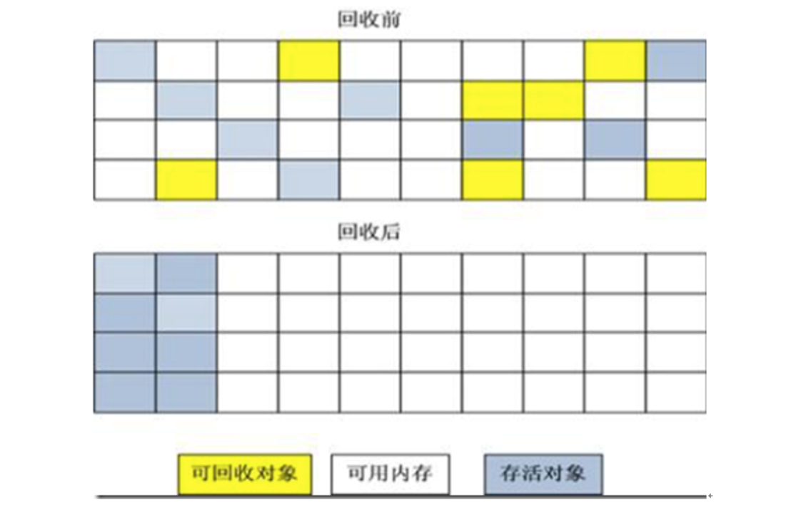
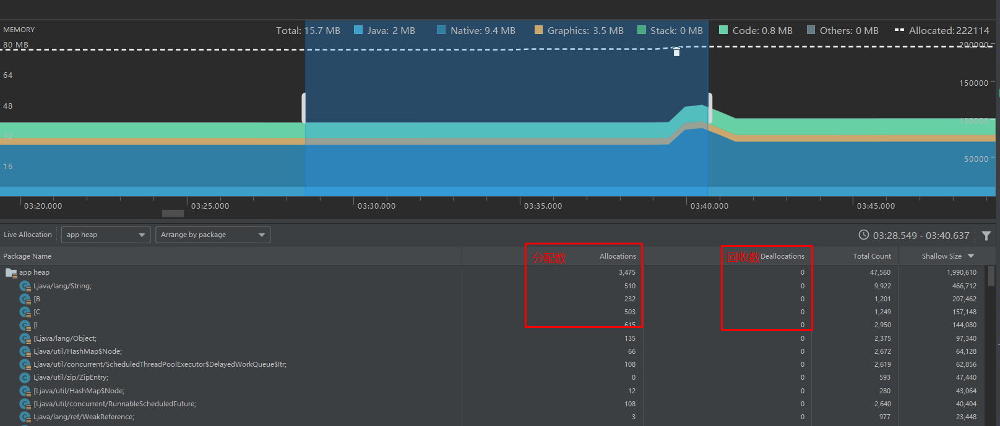

# Android 内存优化

内存优化主要体现在以下方面：

1. 避免内存泄漏，从而避免 OOM。
2. 避免内存抖动，从而避免应用卡顿。
3. 合理使用内存，尽量避免过多的内存分配，从而缓解内存使用压力。

## 1 JVM 内存划分

### 内存的管理方式

- C/C++：程序员自己去分配内存和释放内存——手动管理，(malloc、free)
- Java：程序自带垃圾回收机制，不需要程序员手动管理内存

### 了解内存分配的几种策略

1. 静态的：静态的存储区，内存在程序编译的时候就已经分配好，这块的内存在程序整个运行期间都一直存在。它主要存放静态数据、全局的 static 数据和一些常量。
2. 栈式的：在执行函数(方法)时，函数一些内部变量的存储都可以放在栈上面创建，函数执行结束的时候这些存储单元就会自动被释放掉。栈内存包括分配的运算速度很快，因为内置在处理器的里面的。当然容量有限。
3. 堆式的：也叫做动态内存分配。用 malloc 或者 new 来申请分配一个内存。在 C/C++ 可能需要自己负责释放（java里面直接依赖GC机制）。在 C/C++ 这里是可以自己掌控内存的，需要有很高的素养来解决内存的问题。java 程序员需要的是编程的时候就要注意自己良好的编程习惯。

堆栈区别：

- 堆是不连续的内存区域，堆空间比较灵活也特别大。
- 栈是一块连续的内存区域，大小是有操作系统觉决定的。
- 堆管理很麻烦，频繁地`new/remove`会造成大量的内存碎片，这样就会慢慢导致效率低下。
- 栈先进后出，进出完全不会产生碎片，运行效率高且稳定。

```java
public class Main{
    int a = 1;
    Student s = new Student();
    public void XXX(){
        int b = 1;//栈里面
        Student s2 = new Student();//堆里面
    }

}
```

1.成员变量全部存储在堆中(包括基本数据类型，引用及引用的对象实体)---因为他们属于类，类对象最终还是要被new出来的。
2.局部变量的基本数据类型和引用存储于栈当中，引用的对象实体存储在堆中。-----因为他们属于方法当中的变量，生命周期会随着方法一起结束。

### JVM 内存区域



以上区域可以根据是否为线程共享进行划分：

- 线程私有
  - 程序计数器PC：相当于一个执行代码的指示器，用来确认下一行执行的代码的地址，每个线程都有一个，不会发生OOM。
  - 虚拟机栈：我们平时说的栈就是这块区域，Java 虚拟机规范中在此区域定义了 outofmemory 和 stackoverflow 异常。
  - 本地方法栈：Java 虚拟机规范中在此区域定义了 outofmemory 和 stackoverflow 异常。（在hotspotVM把虚拟机栈和本地方法栈合为一个栈区）
- 共享数据区
  - 方法区：用于存储 ClassLoader 加载的类信息。方法区还包括运行时常量池，用于存储字面量、符号引用等，这里发生 GC 的条件比较苛刻。
  - java堆：虚拟机管理的最大的一块内存，对象都存储在堆中，Java 虚拟机规范中在此区域定义了 outofmemory 异常。



## 2 JVM 的 GC 算法

### 如何判断对象应该被回收

当某对象不再被其他对象引用的时候才会进行回收，那么如何确定一个对象不再被其他对象引用呢？

- 引用计数算法：根据对象的引用数来决定是否回收该对象，缺点是互相引用容易出现计算器永不为 0 的情况，事实上，JVM 从而使用过此算法。
- 可达性分析算法：参考下图，当从 GC ROOT 出发到某一个对象，当无法找到至少一条引用路径时，说明该对象可以被回收。



可作为 GC ROOT 的对象：

- 虚拟机栈正在运行使用的引用。
- 静态属性、常量。
- JNI 引用的对象。

### Java 的四种引用

垃圾回收也与对象的引用类型有关系：

- StrongReference强引用：对象的一般保存，生命周期直到JVM停止的时候才会终止。
- SoftReference软引用：回收时机是当内存不足的时候；使用`SoftReference<String>`结合`ReferenceQueue`构造有效期短，生命周期为内存不足时终止。
- WeakReference弱引用：回收时机是在进行垃圾回收的时候，生命周期为GC后终止，即只要GC发现若引用就会进行回收。
- PhatomReference虚引用：回收时机是在垃圾回收的时候，一般结合`ReferenceQueue`来跟踪对象被垃圾回收期回收的活动，生命周期为GC后终止。

### JVM 内存回收算法

GC 主要发生在堆内存中，而堆内存又可以进一步划分为各种区域。



- 新生代
  - 一个：Eden Space
  - 两个：Survivor Space
- 老年代
- 永久代（Java8 后被元数据区取代）

JVM 会根究不同区域的特点采取不同的垃圾回收算法，常见的算法有：

标记清除算法 Mark-Sweep：



复制算法 Copying：



标记压缩算法Mark-Compact：



各种回收算法各有优缺点，JVM 会根据堆中区域的特点采取最优的回收算法。

常见的垃圾回收器：

- Serial串行收集器
- ParNew 收集器
- Parallel Scavenge收集器
- Serial Old收集器
- Parallel Old收集器
- CMS 收集器（Android ART 默认采用方案），CMS采用"标记-清理"算法实现以获取最短回收停顿时间为目标的收集器：
  - 初始标记：标记一下GC Roots能直接关联到的对象
  - 并发标记：进行GC Roots Tracing 的过程
  - 重新标记：是为了修正并发标记期间因用户程序继续运行而导致标记产品变动的那一部分对象的标记记录
  - 并发清除：清除不能到达GC Roots的对象
  - 重置线程：更新之前使用过的数据

## 3 避免内存泄露

- 什么是内存泄漏(Memory Leak)：内存不在 GC 掌控之内了。当一个对象已经不需要再使用了，本该被回收时，而有另外一个正在使用的对象持有它的引用从而就导致对象不能被回收。这种导致了本该被回收的对象不能被回收而停留在堆内存中，就产生了内存泄漏，我们所讨论内存泄露，主要讨论堆内存，它存放的就是引用指向的对象实体。
- 内存泄漏的危害：进程中某些对象已经没有使用价值了，但是他们却还可以直接或者间接地被引用到 GC Root 导致无法回收。当内存泄露过多的时候，再加上应用本身占用的内存，最终就会导致内存溢出 OOM。
- 什么是内存溢出(OOM)：当应用占用的 heap 资源超过了 Dalvik 虚拟机分配的内存就会内存溢出，应用就会崩溃，比如：加载大图片。

### 如何发现内存泄露

往往做项目的时候情况非常复杂，或者项目做得差不多了想起来要性能优化检查下内存泄露。如何找到项目中存在的内存泄露的这些地方呢？如果我们不知道代码内存泄露的情况，需要凭借工具结合自己的经验来判断，比如我们的app在某个时候或者某个操作以后会出现很卡的现象，判断就是查看内存抖动情况。查找引用了该对象的外部对象有哪些，然后一个一个去猜，查找可能内存泄露的嫌疑犯，依据：看(读代码和猜)他们的生命周期是否一致(可以通过快照对比)，如果生命周期一致了肯定不是元凶。排除一些容易被回收的(软引用、虚引用、弱引用)

#### 1 确定是否存在内存泄露

**Android Monitors的内存分析**：

最直观的看内存增长情况，知道该动作是否发生内存泄露。比如执行某个动作之前，执行GC完后内存为`1.4M`，在动作发生之后再一次GC完后内存`1.6M`，则不可回收的内存增加了`0.2M`

**使用MAT内存分析工具**：

MAT分析heap的总内存占用大小来初步判断是否存在泄露，Heap视图中有一个Type叫做`data object`，即数据对象，也就是我们的程序中大量存在的类类型的对象。在`data object`一行中有一列是`Total Size`，其值就是当前进程中所有Java数据对象的内存总量，一般情况下，这个值的大小决定了是否会有内存泄漏。我们反复执行某一个操作并同时执行GC排除可以回收掉的内存，注意观察`data object`的`Total Size`值，正常情况下`Total Size`值都会稳定在一个有限的范围内，也就是说由于程序中的的代码良好，没有造成对象不被垃圾回收的情况。反之如果代码中存在没有释放对象引用的情况，随着操作次数的增多`Total Size`的值会越来越大。那么这里就已经初步判断这个操作导致了内存泄露的情况。

#### 2 找怀疑对象(哪些对象属于泄露的)

MAT对比操作前后的hprof文件来定位内存泄露是泄露了什么数据对象。这样做可以排除一些对象，不用后面去查看所有被引用的对象是否是嫌疑，
快速定位到操作前后所持有的对象哪些是增加了，GC后还是比之前多出来的对象就可能是泄露对象嫌疑犯。提示：

- Histogram(直方图)中还可以对对象进行Group，比如选择`Group By Package`更方便查看自己Package中的对象信息。
- Android Memory Monitor捕获的hprof文件不是标准的hprof文件，需要在 Cuptures 栏右击文件导入标准的 hprof 文件才能被 MAT 分析,或者也可以使用命令行：`hprof-conv -z origin.hprof new.hprof`。

>hprof-conv位置：`sdk/platform-tools/hprof-conv.exe`

#### 3 MAT 分析 hprof 来定位内存泄露的原因所在

找到哪个对象持有了上面怀疑出来的发生泄露的对象？

1. Dump 出内存泄露“当时”的内存镜像 hprof，分析怀疑泄露的类。
2. 把上面 2 得出的这些嫌疑犯一个一个排查个遍。步骤：
   - 进入 Histogram，过滤出某一个嫌疑对象类
   - 然后分析持有此类对象引用的外部对象（在该类上面点击右键`List Objects--->with incoming references`）
   - 再过滤掉一些弱引用、软引用、虚引用，因为它们迟早可以被GC干掉不属于内存泄露，(在类上面点击右键`Merge Shortest Paths to GC Roots--->exclude all phantom/weak/soft etc.references`)
   - 逐个分析每个对象的 GC 路径是否正常，此时就要进入代码分析，判断此时这个对象的引用持有是否合理，这就要靠经验了。

### 如何判断一个应用里面避免内存泄露做得很好

当 app 退出的时候，这个进程里面绝大部分的对象应该就都被回收了，尤其是很容易被泄露的（View，Activity）是否还内存当中。可以让 app 退出以后，查看系统该进程里面的所有的 View、Activity 对象是否为0.

工具：使用`AndroidStudio--AndroidMonitor--System Information--Memory Usage`查看 Objects 里面的 views 和 Activity 的数量是否为0.

## 4 内存泄露例子

### 单例模式或静态变量引起的内存泄露

当调用getInstance时，如果传入的context是Activity的context。只要这个单例没有被释放，那么这个Activity也不会被释放一直到进程退出才会释放。所以能用Application的context就用Application的

```java
    public class CommUtil {
        private static CommUtil instance;
        private Context context;

        private CommUtil(Context context){
            this.context = context;
        }

        public static CommUtil getInstance(Context mcontext){
            if(instance == null){
                instance = new CommUtil(mcontext);
            } else{
                instance.setContext(mcontext);
            }
            return instance;
        }
```

### 非静态内部类(包括匿名内部类)引起内存泄露

错误的示范：

```java
        public void loadData(){//隐式持有外部类实例，比如MainActivity.this
            new Thread(new Runnable() {
                @Override
                public void run() {
                    while(true){
                        try {
                            Thread.sleep(1000);
                        } catch (InterruptedException e) {
                            e.printStackTrace();
                        }
                    }
                }
            }).start();
        }
```

解决方案：将非静态内部类修改为静态内部类。（静态内部类不会隐士持有外部类）

### 不需要用的监听未移除会发生内存泄露

例子1：

```java
public void sample(){
        //add监听，放到集合里面
        tv.getViewTreeObserver().addOnWindowFocusChangeListener(new ViewTreeObserver.OnWindowFocusChangeListener() {
            @Override
            public void onWindowFocusChanged(boolean b) {
                //监听view的加载，view加载出来的时候，计算他的宽高等。
                //计算完后，一定要移除这个监听
                tv.getViewTreeObserver().removeOnWindowFocusChangeListener(this);
            }
        });
}
```

例子2：

```java
public void sample(){
        SensorManager sensorManager = getSystemService(SENSOR_SERVICE);
        Sensor sensor = sensorManager.getDefaultSensor(Sensor.TYPE_ALL);
        sensorManager.registerListener(this,sensor,SensorManager.SENSOR_DELAY_FASTEST);
        //不需要用的时候记得移除监听
        sensorManager.unregisterListener(listener);
}
```

例子3：

```java
public void sample(){
    handler.post(callback)
    onDestroy(){
        //在需要的时候进行remove
        handler.removeCallback();
    }
}
```

### 资源未关闭引起的内存泄露情况

当不需要使用的时候，要记得及时释放资源。否则就会内存泄露。比如：BroadCastReceiver、Cursor、Bitmap、IO流、自定义属性attribute、attr.recycle() 回收。

### 无限循环动画

没有在 onDestroy 中停止动画，否则 Activity 就会变成泄露对象，比如：轮播图效果。

## 5 内存抖动

什么是内存抖动：内存频繁的分配与回收，当分配速度大于回收速度，最终会产生 OOM。

通过 AndroidStudio 的 Profiler 工具，可以轻松地检测出内存抖动的情况。



如果内存占用动态图出现了连续的锯齿状，则说明这段时间内存发生了频繁的分配与回收，同时也可以查看下面对象的分配与回收数。

## 6  优化建议

- 数据类型：不要使用比需求更占空间的基本数据类型。
- 很多时候去想到主动将对象置为 null 是很好的习惯。
- 循环尽量用 foreach，少用 iterator。
- 自动装箱尽量少用。
- 使用更适合的数据结构或算法来解决问题
  - 数组，链表，栈，树，图。
  - 数据量千级以内可以使用 Sparse 数组(key为整数)，ArrayMap（key为对象）性能不如 HashMap 但节约内存。
- 枚举优化：每一个枚举值都是一个单例对象，在使用它时会增加额外的内存消耗，可以考虑使用`注解 + 整型`的方式来代替枚举的使用。
- 字符串的连接尽量少用加号(+)。
- 重复申请内存的问题：
  - 避免在递归函数、回调函数中 new 对象，避免直接在循环中 new 对象等。
  - 不要在 `onMeause()  onLayout() onDraw()` 分配对象。
- 避免 GC 回收将来要重用的对象：内存设计模式对象沲+LRU算法。
- 使用 LRUCache 算法管理缓存。
- Handler 的使用问题：
  - 非静态内部类持有外部内引用问题,如果开启的线程需要传入参数，用弱引接收可解决问题。
  - handler.postDelayed()问题，记得在 Activity/Fragment 销毁时，调用 `handler.removeCallbacksAndMessages(null)`。
- 对于图片列表，一个列表可能占用着大量的内存，对应这种情况，可以监听UI的状态，如果 Fragment/Activity 处于不可见状态，可以暂时把列表置空，然后在Fragment或Activity可见时重新设置之前的数据，这样在UI处于不可见的状态下，列表上的图片都是可被回收的，需要注意的是，在给列表重新设置之前的数据后，尽可能的恢复之气的UI状态
- 合理使用 Java 的四种引用类型：为了防止内存溢出，处理一些比较占用内存大并且生命周期长的对象的时候，可以尽量使用软引用和弱引用。
- 尽量使用IntentService，而不是 Service。
- WebView 放在单独的进程中。

举例，避免深度递归：

```java
 public int computeFibonacci(int positionInFibSequence) {
       //0 1 1 2 3 5 8
       if (positionInFibSequence <= 2) {
           return 1;
       } else {
           return computeFibonacci(positionInFibSequence - 1)
                   + computeFibonacci(positionInFibSequence - 2);
       }
   }
    //优化后的斐波那契数列的非递归算法 caching缓存+批处理思想
    public int computeFibonacci(int positionInFibSequence) {
        int prev = 0;
        int current = 1;
        int newValue;
        for (int i=1; i<positionInFibSequence; i++) {
            newValue = current + prev;
            prev = current;
            current = newValue;
        }
        return current;
    }
```

举例，对于因为系统本身存在的内存泄漏问题，可以采用发射的方式断开引用链，比如因输入法导致的内存泄漏问题：

```java
    public void fixMemoryLeak(String attr){
        InputMethodManager im=(InputMethodManager)getSystemService(Context.INPUT_METHOD_SERVICE);
        try{
            Field mCurRootViewField = InputMethodManager.class.getDeclaredField(attr);
            mCurRootViewField.setAccessible(true);
            //取对象
            Object mCurRootView=mCurRootViewField.get(im);

            if (null!=mCurRootView) {
                Context context=((View)mCurRootView).getContext();
                if(context==this){
                    //破坏GC链
                    mCurRootViewField.set(im,null);
                }
            }
        }catch(Exception e){
            e.printStackTrace();
        }
    }
```

## 7 优化工具

内存优化的帮助工具包括：

- MAT：hrop分析工具
- Android Device Monitor：包括很多检测工具
- Memory Monitor：用于 dump 堆内存信息
- Allaction Tracking：追踪内存分配信息。可以很直观地看到某个操作的内存是如何进行一步一步地分配的。
- LeakCanary：Square公司开源工具，可以直接在手机端查看内存泄露的工具。
- Lint 工具：AndroidStudio 提供的静态代码检查工具

### LeakCanary

实现原理：本质上还是用命令控制生成 hprof 文件分析检查内存泄露，然后发送通知。大概的步骤：

```java
Application
    install()
LeakCanary
    androidWatcher()
RefWatcher
    new AndroidWatcherExecutor() ---> dumpHeap()/analyze()---> runAnalysis()---> Hprof文件分析
    new AndroidHeapDumper()
    new ServiceHeapDumpListener
```

### Lint分析工具

Lint提供了以下功能

- 检测资源文件是否有没有用到的资源
- 检测常见内存泄露
- 安全问题SDK版本安全问题
- 是否有废弃的代码没有被用到
- 代码的规范，比如驼峰命名法检测
- 没用的导包
- 可能的bug
