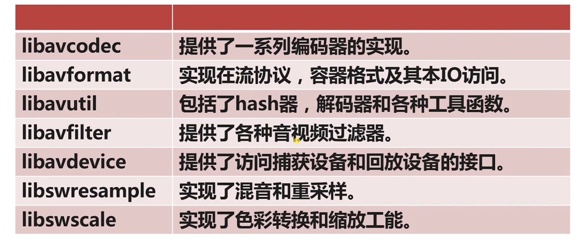

# 5 FFmpeg多媒体文件处理

## 5-1 ffmpeg初级开发介绍

- FFmpeg 日志的使用及目录操作
- FFmpeg 的基本概念及常用结构体
- 对复用/解复用及流操作的各种实战

FFmpeg 代码结构：

## 5-2 ffmpeg开发入门Log系统

## 5-3 ffmpeg文件的删除与重命名

## 5-4 ffmpeg操作目录及list的实现-1

## 5-5 ffmpeg操作目录及list的实现-2

## 5-6 ffmpeg处理流数据的基本概念

## 5-7 ffmpeg打印音视频Meta信息

## 5-8 ffmpeg抽取音频数据-1

## 5-9 ffmpeg抽取音频数据-2

## 5-10 ffmpeg抽取音频数据-3

## 5-11 ffmpeg抽取视频H264数据-1

## 5-12 ffmpeg抽取视频H264数据-2

## 5-13 ffmpeg抽取视频H264数据-3

## 5-14 ffmpeg将mp4转成flv-1

## 5-15 ffmpeg将mp4转成flv-2

## 5-16 ffmpeg音视频裁剪

## 5-17 作业：ffmpeg实现小咖秀