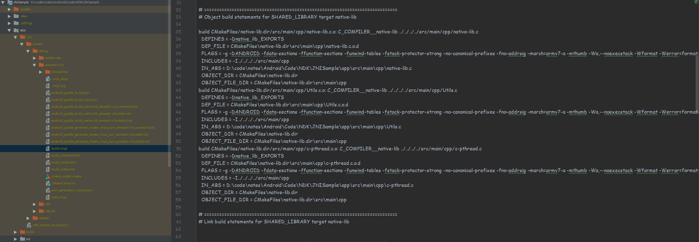

# 编译 FFmeng

---

## 1 编译相关资料

编译教程：

- [FFmpeg官方编译指引](https://trac.ffmpeg.org/wiki/CompilationGuide)，务必要先读一遍官方指南。
- [编译FFmpeg4.1.3并移植到Android app中使用（最详细的FFmpeg-Android编译教程）](https://blog.csdn.net/bobcat_kay/article/details/80889398?utm_medium=distribute.pc_relevant_t0.none-task-blog-BlogCommendFromMachineLearnPai2-1&depth_1-utm_source=distribute.pc_relevant_t0.none-task-blog-BlogCommendFromMachineLearnPai2-1)
- [音视频学习 (六) 一键编译 32/64 位 FFmpeg 4.2.2](https://github.com/yangkun19921001/Blog/blob/master/NDK/%E9%9F%B3%E8%A7%86%E9%A2%91%E5%AD%A6%E4%B9%A0%20(%E5%85%AD)%20FFmpeg4.2.2%20%E4%BA%A4%E5%8F%89%E7%BC%96%E8%AF%91%E5%8A%A8%E6%80%81%E9%9D%99%E6%80%81%E5%BA%93.md)

已经编译好的项目：

- [BlogDemo](https://github.com/burgessjp/BlogDemo)：CMake 方式编译的 FFmpeg
- [ffmpeg-android-java](https://github.com/WritingMinds/ffmpeg-android-java)：在 Android 端运行 FFmpeg 命令行。
- [FFmpeg4Android](https://github.com/mabeijianxi/FFmpeg4Android)：这是一个编译 Android 下可用的 FFmpeg 的项目，内含代码示例。包含 libx264 全平台编译脚本、libfdk-aac 全平台编译脚本。

注意：由于 NDK 一直在改进，所以一定要了解自己所使用的 NDK 版本做了哪些修改，不然遇到编译错误问题很难解决的。

---

## 2 编译方式

在 Android 中使用 FFmpeg 的方式：

1. 只编译出共享库和头文件，然后自己编写 c/c++ 代码调用相关的 API。
2. 编译出共享库和头文件后，将 `ffmpeg.h, ffmpeg.c` 等相关文件也集成到项目中，这样我们就可以在 Android 中执行 FFmpeg 命令。
3. 编译出可以在 Android 平台运行的 FFmpeg 可执行文件，这样我们就只能在 Android 中使用 FFmpeg 命令。

---

## 3 编译参数说明

解压出来后进入 ffmpeg 解压目录，可以看到里面有各种文件、文档。需要关注的是`configure`文件。这个文件本身就是一个shell脚本，作用为生成`makfile`文件，然后使用`make`执行。

1. 首先尝试执行一下 `./configure` 命令，检测一下缓解。
2. configure 文件中描述了各个模块之间的依赖关系，其内部提供了很多配置，用于对编译行为进行控制，configure 的配置方式可以从`./configure --help`命令获取。

尝试运行以下 `./configure --help` 会得到以下输出：

```shell
ubuntu@VM-0-7-ubuntu:~/FFmpeg-release-4.2$ ./configure --help
Usage: configure [options]
Options: [defaults in brackets after descriptions]

Help options:
  --help                   print this message
  --quiet                  Suppress showing informative output
  --list-decoders          show all available decoders
  --list-encoders          show all available encoders
  --list-hwaccels          show all available hardware accelerators
  --list-demuxers          show all available demuxers
  --list-muxers            show all available muxers
  --list-parsers           show all available parsers
  --list-protocols         show all available protocols
  --list-bsfs              show all available bitstream filters
  --list-indevs            show all available input devices
  --list-outdevs           show all available output devices
  --list-filters           show all available filters

Standard options:
  --logfile=FILE           log tests and output to FILE [ffbuild/config.log]
  --disable-logging        do not log configure debug information
  --fatal-warnings         fail if any configure warning is generated
  #编译出的文件保存位置，必须指定。
  --prefix=PREFIX          install in PREFIX [/usr/local]
  --bindir=DIR             install binaries in DIR [PREFIX/bin]
  --datadir=DIR            install data files in DIR [PREFIX/share/ffmpeg]
  --docdir=DIR             install documentation in DIR [PREFIX/share/doc/ffmpeg]
  --libdir=DIR             install libs in DIR [PREFIX/lib]
  --shlibdir=DIR           install shared libs in DIR [LIBDIR]
  --incdir=DIR             install includes in DIR [PREFIX/include]
  --mandir=DIR             install man page in DIR [PREFIX/share/man]
  --pkgconfigdir=DIR       install pkg-config files in DIR [LIBDIR/pkgconfig]
  --enable-rpath           use rpath to allow installing libraries in paths
                           not part of the dynamic linker search path
                           use rpath when linking programs (USE WITH CARE)
  --install-name-dir=DIR   Darwin directory name for installed targets

Licensing options:
  --enable-gpl             allow use of GPL code, the resulting libs
                           and binaries will be under GPL [no]
  --enable-version3        upgrade (L)GPL to version 3 [no]
  --enable-nonfree         allow use of nonfree code, the resulting libs
                           and binaries will be unredistributable [no]

Configuration options:
  # 禁用编译为静态库
  --disable-static         do not build static libraries [no]
  # 编译为共享库
  --enable-shared          build shared libraries [no]
  # 用于优化库的大小，编译时可以加上
  --enable-small           optimize for size instead of speed
  --disable-runtime-cpudetect disable detecting CPU capabilities at runtime (smaller binary)
  --enable-gray            enable full grayscale support (slower color)
  --disable-swscale-alpha  disable alpha channel support in swscale
  --disable-all            disable building components, libraries and programs
  --disable-autodetect     disable automatically detected external libraries [no]

# 下面四个选项用于指定是否生成可执行程序，使用 disable-programs 可以关务另外三个。
Program options:
  --disable-programs       do not build command line programs
  --disable-ffmpeg         disable ffmpeg build
  --disable-ffplay         disable ffplay build
  --disable-ffprobe        disable ffprobe build

Documentation options:
  --disable-doc            do not build documentation
  --disable-htmlpages      do not build HTML documentation pages
  --disable-manpages       do not build man documentation pages
  --disable-podpages       do not build POD documentation pages
  --disable-txtpages       do not build text documentation pages

Component options:
  #用于操作摄像头，Android 中不支持，可以关掉。
  --disable-avdevice       disable libavdevice build
  #音视频编解码，需要用到。
  --disable-avcodec        disable libavcodec build
  ##音视频格式生成和解析相关
  --disable-avformat       disable libavformat build
  #音频重采样（如果想把单声道，变成双声道）
  --disable-swresample     disable libswresample build
  #对视频显示相关（对视频的缩放，放大 缩小）
  --disable-swscale        disable libswscale build
  #后期处理，很少用，可以关闭掉
  --disable-postproc       disable libpostproc build
  #滤镜、水印等，比如给视频加水印，加字幕，特殊效果
  --disable-avfilter       disable libavfilter build
  --enable-avresample      enable libavresample build (deprecated) [no]
  --disable-pthreads       disable pthreads [autodetect]
  --disable-w32threads     disable Win32 threads [autodetect]
  --disable-os2threads     disable OS/2 threads [autodetect]
  --disable-network        disable network support [no]
  --disable-dct            disable DCT code
  --disable-dwt            disable DWT code
  --disable-error-resilience disable error resilience code
  --disable-lsp            disable LSP code
  --disable-lzo            disable LZO decoder code
  --disable-mdct           disable MDCT code
  --disable-rdft           disable RDFT code
  --disable-fft            disable FFT code
  --disable-faan           disable floating point AAN (I)DCT code
  --disable-pixelutils     disable pixel utils in libavutil

# 独立组件选项
Individual component options:
  --disable-everything     disable all components listed below
  --disable-encoder=NAME   disable encoder NAME
  --enable-encoder=NAME    enable encoder NAME
  # 如果仅仅是开发播放器，encoders 可以关掉。
  --disable-encoders       disable all encoders
  --disable-decoder=NAME   disable decoder NAME
  --enable-decoder=NAME    enable decoder NAME
  --disable-decoders       disable all decoders
  --disable-hwaccel=NAME   disable hwaccel NAME
  --enable-hwaccel=NAME    enable hwaccel NAME
  --disable-hwaccels       disable all hwaccels
  --disable-muxer=NAME     disable muxer NAME
  --enable-muxer=NAME      enable muxer NAME
  #混合封装（音视频等于 一段音频 + 一段视频 + 合并在一起 就是封装后的媒体文件，比如 .mp4，muxers 就是用来做封装的，开发播放器的话，不需要封装功能，可以关闭）
  --disable-muxers         disable all muxers
  --disable-demuxer=NAME   disable demuxer NAME
  --enable-demuxer=NAME    enable demuxer NAME
  --disable-demuxers       disable all demuxers
  --enable-parser=NAME     enable parser NAME
  --disable-parser=NAME    disable parser NAME
  --disable-parsers        disable all parsers
  --enable-bsf=NAME        enable bitstream filter NAME
  --disable-bsf=NAME       disable bitstream filter NAME
  --disable-bsfs           disable all bitstream filters
  --enable-protocol=NAME   enable protocol NAME
  --disable-protocol=NAME  disable protocol NAME
  --disable-protocols      disable all protocols
  --enable-indev=NAME      enable input device NAME
  --disable-indev=NAME     disable input device NAME
  --disable-indevs         disable input devices
  --enable-outdev=NAME     enable output device NAME
  --disable-outdev=NAME    disable output device NAME
  --disable-outdevs        disable output devices
  --disable-devices        disable all devices
  --enable-filter=NAME     enable filter NAME
  --disable-filter=NAME    disable filter NAME
  --disable-filters        disable all filters

# 第三方扩展库支持，比如 x264，opengl 等等
External library support:

  Using any of the following switches will allow FFmpeg to link to the
  corresponding external library. All the components depending on that library
  will become enabled, if all their other dependencies are met and they are not
  explicitly disabled. E.g. --enable-libwavpack will enable linking to
  libwavpack and allow the libwavpack encoder to be built, unless it is
  specifically disabled with --disable-encoder=libwavpack.

  Note that only the system libraries are auto-detected. All the other external
  libraries must be explicitly enabled.

  Also note that the following help text describes the purpose of the libraries
  themselves, not all their features will necessarily be usable by FFmpeg.

  --disable-alsa           disable ALSA support [autodetect]
  --disable-appkit         disable Apple AppKit framework [autodetect]
  --disable-avfoundation   disable Apple AVFoundation framework [autodetect]
  --enable-avisynth        enable reading of AviSynth script files [no]
  --disable-bzlib          disable bzlib [autodetect]
  --disable-coreimage      disable Apple CoreImage framework [autodetect]
  --enable-chromaprint     enable audio fingerprinting with chromaprint [no]
  --enable-frei0r          enable frei0r video filtering [no]
  --enable-gcrypt          enable gcrypt, needed for rtmp(t)e support
                           if openssl, librtmp or gmp is not used [no]
  --enable-gmp             enable gmp, needed for rtmp(t)e support
                           if openssl or librtmp is not used [no]
  --enable-gnutls          enable gnutls, needed for https support
                           if openssl, libtls or mbedtls is not used [no]
  --disable-iconv          disable iconv [autodetect]
  --enable-jni             enable JNI support [no]
  --enable-ladspa          enable LADSPA audio filtering [no]
  --enable-libaom          enable AV1 video encoding/decoding via libaom [no]
  --enable-libaribb24      enable ARIB text and caption decoding via libaribb24 [no]
  --enable-libass          enable libass subtitles rendering,
                           needed for subtitles and ass filter [no]
  --enable-libbluray       enable BluRay reading using libbluray [no]
  --enable-libbs2b         enable bs2b DSP library [no]
  --enable-libcaca         enable textual display using libcaca [no]
  --enable-libcelt         enable CELT decoding via libcelt [no]
  --enable-libcdio         enable audio CD grabbing with libcdio [no]
  --enable-libcodec2       enable codec2 en/decoding using libcodec2 [no]
  --enable-libdav1d        enable AV1 decoding via libdav1d [no]
  --enable-libdavs2        enable AVS2 decoding via libdavs2 [no]
  --enable-libdc1394       enable IIDC-1394 grabbing using libdc1394
                           and libraw1394 [no]
  --enable-libfdk-aac      enable AAC de/encoding via libfdk-aac [no]
  --enable-libflite        enable flite (voice synthesis) support via libflite [no]
  --enable-libfontconfig   enable libfontconfig, useful for drawtext filter [no]
  --enable-libfreetype     enable libfreetype, needed for drawtext filter [no]
  --enable-libfribidi      enable libfribidi, improves drawtext filter [no]
  --enable-libgme          enable Game Music Emu via libgme [no]
  --enable-libgsm          enable GSM de/encoding via libgsm [no]
  --enable-libiec61883     enable iec61883 via libiec61883 [no]
  --enable-libilbc         enable iLBC de/encoding via libilbc [no]
  --enable-libjack         enable JACK audio sound server [no]
  --enable-libklvanc       enable Kernel Labs VANC processing [no]
  --enable-libkvazaar      enable HEVC encoding via libkvazaar [no]
  --enable-liblensfun      enable lensfun lens correction [no]
  --enable-libmodplug      enable ModPlug via libmodplug [no]
  --enable-libmp3lame      enable MP3 encoding via libmp3lame [no]
  --enable-libopencore-amrnb enable AMR-NB de/encoding via libopencore-amrnb [no]
  --enable-libopencore-amrwb enable AMR-WB decoding via libopencore-amrwb [no]
  --enable-libopencv       enable video filtering via libopencv [no]
  --enable-libopenh264     enable H.264 encoding via OpenH264 [no]
  --enable-libopenjpeg     enable JPEG 2000 de/encoding via OpenJPEG [no]
  --enable-libopenmpt      enable decoding tracked files via libopenmpt [no]
  --enable-libopus         enable Opus de/encoding via libopus [no]
  --enable-libpulse        enable Pulseaudio input via libpulse [no]
  --enable-librsvg         enable SVG rasterization via librsvg [no]
  --enable-librubberband   enable rubberband needed for rubberband filter [no]
  --enable-librtmp         enable RTMP[E] support via librtmp [no]
  --enable-libshine        enable fixed-point MP3 encoding via libshine [no]
  --enable-libsmbclient    enable Samba protocol via libsmbclient [no]
  --enable-libsnappy       enable Snappy compression, needed for hap encoding [no]
  --enable-libsoxr         enable Include libsoxr resampling [no]
  --enable-libspeex        enable Speex de/encoding via libspeex [no]
  --enable-libsrt          enable Haivision SRT protocol via libsrt [no]
  --enable-libssh          enable SFTP protocol via libssh [no]
  --enable-libtensorflow   enable TensorFlow as a DNN module backend
                           for DNN based filters like sr [no]
  --enable-libtesseract    enable Tesseract, needed for ocr filter [no]
  --enable-libtheora       enable Theora encoding via libtheora [no]
  --enable-libtls          enable LibreSSL (via libtls), needed for https support
                           if openssl, gnutls or mbedtls is not used [no]
  --enable-libtwolame      enable MP2 encoding via libtwolame [no]
  --enable-libv4l2         enable libv4l2/v4l-utils [no]
  --enable-libvidstab      enable video stabilization using vid.stab [no]
  --enable-libvmaf         enable vmaf filter via libvmaf [no]
  --enable-libvo-amrwbenc  enable AMR-WB encoding via libvo-amrwbenc [no]
  --enable-libvorbis       enable Vorbis en/decoding via libvorbis,
                           native implementation exists [no]
  --enable-libvpx          enable VP8 and VP9 de/encoding via libvpx [no]
  --enable-libwavpack      enable wavpack encoding via libwavpack [no]
  --enable-libwebp         enable WebP encoding via libwebp [no]
  --enable-libx264         enable H.264 encoding via x264 [no]
  --enable-libx265         enable HEVC encoding via x265 [no]
  --enable-libxavs         enable AVS encoding via xavs [no]
  --enable-libxavs2        enable AVS2 encoding via xavs2 [no]
  --enable-libxcb          enable X11 grabbing using XCB [autodetect]
  --enable-libxcb-shm      enable X11 grabbing shm communication [autodetect]
  --enable-libxcb-xfixes   enable X11 grabbing mouse rendering [autodetect]
  --enable-libxcb-shape    enable X11 grabbing shape rendering [autodetect]
  --enable-libxvid         enable Xvid encoding via xvidcore,
                           native MPEG-4/Xvid encoder exists [no]
  --enable-libxml2         enable XML parsing using the C library libxml2, needed
                           for dash demuxing support [no]
  --enable-libzimg         enable z.lib, needed for zscale filter [no]
  --enable-libzmq          enable message passing via libzmq [no]
  --enable-libzvbi         enable teletext support via libzvbi [no]
  --enable-lv2             enable LV2 audio filtering [no]
  --disable-lzma           disable lzma [autodetect]
  --enable-decklink        enable Blackmagic DeckLink I/O support [no]
  --enable-mbedtls         enable mbedTLS, needed for https support
                           if openssl, gnutls or libtls is not used [no]
  --enable-mediacodec      enable Android MediaCodec support [no]
  --enable-libmysofa       enable libmysofa, needed for sofalizer filter [no]
  --enable-openal          enable OpenAL 1.1 capture support [no]
  --enable-opencl          enable OpenCL processing [no]
  --enable-opengl          enable OpenGL rendering [no]
  --enable-openssl         enable openssl, needed for https support
                           if gnutls, libtls or mbedtls is not used [no]
  --enable-pocketsphinx    enable PocketSphinx, needed for asr filter [no]
  --disable-sndio          disable sndio support [autodetect]
  --disable-schannel       disable SChannel SSP, needed for TLS support on
                           Windows if openssl and gnutls are not used [autodetect]
  --disable-sdl2           disable sdl2 [autodetect]
  --disable-securetransport disable Secure Transport, needed for TLS support
                           on OSX if openssl and gnutls are not used [autodetect]
  --enable-vapoursynth     enable VapourSynth demuxer [no]
  --disable-xlib           disable xlib [autodetect]
  --disable-zlib           disable zlib [autodetect]

  The following libraries provide various hardware acceleration features:
  --disable-amf            disable AMF video encoding code [autodetect]
  --disable-audiotoolbox   disable Apple AudioToolbox code [autodetect]
  --enable-cuda-nvcc       enable Nvidia CUDA compiler [no]
  --disable-cuda-llvm      disable CUDA compilation using clang [autodetect]
  --disable-cuvid          disable Nvidia CUVID support [autodetect]
  --disable-d3d11va        disable Microsoft Direct3D 11 video acceleration code [autodetect]
  --disable-dxva2          disable Microsoft DirectX 9 video acceleration code [autodetect]
  --disable-ffnvcodec      disable dynamically linked Nvidia code [autodetect]
  --enable-libdrm          enable DRM code (Linux) [no]
  --enable-libmfx          enable Intel MediaSDK (AKA Quick Sync Video) code via libmfx [no]
  --enable-libnpp          enable Nvidia Performance Primitives-based code [no]
  --enable-mmal            enable Broadcom Multi-Media Abstraction Layer (Raspberry Pi) via MMAL [no]
  --disable-nvdec          disable Nvidia video decoding acceleration (via hwaccel) [autodetect]
  --disable-nvenc          disable Nvidia video encoding code [autodetect]
  --enable-omx             enable OpenMAX IL code [no]
  --enable-omx-rpi         enable OpenMAX IL code for Raspberry Pi [no]
  --enable-rkmpp           enable Rockchip Media Process Platform code [no]
  --disable-v4l2-m2m       disable V4L2 mem2mem code [autodetect]
  --disable-vaapi          disable Video Acceleration API (mainly Unix/Intel) code [autodetect]
  --disable-vdpau          disable Nvidia Video Decode and Presentation API for Unix code [autodetect]
  --disable-videotoolbox   disable VideoToolbox code [autodetect]

Toolchain options:
  # 指定 architecture 架构，具体可以选择哪些值呢？可以从 configure 文件中找，打开 configure 文件，搜索 arch 关键字即可。
  --arch=ARCH              select architecture []
  # 同样可以从 configure 文件中找。
  --cpu=CPU                select the minimum required CPU (affects
                           instruction selection, may crash on older CPUs)
  # 用于设置编译工具前缀，这里需要指定为 Android NDK 提供的交叉编译工具。
  # 这里指定前缀是指，ffmpeg 会所用前缀拼接上它需要的工具，比如指定 --cross-prefix=$NKD_ROOT$TOOLCHAIN/bin/arm-linux-androideabi-，然后 ffmpeg 要使用 gcc，则拼接后的命令为 arm-linux-androideabi-gcc
  --cross-prefix=PREFIX    use PREFIX for compilation tools []
  --progs-suffix=SUFFIX    program name suffix []
  # 开启交叉编译，开启之后，使用 cross-prefix 指定交叉编译工具。
  --enable-cross-compile   assume a cross-compiler is used
  # 指定查找头文件与库文件的地方。
  --sysroot=PATH           root of cross-build tree
  --sysinclude=PATH        location of cross-build system headers
  --target-os=OS           compiler targets OS []
  --target-exec=CMD        command to run executables on target
  --target-path=DIR        path to view of build directory on target
  --target-samples=DIR     path to samples directory on target
  --tempprefix=PATH        force fixed dir/prefix instead of mktemp for checks
  # 指定编译器
  --toolchain=NAME         set tool defaults according to NAME
                           (gcc-asan, clang-asan, gcc-msan, clang-msan,
                           gcc-tsan, clang-tsan, gcc-usan, clang-usan,
                           valgrind-massif, valgrind-memcheck,
                           msvc, icl, gcov, llvm-cov, hardened)
  --nm=NM                  use nm tool NM [nm -g]
  --ar=AR                  use archive tool AR [ar]
  --as=AS                  use assembler AS []
  --ln_s=LN_S              use symbolic link tool LN_S [ln -s -f]
  --strip=STRIP            use strip tool STRIP [strip]
  --windres=WINDRES        use windows resource compiler WINDRES [windres]
  --x86asmexe=EXE          use nasm-compatible assembler EXE [nasm]
  --cc=CC                  use C compiler CC [gcc]
  --cxx=CXX                use C compiler CXX [g++]
  --objcc=OCC              use ObjC compiler OCC [gcc]
  --dep-cc=DEPCC           use dependency generator DEPCC [gcc]
  --nvcc=NVCC              use Nvidia CUDA compiler NVCC or clang []
  --ld=LD                  use linker LD []
  --pkg-config=PKGCONFIG   use pkg-config tool PKGCONFIG [pkg-config]
  --pkg-config-flags=FLAGS pass additional flags to pkgconf []
  --ranlib=RANLIB          use ranlib RANLIB [ranlib]
  --doxygen=DOXYGEN        use DOXYGEN to generate API doc [doxygen]
  --host-cc=HOSTCC         use host C compiler HOSTCC
  --host-cflags=HCFLAGS    use HCFLAGS when compiling for host
  --host-cppflags=HCPPFLAGS use HCPPFLAGS when compiling for host
  --host-ld=HOSTLD         use host linker HOSTLD
  --host-ldflags=HLDFLAGS  use HLDFLAGS when linking for host
  --host-extralibs=HLIBS   use libs HLIBS when linking for host
  --host-os=OS             compiler host OS []
  # 添加 c 编译选项
  --extra-cflags=ECFLAGS   add ECFLAGS to CFLAGS []
  # 添加 cpp 编译选项
  --extra-cxxflags=ECFLAGS add ECFLAGS to CXXFLAGS []
  --extra-objcflags=FLAGS  add FLAGS to OBJCFLAGS []
  # 设置连接选项
  --extra-ldflags=ELDFLAGS add ELDFLAGS to LDFLAGS []
  --extra-ldexeflags=ELDFLAGS add ELDFLAGS to LDEXEFLAGS []
  --extra-ldsoflags=ELDFLAGS add ELDFLAGS to LDSOFLAGS []
  --extra-libs=ELIBS       add ELIBS []
  --extra-version=STRING   version string suffix []
  --optflags=OPTFLAGS      override optimization-related compiler flags
  --nvccflags=NVCCFLAGS    override nvcc flags []
  --build-suffix=SUFFIX    library name suffix []
  --enable-pic             build position-independent code
  --enable-thumb           compile for Thumb instruction set
  --enable-lto             use link-time optimization
  --env="ENV=override"     override the environment variables

Advanced options (experts only):
  --malloc-prefix=PREFIX   prefix malloc and related names with PREFIX
  --custom-allocator=NAME  use a supported custom allocator
  --disable-symver         disable symbol versioning
  --enable-hardcoded-tables use hardcoded tables instead of runtime generation
  --disable-safe-bitstream-reader
                           disable buffer boundary checking in bitreaders
                           (faster, but may crash)
  --sws-max-filter-size=N  the max filter size swscale uses [256]

Optimization options (experts only):
  --disable-asm            disable all assembly optimizations
  --disable-altivec        disable AltiVec optimizations
  --disable-vsx            disable VSX optimizations
  --disable-power8         disable POWER8 optimizations
  --disable-amd3dnow       disable 3DNow! optimizations
  --disable-amd3dnowext    disable 3DNow! extended optimizations
  --disable-mmx            disable MMX optimizations
  --disable-mmxext         disable MMXEXT optimizations
  --disable-sse            disable SSE optimizations
  --disable-sse2           disable SSE2 optimizations
  --disable-sse3           disable SSE3 optimizations
  --disable-ssse3          disable SSSE3 optimizations
  --disable-sse4           disable SSE4 optimizations
  --disable-sse42          disable SSE4.2 optimizations
  --disable-avx            disable AVX optimizations
  --disable-xop            disable XOP optimizations
  --disable-fma3           disable FMA3 optimizations
  --disable-fma4           disable FMA4 optimizations
  --disable-avx2           disable AVX2 optimizations
  --disable-avx512         disable AVX-512 optimizations
  --disable-aesni          disable AESNI optimizations
  --disable-armv5te        disable armv5te optimizations
  --disable-armv6          disable armv6 optimizations
  --disable-armv6t2        disable armv6t2 optimizations
  --disable-vfp            disable VFP optimizations
  --disable-neon           disable NEON optimizations
  --disable-inline-asm     disable use of inline assembly
  --disable-x86asm         disable use of standalone x86 assembly
  --disable-mipsdsp        disable MIPS DSP ASE R1 optimizations
  --disable-mipsdspr2      disable MIPS DSP ASE R2 optimizations
  --disable-msa            disable MSA optimizations
  --disable-msa2           disable MSA2 optimizations
  --disable-mipsfpu        disable floating point MIPS optimizations
  --disable-mmi            disable Loongson SIMD optimizations
  --disable-fast-unaligned consider unaligned accesses slow

Developer options (useful when working on FFmpeg itself):
  --disable-debug          disable debugging symbols
  --enable-debug=LEVEL     set the debug level []
  --disable-optimizations  disable compiler optimizations
  --enable-extra-warnings  enable more compiler warnings
  --disable-stripping      disable stripping of executables and shared libraries
  --assert-level=level     0(default), 1 or 2, amount of assertion testing,
                           2 causes a slowdown at runtime.
  --enable-memory-poisoning fill heap uninitialized allocated space with arbitrary data
  --valgrind=VALGRIND      run "make fate" tests through valgrind to detect memory
                           leaks and errors, using the specified valgrind binary.
                           Cannot be combined with --target-exec
  --enable-ftrapv          Trap arithmetic overflows
  --samples=PATH           location of test samples for FATE, if not set use
                           $FATE_SAMPLES at make invocation time.
  --enable-neon-clobber-test check NEON registers for clobbering (should be
                           used only for debugging purposes)
  --enable-xmm-clobber-test check XMM registers for clobbering (Win64-only;
                           should be used only for debugging purposes)
  --enable-random          randomly enable/disable components
  --disable-random
  --enable-random=LIST     randomly enable/disable specific components or
  --disable-random=LIST    component groups. LIST is a comma-separated list
                           of NAME[:PROB] entries where NAME is a component
                           (group) and PROB the probability associated with
                           NAME (default 0.5).
  --random-seed=VALUE      seed value for --enable/disable-random
  --disable-valgrind-backtrace do not print a backtrace under Valgrind
                           (only applies to --disable-optimizations builds)
  --enable-ossfuzz         Enable building fuzzer tool
  --libfuzzer=PATH         path to libfuzzer
  --ignore-tests=TESTS     comma-separated list (without "fate-" prefix
                           in the name) of tests whose result is ignored
  --enable-linux-perf      enable Linux Performance Monitor API

NOTE: Object files are built at the place where configure is launched.
```

---

## 4 编译 FFmpeg-n2.8 版本

环境：

1. FFmpeg-n2.8.8
2. android-ndk-r14b
3. 编译器：gcc

脚本：

```shell
#!/bin/bash

#临时文件夹
export TMPDIR=../temp

#NDK
export NDK=/mnt/d/windows_linux_subsystem/android-ndk-r14b
export SYSROOT=$NDK/platforms/android-19/arch-arm/
export TOOLCHAIN=$NDK/toolchains/arm-linux-androideabi-4.9/prebuilt/linux-x86_64
export CPU=armv7-a

#输出目录
export PREFIX=../android/FFmpeg-n2.8.8/armv7a
export ADDI_CFLAGS="-marm"

#函数
function build_one
{
./configure \
--prefix=$PREFIX \
--enable-shared \
--disable-static \
--disable-doc \
--disable-ffmpeg \
--disable-ffplay \
--disable-ffserver \
--disable-ffprobe \
--disable-postproc \
--disable-avdevice \
--disable-symver \
--enable-small \
--cross-prefix=$TOOLCHAIN/bin/arm-linux-androideabi- \
--target-os=linux \
--arch=arm \
--cpu=armv7-a \
--enable-cross-compile \
--sysroot=$SYSROOT \
--extra-cflags="-Os -fpic $ADDI_CFLAGS" \
--extra-ldflags="$ADDI_LDFLAGS" \
$ADDITIONAL_CONFIGURE_FLAG
make clean
make
make install
}

build_one
```

---

## 5 编译 FFmpeg 3.4 版本

环境：

1. [FFmpeg3.4](https://github.com/FFmpeg/FFmpeg/tree/release/3.4)
2. android-ndk-r17c
3. 编译器：gcc

脚本：

```shell
#!/bin/bash

#版本
API=19

# C 优化参数
OPTIMIZE_CFLAGS="-D__ANDROID_API__=$API -U_FILE_OFFSET_BITS -Os -fpic -DANDROID -mfloat-abi=softfp -mfpu=vfp -marm"
ADDI_CFLAGS=""
# 链接优化参数
ADDI_LDFLAGS="-marm"

#NDK
export NDK_ROOT=/home/ubuntu/android-ndk-r17c
ISYSROOT=$NDK_ROOT/sysroot/

#函数
function build_one
{
./configure \
--target-os=android \
--prefix=$PREFIX \
--enable-shared \
--disable-static \
--disable-doc \
--disable-ffmpeg \
--disable-ffplay \
--disable-ffserver \
--disable-ffprobe \
--disable-postproc \
--disable-avdevice \
--disable-symver \
--enable-small \
--cross-prefix=$TOOLCHAIN/bin/arm-linux-androideabi- \
--arch=$ARCH \
--sysroot=$SYSROOT \
--enable-cross-compile \
--extra-cflags="-I$ASM -isysroot $ISYSROOT $ADDI_CFLAGS $OPTIMIZE_CFLAGS" \
--extra-ldflags="$ADDI_LDFLAGS"

make clean
make
make install
}

#build armv7-a
ARCH=armv7-a
PREFIX=./result/$ARCH
PLATFORM=arm-linux-androideabi
TOOLCHAIN=$NDK_ROOT/toolchains/$PLATFORM-4.9/prebuilt/linux-x86_64

SYSROOT=$NDK_ROOT/platforms/android-$API/arch-arm/
ASM=$ISYSROOT/usr/include/$PLATFORM

build_one

#build arm64
ARCH=aarch64
PREFIX=./result/$ARCH
PLATFORM=aarch64-linux-android
TOOLCHAIN=$NDK_ROOT/toolchains/$PLATFORM-4.9/prebuilt/linux-x86_64

SYSROOT=$NDK_ROOT/platforms/android-$API/arch-x86/
ASM=$ISYSROOT/usr/include/$PLATFORM

build_one
```

Android NDK，修订版 15c 开始，将头文件和库文件进行了分离，platforms 文件夹下只有库文件，而头文件放在了 NDK 目录下的 sysroot 内，需在 `--extra-cflags` 中添加 `-isysroot $NDK/sysroot"` 指定正确的位置，有关汇编的头文件也进行了分离，需要根据目标平台进行指定 `"-I$NDK_ROOT/sysroot/usr/include/arm-linux-androideabi"`，对于其他平台将 `"arm-linux-androideabi"` 改为需要的平台就可以，终于可以顺利的进行编译了。具体参考 [UnifiedHeaders.md](https://android.googlesource.com/platform/ndk/+/ndk-release-r16/docs/UnifiedHeaders.md)

- 将 `--target-os` 设为 android，生成的库文件就不带版本号了，可以不用再去修改 configure 文件。
- 汇编优化参数：`-marm` (和 -mthumb 用来执行生成的代码在 arm 模式还是 thumb 模式执行)，参考（<https://abcamus.github.io/2017/01/04/arm-gcc%E7%BC%96%E8%AF%91%E4%B8%8E%E9%93%BE%E6%8E%A5%E5%8F%82%E6%95%B0/）。>
- `-D__ANDROID_API__=$API -U_FILE_OFFSET_BITS` 用于指定 Android 版本，具体参考：
  - <https://blog.csdn.net/luo0xue/article/details/80048847>
  - [android-ndk-compilation-without-sysroot](https://stackoverflow.com/questions/45504340/android-ndk-compilation-without-sysroot)

---

## 6 编译 FFmpeg 4.0.2 版本

环境：

1. [ffmpeg-4.0.2](https://ffmpeg.org/releases/ffmpeg-4.0.2.tar.bz2)
2. android-ndk-r17c
3. 编译器：gcc

脚本：

```shell
#!/bin/bash

#指定编译针对的 cpu 架构
CPU=arm-linux-androideabi
#TOOLCHAIN 变量指向ndk中的交叉编译gcc所在的目录
TOOLCHAIN=$NDK_ROOT/toolchains/$CPU-4.9/prebuilt/linux-x86_64

#FLAGS与INCLUDES变量 可以从AS ndk工程的.externativeBuild/cmake/debug/armeabi-v7a/build.ninja中拷贝，需要注意的是相对路径。
FLAGS="-isystem $NDK_ROOT/sysroot/usr/include/arm-linux-androideabi -D__ANDROID_API__=21 -g -DANDROID -ffunction-sections -funwind-tables -fstack-protector-strong -no-canonical-prefixes -march=armv7-a -mfloat-abi=softfp -mfpu=vfpv3-d16 -mthumb -Wa,--noexecstack -Wformat -Werror=format-security  -O0 -fPIC"
INCLUDES=" -isystem $NDK_ROOT/sources/android/support/include"

#此变量用于编译完成之后的库与头文件存放在哪个目录
PREFIX=./android/armeabi-v7a

#执行configure脚本，用于生成makefile
#--prefix：安装目录
#--enable-small：优化大小
#--disable-programs：不编译ffmpeg程序(命令行工具)，我们是需要获得静态(动态)库。
#--disable-avdevice：关闭avdevice模块，此模块在android中无用
#--disable-encoders：关闭所有编码器 (播放不需要编码)
#--disable-muxers： 关闭所有复用器(封装器)，不需要生成mp4这样的文件，所以关闭
#--disable-filters :关闭视频滤镜
#--enable-cross-compile：开启交叉编译（ffmpeg比较**跨平台**,并不是所有库都有这么happy的选项 ）
#--cross-prefix: 看右边的值应该就知道是干嘛的，gcc的前缀 xxx/xxx/xxx-gcc 则给xxx/xxx/xxx-
#disable-shared enable-static 不写也可以，默认就是这样的。
#--sysroot:指定库文件和头文件查找路径
#--extra-cflags: 会传给gcc的参数
#--arch --target-os：不给不行，为什么给这些值，见视频
./configure \
--prefix=$PREFIX \
--enable-small \
--disable-programs \
--disable-avdevice \
--disable-encoders \
--disable-muxers \
--disable-filters \
--enable-cross-compile \
--cross-prefix=$TOOLCHAIN/bin/$CPU- \
--disable-shared \
--enable-static \
--sysroot=$NDK_ROOT/platforms/android-21/arch-arm \
--extra-cflags="$FLAGS $INCLUDES" \
--extra-cflags="-isysroot $NDK_ROOT/sysroot/" \
--arch=arm \
--target-os=android

# 清理一下
make clean
#执行makefile
make install
```

说明：上面 `FLAGS` 中的参数看起来很复杂，是从哪里来的呢？使用 AndroidStudio 创建一个简单的包含 C/C++ 的工程，然后编译运行，就可以从项目目录下的 `externalNativeBuild/xxx/build.ninja` 文件中找到 AndroidStudio 生成的编译脚本，然后我们就可以将其复制出来用到这里。其实这里面包含很多优化的指令。编译器的或连接器的，如果需要深入了解的话，还需要学习汇编方面的知识。



```ninja
#############################################
# Include rules file.

include rules.ninja

# =============================================================================
# Object build statements for SHARED_LIBRARY target native-lib

build CMakeFiles/native-lib.dir/src/main/cpp/native-lib.c.o: C_COMPILER__native-lib ../../../../src/main/cpp/native-lib.c
  DEFINES = -Dnative_lib_EXPORTS
  DEP_FILE = CMakeFiles\native-lib.dir\src\main\cpp\native-lib.c.o.d
  FLAGS = -g -DANDROID -fdata-sections -ffunction-sections -funwind-tables -fstack-protector-strong -no-canonical-prefixes -fno-addrsig -march=armv7-a -mthumb -Wa,--noexecstack -Wformat -Werror=format-security  -O0 -fno-limit-debug-info  -fPIC
  INCLUDES = -I../../../../src/main/cpp
  IN_ABS = D:\code\notes\Android\Code\NDK\JNISample\app\src\main\cpp\native-lib.c
  OBJECT_DIR = CMakeFiles\native-lib.dir
  OBJECT_FILE_DIR = CMakeFiles\native-lib.dir\src\main\cpp
build CMakeFiles/native-lib.dir/src/main/cpp/Utils.c.o: C_COMPILER__native-lib ../../../../src/main/cpp/Utils.c
  DEFINES = -Dnative_lib_EXPORTS
  DEP_FILE = CMakeFiles\native-lib.dir\src\main\cpp\Utils.c.o.d
  FLAGS = -g -DANDROID -fdata-sections -ffunction-sections -funwind-tables -fstack-protector-strong -no-canonical-prefixes -fno-addrsig -march=armv7-a -mthumb -Wa,--noexecstack -Wformat -Werror=format-security  -O0 -fno-limit-debug-info  -fPIC
  INCLUDES = -I../../../../src/main/cpp
  IN_ABS = D:\code\notes\Android\Code\NDK\JNISample\app\src\main\cpp\Utils.c
  OBJECT_DIR = CMakeFiles\native-lib.dir
  OBJECT_FILE_DIR = CMakeFiles\native-lib.dir\src\main\cpp
build CMakeFiles/native-lib.dir/src/main/cpp/c-pthread.c.o: C_COMPILER__native-lib ../../../../src/main/cpp/c-pthread.c
  DEFINES = -Dnative_lib_EXPORTS
  DEP_FILE = CMakeFiles\native-lib.dir\src\main\cpp\c-pthread.c.o.d
  FLAGS = -g -DANDROID -fdata-sections -ffunction-sections -funwind-tables -fstack-protector-strong -no-canonical-prefixes -fno-addrsig -march=armv7-a -mthumb -Wa,--noexecstack -Wformat -Werror=format-security  -O0 -fno-limit-debug-info  -fPIC
  INCLUDES = -I../../../../src/main/cpp
  IN_ABS = D:\code\notes\Android\Code\NDK\JNISample\app\src\main\cpp\c-pthread.c
  OBJECT_DIR = CMakeFiles\native-lib.dir
  OBJECT_FILE_DIR = CMakeFiles\native-lib.dir\src\main\cpp

# =============================================================================
# Link build statements for SHARED_LIBRARY target native-lib


#############################################
# Link the shared library ..\..\..\..\build\intermediates\cmake\debug\obj\armeabi-v7a\libnative-lib.so

build ../../../../build/intermediates/cmake/debug/obj/armeabi-v7a/libnative-lib.so: C_SHARED_LIBRARY_LINKER__native-lib CMakeFiles/native-lib.dir/src/main/cpp/native-lib.c.o CMakeFiles/native-lib.dir/src/main/cpp/Utils.c.o CMakeFiles/native-lib.dir/src/main/cpp/c-pthread.c.o | D$:/dev_tools/android-sdk/ndk/20.1.5948944/toolchains/llvm/prebuilt/windows-x86_64/sysroot/usr/lib/arm-linux-androideabi/19/liblog.so
  LANGUAGE_COMPILE_FLAGS = -g -DANDROID -fdata-sections -ffunction-sections -funwind-tables -fstack-protector-strong -no-canonical-prefixes -fno-addrsig -march=armv7-a -mthumb -Wa,--noexecstack -Wformat -Werror=format-security  -O0 -fno-limit-debug-info
  LINK_FLAGS = -Wl,--exclude-libs,libgcc.a -Wl,--exclude-libs,libatomic.a -static-libstdc++ -Wl,--build-id -Wl,--warn-shared-textrel -Wl,--fatal-warnings -Wl,--exclude-libs,libunwind.a -Wl,--no-undefined -Qunused-arguments -Wl,-z,noexecstack
  LINK_LIBRARIES = -llog -latomic -lm
  OBJECT_DIR = CMakeFiles\native-lib.dir
  POST_BUILD = cd .
  PRE_LINK = cd .
  SONAME = libnative-lib.so
  SONAME_FLAG = -Wl,-soname,
  TARGET_FILE = ..\..\..\..\build\intermediates\cmake\debug\obj\armeabi-v7a\libnative-lib.so
  TARGET_PDB = native-lib.so.dbg

#############################################
# Utility command for edit_cache

build CMakeFiles/edit_cache.util: CUSTOM_COMMAND
  COMMAND = cmd.exe /C "cd /D D:\code\notes\Android\Code\NDK\JNISample\app\.cxx\cmake\debug\armeabi-v7a && D:\dev_tools\android-sdk\cmake\3.6.4111459\bin\cmake.exe -E echo "No interactive CMake dialog available.""
  DESC = No interactive CMake dialog available...
  restat = 1
build edit_cache: phony CMakeFiles/edit_cache.util

#############################################
# Utility command for rebuild_cache

build CMakeFiles/rebuild_cache.util: CUSTOM_COMMAND
  COMMAND = cmd.exe /C "cd /D D:\code\notes\Android\Code\NDK\JNISample\app\.cxx\cmake\debug\armeabi-v7a && D:\dev_tools\android-sdk\cmake\3.6.4111459\bin\cmake.exe -HD:\code\notes\Android\Code\NDK\JNISample\app -BD:\code\notes\Android\Code\NDK\JNISample\app\.cxx\cmake\debug\armeabi-v7a"
  DESC = Running CMake to regenerate build system...
  pool = console
  restat = 1
build rebuild_cache: phony CMakeFiles/rebuild_cache.util
# =============================================================================
# Target aliases.

build libnative-lib.so: phony ../../../../build/intermediates/cmake/debug/obj/armeabi-v7a/libnative-lib.so
build native-lib: phony ../../../../build/intermediates/cmake/debug/obj/armeabi-v7a/libnative-lib.so
# =============================================================================
# Folder targets.
```

---

## 7 编译 FFmpeg 4.2 版本

注意：

1. FFmpeg 4.2.2 版本默认使用了 clang 进行编译。在 `configure` 文件中查找 `cc_default` 会看到 `cc_default="clang"`。
2. Android NDK，修订版 r18b 移除了 gcc，需要在 configure 时使用 `--cc --cxx --ld` 来分别指定 c/c++编译器和链接器。
