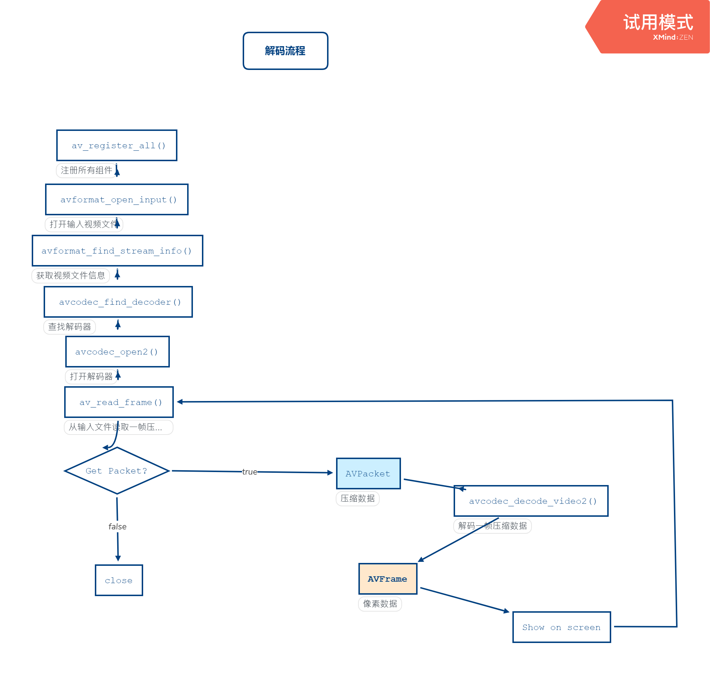

# FFmpeg 播放器开发

本笔记记录从 0 开始开发一个 FFmpeg 播放器。

## 1 播放器原理说明

一个视频文件里面包含了视频流、音频流、字幕等信息，播放视频就是利用 FFmpeg 将里面的信息分别抽取出来，然后借助操作系统提供的 API 将数据展示出来，比如视频就对应着一帧一帧的画面，抽取信息涉及到解封装和解码，具体流程参考下图：

为什么需要解封装和解码呢？这就涉及到媒体数据的编码与封装了，我们使用使用设备分别对画面和声音进行采集，一定的编码方式存储为保存起来，这就形成了最原始的数据，然后再次通过一定的数据结构把视频数据和音频数据进行整合就形成了我们常见的视频格式了，比如 MP4 等，当然这其中还包括数据压缩等过程，而我们播放视频，其实对就是封装和编码的逆向过程。

## 2 FFmpeg 解码流程与常用结构体

FFmpeg 内部就提供了各种视频编解码算法，不仅如此，还可以将其他第三方算法集成到 FFmpeg 中，比如 x264、lamc、faac、fdkaac。通过代码的方式进行编解码称为软解码，其次有些设备支持硬解码（使用硬件进行解码），硬解码性能较好，Android 中也提供了 MediaCodec 用于编解码，但是其兼容性很不好，所以大部分厂商都会选择集成 FFmpeg 来进行视频应用开发。

这里我们将会使用 FFmpeg 实现一个简单的播放器，其概要架构如下：

1. JavaCallHelper：播放视频时，用于和 java 层进行交互，比如 c++ 中播放视频出错，就通过 JavaCallHelper 通知到 java 层，进行 UI 更新。
2. DNFFmpeg：用于对获取音视频信息。

既然要使用 FFmpeg 就需要对其内部常用的结构体和数据进行了解，以及 FFmpeg 的解码流程。

### 解码流程

说明：

1. `av_register_all()` 用于注册所有组件。（4.0 及以上版本不再需要调用该函数）
2. `avformat_open_input()`：打开输入视频文件或流，然后可以获取到视频的相关信息，比如视频的宽高、帧率等。
3. `avformat_find_stream_info()`：获取视频文件信息。
4. `avcodec_find_decoder()`：查找解码器。
5. `avcodec_open2()`：打开解码器。
6. `av_read_frame()`：从输入文件读取一帧压缩数据。
   1. 获取不到包，则急速播放。
   2. 获取到 AVPacket 则继续流程。
7. `avcodec_decode_video2()`：解码一帧压缩数据，获取到 AVFrame（像素数据），展示到屏幕视，然后回到步骤 6，反复执行。

### 常用结构体

AVFormatContext：封装格式上下文结构体，全局结构体，保存了视频文件封装格式相关信息

1. iformat：输入视频的 AVInputFormat
2. nb_streams：输入视频的AVStream 个数。
3. streams：输入视频的 `AVStream []` 数组。
4. duration：输入视频的时长（以微秒为单位）。
5. bit_rate：输入视频的码率。

AVInputFormat：每种封装格式对应一个该结构体

1. name：封装格式名称。
2. long_name：封装格式的长名称。
3. extensions：封装格式的扩展名。
4. id：封装格式 ID。。
5. 一些封装格式处理的接口函数

AVStream：视频文件中每个视频（音频）流对应一个该结构体

1. id：序号。
2. codec：该流对应的AVCodecContext。
3. time_base：该流的时基。
4. avg_frame_rate：该流的帧率。

AVCodecContext：编码器上下文结构体，保存了视频（音频）编解码相关信息

1. codec：编解码器的 AVCodec。
2. width, height：图像的宽高。
3. pix_fmt：像素格式。
4. sample_rate：音频采样率。
5. channels：声道数。
6. sample_fmt：音频采样格式。

AVCodec：每种视频（音频）编解码器(例如H.264解码器)对应一个该结构体

1. name：编解码器名称。
2. long_name：编解码器长名称。
3. type：编解码器类型。
4. id：编解码器ID。
5. 一些编解码的接口函数。

AVPacket

1. pts：显示时间戳。
2. dts：解码时间戳。
3. data：压缩编码数据。
4. size：压缩编码数据大小。
5. stream_index：所属的 AVStream。

AVFrame

1. data：解码后的图像像素数据（音频采样数据）。
2. linesize：对视频来说是图像中一行像素的大小；对音频来说是整个音。
3. width, height：图像的宽高。
4. key_frame：是否为关键帧。
5. pict_type：帧类型（只针对视频） 。例如 I，P，B。

---

## 3 实现视频播放

---

## 4 实现音频播放

RGB、YUV 是图像原始格式，而 PCM 是声音的原始格式。Android 播放 PCM 的方式有：

1. Java SDK: AudioTrack - （AudioRecord录音pcm)
2. NDK : OpenSL ES

>OpenSL ES 是无授权费、跨平台、针对嵌入式系统精心优化的硬件音频加速API。该库都允许使用C或C ++来实现高性能，低延迟的音频操作。关于OpenSL ES的使用可以进入ndk-sample查看native-audio工程：<https://github.com/googlesamples/android-ndk/blob/master/native-audio/app/src/main/cpp/native-audio-jni.c>

这里选择 penSL ES 实现音频播放。

OpenSL ES的开发流程主要有如下7个步骤：

1. 创建接口对象
2. 设置混音器
3. 创建播放器
4. 设置播放回调函数
5. 设置播放状态
6. 启动回调函数
7. 释放
