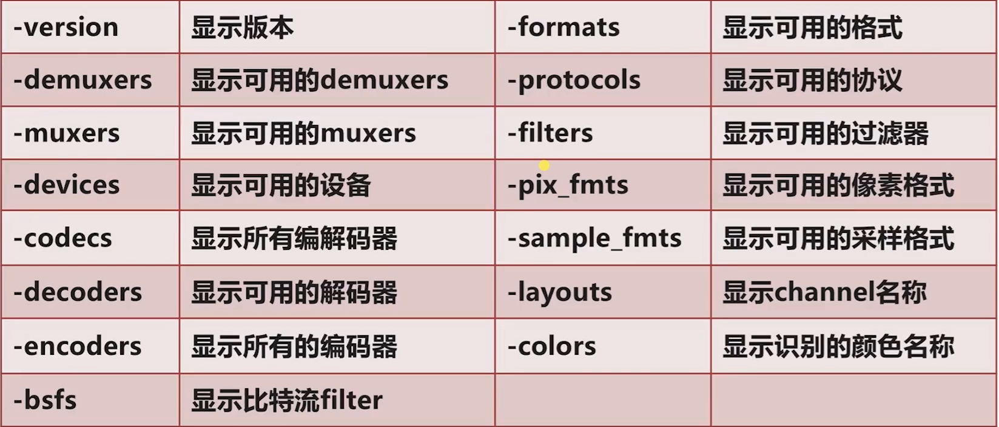

# 2 FFmpeg常用命令实战

## 2.0 FFMPEG基本概念

- **音／视频流**：在音视频领域，我们把一路音／视频称为一路流。如我们小时候经常使用VCD看港片，在里边可以选择粤语或国语声音，其实就是CD视频文件中存放了两路音频流，用户可以选择其中一路进行播放。
- **容器**：我们一般把 MP4､ FLV、MOV等文件格式称之为容器。也就是在这些常用格式文件中，可以存放多路音视频文件。以 MP4 为例，就可以存放一路视频流，多路音频流，多路字幕流。
- **channel**：channel是音频中的概念，称之为声道。在一路音频流中，可以有单声道，双声道或立体声。

## 2.1 FFmpeg常用命令分类讲解


- 基本信息查询命令
- 录制
- 分解/复用
- 处理原始数据
- 滤镜
- 切割与合并
- 图／视互转
- 直播相关

下面所有命令，具体参考：[FFMPEG常用命令](https://www.imooc.com/article/254520)

## 2.2 FFmpeg音视频处理流程讲解

除了 FFMPEG 的基本信息查询命令外，其它命令都按下图所示的流程处理音视频。


1. 对输入文件进行解封装，比如 MP4，就像一个盒子里面有音频、视频、字幕、打开这个盒子的过程就叫 demuxer。
2. 打开盒子后得到的是编码数据包，即压缩数据。
3. 对编码数据包进行解码，得到的是高度还原采集数据。
4. 对采集数据进行相关处理后，再进行编码。
5. 最后要给别人用，需要再次进行封装（封装成一种流行的格式）。

>具体过程：ffmpeg 调用 libavformat库（包含demuxers）来读取输入文件并获取包含编码数据的数据包。 当有多个输入文件时，ffmpeg会尝试通过跟踪任何活动输入流上的最低时间戳来使其保持同步。然后将编码的数据包传送给解码器（除非为数据流选择了流拷贝，请参阅进一步描述）。 解码器产生未压缩的帧（原始视频/ PCM音频/ …），可以通过滤波进一步处理（见下一节）。 在过滤之后，帧被传递到编码器，编码器并输出编码的数据包。 最后，这些传递给复用器，将编码的数据包写入输出文件。默认情况下，ffmpeg只包含输入文件中每种类型（视频，音频，字幕）的一个流，并将其添加到每个输出文件中。 它根据以下标准挑选每一个的“最佳”：对于视频，它是具有最高分辨率的流，对于音频，它是具有最多channel的流，对于字幕，是第一个字幕流。 在相同类型的几个流相等的情况下，选择具有最低索引的流。可以通过使用 `-vn / -an / -sn / -dn` 选项来禁用某些默认设置。 要进行全面的手动控制，请使用 `-map` 选项，该选项禁用刚描述的默认设置。

实例：

1. 格式转换的过程相对简单，比如 MP4 转 FLV：
   1. 对 MAP4 进行 demuxer 得到编码数据包。
   2. 对编码数据包进行 muxer（安装FLV规格）得到 FLV 格式视频。
2. 视频压缩（比如 1080P 转 320P）则要走完整个流程。

## 2.3 FFmpeg基本信息查询命令实战



`ffmpeg -codecs` 命令列出的前缀说明

```log
Codecs:
 D..... = Decoding supported 解码器
 .E.... = Encoding supported 编码器
 ..V... = Video codec 视频
 ..A... = Audio codec 音频
 ..S... = Subtitle codec 字幕
 ...I.. = Intra frame-only codec 帧内压缩
 ....L. = Lossy compression 有损压缩
 .....S = Lossless compression 无损压缩
```

### FFmpeg 命令基本格式及参数

```shell
ffmpeg [global_options] {[input_file_options] -i input_url} ...
                        {[output_file_options] output_url} ...
```

- ffmpeg 通过 -i 选项读取输任意数量的输入“文件”（可以是常规文件，管道，网络流，抓取设备等，并写入任意数量的输出“文件”。
- 原则上，每个输入/输出“文件”都可以包含任意数量的不同类型的视频流（视频/音频/字幕/附件/数据）。 流的数量和/或类型是由容器格式来限制。 选择从哪个输入进入到哪个输出将自动完成或使用 -map 选项进行定制。
- 要引用选项中的输入文件，您必须使用它们的索引（从0开始）。 例如。 第一个输入文件是 0，第二个输入文件是1，等等。类似地，文件内的流被它们的索引引用。 例如。 `2：3`是指第三个输入文件中的第四个流。

### 主要参数

参数 | 说明
---|---
-f fmt（输入/输出） | 强制输入或输出文件格式。 格式通常是自动检测输入文件，并从输出文件的文件扩展名中猜测出来，所以在大多数情况下这个选项是不需要的。
-i url（输入） | 输入文件的网址
-y（全局参数） | 覆盖输出文件而不询问。
-n（全局参数） | 不要覆盖输出文件，如果指定的输出文件已经存在，请立即退出。
`-c [：stream_specifier]` codec（输入/输出，每个流） | 选择一个编码器（当在输出文件之前使用）或解码器（当在输入文件之前使用时）用于一个或多个流。codec 是解码器/编码器的名称或 copy（仅输出）以指示该流不被重新编码。如：`ffmpeg -i INPUT -map 0 -c:v libx264 -c:a copy OUTPUT`
`-codec [：stream_specifier]`编解码器（输入/输出，每个流） | 同 -c
-t duration（输入/输出） | 当用作输入选项（在-i之前）时，限制从输入文件读取的数据的持续时间。当用作输出选项时（在输出url之前），在持续时间到达持续时间之后停止输出。
-ss位置（输入/输出） | 当用作输入选项时（在-i之前），在这个输入文件中寻找位置。 请注意，在大多数格式中，不可能精确搜索，因此ffmpeg将在位置之前寻找最近的搜索点。 当转码和-accurate_seek被启用时（默认），搜索点和位置之间的这个额外的分段将被解码和丢弃。 当进行流式复制或使用-noaccurate_seek时，它将被保留。当用作输出选项（在输出url之前）时，解码但丢弃输入，直到时间戳到达位置。
`-frames [：stream_specifier] framecount（output，per-stream）` | 停止在帧计数帧之后写入流。
`-filter [：stream_specifier] filtergraph（output，per-stream）` | 创建由filtergraph指定的过滤器图，并使用它来过滤流。filtergraph是应用于流的filtergraph的描述，并且必须具有相同类型的流的单个输入和单个输出。在过滤器图形中，输入与标签中的标签相关联，标签中的输出与标签相关联。有关filtergraph语法的更多信息，请参阅ffmpeg-filters手册。

### 视频参数

参数 | 说明
---|---
-vframes num（输出） | 设置要输出的视频帧的数量。对于-frames：v，这是一个过时的别名，您应该使用它。
-r [：stream_specifier] fps（输入/输出，每个流） | 设置帧率（Hz值，分数或缩写）。作为输入选项，忽略存储在文件中的任何时间戳，根据速率生成新的时间戳。这与用于-framerate选项不同（它在FFmpeg的旧版本中使用的是相同的）。如果有疑问，请使用-framerate而不是输入选项-r。作为输出选项，复制或丢弃输入帧以实现恒定输出帧频fps。
-s [：stream_specifier]大小（输入/输出，每个流） | 设置窗口大小。作为输入选项，这是video_size专用选项的快捷方式，由某些分帧器识别，其帧尺寸未被存储在文件中。作为输出选项，这会将缩放视频过滤器插入到相应过滤器图形的末尾。请直接使用比例过滤器将其插入到开头或其他地方。格式是'wxh'（默认 - 与源相同）。
-aspect [：stream_specifier] 宽高比（输出，每个流） | 设置方面指定的视频显示宽高比。aspect可以是浮点数字符串，也可以是num：den形式的字符串，其中num和den是宽高比的分子和分母。例如“4：3”，“16：9”，“1.3333”和“1.7777”是有效的参数值。如果与-vcodec副本一起使用，则会影响存储在容器级别的宽高比，但不会影响存储在编码帧中的宽高比（如果存在）。
-vn（输出） | 禁用视频录制。
-vcodec编解码器（输出） | 设置视频编解码器。这是-codec：v的别名。
-vf filtergraph（输出） | 创建由filtergraph指定的过滤器图，并使用它来过滤流。

### 音频参数

参数 | 说明
---|---
-aframes（输出） | 设置要输出的音频帧的数量。这是-frames：a的一个过时的别名。
`-ar [：stream_specifier] freq （输入/输出，每个流）` | 设置音频采样频率。对于输出流，它默认设置为相应输入流的频率。对于输入流，此选项仅适用于音频捕获设备和原始分路器，并映射到相应的分路器选件。
`-ac [：stream_specifier]通道（输入/输出，每个流）` | 设置音频通道的数量。对于输出流，它默认设置为输入音频通道的数量。对于输入流，此选项仅适用于音频捕获设备和原始分路器，并映射到相应的分路器选件。
-an（输出） | 禁用录音。
-acodec编解码器（输入/输出） | 设置音频编解码器。这是-codec的别名：a。
`-sample_fmt [：stream_specifier] sample_fmt（输出，每个流）` | 设置音频采样格式。使用-sample_fmts获取支持的样本格式列表。
`-af filtergraph（输出）` | 创建由filtergraph指定的过滤器图，并使用它来过滤流。

## 2.4 FFmpeg录制命令实战

步骤：

1. `ffmpeg -devices` 查看支持的设备
2. `ffmpeg -list_devices true -f dshow -i dummy` 查看 dshow 支持的输出输出
3. 使用具体的输入输出录制音视频

参考：

- [官方文档：Capture/Desktop](https://trac.ffmpeg.org/wiki/Capture/Desktop)

## 2.5 ffmpeg分解与复用命令实战

分解与复用即文件格式转换。


实战操作：

- 格式转换：`ffmpeg -i out.mp4 -vcodec copy -acodec copy out.flv`
- 抽取音频：`ffmpeg -i input.mp4 -acodec copy -vn out.aac`
- 抽取视频：`ffmpeg -i input.mp4 -vcodec copy -an out.h264`
- 音频和视频合并：`ffmpeg -i out.h264 -i out.aac -vcodec copy -acodec copy out.mp4`

## 2.6 ffmpeg 处理原始数据命令实战

什么是原始数据？FFmpeg解码后的数据，音频就是 PCM 数据，视频就是 YUV 数据。

实战操作：

- 抽取 YUV 视频：`ffmpeg -i input.mp4 -an -c:v rawvideo -pixel_format yuv420p out.yuv`
- 抽取 PCM 音频：`ffmpeg -i out.mp4 -vn -ar 44100 -ac 2 -f s16le out.pcm`
  - -ar 44100：a表示音频，r表示rate，ar表示音频采样率
  - -ac2：a表示音频，c表示channel，ac2 即双声道
  - -f s16le：f 表示抽取的音频数据的存储格式，这里使用的是 s16le

注意：

- 在使用 ffplay 播放 YUV 数据时，要指定视频的 size，否则无法播放，因为 YUV 中并不存放视频的 size。`ffplay -s 1920x1080 1.yuv`
- 在使用 ffplay 播放 PCM 数据时，要指定采样率、存储格式、升到，否则无法播放。`ffplay -ar 44100 -ac 2 -f s16le out.pcm`

## 2.7 ffmpeg滤镜命令实战

滤镜过程：


## 2.8 ffmpeg音视频的裁剪与合并命令实战

- 视频裁剪：`ffmpeg -i in.mp4 -vf crop=in_w-200:in_h-200 -c:v libx264 -c:a copy out.mp4`
  - in_w-200: in_h-200：in_w 表示输入视频的宽度是多少，-200 表示在视频原有宽度上减去200。
  - -c:v libx264：表示制定视频编码器为 libx264。
  - -c:a copy：制定音频变频器，copy 不对音频做特殊处理。

## 2.9 ffmpeg图片与视频互转实战

- 视频转JPEG：`ffmpeg -i test.flv -r 1 -f image2 image-%3d.jpeg`
  - `-r 1`：r表示帧率，1 则表示 1 秒钟输出一张图片。
  - `-f image2 image-%3d.jpeg`：f 用于制定图片格式，image2 是一种图片格式，image-%3d.jpeg 指定图片的输出名以 image-开头，后面三个数字以秒数填充。
- 图片转视频：`ffmpeg  -f image2 -i image-%3d.jpeg images.mp4`
  - 图片合成视频为什么会立即就播放完？

## 2.10 ffmpeg直播相关的命令实战

- 推流：`ffmpeg -re -i out.mp4 -c copy -f flv rtmp://server/live/streamName`
  - -re 表示减慢帧率，本地播放一般是有多快播放多快，在直播时加上，表示让直播的帧率与真实的帧率保持同步
  - -c 表示音视频编解码，如果是单独指定音频，则使用 -a:c，视频 -v:c
  - -f 用于指定文件格式
