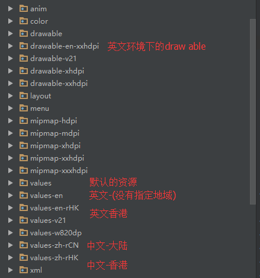

# Android应用国际化

---
## 1 Android国际化

Android中对国家化的支持还是比较强大的。只需要根据不同**地区代号**与**语言代号**建立不同的文件夹，然后吧对于的资源文件(*String,Drawable等*)放入不同的问文件夹即可。系统会自动根据语言设置来读取对于的资源。

示例：



`values-zh-rCH`:其中zh表示中文，r是固定的，后面的CH就表示中国，其他相关国家代号与语言可以查阅相关网站。

---
## 2 应用内切换语言

有时候app可能会有这样的需求，就是在App内提供语言切换功能。这时就需要相关代码来实现了。

### Android6.0之前实现

Android6.0之前只需要根据选择的语言配置调用从context获取的Resource对象的`updateConfiguration`方法即可，Configuration中的语言相当于是App的全局设置

主要实现如下：

```java
    //获取设置的语言
    private Locale getLocale() {
        int setting = getLanguage();
        if (setting == AppSetting.FOLLOW_SYSTEM) {//用户没有设置过语言
            //不做任何操作
            return null;
        }
        Locale locale;
        switch (setting) {
            case AppSetting.ZH_RMB: {
                locale = Locale.SIMPLIFIED_CHINESE;
                break;
            }
            case AppSetting.EN_HDK: {
                locale = Locale.ENGLISH;
                break;
            }
            default:
                throw new IllegalStateException("unknow config");
        }
        return locale;
    }

    //配置语言
    public void configLanguage(Context context) {
        Resources resources = context.getResources();
        DisplayMetrics dm = resources.getDisplayMetrics();
        Configuration config = resources.getConfiguration();

        if (AndroidVersion.atLeast(24)) {
            config.setLocales(new LocaleList(locale));
        } else if (AndroidVersion.atLeast(17)) {
            config.setLocale(locale);
        } else {
            config.locale = locale;
        }
        context.getResources().updateConfiguration(config, dm);
    }
```

在BaseActivity中配置语言

```java
    @Override
    protected void onCreate(@Nullable Bundle savedInstanceState) {
        super.onCreate(savedInstanceState);
        configLanguage(this);
    }
```

默认情况下，调用 `updateConfiguration()` 方法会引起配置的改变，造成任务栈中 Activity 的重建，所以我们只需要重启当前 Activity 即可

```java
    getActivity().recreate();
```

然后从当前 Activity 退出后重新回到栈顶的 Activity 会自动重启。

### Android7.0行为变更

Android7.0及之后版本，新增了 LocaleList。如果 `Android7.0` 使用旧的配置方式，有些Activity可能会显示为手机的系统语言。

`updateConfiguration()`方法废弃了，替代方法为 `createConfigurationContext()`,这个方法返回新的Contenxt。目的是语言需要植入到 Context 中，每个 Context 都植入一遍。

主要实现如下：

```java
    //设置语言
    public Context configLanguage(Context context) {
        //没有配置
        Locale locale = getLocale();
        if (locale == null) {
            return context;
        }

        //7.0
        if (Build.VERSION.SDK_INT >= Build.VERSION_CODES.N) {
            return createConfigurationResources(context, locale);
        }

        //7.0以下
        Resources resources = context.getResources();
        DisplayMetrics dm = resources.getDisplayMetrics();
        Configuration config = resources.getConfiguration();

        if (AndroidVersion.atLeast(24)) {
            config.setLocales(new LocaleList(locale));
        } else if (AndroidVersion.atLeast(17)) {
            config.setLocale(locale);
        } else {
            config.locale = locale;
        }
        context.getResources().updateConfiguration(config, dm);
        return context;
    }

    @TargetApi(Build.VERSION_CODES.N)
    private Context createConfigurationResources(Context context, Locale locale) {
        Resources resources = context.getResources();
        Configuration configuration = resources.getConfiguration();
        configuration.setLocale(locale);
        return context.createConfigurationContext(configuration);
    }

    //Activity的attachBaseContext中配置
    public class BaseActivity{
       //植入语言
        @Override
        protected void attachBaseContext(Context base) {
            super.attachBaseContext(configLanguage(base));
        }
    }
```

### 重启App

某些机型简单的重启Activity总会有一些问题，比如某个Button或者控件上的Text没有更新，这时需要通过重启App来达到效果。

```java
  Intent intent = new Intent(activity, MainActivity.class);
  intent.setFlags(Intent.FLAG_ACTIVITY_NEW_TASK | Intent.FLAG_ACTIVITY_CLEAR_TASK);
  activity.startActivity(intent);
  android.os.Process.killProcess(android.os.Process.myPid());
```

---
## 引用

- [Android多语言切换](http://xesam.github.io/android/2016/08/04/Android-%E5%A4%9A%E8%AF%AD%E8%A8%80%E5%88%87%E6%8D%A2.html)
- [Android应用内语言切换实现](http://blog.csdn.net/lanyeming2012/article/details/37776107)
- [Android App 多语言切换](http://jaeger.itscoder.com/android/2016/05/14/switch-language-on-android-app.html)
- [7.0适配](https://yanlu.me/android-7-0-app-language-switch/)
- [AndroidMultiLanguage](https://github.com/finddreams/AndroidMultiLanguage)
