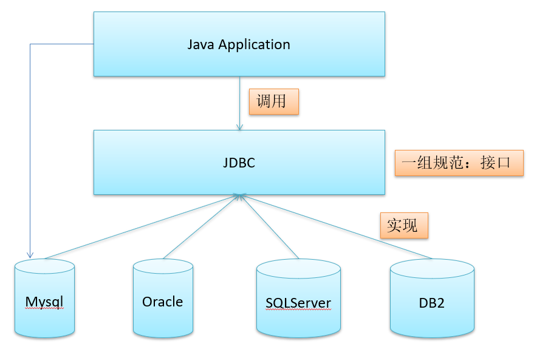
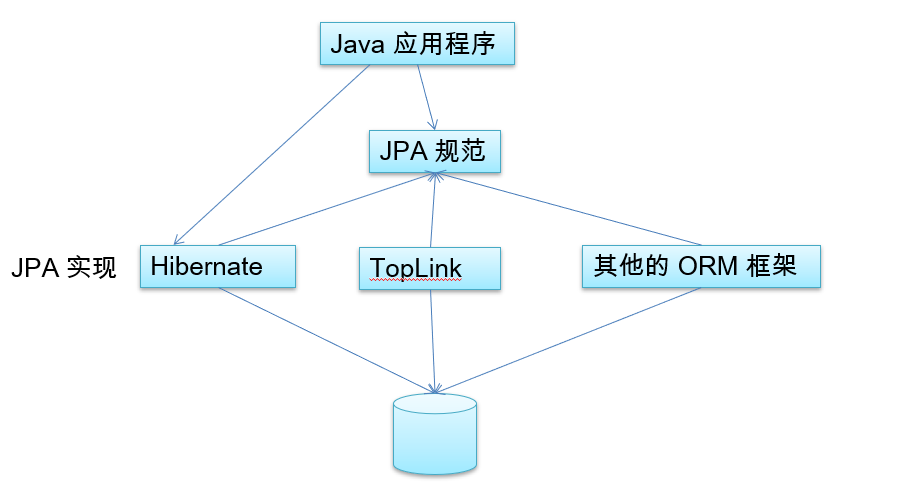
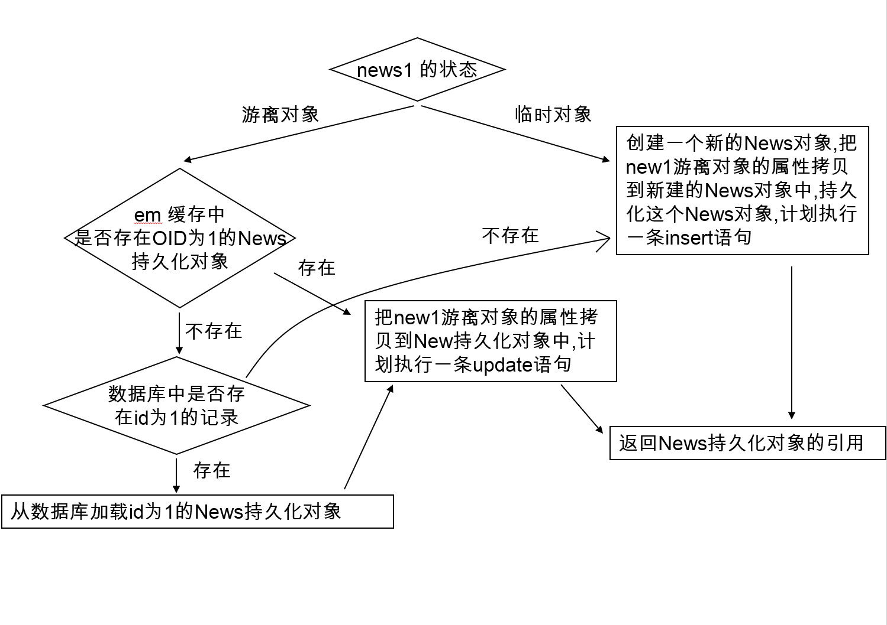

# JPA

## 1 JPA 概述

### 什么是 JPA

什么是 JDBC，JDBC 统一了数据库连接规范。



什么是 JPA：即 Java Persistence API，用于对象持久化的 API，Java EE 5.0 平台标准的 ORM 规范，使得应用程序以统一的方式访问持久层。



JPA 和 Hibernate 的关系：

- JPA 是 hibernate 的一个抽象（就像JDBC和JDBC驱动的关系）。
- JPA 是规范：JPA 本质上就是一种  ORM 规范，不是ORM 框架 —— 因为 JPA 并未提供 ORM 实现，它只是制订了一些规范，提供了一些编程的 API 接口，但具体实现则由 ORM 厂商提供实现。
- Hibernate 是实现：Hibernate 除了作为 ORM 框架之外，它也是一种 JPA 实现。
- 从功能上来说， JPA 是 Hibernate 功能的一个子集。

### JPA 的供应商

JPA 的目标之一是制定一个可以由很多供应商实现的 API，目前Hibernate 3.2+、TopLink 10.1+ 以及 OpenJPA 都提供了 JPA 的实现

1. Hibernate 从 3.2 开始兼容 JPA
2. OpenJPA  是 Apache 组织提供的开源项目
3. TopLink 以前需要收费，如今开源了

### JPA 的优势

- 标准化:  提供相同的 API，这保证了基于 JPA 开发的企业应用能够经过少量的修改就能够在不同的 JPA 框架下运行。
- 简单易用，集成方便: JPA 的主要目标之一就是提供更加简单的编程模型，在 JPA 框架下创建实体和创建 Java 类一样简单，只需要使用 `javax.persistence.Entity` 进行注释；JPA 的框架和接口也都非常简单。
- 可媲美 JDBC 的查询能力:  JPA 的查询语言是面向对象的，JPA 定义了独特的 JPQL，而且能够支持批量更新和修改、JOIN、GROUP BY、HAVING 等通常只有 SQL 才能够提供的高级查询特性，甚至还能够支持子查询。
- 支持面向对象的高级特性: JPA 中能够支持面向对象的高级特性，如类之间的继承、多态和类之间的复杂关系，最大限度的使用面向对象的模型

JPA 包括 3方面的技术：

- ORM 映射元数据：JPA 支持 XML 和 JDK 5.0 注解两种元数据的形式，元数据描述对象和表之间的映射关系，框架据此将实体对象持久化到数据库表中。  
- JPA 的 API：用来操作实体对象，执行 CRUD 操作，框架在后台完成所有的事情，开发者从繁琐的 JDBC和 SQL代码中解脱出来。  
- 查询语言（JPQL）：这是持久化操作中很重要的一个方面，通过面向对象而非面向数据库的查询语言查询数据，避免程序和具体的 SQL 紧密耦合。

## 2 JPA 的基本使用

主要步骤有：

1. 创建 `persistence.xml`，在这个文件中配置持久化单元
   1. 需要指定跟哪个数据库进行交互
   2. 需要指定 JPA 使用哪个持久化的框架以及配置该框架的基本属性
2. 创建实体类，使用 annotation 来描述实体类跟数据库表之间的映射关系
3. 使用 JPA API 完成数据增加、删除、修改和查询操作
   1. 创建 EntityManagerFactory (对应 Hibernate 中的 SessionFactory)
   2. 创建 EntityManager (对应 Hibernate 中的 Session);

下面描述如何使用在 idea 中使用 gradle 构建入门项目：

1 创建 gradle java 工程后，引入相关依赖：

```groovy
dataBaseLibs = [
        // https://mvnrepository.com/artifact/mysql/mysql-connector-java
        mysqlConnector        : 'mysql:mysql-connector-java:6.0.5',
        //hibernate
        // https://mvnrepository.com/artifact/org.hibernate/hibernate-core，hibernate核心
        hibernate             : 'org.hibernate:hibernate-core:5.4.13.Final'
        // https://mvnrepository.com/artifact/org.hibernate/hibernate-entitymanager，实体管理
        hibernateEntitymanager: 'org.hibernate:hibernate-entitymanager:5.4.13.Final',
]

dependencies {
  compile dataBaseLibs.mysqlConnector
  compile dataBaseLibs.hibernate
  compile dataBaseLibs.hibernateEhcache
  compile dataBaseLibs.hibernateEntitymanager
}
```

2 创建实体类，并用注解标注。

```java
@Table(name = "JPA_CUSTOMERS_BASE")
@Entity(name = "CUSTOMER_BASE")
public class Customer {

    private Integer id;
    private String lastName;

    private String email;
    private int age;

    private Date createdTime;
    private Date birth;

    public Customer() {
    }

    @GeneratedValue(strategy = GenerationType.AUTO)
    @Id
    public Integer getId() {
        return id;
    }

    public void setId(Integer id) {
        this.id = id;
    }

    @Column(name = "LAST_NAME", length = 50, nullable = false)
    public String getLastName() {
        return lastName;
    }

    public void setLastName(String lastName) {
        this.lastName = lastName;
    }

    public String getEmail() {
        return email;
    }

    public void setEmail(String email) {
        this.email = email;
    }

    public int getAge() {
        return age;
    }

    public void setAge(int age) {
        this.age = age;
    }

    @Temporal(TemporalType.TIMESTAMP)
    public Date getCreatedTime() {
        return createdTime;
    }

    public void setCreatedTime(Date createdTime) {
        this.createdTime = createdTime;
    }

    @Temporal(TemporalType.DATE)
    public Date getBirth() {
        return birth;
    }

    public void setBirth(Date birth) {
        this.birth = birth;
    }

    @Transient
    public String getInfo() {
        return "lastName: " + lastName + ", email: " + email;
    }

    @Override
    public String toString() {
        return "Customer [id=" + id + ", lastName=" + lastName + ", email=" + email + ", age=" + age + ", createdTime=" + createdTime + ", birth=" + birth + "]";
    }

}
```

3 在 `resource/META_INF` 目录下创建 `persistence.xml` 配置文件，对 JPA 进行配置，注意路径和文件名都是固定的。

```xml
<?xml version="1.0" encoding="UTF-8"?>
<persistence version="2.0" xmlns="http://java.sun.com/xml/ns/persistence"
             xmlns:xsi="http://www.w3.org/2001/XMLSchema-instance"
             xsi:schemaLocation="http://java.sun.com/xml/ns/persistence
             http://java.sun.com/xml/ns/persistence/persistence_2_0.xsd">

    <persistence-unit name="jpa-base" transaction-type="RESOURCE_LOCAL">

        <!--
        配置使用什么 ORM 产品来作为 JPA 的实现
        1. 实际上配置的是  javax.persistence.spi.PersistenceProvider 接口的实现类
        2. 若 JPA 项目中只有一个 JPA 的实现产品, 则也可以不配置该节点。
        -->
        <provider>org.hibernate.jpa.HibernatePersistenceProvider</provider>

        <!-- 添加持久化类 -->
        <class>com.atguigu.jpa.entities.base.Customer</class>

        <properties>
            <!-- 连接数据库的基本信息 -->
            <property name="javax.persistence.jdbc.driver" value="com.mysql.jdbc.Driver"/>
            <property name="javax.persistence.jdbc.url" value="jdbc:mysql:///jpa_base?useSSL=false&amp;serverTimezone=Asia/Shanghai"/>
            <property name="javax.persistence.jdbc.user" value="root"/>
            <property name="javax.persistence.jdbc.password" value="201314"/>

            <!-- 配置 JPA 实现产品的基本属性. 配置 hibernate 的基本属性 -->
            <property name="hibernate.format_sql" value="true"/>
            <property name="hibernate.show_sql" value="true"/>
            <property name="hibernate.hbm2ddl.auto" value="update"/>
        </properties>

    </persistence-unit>

</persistence>
```

- name 属性用于定义持久化单元的名字， 必选。
- transaction-type：指定 JPA  的事务处理策略。
  - RESOURCE_LOCAL：默认值，数据库级别的事务，只能针对一种数据库，不支持分布式事务。
  - 如果需要支持分布式事务，使用 `JTA：transaction-type="JTA"`。
- JPA 会自动创建数据表，但是别忘记我们需要先创建对应的数据库。

4 使用jpb 进行 orm 操作

```java
public class JPAUsageTest {

    /**
     * 基础流程演示
     */
    @Test
    public void base() {
        //1. 创建 EntityManagerFactory
        String persistenceUnitName = "jpa-base";
        Map<String, Object> properties = new HashMap<>();
        //配置属性
        properties.put("hibernate.show_sql", true);
        EntityManagerFactory entityManagerFactory = Persistence.createEntityManagerFactory(persistenceUnitName, properties);

        //2. 创建 EntityManager. 类似于 Hibernate 的 SessionFactory
        EntityManager entityManager = entityManagerFactory.createEntityManager();

        //3. 开启事务
        EntityTransaction transaction = entityManager.getTransaction();
        transaction.begin();

        //4. 进行持久化操作
        Customer customer = new Customer();
        customer.setAge(12);
        customer.setEmail("tom@atguigu.com");
        customer.setLastName("Tom");
        customer.setBirth(new Date());
        customer.setCreatedTime(new Date());

        entityManager.persist(customer);

        //5. 提交事务
        transaction.commit();

        //6. 关闭 EntityManager
        entityManager.close();

        //7. 关闭 EntityManagerFactory
        entityManagerFactory.close();
    }

}
```

## 3 JPA 基本注解

将 Entity 注解配置在实体类上，可以将其映射为一张表，然后可以通过其他注解进行对表进行具体的配置。

- `@Entity`：用于实体类声明语句之前，指出该Java 类为实体类，将映射到指定的数据库表。如声明一个实体类 Customer，它将映射到数据库中的 customer 表上。
- `@Table`：当实体类与其映射的数据库表名不同名时需要使用 @Table 标注说明，该标注与 @Entity 标注并列使用，置于实体类声明语句之前。
  - @Table 标注的常用选项是 name，用于指明数据库的表名
  - @Table 标注还有两个选项 catalog 和 schema，用于设置表所属的数据库目录或模式，通常为数据库名。
  - uniqueConstraints 选项用于设置约束条件，通常不须设置。
- `@Id`：用于声明一个实体类的属性映射为数据库的主键列。该属性通常置于属性声明语句之前。
- `@GeneratedValue`：用于标注主键的生成策略，通过 strategy 属性指定。默认情况下，JPA 自动选择一个最适合底层数据库的主键生成策略，SqlServer 对应 `identity`，MySQL 对应 `auto increment`。在 `javax.persistence.GenerationType` 中定义了以下几种可供选择的策略：
  - IDENTITY：采用数据库 ID自增长的方式来自增主键字段，Oracle 不支持这种方式。
  - AUTO： JPA自动选择合适的策略，是默认选项。
  - SEQUENCE：通过序列产生主键，通过 @SequenceGenerator 注解指定序列名，MySql 不支持这种方式。
  - TABLE：通过表产生主键，框架借由表模拟序列产生主键，使用该策略可以使应用更易于数据库移植。
- `@Basic`：表示一个简单的属性到数据库表的字段的映射，对于没有任何标注的字段或者 getter 方法，默认即为 `@Basic`。
  - fetch: 表示该属性的读取策略，有 EAGER 和 LAZY 两种，分别表示主支抓取和延迟加载，默认为 EAGER。
  - optional：表示该属性是否允许为null， 默认为true。
- `@Column`：当实体的属性与其映射的数据库表的列不同名时需要使用 @Column 标注说明，该属性通常置于实体的属性声明语句之前，还可与 @Id 标注一起使用。
  - @Column 标注的常用属性是 name，用于设置映射数据库表的列名。此外，该标注还包含其它多个属性，如：unique 、nullable、length 等。
  - @Column 标注的 columnDefinition 属性: 表示该字段在数据库中的实际类型。通常 ORM 框架可以根据属性类型自动判断数据库中字段的类型，但是对于 Date 类型仍无法确定数据库中字段类型究竟是 DATE、TIME 还是 TIMESTAMP。此外，String 的默认映射类型为 VARCHAR, 如果要将 String 类型映射到特定数据库的 BLOB 或TEXT 字段类型，也需要使用 columnDefinition 属性指定。
- `@Transient`：表示该属性并非一个到数据库表的字段的映射，ORM框架将忽略该属性，如果一个属性并非数据库表的字段映射，就务必将其标示为@Transient，因为 ORM 框架默认为其注解 @Basic
- `@Temporal`：在核心的 Java API 中并没有定义 Date 类型的精度(temporal precision)，而在数据库中,表示 Date 类型的数据有 DATE、 TIME 和 TIMESTAMP 三种精度(即单纯的日期、时间、或者两者兼备)，在进行属性映射时可使用 @Temporal 注解来调整精度。

针对于列的注解可以设置在字段声明上，可以注解在 getter 方法上。

### 用 table 来生成主键详解

主键的生成有很多策略，有一种方法是使用一种独立的表来为业务表提供逐渐生成因子。即将当前主键的值单独保存到一个数据库的表中，主键的值每次都是从指定的表中查询来获得，这种方法生成主键的策略可以适用于任何数据库，不必担心不同数据库不兼容造成的问题。

首先我们需要一张表独立的表：

```sql
CREATE TABLE `jpa_id_generators` (
  `ID` int(10) NOT NULL AUTO_INCREMENT,
  `PK_NAME` varchar(50) NOT NULL,
  `PK_VALUE` int(10) NOT NULL,
  PRIMARY KEY (`ID`)
) ENGINE=InnoDB DEFAULT CHARSET=utf8
```

插入相关数据

```log
+----+----------------------+----------+
| ID | PK_NAME              | PK_VALUE |
+----+----------------------+----------+
|  1 | JPA_CUSTOMER_BASE_ID |        1 |
|  2 | ORDER_ID             |      100 |
|  3 | STUDENT_ID           |     1000 |
+----+----------------------+----------+
```

为实体类定义主键生成策略：

```java
    //通过pkColumnName、pkColumnValue、valueColumnName就可以确定表中的唯一个值，该值将作为因子参与主键生成。
    @TableGenerator(
            //策略名称
            name = "ID_GENERATOR",
            //使用该表生成主键
            table = "jpa_id_generators",
            //主键名称
            pkColumnName = "PK_NAME",
            //主键的值
            pkColumnValue = "JPA_CUSTOMER_BASE_ID",
            //用来生成主键的值的列名
            valueColumnName = "PK_VALUE",
            //自增间隔
            allocationSize = 100)
    //指定主键生成策略为 TABLE，generator 的值指向 TableGenerator 的 name 属性。
    @GeneratedValue(strategy = GenerationType.TABLE, generator = "ID_GENERATOR")
    @Id
    public Integer getId() {
        return id;
    }
```

>用 table 类生成主键值（用的不多，特殊情况需要）

## 3 JPA API

- Persistence
- EntityManagerFactory
- EntityManager
- EntityTransaction

### Persistence

Persistence  类是用于获取 EntityManagerFactory 实例。该类包含一个名为 createEntityManagerFactory 的静态方法 。

createEntityManagerFactory 方法有如下两个重载版本。

- 带有一个参数的方法以 JPA 配置文件 `persistence.xml` 中的持久化单元名为参数。
- 带有两个参数的方法：前一个参数含义相同，后一个参数 Map 类型，用于设置 JPA 的相关属性，这时将忽略其它地方设置的属性。Map 对象的属性名必须是 JPA 实现库提供商的名字空间约定的属性名。

### EntityManagerFactory

EntityManagerFactory 接口主要用来创建 EntityManager 实例。该接口约定了如下 4 个方法：

- `createEntityManager()`：用于创建实体管理器对象实例。
- `createEntityManager(Map map)`：用于创建实体管理器对象实例的重载方法，Map 参数用于提供 EntityManager 的属性。
- `isOpen()`：检查 EntityManagerFactory 是否处于打开状态。实体管理器工厂创建后一直处于打开状态，除非调用close()方法将其关闭。
- `close()`：关闭 EntityManagerFactory 。 EntityManagerFactory 关闭后将释放所有资源，`isOpen()`方法测试将返回 false，其它方法将不能调用，否则将导致 IllegalStateException 异常。

### EntityManager

在 JPA 规范中, EntityManager 是完成持久化操作的核心对象。实体作为普通 Java 对象，只有在调用 EntityManager 将其持久化后才会变成持久化对象。EntityManager 对象在一组实体类与底层数据源之间进行 O/R 映射的管理。它可以用来管理和更新 Entity Bean, 根椐主键查找 Entity Bean, 还可以通过 JPQL 语句查询实体。

#### JPA 中的实体的状态

- 新建状态：新创建的对象，尚未拥有持久性主键。
- 游离状态：拥有持久化主键，但是没有与持久化建立上下文环境。
- 持久化状态：已经拥有持久性主键并和持久化建立了上下文环境。
- 删除状态：拥有持久化主键，已经和持久化建立上下文环境，但是已从数据库中删除。

#### EntityManager 对象查询方法

- `find (Class<T> entityClass,Object primaryKey)`：返回指定的 OID 对应的实体类对象，如果这个实体存在于当前的持久化环境，则返回一个被缓存的对象；否则会创建一个新的 Entity, 并加载数据库中相关信息；若 OID 不存在于数据库中，则返回一个 null。第一个参数为被查询的实体类类型，第二个参数为待查找实体的主键值。
- `getReference (Class<T> entityClass,Object primaryKey)`：与find()方法类似，不同的是：如果缓存中不存在指定的 Entity, EntityManager 会创建一个 Entity 类的代理，但是不会立即加载数据库中的信息，只有第一次真正使用此 Entity 的属性才加载，所以如果此 OID 在数据库不存在，getReference() 不会返回 null 值, 而是抛出EntityNotFoundException
- `persist (Object entity)`：用于将新创建的 Entity 纳入到 EntityManager 的管理。该方法执行后，传入 persist() 方法的 Entity 对象转换成持久化状态。
  - 如果传入 persist() 方法的 Entity 对象已经处于持久化状态，则 persist() 方法什么都不做。
  - 如果对删除状态的 Entity 进行 persist() 操作，会转换为持久化状态。
  - 如果对游离状态的实体执行 persist() 操作，可能会在 persist() 方法抛出 EntityExistException(也有可能是在flush或事务提交后抛出)。
- `remove(Object entity)`：删除实例。如果实例是被管理的，即与数据库实体记录关联，则同时会删除关联的数据库记录。
- `refresh(Object entity)`：用数据库实体记录的值更新实体对象的状态，即更新实例的属性值。
- `clear()`：清除持久上下文环境，断开所有关联的实体。如果这时还有未提交的更新则会被撤消。
- `contains(Object entity)`：判断一个实例是否属于当前持久上下文环境管理的实体。
- `isOpen()`：判断当前的实体管理器是否是打开状态。
- `getTransaction()`：返回资源层的事务对象。EntityTransaction 实例可以用于开始和提交多个事务。
- `close()`：关闭实体管理器。之后若调用实体管理器实例的方法或其派生的查询对象的方法都将抛出 IllegalstateException 异常，除了getTransaction 和 isOpen方法(返回 false)。不过，当与实体管理器关联的事务处于活动状态时，调用 close 方法后持久上下文将仍处于被管理状态，直到事务完成。

#### `EntityManager.merge()`

`merge(T entity)`：merge 用于处理 Entity 的同步，即数据库的插入和更新操作。

merge总的来说:类似于 hibernate Session 的 saveOrUpdate 方法。

1. 若传入的是一个临时对象：会创建一个新的对象， 把临时对象的属性复制到新的对象中， 然后对新的对象执行持久化操作，所以新的对象中有 id，但以前的临时对象中没有 id。
2. 若传入的是一个游离对象，即传入的对象有 OID：
   1. 若在 EntityManager 缓存中没有该对象，若在数据库中也没有对应的记录
   2. JPA 会创建一个新的对象， 然后把当前游离对象的属性复制到新创建的对象中
   3. 对新创建的对象执行 insert 操作
3. 若传入的是一个游离对象，即传入的对象有 OID：
   1. 若在 EntityManager 缓存中没有该对象，但在数据库中有对应的记录
   2. JPA 会查询对应的记录，然后返回该记录对应的对象，再然后会把游离对象的属性复制到查询到的对象中
   3. 对查询到的对象执行 update 操作。
4. 若传入的是一个游离对象， 即传入的对象有 OID：
   1. 若在 EntityManager 缓存中有对应的对象
   2. JPA 会把游离对象的属性复制到查询到 EntityManager 缓存中的对象中
   3. EntityManager 缓存中的对象执行 UPDATE。

流程如下：



#### EntityManager 原始 SQL 以及 JPQL 相关方法

- `createQuery(String qlString)`：创建一个查询对象。
- `createNamedQuery(String name)`：根据命名的查询语句块创建查询对象。参数为命名的查询语句。
- `createNativeQuery(String sqlString)`：使用标准 SQL语句创建查询对象。参数为标准SQL语句字符串。
- `createNativeQuery(String sqls, String resultSetMapping)`：使用标准SQL语句创建查询对象，并指定返回结果集 Map 的名称。

### EntityTransaction

EntityTransaction 接口用来管理资源层实体管理器的事务操作。通过调用实体管理器的 getTransaction() 方法 获得其实例。

- `begin()：用于启动一个事务，此后的多个数据库操作将作为整体被提交或撤消。若这时事务已启动则会抛出 IllegalStateException 异常。
- `commit()`：用于提交当前事务。即将事务启动以后的所有数据库更新操作持久化至数据库中。
- `rollback()`：撤消(回滚)当前事务。即撤消事务启动后的所有数据库更新操作，从而不对数据库产生影响。
- `setRollbackOnly()`：使当前事务只能被撤消。
- `getRollbackOnly()`：查看当前事务是否设置了只能撤消标志。
- `isActive()`：查看当前事务是否是活动的。如果返回true则不能调用begin方法，否则将抛出 IllegalStateException 异常；如果返回 false 则不能调用 commit、rollback、setRollbackOnly 及 getRollbackOnly 方法，否则将抛出 IllegalStateException 异常。

## 4 映射关联关系

映射关联关系包括：

1. 映射单向多对一的关联关系
2. 映射单向一对多的关联关系
3. 映射双向多对一的关联关系
4. 映射双向一对一的关联关系
5. 映射双向多对多的关联关系

### 双向一对多及多对一映射

1. 双向一对多关系中，必须存在一个关系维护端，在 JPA 规范中，要求 many 的一方作为关系的维护端(owner side)，one 的一方作为被维护端(inverse side)。
2. 可以在 one 方指定 @OneToMany 注释并设置 mappedBy 属性，以指定它是这一关联中的被维护端，many 为维护端。在 many 方指定 @ManyToOne 注释，并使用 @JoinColumn 指定外键名称

比如，客户和订单是多对一关系，可以使用下面方式实现双向一对多及多对一映射：

```java
@Table(name = "JPA_ORDERS_TWO_WAY_MANY_TO_ONE")
@Entity(name = "ORDER_TWO_WAY_MANY_TO_ONE")
public class Order {

    private Integer id;
    private String orderName;
    private Customer customer;

    @GeneratedValue
    @Id
    public Integer getId() {
        return id;
    }

    public void setId(Integer id) {
        this.id = id;
    }

    @Column(name = "ORDER_NAME")
    public String getOrderName() {
        return orderName;
    }

    public void setOrderName(String orderName) {
        this.orderName = orderName;
    }

    /*
      双向多对一，两个表外键列名要一致。
     */
    @JoinColumn(name = "customer_id")
    @ManyToOne(fetch = FetchType.LAZY)
    public Customer getCustomer() {
        return customer;
    }

    public void setCustomer(Customer customer) {
        this.customer = customer;
    }

}

@Table(name = "JPA_CUSTOMERS_TWO_WAY_MANY_TO_ONE")
@Entity(name = "CUSTOMER_TWO_WAY_MANY_TO_ONE")
public class Customer {

    private Integer id;
    private String lastName;

    private String email;
    private int age;

    private Date createdTime;
    private Date birth;

    private Set<Order> orders = new HashSet<>();

    public Customer() {
    }

    public Customer(String lastName, int age) {
        super();
        this.lastName = lastName;
        this.age = age;
    }

    @GeneratedValue(strategy = GenerationType.AUTO)
    @Id
    public Integer getId() {
        return id;
    }

    public void setId(Integer id) {
        this.id = id;
    }

    @Column(name = "LAST_NAME", length = 50, nullable = false)
    public String getLastName() {
        return lastName;
    }

    public void setLastName(String lastName) {
        this.lastName = lastName;
    }

    public String getEmail() {
        return email;
    }

    public void setEmail(String email) {
        this.email = email;
    }

    public int getAge() {
        return age;
    }

    public void setAge(int age) {
        this.age = age;
    }

    @Temporal(TemporalType.TIMESTAMP)
    public Date getCreatedTime() {
        return createdTime;
    }

    public void setCreatedTime(Date createdTime) {
        this.createdTime = createdTime;
    }

    @Temporal(TemporalType.DATE)
    public Date getBirth() {
        return birth;
    }

    public void setBirth(Date birth) {
        this.birth = birth;
    }

    //工具方法. 不需要映射为数据表的一列.
    @Transient
    public String getInfo() {
        return "lastName: " + lastName + ", email: " + email;
    }

    /*
    双向多对一，两个表外键列名要一致。

        注意:：若在 1 的一端的 @OneToMany 中使用 mappedBy 属性, 则 @OneToMany 的 one 端就不能再使用 @JoinColumn 属性了.
     */
    //@JoinColumn(name = "customer_id")
    @OneToMany(fetch = FetchType.LAZY, cascade = {CascadeType.REMOVE}, mappedBy = "customer")
    public Set<Order> getOrders() {
        return orders;
    }

    public void setOrders(Set<Order> orders) {
        this.orders = orders;
    }

    @Override
    public String toString() {
        return "Customer [id=" + id + ", lastName=" + lastName + ", email=" + email + ", age=" + age + ", createdTime=" + createdTime + ", birth=" + birth + "]";
    }

}
```

最终表结构为：

```sql
-- customs
mysql> SELECT * FROM jpa_customers_two_way_many_to_one;
+----+-----+------------+----------------------------+-------------+-----------+
| id | age | birth      | createdTime                | email       | LAST_NAME |
+----+-----+------------+----------------------------+-------------+-----------+
| 51 |  17 | 2020-04-11 | 2020-04-11 23:35:02.210000 | aad@163.com | cc        |
| 54 |  18 | 2020-04-11 | 2020-04-11 23:35:12.519000 | bb@163.com  | bb        |
| 57 |  19 | 2020-04-11 | 2020-04-11 23:35:24.968000 | cc@163.com  | aa        |
+----+-----+------------+----------------------------+-------------+-----------+
3 rows in set (0.00 sec)

mysql> SELECT * FROM jpa_orders_two_way_many_to_one;
+----+------------+-------------+
| id | ORDER_NAME | customer_id |
+----+------------+-------------+
| 49 | DDD-MM-1   |          51 |
| 50 | DAD-MM-2   |          51 |
| 52 | DDD-MM-1   |          54 |
| 53 | DAD-MM-2   |          54 |
| 55 | CC-MM-1    |          57 |
| 56 | CC-MM-2    |          57 |
+----+------------+-------------+
6 rows in set (0.00 sec)
```

### 双向一对一映射

基于外键的 1-1 关联关系：在双向的一对一关联中，需要在关系被维护端(inverse side)中的 @OneToOne 注释中指定 mappedBy，以指定是这一关联中的被维护端。同时需要在关系维护端(owner side)建立外键列指向关系被维护端的主键列。

比如部门和经理就是一对一映射：

```java
@Table(name = "JPA_DEPARTMENTS")
@Entity
public class Department {

    private Integer id;
    private String deptName;

    private Manager mgr;

    @GeneratedValue
    @Id
    public Integer getId() {
        return id;
    }

    public void setId(Integer id) {
        this.id = id;
    }

    @Column(name = "DEPT_NAME")
    public String getDeptName() {
        return deptName;
    }

    public void setDeptName(String deptName) {
        this.deptName = deptName;
    }

    //使用 @OneToOne 来映射 1-1 关联关系。
    //若需要在当前数据表中添加主键则需要使用 @JoinColumn 来进行映射，注意因为是 1-1 关联关系，所以需要添加 unique=true
    @JoinColumn(name = "MGR_ID", unique = true)
    @OneToOne(fetch = FetchType.LAZY)
    public Manager getMgr() {
        return mgr;
    }

    public void setMgr(Manager mgr) {
        this.mgr = mgr;
    }

}

@Table(name = "JPA_MANAGERS")
@Entity
public class Manager {

    private Integer id;
    private String mgrName;

    private Department dept;

    @GeneratedValue
    @Id
    public Integer getId() {
        return id;
    }

    public void setId(Integer id) {
        this.id = id;
    }

    @Column(name = "MGR_NAME")
    public String getMgrName() {
        return mgrName;
    }

    public void setMgrName(String mgrName) {
        this.mgrName = mgrName;
    }

    //对于不维护关联关系，没有外键的一方, 使用 @OneToOne 来进行映射，建议设置 mappedBy='mgr'，mgr 为关系维护方表中的关联属性的字段名。
    @OneToOne(mappedBy = "mgr")
    public Department getDept() {
        return dept;
    }

    public void setDept(Department dept) {
        this.dept = dept;
    }

}
```

最终表结构为：

```sql
mysql> SELECT * FROM jpa_departments;
+----+-----------+--------+
| id | DEPT_NAME | MGR_ID |
+----+-----------+--------+
| 29 | D-BB      |     28 |
| 31 | A-BB      |     30 |
+----+-----------+--------+
2 rows in set (0.01 sec)

mysql> SELECT * FROM jpa_managers;
+----+----------+
| id | MGR_NAME |
+----+----------+
| 28 | M-BB     |
| 30 | N-BB     |
+----+----------+
2 rows in set (0.01 sec)
```

**双向 1-1 中，不维护关系的一方的不延迟加载的问题**：默认情况下，若获取不维护关联关系的一方，则也会通过左外连接获取其关联的对象，但可以通过 @OntToOne 的 fetch 属性来修改加载策略。但依然会再发送 SQL 语句来初始化其关联的对象，这说明在不维护关联关系的一方，不建议修改 fetch 属性.。

1. 如果延迟加载要起作用，就必须设置一个代理对象。
2. Manager 其实可以不关联一个 Department。
3. 如果有 Department 关联就设置为代理对象而延迟加载，如果不存在关联的 Department 就设置 null, 因为外键字段是定义在 Department 表中的，Hibernate 在不读取 Department 表的情况是无法判断是否有关联有 Deparmtment，因此无法判断设置 null 还是代理对象（还是要去查），而统一设置为代理对象，也无法满足不关联的情况，所以无法使用延迟加载，只有显式读取 Department。

### 双向多对多关联关系

在双向多对多关系中，我们必须指定一个关系维护端(owner side)，可以通过 @ManyToMany 注释中指定 mappedBy 属性来标识其为关系维护端。

比如类别和条目就是多对多关联关系：

```java
@Table(name = "JPA_CATEGORIES")
@Entity
public class Category {

    private Integer id;
    private String categoryName;

    private Set<Item> items = new HashSet<>();

    @GeneratedValue
    @Id
    public Integer getId() {
        return id;
    }

    public void setId(Integer id) {
        this.id = id;
    }

    @Column(name = "CATEGORY_NAME")
    public String getCategoryName() {
        return categoryName;
    }

    public void setCategoryName(String categoryName) {
        this.categoryName = categoryName;
    }

    @ManyToMany(mappedBy = "categories")
    public Set<Item> getItems() {
        return items;
    }

    public void setItems(Set<Item> items) {
        this.items = items;
    }

}

@Table(name = "JPA_ITEMS")
@Entity
public class Item {

    private Integer id;
    private String itemName;

    private Set<Category> categories = new HashSet<>();

    @GeneratedValue
    @Id
    public Integer getId() {
        return id;
    }

    public void setId(Integer id) {
        this.id = id;
    }

    @Column(name = "ITEM_NAME")
    public String getItemName() {
        return itemName;
    }

    public void setItemName(String itemName) {
        this.itemName = itemName;
    }

    /*
    使用 @ManyToMany 注解来映射多对多关联关系
        使用 @JoinTable 来映射中间表
            1. name 指向中间表的名字
            2. joinColumns 映射当前类所在的表在中间表中的外键
                2.1 name 指定外键列的列名
                2.2 referencedColumnName 指定外键列关联当前表的哪一列，不写也可以
            3. inverseJoinColumns 映射关联的类所在中间表的外键
     */
    @JoinTable(
            name = "ITEM_CATEGORY",
            joinColumns = {@JoinColumn(name = "ITEM_ID"/*, referencedColumnName = "ID"*/)},
            inverseJoinColumns = {@JoinColumn(name = "CATEGORY_ID"/*, referencedColumnName = "ID"*/)})
    @ManyToMany
    public Set<Category> getCategories() {
        return categories;
    }

    public void setCategories(Set<Category> categories) {
        this.categories = categories;
    }

}
```

最终关系表为：

```sql
mysql> SELECT * FROM jpa_items;
+----+-----------+
| id | ITEM_NAME |
+----+-----------+
| 32 | i-1       |
| 33 | i-2       |
| 36 | f-1       |
| 37 | f-2       |
+----+-----------+
4 rows in set (0.01 sec)

mysql> SELECT * FROM jpa_managers;
+----+----------+
| id | MGR_NAME |
+----+----------+
| 28 | M-BB     |
| 30 | N-BB     |
+----+----------+
2 rows in set (0.00 sec)

mysql> SELECT * FROM item_category;
+---------+-------------+
| ITEM_ID | CATEGORY_ID |
+---------+-------------+
|      32 |          34 |
|      33 |          34 |
|      32 |          35 |
|      33 |          35 |
|      36 |          38 |
|      37 |          38 |
|      36 |          39 |
|      37 |          39 |
+---------+-------------+
8 rows in set (0.01 sec)
```

## 5 使用二级缓存

`<shared-cache-mode>` 节点：若 JPA 实现支持二级缓存，该节点可以配置在当前的持久化单元中是否启用二级缓存，可配置如下值：

- ALL：所有的实体类都被缓存
- NONE：所有的实体类都不被缓存
- ENABLE_SELECTIVE：标识 @Cacheable(true) 注解的实体类将被缓存
- DISABLE_SELECTIVE：缓存除标识 @Cacheable(false) 以外的所有实体类
- UNSPECIFIED：默认值，JPA 产品默认值将被使用

gradle 加入缓存依赖

```groovy
// https://mvnrepository.com/artifact/org.hibernate/hibernate-ehcache，缓存
compile 'org.hibernate:hibernate-ehcache:5.4.13.Final'
```

配置：

```xml
<?xml version="1.0" encoding="UTF-8"?>
<persistence version="2.0" xmlns="http://java.sun.com/xml/ns/persistence"
             xmlns:xsi="http://www.w3.org/2001/XMLSchema-instance"
             xsi:schemaLocation="http://java.sun.com/xml/ns/persistence
             http://java.sun.com/xml/ns/persistence/persistence_2_0.xsd">

    <persistence-unit name="jpa-base" transaction-type="RESOURCE_LOCAL">

        <!-- ...省略之前的配置信息 -->

        <!--
        配置二级缓存的策略 ：
        		ALL：所有的实体类都被缓存
        		NONE：所有的实体类都不被缓存.
        		ENABLE_SELECTIVE：标识 @Cacheable(true) 注解的实体类将被缓存
        		DISABLE_SELECTIVE：缓存除标识 @Cacheable(false) 以外的所有实体类
        		UNSPECIFIED：默认值，JPA 产品默认值将被使用
        -->
        <shared-cache-mode>ENABLE_SELECTIVE</shared-cache-mode>

        <properties>
            <!-- ...之前的配置信息 -->

            <!-- 二级缓存相关 -->
            <property name="hibernate.cache.use_second_level_cache" value="true"/>
            <property name="hibernate.cache.region.factory_class" value="org.hibernate.cache.ehcache.EhCacheRegionFactory"/>
            <property name="hibernate.cache.use_query_cache" value="true"/>
        </properties>

    </persistence-unit>

</persistence>

```

测试代码

```java
//实体类配置可缓存
@Cacheable(value = true)
@Table(name = "JPA_CUSTOMERS_TWO_WAY_MANY_TO_ONE")
@Entity(name = "CUSTOMER_TWO_WAY_MANY_TO_ONE")
public class Customer {
  // ...省略相关代码
}

@Test
public void testSecondLevelCache(){
    //只会执行一条语句，因为配置了二级缓存，如果没有配置二级缓存，将触发两次查询。
    Customer customer1 = entityManager.find(Customer.class, 16);
    transaction.commit();
    entityManager.close();

    entityManager = entityManagerFactory.createEntityManager();
    transaction = entityManager.getTransaction();
    transaction.begin();
    Customer customer2 = entityManager.find(Customer.class, 16);
}

@Test
public void testFirstLevelCache(){
    //只会执行一条语句，因为jpa自带一级缓存。
    Customer customer1 = entityManager.find(Customer.class, 16);
    Customer customer2 = entityManager.find(Customer.class, 16);
}
```

## 6 JPQL

JPQL语言，即 Java Persistence Query Language 的简称。JPQL 是一种和 SQL 非常类似的中间性和对象化查询语言，它最终会被编译成针对不同底层数据库的 SQL 查询，从而屏蔽不同数据库的差异。JPQL语言的语句可以是 select 语句、update 语句或delete语句，它们都通过 Query 接口封装执行

### Query 接口

API说明：`javax.persistence.Query`，Query 接口封装了执行数据库查询的相关方法。调用 EntityManager 的 createQuery、create NamedQuery 及 createNativeQuery 方法可以获得查询对象，进而可调用 Query 接口的相关方法来执行查询操作。

- `int executeUpdate()` 用于执行update或delete语句。
- `List getResultList()` 用于执行select语句并返回结果集实体列表。
- `Object getSingleResult()` 用于执行只返回单个结果实体的select语句。
- `Query setFirstResult(int startPosition`) 用于设置从哪个实体记录开始返回查询结果。
- `Query setMaxResults(int maxResult)` 用于设置返回结果实体的最大数。与setFirstResult结合使用可实现分页查询。
- `Query setFlushMode(FlushModeType flushMode)` 设置查询对象的Flush模式。参数可以取2个枚举值：FlushModeType.AUTO 为自动更新数据库记录，FlushMode Type.COMMIT 为直到提交事务时才更新数据库记录。
- `setHint(String hintName, Object value)` 设置与查询对象相关的特定供应商参数或提示信息。参数名及其取值需要参考特定 JPA 实现库提供商的文档。如果第二个参数无效将抛出IllegalArgumentException异常。
- `setParameter(int position, Object value)` 为查询语句的指定位置参数赋值。Position 指定参数序号，value 为赋给参数的值。
- `setParameter(int position, Date d, TemporalType type)` 为查询语句的指定位置参数赋 Date 值。Position 指定参数序号，value 为赋给参数的值，temporalType 取 TemporalType 的枚举常量，包括 DATE、TIME 及 TIMESTAMP 三个，，用于将 Java 的 Date 型值临时转换为数据库支持的日期时间类型（java.sql.Date、java.sql.Time及java.sql.Timestamp）。
- `setParameter(int position, Calendar c, TemporalType type)` 为查询语句的指定位置参数赋 Calenda r值。position 指定参数序号，value 为赋给参数的值，temporalType 的含义及取舍同前。
- `setParameter(String name, Object value)` 为查询语句的指定名称参数赋值。
- `setParameter(String name, Date d, TemporalType type)` 为查询语句的指定名称参数赋 Date 值。用法同前。
- `setParameter(String name, Calendar c, TemporalType type)` 为查询语句的指定名称参数设置Calendar值。name为参数名，其它同前。该方法调用时如果参数位置或参数名不正确，或者所赋的参数值类型不匹配，将抛出 IllegalArgumentException 异常。

### 查询语句

select语句用于执行查询。其语法可表示为：

```sql
select_clause
form_clause
[where_clause]
[groupby_clause]
[having_clause]
[orderby_clause]
```

简单示例：

```java
@Test
public void testJPQL() {
    String jpql = "FROM CUSTOMER_TWO_WAY_MANY_TO_ONE c WHERE c.age > ?1";
    Query query = entityManager.createQuery(jpql);
    //占位符的索引是从 1 开始
    query.setParameter(1, 16);
    List<Customer> customers = query.getResultList();
    System.out.println(customers.size());
}
```

**注意，上面`CUSTOMER_TWO_WAY_MANY_TO_ONE` 是 Customer 类上 Entity 注解的 name 属性值，默认为类名，如果存在不同包下有相同类名的实体类，就需要使用这个属性加以区分**。

#### select-from 子句

from 子句是查询语句的必选子句。

- Select 用来指定查询返回的结果实体或实体的某些属性，如果是查询整个实体，则 select 是可省略的。
- From 子句声明查询源实体类，并指定标识符变量（相当于SQL表的别名）。
- 如果不希望返回重复实体，可使用关键字 distinct 修饰。select、from 都是 JPQL 的关键字，通常全大写或全小写，建议不要大小写混用

**查询所有实体**：查询所有实体的 JPQL 查询字串很简单，例如：`select o from Order as o` 或省去关键字 as `select o from Order o`。
标识符变量的命名规范与 Java 标识符相同，且区分大小写。调用 EntityManager 的 createQuery() 方法可创建查询对象，接着调用 Query 接口的 getResultList() 方法就可获得查询结果集。例如上面`testJPQL()` 示例。

**查询部分属性**：如果只须查询实体的部分属性而不需要返回整个实体。例如：`select o.id, o.customerName, o.address.streetNumber from Order o order by o.id`，执行该查询返回的不再是 Orders 实体集合，而是一个对象数组的集合`(Object[])`，集合的每个成员为一个对象数组，可通过数组元素访问各个属性。返回的 Object 使用很麻烦，此时可以在实体类中创建对应的构造器，然后在 JPQL 语句中利用对应的构造器返回实体类的对象。

#### where 子句

where子句用于指定查询条件，where跟条件表达式。例：

```sql
select o from Orders o where o.id = 1
select o from Orders o where o.id > 3 and o.confirm = 'true'
select o from Orders o where o.address.streetNumber >= 123
```

JPQL也支持包含参数的查询，例如：

```sql
select o from Orders o where o.id = :myId
select o from Orders o where o.id = :myId and o.customer = :customerName
```

注意：参数名前必须冠以冒号(:)，执行查询前须使用`Query.setParameter(name, value)`方法给参数赋值。

也可以不使用参数名而使用参数的序号，例如：

```sql
select o from Order o where o.id = ?1 and o.customer = ?2
```

其中 ?1 代表第一个参数，?2 代表第一个参数。在执行查询之前需要使用重载方法 `Query.setParameter(pos, value)` 提供参数值。

```java
Query query = entityManager.createQuery( "select o from Orders o where o.id = ?1 and o.customer = ?2" );
query.setParameter( 1, 2 );
query.setParameter( 2, "John" );
List orders = query.getResultList();
```

where 条件表达式中可用的运算符基本上与 SQL 一致，包括：

- 算术运算符：`+　-　*　/　+(正)　-(负)`
- 关系运算符：`==　<>　>　>=　<　<=　between…and　like　in　is null` 等
- 逻辑运算符：`and　or 　not`

where 子句示例：

```sql
-- // 以下语句查询 Id 介于 100 至 200 之间的订单。
select o from Orders o where o.id between 100 and 200
-- // 以下语句查询国籍为的 'US'、'CN'或'JP' 的客户。
select c from Customers c where c.county in ('US','CN','JP')
-- // 以下语句查询手机号以139开头的客户。%表示任意多个字符序列，包括0个。
select c from Customers c where c.phone like '139%'
-- // 以下语句查询名字包含4个字符，且234位为ose的客户。_表示任意单个字符。
select c from Customers c where c.lname like '_ose'
-- // 以下语句查询电话号码未知的客户。Nul l用于测试单值是否为空。
select c from Customers c where c.phone is null
-- // 以下语句查询尚未输入订单项的订单。empty用于测试集合是否为空。
select o from Orders o where o.orderItems is empty
```

#### 使用 Hibernate 的查询缓存

```java
    //使用 hibernate 的查询缓存，前提是配置文件启用了缓存。
    @Test
    public void testQueryCache() {
        String jpql = "FROM CUSTOMER_TWO_WAY_MANY_TO_ONE c WHERE c.age > ?1";
        Query query = entityManager.createQuery(jpql)
                .setHint(QueryHints.HINT_CACHEABLE, true);//使用缓存

        //占位符的索引是从 1 开始
        query.setParameter(1, 16);
        List<Customer> customers = query.getResultList();
        System.out.println(customers.size());

        query = entityManager.createQuery(jpql)
                .setHint(QueryHints.HINT_CACHEABLE, true);//使用缓存

        //占位符的索引是从 1 开始
        query.setParameter(1, 16);
        customers = query.getResultList();
        System.out.println(customers.size());
    }

```

#### order by 子句

order by子句用于对查询结果集进行排序。和SQL的用法类似，可以用 “asc“ 和 "desc“ 指定升降序。如果不显式注明，默认为升序。

```sql
select o from Orders o order by o.id
select o from Orders o order by o.address.streetNumber desc
select o from Orders o order by o.customer asc, o.id desc
```

#### group by 子句与聚合查询

group by 子句用于对查询结果分组统计，通常需要使用聚合函数。常用的聚合函数主要有 AVG、SUM、COUNT、MAX、MIN 等，它们的含义与SQL相同。例如：

```sql
select max(o.id) from Orders o
```

没有 group by 子句的查询是基于整个实体类的，使用聚合函数将返回单个结果值，可以使用 `Query.getSingleResult()` 得到查询结果。例如：

```sql
Query query = entityManager.createQuery("select max(o.id) from Orders o");
Object result = query.getSingleResult();
Long max = (Long)result;
```

#### having 子句

Having 子句用于对 group by 分组设置约束条件，用法与 where 子句基本相同，不同是 where 子句作用于基表或视图，以便从中选择满足条件的记录；having 子句则作用于分组，用于选择满足条件的组，其条件表达式中通常会使用聚合函数。

例如，以下语句用于查询订购总数大于100的商家所售商品及数量：

```sql
select o.seller, o.goodId, sum(o.amount) from V_Orders o group by o.seller, o.goodId having sum(o.amount) > 100
```

having 子句与 where 子句一样都可以使用参数。

#### 关联查询

在JPQL中，很多时候都是通过在实体类中配置实体关联的类属性来实现隐含的关联(join)查询。例如：

```sql
select o from Orders o where o.address.streetNumber=2000
```

上述JPQL语句编译成以下SQL时就会自动包含关联，默认为左关联。

在某些情况下可能仍然需要对关联做精确的控制。为此，JPQL 也支持和 SQL 中类似的关联语法。如：

```sql
left out join / left join
inner join
left join / inner join fetch
```

其中，left join 和 left out join 等义，都是允许符合条件的右边表达式中的实体为空。

#### 子查询

JPQL也支持子查询，在 where 或 having 子句中可以包含另一个查询。当子查询返回多于 1 个结果集时，它常出现在 any、all、exist s表达式中用于集合匹配查询。它们的用法与SQL语句基本相同。

#### JPQL函数

JPQL提供了以下一些内建函数，包括字符串处理函数、算术函数和日期函数。

字符串处理函数主要有：

- `concat(String s1, String s2)`：字符串合并/连接函数。
- `substring(String s, int start, int length)`：取字串函数。
- `trim([leading|trailing|both,] [char c,] String s)`：从字符串中去掉首/尾指定的字符或空格。
- `lower(String s)`：将字符串转换成小写形式。
- `upper(String s)`：将字符串转换成大写形式。
- `length(String s)`：求字符串的长度。
- `locate(String s1, String s2[, int start])`：从第一个字符串中查找第二个字符串(子串)出现的位置。若未找到则返回0。
- 算术函数主要有 `abs、mod、sqrt、size` 等。Size 用于求集合的元素个数。
- 日期函数主要为三个，即 `current_date、current_time、current_timestamp`，它们不需要参数，返回服务器上的当前日期、时间和时戳。

#### update 语句和 delete 语句

update 语句用于执行数据更新操作。主要用于针对单个实体类的批量更新。以下语句将帐户余额不足万元的客户状态设置为未偿付：

```sql
update Customers c set c.status = '未偿付' where c.balance < 10000
```

delete 语句用于执行数据更新操作。以下语句删除不活跃的、没有订单的客户：

```sql
delete from Customers c where c.status = 'inactive' and c.orders is empty
```

## 7 整合 Spring

Spring 整合 JPA 的三种方式：

1. LocalEntityManagerFactoryBean：适用于那些仅使用 JPA 进行数据访问的项目，该 FactoryBean 将根据JPA PersistenceProvider 自动检测配置文件进行工作，一般从`“META-INF/persistence.xml”`读取配置信息，这种方式最简单，但不能设置 Spring 中定义的 DataSource，且不支持 Spring 管理的全局事务
2. 从JNDI中获取：用于从 Java EE 服务器获取指定的EntityManagerFactory，这种方式在进行 Spring 事务管理时一般要使用 JTA 事务管理.
3. LocalContainerEntityManagerFactoryBean：适用于所有环境的 FactoryBean，能全面控制 EntityManagerFactory 配置,如指定 Spring 定义的 DataSource 等等。一般选用这种方式。

配置方式：

```xml
<?xml version="1.0" encoding="UTF-8"?>
<beans xmlns="http://www.springframework.org/schema/beans"
       xmlns:xsi="http://www.w3.org/2001/XMLSchema-instance"
       xmlns:context="http://www.springframework.org/schema/context"
       xmlns:tx="http://www.springframework.org/schema/tx"
       xsi:schemaLocation="http://www.springframework.org/schema/beans
       http://www.springframework.org/schema/beans/spring-beans.xsd
       http://www.springframework.org/schema/context
       http://www.springframework.org/schema/context/spring-context-4.0.xsd
       http://www.springframework.org/schema/tx
       http://www.springframework.org/schema/tx/spring-tx-4.0.xsd">

    <!-- 配置自动扫描的包 -->
    <context:component-scan base-package="com.atguigu.jpa"/>

    <!-- 配置 C3P0 数据源 -->
    <context:property-placeholder location="classpath:db.properties"/>

    <bean id="dataSource" class="com.mchange.v2.c3p0.ComboPooledDataSource">
        <property name="user" value="${jdbc.user}"/>
        <property name="password" value="${jdbc.password}"/>
        <property name="driverClass" value="${jdbc.driverClass}"/>
        <property name="jdbcUrl" value="${jdbc.jdbcUrl}"/>
        <!-- 配置其他属性 -->
    </bean>

    <!-- 配置 EntityManagerFactory -->
    <bean id="entityManagerFactory" class="org.springframework.orm.jpa.LocalContainerEntityManagerFactoryBean">
        <property name="dataSource" ref="dataSource"/>

        <!-- 配置 JPA 提供商的适配器. 可以通过内部 bean 的方式来配置 -->
        <property name="jpaVendorAdapter">
            <bean class="org.springframework.orm.jpa.vendor.HibernateJpaVendorAdapter"/>
        </property>

        <!-- 配置实体类所在的包 -->
        <property name="packagesToScan" value="com.atguigu.jpa.spring.entities"/>

        <!-- 配置 JPA 的基本属性. 例如 JPA 实现产品的属性 -->
        <property name="jpaProperties">
            <props>
                <prop key="hibernate.show_sql">true</prop>
                <prop key="hibernate.format_sql">true</prop>
                <prop key="hibernate.hbm2ddl.auto">update</prop>
            </props>
        </property>

    </bean>

    <!-- 配置 JPA 使用的事务管理器 -->
    <bean id="transactionManager" class="org.springframework.orm.jpa.JpaTransactionManager">
        <property name="entityManagerFactory" ref="entityManagerFactory"/>
    </bean>

    <!-- 配置支持基于注解是事务配置 -->
    <tx:annotation-driven transaction-manager="transactionManager"/>

</beans>
```

## 8 参考

以上笔记来自对 [尚硅谷JavaEE](http://www.atguigu.com/download.shtml#javaEE) 课程 **JPA** 部分的学习。

## 9 示例项目

- [JAP-Base](../Code/JPA/JPA-Base/README.md)
- [JAP-Base](../Code/JPA/JPA-Spring/README.md)