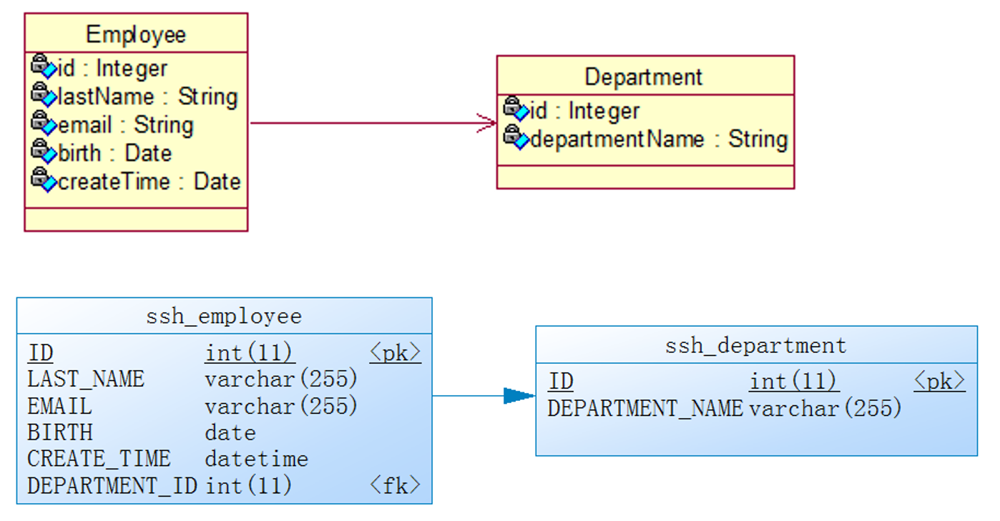

# Spring + SpringMVC + SpringData/JPA 整合实现分页以及增删改查

演示一个员工和部门的后台管理系统，提供增删改查功能。

## 1 涉及技术

1. SpringMVC、Spring、SpringData\JPA 整合完成 CRUD、翻页
2. 基于Restful 风格
3. 使用 JPA 二级缓存
4. 使用 @ResponseBody 注解完成 Ajax.

## 2 整体架构

### 架构

```
RequestHandler（请求处理） --> Service（业务逻辑处理） --> Repository（数据操作）
```

### 实体类关系 & 数据表解析



employee 与 department 形成一对多关系，employee 增加外键引用 department 主键。

## 3 实现业务

### 3.1 完成分页操作

```java
    @RequestMapping("/emps")
    public String list(@RequestParam(value = "pageNo", required = false, defaultValue = "1") String pageNoStr, Map<String, Object> map) {
        /*这里用字符串接收 pageNumber，防止解析异常。*/
        int pageNo = 1;

        try {
            //对 pageNo 的校验
            pageNo = Integer.parseInt(pageNoStr);
            if (pageNo < 1) {
                pageNo = 1;
            }
        } catch (Exception ignore) {
        }

        Page<Employee> page = employeeService.getPage(pageNo, 5);
        map.put("page", page);

        return "emp/list";
    }
```

Dao 层：

1. 不带查询查询条件的分页，所以可以直接调用 PagingAndSortingRepository# findAll(Pageable pageable) 返回 Page 对象。

Service 层：

1. 没有业务逻辑
2. 把 Controller 传入的 pageNo 和 pageSize 封装为 Pageable 对象。注意：Pageable 的 pageNo 是从 0 开始的
3. 调用 Dao 层的方法即可。

Controller 层：

1. 获取 pageNo，并对 pageNo 进行校验
2. 调用 Service 方法返回 Page 对象
3. 把 Page 对象放入到 request 中
4. 转发页面
5. JSP 页面：使用 JSTL 来显示页面

### 3.2 完成添加操作

操作步骤：点击超链接 addNewEmployee，执行 get 请求，没有任何参数，跳转到添加 employee 的界面。

```java
    @RequestMapping(value = "/emp", method = RequestMethod.GET)
    public String input(Map<String, Object> map) {
        map.put("departments", departmentService.getAll());
        map.put("employee", new Employee());
        return "emp/input";
    }

    @ResponseBody
    @RequestMapping(value = "/ajaxValidateLastName", method = RequestMethod.POST)
    public String validateLastName(@RequestParam(value = "lastName", required = true) String lastName) {
        Employee employee = employeeService.getByLastName(lastName);
        if (employee == null) {
            return "0";
        } else {
            return "1";
        }
    }
```

**1 添加操作：显示添加页面 & 使用 JPA 二级缓存**：

1. Dao 层：查询所有的 Department，且需要使用 JPA 的二级缓存 （防止每次刷新页面对 Department 的重复查询）。
2. Service 层：调用 Dao 层的方法，获取所有的 Department，返回即可。
3. Controller 层：
    1. 调用 Service 层，获取所有的 Department，并放入到 request 中。
    2. 创建一个新的 Employee 对象，放入到 request 中。且其键和表单的 modelAttribute 属性值一致。
    3. 转发到操作页面。
4. JSP 页面：
    1. 需要使用 SpringMVC 的表单标签来显示表单页面
    2. 注意：form:form 标签必须设置一个 modelAttribute 属性，以从 request 中获取对应的 bean，要求该 bean 的属性和表单字段是一一对应的。

**2 Ajax 验证用户名可用性**：

1. Dao 层：新建一个方法：根据 lastName 查询对应的 Employee，若存在返回 Employee 对象，若不存在则返回 null。
2. Service 层：直接调用 Dao 方法返回结果即可。
3. Controller 层：
    1. 获取请求参数
    2. 调用 Service 层验证 lastName 对应的 Employee 是否存在。若存在则返回 “1”，若不存在则返回 “0”。 需要使用 @ResponseBody 注解标明这是返回的实体数据。
    3. JSP 页面：使用 jQuery 完成 Ajax 的发送，和结果的响应。

**3 完成添加**：

1. Dao 层：不需要定义任何方法，直接使用 JpaRepository 或其父接口提供的 save 方法即可。
2. Service 层：需要调用 Dao 层的方法。注意：需要设置 createTime 属性。
3. Controller 层：调用 Service 层的方法，重定向到显示所有员工的页面。
4. 注意：如何把页面上输入的字符串转为 Date 类型。使用@DateTimeFormat 注解!

### 3.3 完成修改操作

```java
    @ModelAttribute
    public void getEmployee(@RequestParam(value = "id", required = false) Integer id, Map<String, Object> map) {
        if (id != null) {
            Employee employee = employeeService.get(id);
            //这里如果不置空，则会导致崩溃，因为更新时，不允许修改 employee 关联的 Department（外键）id。
            //Hibernate 持久化对象的 主键id 是不允许被修改的。
            employee.setDepartment(null);
            map.put("employee", employee);
        }
    }

    @RequestMapping(value = "/emp/{id}", method = RequestMethod.PUT)
    public String update(Employee employee) {
        employeeService.save(employee);
        return "redirect:/emps";
    }

    @RequestMapping(value = "/emp/{id}", method = RequestMethod.GET)
    public String input(@PathVariable("id") Integer id, Map<String, Object> map) {
        Employee employee = employeeService.get(id);
        map.put("employee", employee);
        map.put("departments", departmentService.getAll());
        return "emp/input";
    }
```

**1 操作界面表单回显（显示旧数据供用户进行修改）**：

1. SpringMVC 表单回显的原理：
    1. 实际上表单的回显是由 SpringMVC 的 form 标签完成的。
    2. 在 Handler 方法中，向 request  中添加一个属性。键：SpringMVC form:form 标签 modelAttribute 属性值，值：包含了回显信息的一个 bean 对象。
2. `URL：/emp/{id}，method：GET`
3. Dao 层：直接调用方法，根据 id 来获取对应的 bean。
4. Service 层：调用 Dao 层的方法，返回 bean 对象。
5. Controller 层：
    1. 获取 id。
    2. 调用 Service 方法，得到 bean 的对象。
    3. 获取全部的 Department，并放入到 request 中。
    4. 把 bean 对象放入到 request 中，键为：form:form 标签的 modelAttribute 属性值。
    5. 转发页面

**2 修改状态下 Ajax 验证用户名可用性**：

1. 和 添加状态下 Ajax 验证的区别：若修改后当前的 lastName，则不应该再发送任何 Ajax 请求，而直接 alert：用户名可用。
2. JSP 页面：修改 JS 的 Ajax 请求逻辑：若修改回之前的 lastName 则不发送任何请求，直接弹出 “用户名可用”。

**3 完成修改**：

1. URL：`emp/{id}，method：PUT`
2. Dao 层：继续使用 saveAndFlush 方法即可
3. Service 层：
    1. 不需要设置 createTime 属性
    2. 判定添加和修改的标准：传入的 bean 的 id 是否为 null
4. Controller 层：
    1. 新建 @ModelAttribute 注解修饰的方法，在其中利用 id 获取对应的 bean，并把该 bean 放入到 map 中，键为：Employee 类名第一个字母小写
    2. 在 @ModelAttribute 方法中，把关联的 department 置为 null，因为 Hibernate 持久化对象的 主键id 是不允许被修改的。
    3. 调用 Service 的方法进行更新
    4. 重定向到：`/emps`
5. JSP 页面：id 和 _method 加入到隐藏域中。

### 3.4 完成删除操作

```java
    @RequestMapping(value = "/emp/{id}", method = RequestMethod.DELETE)
    public String delete(@PathVariable("id") Integer id) {
        employeeService.delete(id);
        return "redirect:/emps";
    }
```

1. URL：`emp/{id}、method：DELETE`
2. Dao 层：直接使用 SpringData 已经自带的 delete 方法即可。
3. Service 层：直接调用 Dao 方法即可。
4. Controller 层：
    1. 直接调用 Service 方法。
    2. 重定向到 `/emps` 。（最好是回到删除之前对应的页面，而不要回到第一页。）
5. JSP 页面：
    1. 使用 JS confirm：确定要删除 xx 的信息吗 
    2. 把超链接的 GET 请求转为 POST 请求，且携带 _method=DELETE 的请求参数
