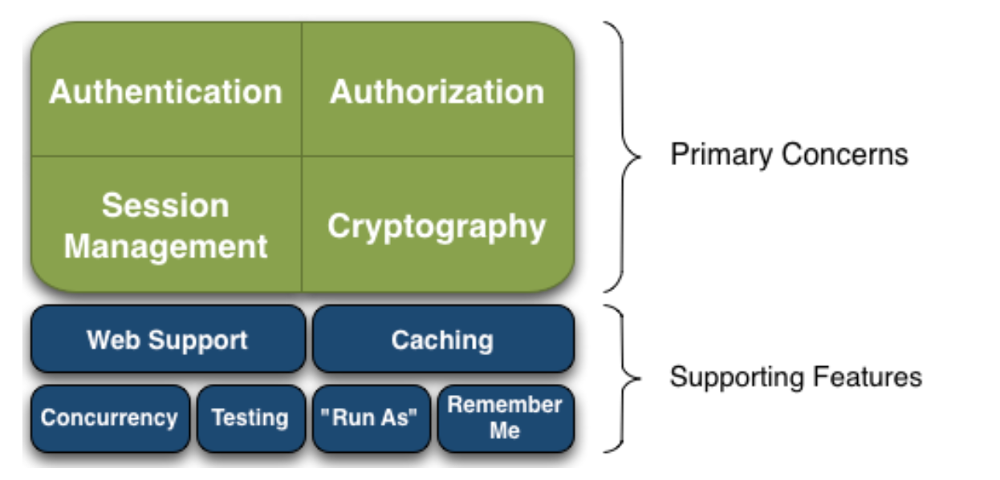
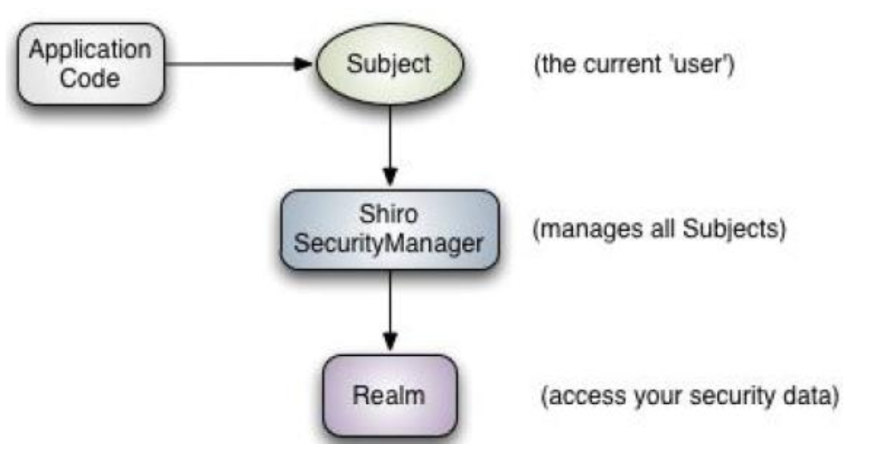
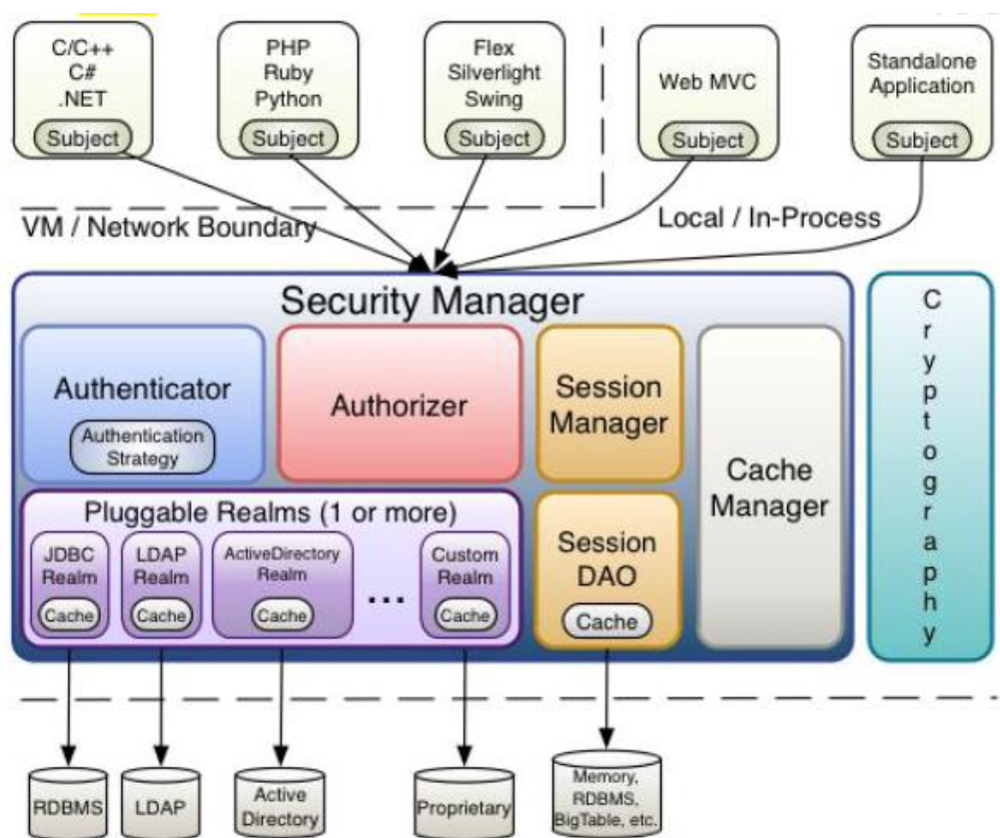
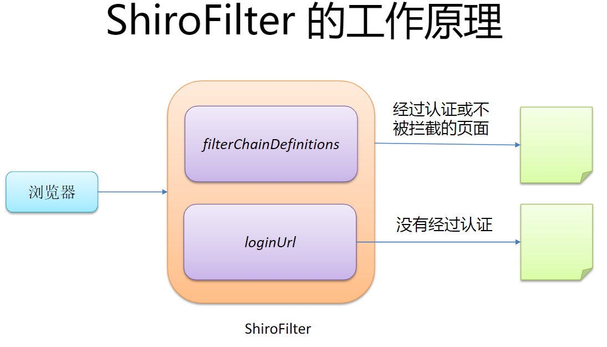
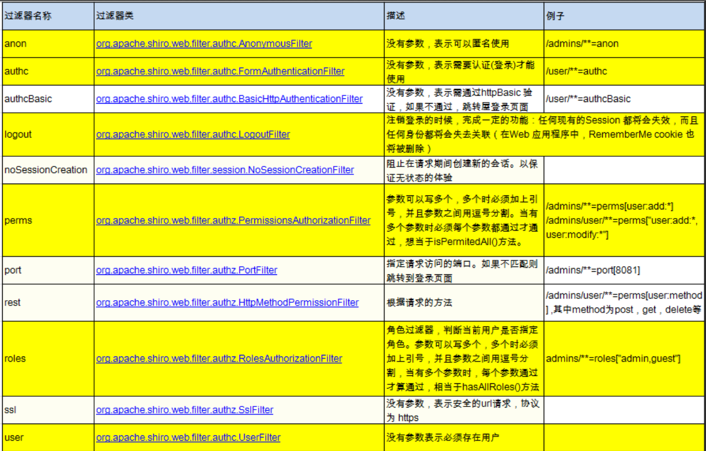

# Shiro 入门

## 1-Shiro简介

- ApacheShiro是 Java 的一个安全（权限）框架。
- Shiro可以非常容易的开发出足够好的应用，其不仅可以用在 JavaSE 环境，也可以用在 JavaEE 环境。
- Shiro可以完成：认证、授权、加密、会话管理、与 Web 集成、缓存等。

相关资料：

- Shiro 官方网址：<http://shiro.apache.org/>
- GIthub 上的一个示例项目 [integrating `Shiro` into SSM to control the authority management](https://github.com/codingXiaxw/shiro/)
- 参考代码：[Shiro-Sample](../Code/Shiro/README.md)

### 1.1-Shiro的功能简介



- **Authentication**：身份认证/登录，验证用户是不是拥有相应的身份。
- **Authorization**：授权，即权限验证，验证某个已认证的用户是否拥有某个权限；即判断用户是否能进行什么操作，如：验证某个用户是否拥有某个角色。或者细粒度的验证某个用户对某个资源是否具有某个权限。
- **Session Manager**：会话管理，即用户登录后就是一次会话，在没有退出之前，它的所有信息都在会话中；会话可以是普通 JavaSE 环境，也可以是 Web 环境的。
- **Cryptography**：加密，保护数据的安全性，如密码加密存储到数据库，而不是明文存储。
- **Web Support**：Web 支持，可以非常容易的集成到 Web 环境。
- **Caching**：缓存，比如用户登录后，其用户信息、拥有的角色/权限不必每次去查，这样可以提高效率；
- **Concurrency**：Shiro 支持多线程应用的并发验证，即如在一个线程中开启另一个线程，能把权限自动传播过去。
- **Testing**：提供测试支持。
- **Run As**：允许一个用户假装为另一个用户（如果他们允许）的身份进行访问。
- **Remember Me**：记住我，这个是非常常见的功能，即一次登录后，下次再来的话不用登录了。

### 1.2-Shiro架构

#### 从 Shiro 外部来看

即从应用程序角度的来观察如何使用 Shiro 完成工作：



- **Subject**：应用代码直接交互的对象是 Subject，也就是说 Shiro 的对外 API 核心就是 Subject。Subject 代表了当前“用户”，这个用户不一定是一个具体的人，与当前应用交互的任何东西都是 Subject，如网络爬虫，机器人等；与 Subject  的所有交互都会委托给 SecurityManager；Subject 其实是一个门面，SecurityManager 才是实际的执行者。
- **SecurityManager**：安全管理器；即所有与安全有关的操作都会与 SecurityManager 交互；且其管理着所有 Subject；可以看出它是 Shiro 的核心，它负责与 Shiro 的其他组件进行交互，它相当于 SpringMVC 中 DispatcherServlet 的角色。
- **Realm**：Shiro 从 Realm 获取安全数据（如用户、角色、权限），就是说 SecurityManager 要验证用户身份，那么它需要从 Realm 获取相应的用户进行比较以确定用户身份是否合法；也需要从 Realm 得到用户相应的角色/权限进行验证用户是否能进行操作；可以把 Realm 看成 DataSource。

#### 从 Shiro 内部来看

即 Shiro 的内部架构：



- **Subject**：任何可以与应用交互的“用户”。
- **SecurityManager**：相当于 SpringMVC 中的 DispatcherServlet；是 Shiro 的心脏；所有具体的交互都通过 SecurityManager 进行控制；它管理着所有Subject、且负责进行认证、授权、会话及缓存的管理。
- **Authenticator**：负责 Subject 认证，是一个扩展点，可以自定义实现；可以使用认证策略（Authentication Strategy），即什么情况下算用户认证通过了。
- **Authorizer**：授权器、即访问控制器，用来决定主体是否有权限进行相应的操作；即控制着用户能访问应用中的哪些功能；
- Realm：可以有1 个或多个 Realm，可以认为是安全实体数据源，即用于获取安全实体的；可以是 JDBC 实现，也可以是内存实现等等；由用户提供；所以一般在应用中都需要实现自己的 Realm。
- **SessionManager**：管理 Session 生命周期的组件；而 Shiro 并不仅仅可以用在 Web 环境，也可以用在如普通的 JavaSE 环境。
- **CacheManager**：缓存控制器，来管理如用户、角色、权限等的缓存的；因为这些数据基本上很少改变，放到缓存中后可以提高访问的性能
- **Cryptography**：密码模块，Shiro提高了一些常见的加密组件用于如密码加密/解密。

## 2-Shiro快速入门

这里可以参考 [10 Minute Tutorial on Apache Shiro](https://shiro.apache.org/10-minute-tutorial.html)。从文档提供的位置下载示例代码，运行即可，核心代码为 `QuickStart.java` 与其配置文件 `shiri.ini`：

配置文件：

```ini
# 配置用户：
[users]
# 配置一个 root 用户,其密码为 secret，其有两个角色，admin 和 schwartz。
root = secret, admin, schwartz

# 配置角色：
[roles]
# 'admin' role has all permissions, indicated by the wildcard '*'
# admin 有所有的权限。
admin = *
# The 'schwartz' role can do anything (*) with any lightsaber:
# schwartz 可以做任何 lightsaber 相关的事情。
schwartz = lightsaber:*
# The 'goodguy' role is allowed to 'delete' (action) the user (type) with license plate 'zhangsan' (instance specific id)
# goodguy可以对 user 类型的 zhangsan 进行 delete 操作
goodguy = user:delete:zhangsan
```

示例代码：

```java
public class Quickstart {

    private static final transient Logger log = LoggerFactory.getLogger(Quickstart.class);

    @Test
    public void testQuickStart() {
        //创建 SecurityManager
        Factory<SecurityManager> factory = new IniSecurityManagerFactory("classpath:shiro.ini");
        SecurityManager securityManager = factory.getInstance();

        //设置 SecurityManager
        SecurityUtils.setSecurityManager(securityManager);

        // 获取当前的 Subject. 调用 SecurityUtils.getSubject();
        Subject currentUser = SecurityUtils.getSubject();

        // 测试使用 Session
        // 获取 Session: Subject#getSession()
        Session session = currentUser.getSession();
        session.setAttribute("someKey", "aValue");
        String value = (String) session.getAttribute("someKey");
        if (value.equals("aValue")) {
            log.info("---> Retrieved the correct value! [" + value + "]");
        }

        // 测试当前的用户是否已经被认证. 即是否已经登录。
        // 调动 Subject 的 isAuthenticated()
        if (!currentUser.isAuthenticated()) {
            // 把用户名和密码封装为 UsernamePasswordToken 对象
            UsernamePasswordToken token = new UsernamePasswordToken("lonestarr", "vespa");
            // rememberme
            token.setRememberMe(true);
            try {
                // 执行登录.
                currentUser.login(token);
            }
            // 若没有指定的账户, 则 shiro 将会抛出 UnknownAccountException 异常。
            catch (UnknownAccountException uae) {
                log.info("----> There is no user with username of " + token.getPrincipal());
                return;
            }
            // 若账户存在, 但密码不匹配, 则 shiro 会抛出 IncorrectCredentialsException 异常。
            catch (IncorrectCredentialsException ice) {
                log.info("----> Password for account " + token.getPrincipal() + " was incorrect!");
                return;
            }
            // 用户被锁定的异常 LockedAccountException。
            catch (LockedAccountException lae) {
                log.info("The account for username " + token.getPrincipal() + " is locked.  " + "Please contact your administrator to unlock it.");
            }
            // 所有认证时异常的父类。
            catch (AuthenticationException ae) {
                //unexpected condition?  error?
            }
        }

        log.info("----> User [" + currentUser.getPrincipal() + "] logged in successfully.");

        // 测试是否有某一个角色. 调用 Subject 的 hasRole 方法。
        if (currentUser.hasRole("schwartz")) {
            log.info("----> May the Schwartz be with you!");
        } else {
            log.info("----> Hello, mere mortal.");
            return;
        }

        //test a typed permission (not instance-level)
        // 测试用户是否具备某一个行为. 调用 Subject 的 isPermitted() 方法。
        if (currentUser.isPermitted("lightsaber:weild")) {
            log.info("----> You may use a lightsaber ring.  Use it wisely.");
        } else {
            log.info("Sorry, lightsaber rings are for schwartz masters only.");
        }

        //a (very powerful) Instance Level permission:
        // 测试用户是否具备某一个行为。
        if (currentUser.isPermitted("user:delete:zhangsan")) {
            log.info("----> You are permitted to 'drive' the winnebago with license plate (id) 'eagle5'. Here are the keys - have fun!");
        } else {
            log.info("Sorry, you aren't allowed to drive the 'eagle5' winnebago!");
        }

        //all done - log out!
        // 执行登出，调用 Subject 的 Logout() 方法。
        System.out.println("---->" + currentUser.isAuthenticated());
        currentUser.logout();
        System.out.println("---->" + currentUser.isAuthenticated());
    }

}
```

## 3-使用Spring集成Shiro

主要参考官方文档：

- [Beginner’s Webapp Tutorial: a step-by-step tutorial to enable Shiro in a web application](https://shiro.apache.org/webapp-tutorial.html)
- [Integrating Apache Shiro into Spring-based Applications](https://shiro.apache.org/spring.html)

### ShiroFilter 说明

Shiro 提供了与 Web 集成的支持，其通过一个 ShiroFilter入口来拦截需要安全控制的 URL，然后进行相应的控制，ShiroFilter 类似于如 Strut2/SpringMVC 这种 web 框架的前端控制器，是安全控制的入口点，其负责读取配置（如ini配置文件），然后判断 URL 是否需要登录/权限等工作。



在 web.xml 中，我们需要配置一个 DelegatingFilterProxy，其作用是自动到Spring 容器查找名字为shiroFilter（filter-name）的bean并把所有Filter 的操作委托给它。

```xml
    <filter>
        <filter-name>shiroFilter</filter-name>
        <filter-class>org.springframework.web.filter.DelegatingFilterProxy</filter-class>
        <init-param>
            <param-name>targetFilterLifecycle</param-name>
            <param-value>true</param-value>
        </init-param>
    </filter>

    <filter-mapping>
        <filter-name>shiroFilter</filter-name>
        <url-pattern>/*</url-pattern>
    </filter-mapping>
```

然后我们会在 spring 容器中配置一个名为 shiroFilter 的 Bean：

```xml
<!-- PropertiesPlaceholderConfigurer and abstract beans or anything else we might need: -->
<bean id="shiroFilter" class="org.apache.shiro.spring.web.ShiroFilterFactoryBean">
    <property name="securityManager" ref="securityManager"/>
    <property name="loginUrl" value="/login.jsp"/>
    <property name="successUrl" value="/list.jsp"/>
    <property name="unauthorizedUrl" value="/unauthorized.jsp"/>
    <property name="filterChainDefinitionMap" ref="filterChainDefinitionMap"/>
    <!--  
        配置哪些页面需要受保护，以及访问这些页面需要的权限. 
        1). anon 可以被匿名访问
        2). authc 必须认证(即登录)后才可能访问的页面. 
        3). logout 登出.
        4). roles 角色过滤器
    -->
    <property name="filterChainDefinitions">
        <value>
            /login.jsp = anon
            /shiro/login = anon
            /shiro/logout = logout
            /user.jsp = roles[user]
            /admin.jsp = roles[admin]
            /** = authc
        </value>
    </property>
</bean>
```

### URL 匹配说明

对于向应用发起的每个访问，我们可以在 xml 或者 Java 类中配置哪些需要保护哪些需要放行：

- `[urls]` 部分的配置，其格式是：`“url=拦截器[参数]，拦截器[参数]”；`。
- 如果当前请求的 url 匹配 `[urls]` 部分的某个 url 模式，将会执行其配置的拦截器。

**Shiro 中默认的过滤器**：

- anon（anonymous）拦截器表示匿名访问（即不需要登录即可访问）。
- authc（authentication）拦截器表示需要身份认证通过后才能访问。



**URL 匹配模式**：

- url 模式使用Ant 风格模式
- Ant 路径通配符支持`?、*、**`，注意通配符匹配不包括目录分隔符`“/”`：
  - `?`：匹配一个字符，如 /admin? 将匹配 /admin1，但不匹配 `/admin` 或 `/admin/`。
  - `*`：匹配零个或多个字符串，如 `/admin` 将匹配 `/admin`、`/admin123`，但不匹配 `/admin/1`。
  - `**`：匹配路径中的零个或多个路径，如 `/admin/**` 将匹配 `/admin/a` 或 `/admin/a/b`。

**URL 匹配顺序**：URL 权限采取第一次匹配优先的方式，即从头开始使用第一个匹配的 url 模式对应的拦截器链。

如：

```xml
<property name="filterChainDefinitions">
    <value>
        /bb/**=filter1
        /bb/aa=filter2
        /**=filter3
    </value>
</property>

```

如果请求的url是 `“/bb/aa”`，因为按照声明顺序进行匹配，那么将使用 filter1 进行拦截。

## 4-Shrio中的认证

- [ ] todo

## 5-Shrio中的授权

- [ ] todo

## 6-Shrio中的会话管理

- [ ] todo

## 7-Shrio中的缓存

- [ ] todo

## 8-ShrioRememberMe

- [ ] todo
