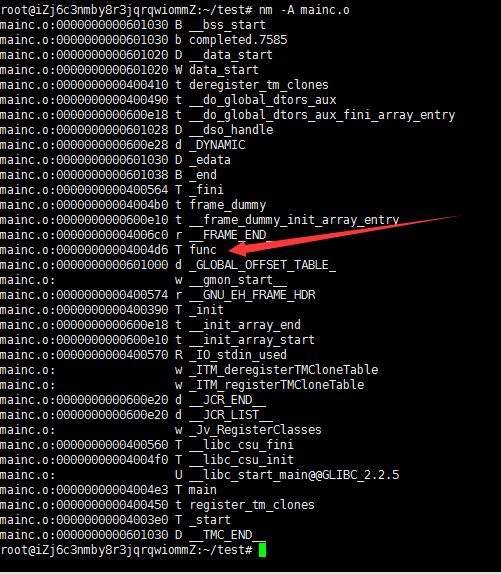
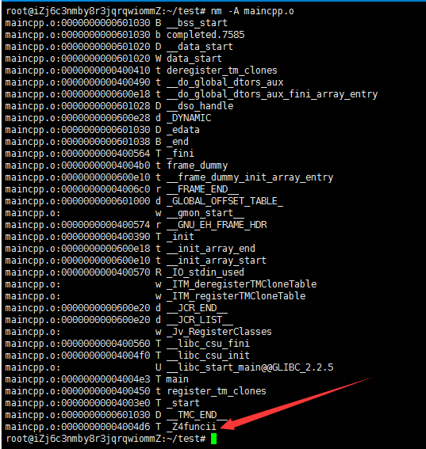

# C & CPP Interacting

C 与 C++ 混合编程，如果不做处理，会出现编译通过但链接时找不到函数或者直接编译不通过的情况。原因在于符号兼容性问题和C语言不兼容某些C++特性。

**符号兼容性**：C++ 支持函数重载，C 不支持函数重载，在编译后，C++ 的函数名会被修改，而 C 的函数名基本上不变，由于两者在编译后函数名的命名策略不同，所以在不处理的情况下，C 调用 C++ 的函数或者 C++ 调用 C 函数，都会在链接阶段报找不到函数的错误。

对于 `func` 函数 被 C 的编译器编译后在函数库中的名字可能为 `func`(无参数符号)，而 C++ 编译器则会产生类似`funcii`之类的名字。

```c
int func(int x,int y){

}

int main(){
    return 0;
}
```

上面代码分别命名为 `main.c / main.cpp`，接着分别进行编译，然后使用 `nm`(显示二进制目标文件的符号表) 命令查看程序的符号表：

```shell
gcc main.c -o mainc.o
gcc main.cpp -o maincpp.o

nm -A mainc.o
nm -A maincpp.o
```

main.c



main.cpp



问题就在于： c的 .h 头文件中定义了 `func` 函数，则 .c 源文件中实现这个函数符号都是`func`，然后拿到 C++ 中使用，.h 文件中的对应函数符号就被编译成另一种，和库中的符号不匹配，这样就无法正确调用到库中的实现。

## 使用 `extern` 解决符号兼容性问题

### CPP 调用 C

- c 不需要做特殊处理。
- cpp 在引用 c 头文件时使用 extern 关键字，extern "C" 告诉链接器去寻找按 C 编译器规则编译成的符号，而不是经过 C++ 修饰的符号。

Clibrary.h

```c
#ifndef INTERACTOR_CLIBRARY_H
#define INTERACTOR_CLIBRARY_H

int add(int a, int b);

#endif
```

Clibrary.c

```c
#include "CLibrary.h"

int add(int a, int b) {
    return a + b;
}
```

main.cpp

```cpp
#include <iostream>

//C++调用C函数的例子: 引用C的头文件时，需要加extern "C"
extern "C" {
#include "CLibrary.h"
}

int main() {
    int a = 100;
    int b = 300;
    int ret = add(a, b);
    std::cout << "cpp call c add result = " << ret << std::endl;
    return 0;
}
```

### C 调用 CPP

- cpp 代码需要照顾到 c，在 header 中使用 extern "C" 修饰包含函数声明，目的就是告诉 C++ 编译器（因为cpp代码还是会调用到cpp的编译器去编译），其函数命名规则采用 C 的方式，这样 C 调用了 C++ 函数，在链接时就能找得到。
- c 不需要做特殊处理。

CppLibrary.h

```cpp
#ifndef INTERACTOR_CPPLIBRARY_H
#define INTERACTOR_CPPLIBRARY_H

#ifdef  __cplusplus
extern "C" {
#endif

int add(int a, int b);

#ifdef  __cplusplus
}
#endif

#endif
```

CppLibrary.cpp

```c
#include "CppLibrary.h"

int add(int a, int b) {
    return a + b;
}
```

main.c

```c
#include <stdlib.h>
#include <stdio.h>
#include "CppLibrary.h"

//C中调用 C++ 函数：extern "C"需要放在 C++ 头文件中。

int main() {
    int a = 10;
    int b = 90;
    int ret = add(a, b);
    printf("c call cpp result = %d", ret);
    return EXIT_SUCCESS;
}
```

## 复杂情形的调用

参考：

- [NDK开发中C与C++互相调用处理](https://www.jianshu.com/p/49859d267567)
