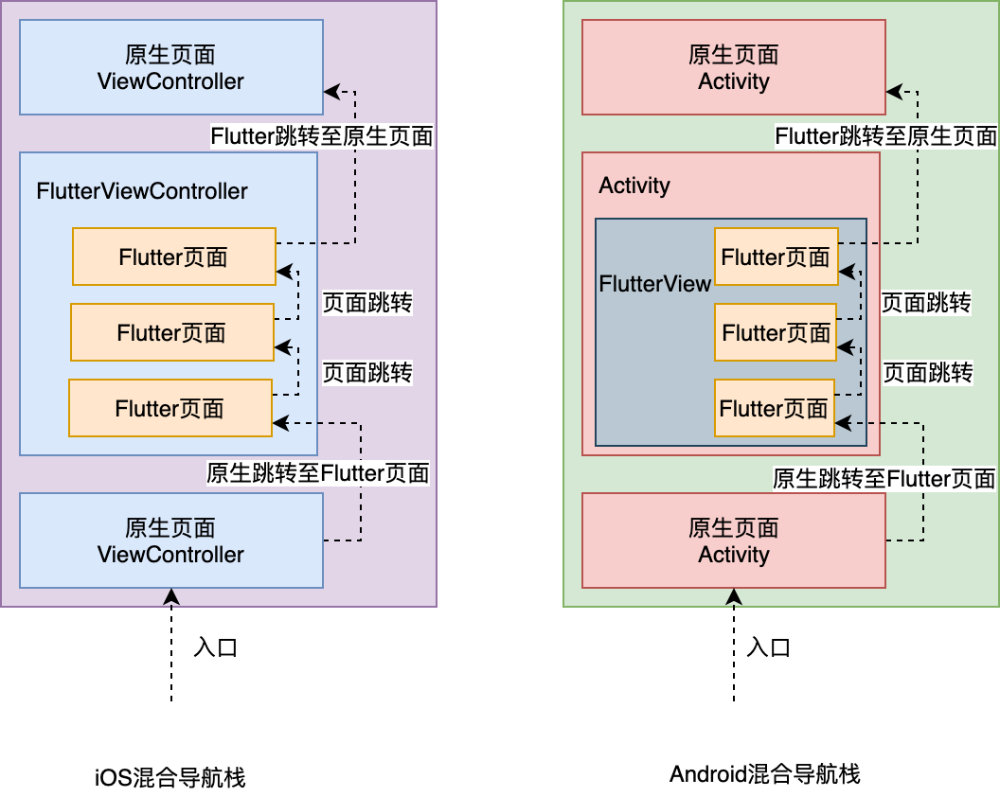

# 29-混合开发-导航栈管理方案

为了把 Flutter 引入到原生工程，我们需要把 Flutter 工程改造为原生工程的一个组件依赖，并以组件化的方式管理不同平台的 Flutter 构建产物，即 Android 平台使用 aar、iOS 平台使用 pod 进行依赖管理。这样我们就可以在 Android 工程中通过 FlutterView，iOS 工程中通过 FlutterViewController，为 Flutter 搭建应用入口，实现 Flutter 与原生的混合开发方式。

**纯 Flutter 与插件化的 Flutter 在运行机制上并无任何区别**：FlutterView 与 FlutterViewController 是初始化 Flutter 的地方，也是应用的入口。以混合开发方式接入 Flutter，与开发一个纯 Flutter 应用在运行机制上并无任何区别，只需要原生工程为它提供一个画板容器（Android 为 FlutterView，iOS 为 FlutterViewController），Flutter 就可以自己管理页面导航栈，从而实现多个复杂页面的渲染和切换。

**新问题——如何管理混合导航栈？**：Flutter 被接入之后，又有一个新问题，即如何管理混合导航栈？对于混合开发的应用而言，通常我们只会将应用的部分模块修改成 Flutter 开发，其他模块继续保留原生开发，因此应用内除了 Flutter 的页面之外，还会有原生 Android、iOS 的页面。Flutter 页面有可能会需要跳转到原生页面，而原生页面也可能会需要跳转到 Flutter 页面。这就涉及到了一个新的问题：如何统一管理原生页面和 Flutter 页面跳转交互的混合导航栈。

## 1 混合导航栈

**混合导航栈**：指的是原生页面和 Flutter 页面相互掺杂，存在于用户视角的页面导航栈视图中。

Flutter 与原生 Android、iOS 各自实现了一套互不相同的页面映射机制，即：

- 原生采用单容器单页面（一个 ViewController/Activity 对应一个原生页面）
- Flutter 采用单容器多页面（一个 ViewController/Activity 对应多个 Flutter 页面）的机制。

Flutter 在原生的导航栈之上又自建了一套 Flutter 导航栈，这使得 Flutter 页面与原生页面之间涉及页面切换时，我们需要处理跨引擎的页面切换。



## 2 从原生页面跳转至 Flutter 页面

**从原生页面跳转至 Flutter 页面**：因为 Flutter 本身依托于原生提供的容器（iOS 为 FlutterViewController，Android 为 Activity 中的 FlutterView），所以我们通过初始化 Flutter 容器，为其设置初始路由页面之后，就可以以原生的方式跳转至 Flutter 页面了。

示例代码：

1. 对于 iOS，我们初始化一个 FlutterViewController 的实例，为其设置初始化页面路由后，将其加入原生的视图导航栈中完成跳转。
2. 对于 Android，因为 Flutter 页面的入口并不是原生视图导航栈的最小单位 Activity，而是一个 View（即 FlutterView），所以我们还需要把这个 View 包装到 Activity 的 contentView 中。在 Activity 内部设置页面初始化路由之后，在外部就可以采用打开一个普通的原生视图的方式，打开 Flutter 页面了。

```java
//iOS 跳转至 Flutter 页面
FlutterViewController *vc = [[FlutterViewController alloc] init];
[vc setInitialRoute:@"defaultPage"];// 设置 Flutter 初始化路由页面
[self.navigationController pushViewController:vc animated:YES];// 完成页面跳转

//Android 跳转至 Flutter 页面

// 创建一个作为 Flutter 页面容器的 Activity
public class FlutterHomeActivity extends AppCompatActivity {
  protected void onCreate(Bundle savedInstanceState) {
    super.onCreate(savedInstanceState);
    // 设置 Flutter 初始化路由页面
    View FlutterView = Flutter.createView(this, getLifecycle(), "defaultRoute"); // 传入路由标识符
    setContentView(FlutterView);// 用 FlutterView 替代 Activity 的 ContentView
  }
}
// 用 FlutterPageActivity 完成页面跳转
Intent intent = new Intent(MainActivity.this, FlutterHomeActivity.class);
startActivity(intent);
```

## 3 从 Flutter 页面跳转至原生页面

从 Flutter 页面跳转至原生页面，需要考虑以下两种场景：

1. 从 Flutter 页面打开新的原生页面；
2. 从 Flutter 页面回退到旧的原生页面。

### 从 Flutter 如何打开原生页面

**使用方法通道**：Flutter 并没有提供对原生页面操作的方法，所以不可以直接调用。我们需要通过方法通道。在 Flutter 和原生两端各自初始化时，提供 Flutter 操作原生页面的方法，并注册方法通道，在原生端收到 Flutter 的方法调用时，打开新的原生页面。

### 从 Flutter 页面回退到原生页面

1. 因为 Flutter 容器本身属于原生导航栈的一部分，所以当 Flutter 容器内的根页面（即初始化路由页面）需要返回时，我们需要关闭 Flutter 容器，从而实现 Flutter 根页面的关闭。
2. 同样，Flutter 并没有提供操作 Flutter 容器的方法，因此我们依然需要通过方法通道，在原生代码宿主为 Flutter 提供操作 Flutter 容器的方法，在页面返回时，关闭 Flutter 页面。

Flutter 跳转至原生页面的两种场景，如下图所示：


接下来分析这两个需要通过方法通道实现的方法在 Android 和 iOS 平台上分别如何实现。即：

1. 打开原生页面 openNativePage；
2. 关闭 Flutter 页面 closeFlutterPage。

#### 注册方法通道

注册方法通道最合适的地方，是 Flutter 应用的入口，即在 FlutterViewController（iOS 端）和 Activity 中的 FlutterView（Android 端）这两个容器内部初始化 Flutter 页面前。

为了将 Flutter 相关的行为封装到容器内部，我们需要分别继承 FlutterViewController 和 Activity，在其 viewDidLoad 和 onCreate 初始化容器时，注册 openNativePage 和 closeFlutterPage 这两个方法。

iOS 端的实现代码如下所示：

```oc
@interface FlutterHomeViewController : FlutterViewController
@end
 
@implementation FlutterHomeViewController
- (void)viewDidLoad {
    [super viewDidLoad];
    // 声明方法通道
    FlutterMethodChannel* channel = [FlutterMethodChannel methodChannelWithName:@"samples.chenhang/navigation" binaryMessenger:self];
    // 注册方法回调
    [channel setMethodCallHandler:^(FlutterMethodCall* call, FlutterResult result) {
        // 如果方法名为打开新页面
        if([call.method isEqualToString:@"openNativePage"]) {
            // 初始化原生页面并打开
            SomeOtherNativeViewController *vc = [[SomeOtherNativeViewController alloc] init];
            [self.navigationController pushViewController:vc animated:YES];
            result(@0);
        }
        // 如果方法名为关闭 Flutter 页面
        else if([call.method isEqualToString:@"closeFlutterPage"]) {
            // 关闭自身 (FlutterHomeViewController)
            [self.navigationController popViewControllerAnimated:YES];
            result(@0);
        }
        else {
            result(FlutterMethodNotImplemented);// 其他方法未实现
        }
    }];
}
@end
```

Android 端的实现代码如下所示：

```java
// 继承 AppCompatActivity 来作为 Flutter 的容器
public class FlutterHomeActivity extends AppCompatActivity {

    @Override
    protected void onCreate(Bundle savedInstanceState) {
        super.onCreate(savedInstanceState);
        // 初始化 Flutter 容器
        FlutterView flutterView = Flutter.createView(this, getLifecycle(), "defaultPage"); // 传入路由标识符
        // 注册方法通道
        new MethodChannel(flutterView, "samples.chenhang/navigation").setMethodCallHandler(
            new MethodCallHandler() {
                @Override
                public void onMethodCall(MethodCall call, Result result) {
                    // 如果方法名为打开新页面
                    if(call.method.equals("openNativePage")) {
                        // 新建 Intent，打开原生页面
                        Intent intent = new Intent(FlutterHomeActivity.this, SomeNativePageActivity.class);
                        startActivity(intent);
                        result.success(0);
                    }
                    // 如果方法名为关闭 Flutter 页面
                    else if(call.method.equals("closeFlutterPage")) {
                        // 销毁自身 (Flutter 容器)
                        finish();
                        result.success(0);
                    }
                    else {
                        // 方法未实现
                        result.notImplemented();
                    }
                }
            });
        // 将 flutterView 替换成 Activity 的 contentView
        setContentView(flutterView);
    }

}
```

经过上面的方法注册，我们就可以在 Flutter 层分别通过 openNativePage 和 closeFlutterPage 方法，来实现 Flutter 页面与原生页面之间的切换了。

#### 实现界面跳转

在下面的例子中，Flutter 容器的根视图 DefaultPage 包含有两个按钮：

- 点击左上角的按钮后，可以通过 closeFlutterPage 返回原生页面；
- 点击中间的按钮后，会打开一个新的 Flutter 页面 PageA。PageA 中也有一个按钮，点击这个按钮之后会调用 openNativePage 来打开一个新的原生页面。

```dart
void main() => runApp(_widgetForRoute(window.defaultRouteName));
// 获取方法通道
const platform = MethodChannel('samples.chenhang/navigation');

// 根据路由标识符返回应用入口视图
Widget _widgetForRoute(String route) {
  switch (route) {
    default:// 返回默认视图
      return MaterialApp(home:DefaultPage());
  }
}

class PageA extends StatelessWidget {
  ...
  @override
  Widget build(BuildContext context) {
    return Scaffold(
            body: RaisedButton(
                    child: Text("Go PageB"),
                    onPressed: ()=>platform.invokeMethod('openNativePage')// 打开原生页面
            ));
  }
}

class DefaultPage extends StatelessWidget {
  ...
  @override
  Widget build(BuildContext context) {
    return Scaffold(
        appBar: AppBar(
            title: Text("DefaultPage Page"),
            leading: IconButton(icon:Icon(Icons.arrow_back), onPressed:() => platform.invokeMethod('closeFlutterPage')// 关闭 Flutter 页面
        )),
        body: RaisedButton(
                  child: Text("Go PageA"),
                  onPressed: ()=>Navigator.push(context, MaterialPageRoute(builder: (context) => PageA())),// 打开 Flutter 页面 PageA
        ));
  }
}
```

整个混合导航栈示例的代码流程，如下图所示。通过这张图，你就可以把这个示例的整个代码流程串起来了。


在我们的混合应用中，RootViewController 与 MainActivity 分别是 iOS 和 Android 应用的原生页面入口，可以初始化为 Flutter 容器的 FlutterHomeViewController（iOS 端）与 FlutterHomeActivity（Android 端）。

在为其设置初始路由页面 DefaultPage 之后，就可以以原生的方式跳转至 Flutter 页面。但是，Flutter 并未提供接口，来支持从 Flutter 的 DefaultPage 页面返回到原生页面，因此我们需要利用方法通道来注册关闭 Flutter 容器的方法，即 closeFlutterPage，让 Flutter 容器接收到这个方法调用时关闭自身。

在 Flutter 容器内部，我们可以使用 Flutter 内部的页面路由机制，通过 Navigator.push 方法，完成从 DefaultPage 到 PageA 的页面跳转；而当我们想从 Flutter 的 PageA 页面跳转到原生页面时，因为涉及到跨引擎的页面路由，所以我们仍然需要利用方法通道来注册打开原生页面的方法，即 openNativePage，让 Flutter 容器接收到这个方法调用时，在原生代码宿主完成原生页面 SomeOtherNativeViewController（iOS 端）与 SomeNativePageActivity（Android 端）的初始化，并最终完成页面跳转。

## 4 总结

对于原生 Android、iOS 工程混编 Flutter 开发，由于应用中会同时存在 Android、iOS 和 Flutter 页面，所以我们需要妥善处理跨渲染引擎的页面跳转，解决原生页面如何切换 Flutter 页面，以及 Flutter 页面如何切换到原生页面的问题。

- 在原生页面切换到 Flutter 页面时，我们通常会将 Flutter 容器封装成一个独立的 ViewController（iOS 端）或 Activity（Android 端），在为其设置好 Flutter 容器的页面初始化路由（即根视图）后，原生的代码就可以按照打开一个普通的原生页面的方式，来打开 Flutter 页面了。
- 如果我们想在 Flutter 页面跳转到原生页面，则需要同时处理好打开新的原生页面，以及关闭自身回退到老的原生页面两种场景。在这两种场景下，我们都需要利用方法通道来注册相应的处理方法，从而在原生代码宿主实现新页面的打开和 Flutter 容器的关闭。

### 多 Flutter 示例问题

与纯 Flutter 应用不同，原生应用混编 Flutter 由于涉及到原生页面与 Flutter 页面之间切换，因此导航栈内可能会出现多个 Flutter 容器的情况，即多个 Flutter 实例。

**Flutter 实例的初始化成本非常高昂**，每启动一个 Flutter 实例，就会创建一套新的渲染机制，即 Flutter Engine，以及底层的 Isolate。而这些实例之间的内存是不互相共享的，会带来较大的系统资源消耗。

因此我们在实际业务开发中，应该尽量用 Flutter 去开发闭环的业务模块，原生只需要能够跳转到 Flutter 模块，剩下的业务都应该在 Flutter 内部完成，而**尽量避免 Flutter 页面又跳回到原生页面，原生页面又启动新的 Flutter 实例的情况**。

为了解决混编工程中 Flutter 多实例的问题，业界有两种解决方案：

- 以今日头条为代表的[修改 Flutter Engine 源码](https://mp.weixin.qq.com/s/-vyU1JQzdGLUmLGHRImIvg)，使多 FlutterView 实例对应的多 Flutter Engine 能够在底层共享 Isolate；
- 以闲鱼为代表的[共享 FlutterView](https://www.infoq.cn/article/VBqfCIuwdjtU_CmcKaEu)，即由原生层驱动 Flutter 层渲染内容的方案。

但这两种方案各有不足：

- 前者涉及到修改 Flutter 源码，不仅开发维护成本高，而且增加了线程模型和内存回收出现异常的概率，稳定性不可控。
- 后者涉及到跨渲染引擎的 hack，包括 Flutter 页面的新建、缓存和内存回收等机制，因此在一些低端机或是处理页面切换动画时，容易出现渲染 Bug。
除此之外，这两种方式均与 Flutter 的内部实现绑定较紧，因此在处理 Flutter SDK 版本升级时往往需要耗费较大的适配成本。

综合来说，目前这两种解决方案都不够完美。所以，在 Flutter 官方支持多实例单引擎之前，我们还是尽量在产品模块层面，保证应用内不要出现多个 Flutter 容器实例吧。

## 5 相关示例

- [29_flutter_module_page](https://github.com/cyndibaby905/29_flutter_module_page)
- [29_android_hybrid_demo](https://github.com/cyndibaby905/29_android_hybrid_demo)
- [29_ios_hybrid_demo](https://github.com/cyndibaby905/29_ios_hybrid_demo)

## 6 思考题

1.请在 openNativePage 方法的基础上，增加页面 id 的功能，可以支持在 Flutter 页面打开任意的原生页面。

2.混编工程中会出现两种页面过渡动画：原生页面之间的切换动画、Flutter 页面之间的切换动画。请你思考下，如何能够确保这两种页面过渡动画在应用整体的效果是一致的。

## 7 说明

由于 Flutter SDK 升级到 1.12 后，有很多不兼容的更新，原文所述集成方式可能不再适用，比如：

- FlutterView 已经被移除，Flutter 目前不提供在 View 级别使用 Flutter的便捷 API，因此如果可能，应避免使用 FlutterView。
- MethondChannel 使用方式有所更新。

具体参考

- [flutter-io-flutter-facade-not-found](https://stackoverflow.com/questions/59367636/flutter-io-flutter-facade-not-found)
- [Add Flutter to existing app](https://flutter.dev/docs/development/add-to-app)
- [platform_channel usage](https://github.com/flutter/flutter/blob/master/examples/platform_channel/android/app/src/main/java/com/example/platformchannel/MainActivity.java)
