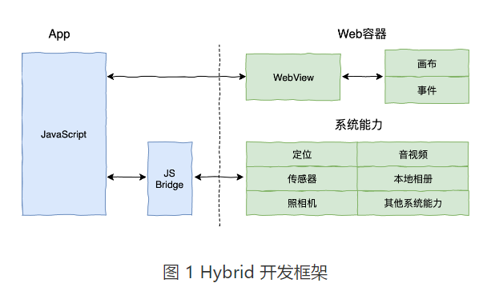
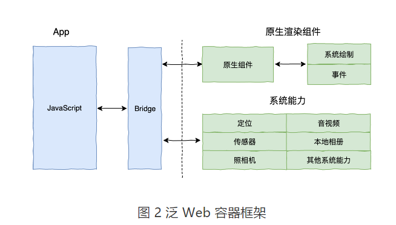
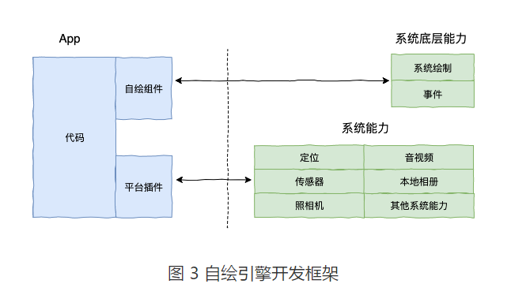

# 深入理解跨平台方案的历史发展逻辑

## 1 跨平台简介

跨平台开发是为了增加业务代码的复用率，减少因为要适配多个平台带来的工作量，从而降低开发成本。

## 2 跨平台开发方案的三个时代

1 **Web 容器时代**：基于 Web 相关技术通过浏览器组件来实现界面及功能，典型的框架包括Cordova(PhoneGap)、Ionic 和微信小程序。

2 **泛 Web 容器时代**：采用类 Web 标准进行开发，但在运行时把绘制和渲染交由原生系统接管的技术，代表框架有React Native、Weex 和快应用，广义的还包括天猫的Virtual View 等。

3 **自绘引擎时代**：自带渲染引擎，客户端仅提供一块画布即可获得从业务逻辑到功能呈现的多端高度一致的渲染体验。Flutter，是为数不多的代表。

## 3 如何选择跨平台方案

三个时代的跨平台框架代表们在开发效率、渲染性能、维护成本和社区生态上各有优劣，如下图所示：

在做技术选型时，可以参考以上维度，从**开发效率、技术栈、性能表现、维护成本**和**社区生态**来进行综合考虑。比如，是否必须支持动态化？是只解决 Android、iOS 的跨端问题，还是要包括 Web？对性能要求如何？对多端体验的绝对一致性和维护成本是否有强诉求？

- 如果是中短期项目的话，建议使用 ReactNative。
- 如果是长期项目，Flutter的设计理念比较先进，解决方案也相对彻底，在渲染能力的一致性以及性能上，和 React Native 相比优势非常明显。

## 原文

- [深入理解跨平台方案的历史发展逻辑](https://time.geekbang.org/column/article/104077)
