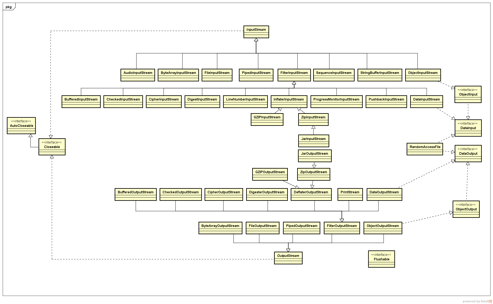
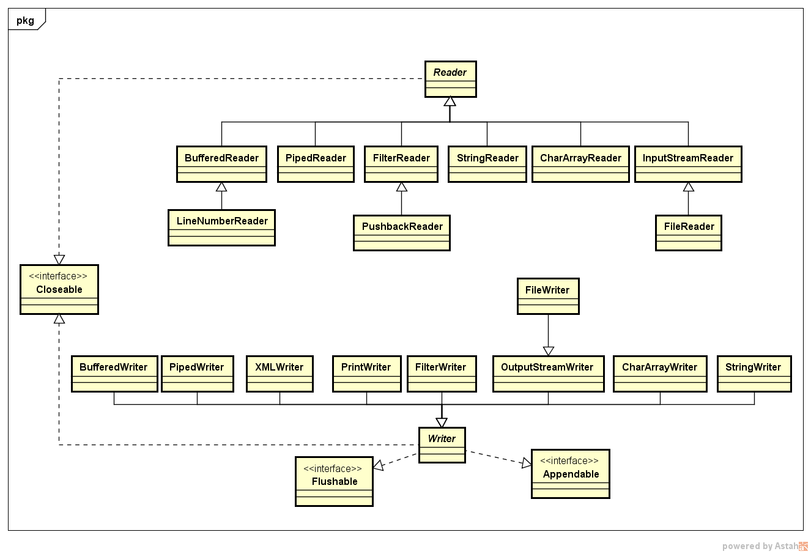

# Java BIO 学习

---

## 1 Java I/O

程序通用有两类操作：

- 一种是占用 CPU 时间的计算。即计算密集型任务。
- 另外一种是与数据输入/输出（I/O）相关的计算，即 I/O 密集型任务。

很多时候，频繁的 I/O 操作会造成性能问题，因为**在进行I/O操作时，一般需要竞争操作系统中有限的资源，或是需要等待速度较慢的外部设备完成其操作，从而造成I/O相关的计算所等待的时间较长**。从性能优化的角度出发，提升I/O相关操作的性能会对应用程序的整体性能产生比较大的帮助。

Java 提供了丰富的标准类库来满足应用程序中可能出现的与 I/O 操作相关的需求，而且这些标准库自身也在不断发展，主要表现如下：

1. 最初的随 JDK1.0 一起发布的 java.io。
2. JDK1.4 中的新增的 NIO（JSR 51：New I/O APIs for the JavaTM Platform, NIO）
3. Java7 中对 NIO 的补充和增强：NIO2（JSR 203：More New I/O APIs for the JavaTM Platform）

**I/O 的本质就是数据传输**，输入和输出是数据流动的方向，而实际的流动需要具体的媒介，最主要的媒介是**文件系统**和**网络连接**。Java I/O 对这两种媒介都有良好的支持。

从不同的抽象层次来看I/O操作，所得到的 API 是不同的：

- java.io 包把 I/O 操作抽象成数据的流动，进而有了 **流（stream）** 的概念。
- Java NIO 把 I/O 操作抽象成端到端的一个数据连接，这就有了通道 **（channel）** 的概念。

由于 java.io 只支持阻塞的方式，也被成为 bio。

---

## 2 Java 字节流



### 2.1 流的概念

java.io 最初将 I/O 抽象为流，流把I/O操作抽象成数据的流动。流所代表的是流动中的数据。可以从其中读入一个字节序列的对象称做输入流，可以向其中写入一个字节序列的对象称做输出流。这些字节序列的来源地和目的地通常都是文件，但也有可能是网络连接、甚至是内存块。

类库结构：

- java.io 中最基本的流是在字节这个层次上进行操作的（即字节流）。也就是说基本的流只负责在来源和目的之间传输字节，并不负责对字节的含义进行解释，Java中抽象的`InputStream`和`OutputStream`构成了输入/输出(IO)类层次结构的基础。
- 基于基本的字节流，Java 也提供了一些过滤流（filter stream）的实现。这些过滤流实际上是基本字节流上的一个封装，在其上增加了不同的处理能力，如基本类型与字节序列之间的转换等。

由于流的相关 API 设计得比较早，因此并没有采用现在流行的面向接口编程的思路，而是采用了抽象类。流类库中大量采用装饰设计模式，基类提供最基础的流功能，子类通过包装积累来实现功能增强。

### 2.2 字节流：InputStream 和 OutputStream

`java.io.InputStream` 和 `java.io.OutputStream` 是最基本的 I/O 流抽象类。

#### InputStream

输入流 InputStream 类中包含两类功能：

- 一类是与读取流中字节数据相关的功能：读取流中的字节通过read方法来完成。
- 另一类则是流的控制功能。

读取操作：主要体现在 read 方法。InputSteam 中提供了三个 read 方法。

- 第一种形式不带任何参数`int read()`，每次读取一个字节并返回。这是一个抽象方法，需要由具体的子类实现，毕竟作为抽象是不能知道具体的数据从哪里流过来的。read 是阻塞的，直到字节确实可以被读入或者写出。read 方法在碰到流的结尾时返回 -1。
- 第二种形式使用字节数组作为缓冲区`int read(byte b[])`，用读取到的字节数据填充缓冲区；内部调用抽象的`int read()`方法实现。read 方法的返回值是每次调用中成功读取的字节数。
- 最后一种形式为`int read(byte b[], int off, int len)`，其需要提供作为缓冲区使用的字节数组和数组中的起始位置和长度，读取到的字节数据被填充到缓冲区的指定位置上。

>缓冲区的作用：read 这种阻塞式的特性可能会成为应用中的性能瓶颈。如果不使用字节数组作为缓冲区，read 方法一次只能读入一个字节。在提供缓冲区的情况下，虽然 InputStream 类也只是以循环的方式每次读取一个字节来填充缓冲区，但是 InputStream 类的子类一般会为接受缓冲区作为参数的 read 方法提供更加高效的实现。所以我们应该实现带缓冲区版本的 read 方法。

控制功能：

- close 方法：用于关闭流，关闭一个输出流将在关闭流之前冲刷这个流的缓冲区。
- skip 方法：用于跳过指定数目的字节，相当于把流中的当前读取位置往后移动若干个字节。由于跳过若干个字节后，可能就已经到达了流的末尾，因此skip方法并不总能正确跳过指定数目的字节。调用者应该检查skip方法的返回值来获取实际跳过的字节数。并不是所有 InputStream 类的子类都支持skip方法。
- mark 和 reset 方法：这两个方法配合起来使用，可以实现流中部分内容的重复读取，不是所有的流都支持标记功能，因此在使用 mark 方法来标记当前位置之前，需要通过 markSupported 方法来判断当前流的实现是否支持标记功能。使用 mark 方法进行标记时，需要指定一个整数来表示允许重复读取的字节数。例如，标记时使用的是“mark（1024）”，那么在调用了 reset 之后，就只能从之前标记的位置开始再次重复读取最多 1024 字节。
- available 方法：当被调用 read 方法，而当前流中没有立即可用的数据时，这个调用操作会被阻塞到当前流成功地完成数据的准备为止。available 用于告诉流的使用者，在不产生阻塞的情况下，当前流中还有多少字节可供读取。如果每次只读取调用 available 方法获取到的字节数，那么读取操作肯定不会被阻塞。

>mark 和 reset 方法可以实现流的复用，但从流本身所代表的抽象层次出发，它表示的是一个流动的字节流，如流水一样，流中所包含的字节一旦流过去，就无法再重新使用。所以一般的只流能做顺序读取，但是也会有一些特殊流支持额外的控制操作，因此 InputStream 作为基类也定义了这两个方法。

#### OutputStream

- OutputStream 的 write 方法用于输出数据。
- flush 方法用来强制将 OutputStream 类的对象对暂时保存在内部缓冲区中的内容立即进行实际的写入操作。有些 OutputStream 类的子类会在内部维护一个缓冲区，通过 write 方法写入的数据会被首先存放在这个缓冲区中，然后在某个合适的时机再一次性地执行已缓冲的内容的实际写入操作。这种实现方式的出发点是为了性能考虑，减少实际的写入操作次数。当 OutputStream 类的对象的内部的缓冲区满了之后，会自动执行实际的写入操作。同时在 OutputStream 类的对象被关闭时，flush方法一般也会被自动调用。

#### 输入流的复用

有一些场景是需要复用流的，比如：通过 HTTP 连接获取到的 XML 文档的输入流，可能既要进行合法性检验，又要解析文档内容，还有可能要保存到磁盘中。这些操作都需要直接接收同一个输入流。对输入流复用的需求，有两种解决方式：

第一种是利用输入流提供的 mark 和 reset 的控制能力。比如 BufferedInputStream 类就支持这种操作。

```java
public class StreamReuse {

    private InputStream input;

    public StreamReuse(InputStream input) {
        if (!input.markSupported()) {
            this.input = new BufferedInputStream(input);
        } else {
            this.input = input;
        }
    }

    public InputStream getInputStream() {
        input.mark(Integer.MAX_VALUE);
        return input;
    }

    public void markUsed() throws IOException {
        input.reset();
    }

}
```

第二种是把输入流转换成数据来使用。

```java
public class SavedStream {

    private InputStream input;

    private byte[] data = new byte[0];

    public SavedStream(InputStream input) throws IOException {
        this.input = input;
        save();
    }

    private void save() throws IOException {
        ByteArrayOutputStream output = new ByteArrayOutputStream();
        byte[] buffer = new byte[1024];
        int len = -1;
        while ((len = input.read(buffer)) != -1) {
            output.write(buffer, 0, len);
        }
        data = output.toByteArray();
    }

    public InputStream getInputStream() {
        return new ByteArrayInputStream(data);
    }

}
```

实际上，这两种复用流的做法在实现上的思路是一样的，都是预先把要复用的数据保存起来。BufferedInputStream类在内部有一个自己的字节数组来维护标记位置之后可供读取的内容，与第二种做法中的字节数组的作用是一样的。

### 2.3 过滤输入输出流

在基本的输入输出流之上，java.io包还提供了多种功能更强的过滤输入输出流。这些过滤流所提供的增强能力各不相同：

1. **BufferedInputStream 类和 BufferedOutputStream 类**使用了内部的缓冲区来提高读写操作时的性能。
2. **DataInputStream 类和 DataOutputStream 类**在基本的字节流基础上提供了对读取和写入 Java 基本类型的支持。在使用 DataInputStream 类时，可以通过 readInt、readFloat 和 readUTF 等方法来读取基本数据类型，DataOutputStream 也有类似对应功能，这样我们就不需要关心数据类型与字节数组之间的转换工作，也不需要关心字节顺序（分为：大端表示（big-endian）和小端表示（little-endian））。
3. **ObjectInputStream 类和 ObjectOutputStream 类**在基本数据类型的基础上增加了读写 Java 对象的支持，这涉及到对象的序列化和反序列化。
4. **PushbackInputStream 类**支持当从输入流中读取了某些数据之后，又把这些数据又放回输入流中的操作，以便下次可以重新读取。这个功能由 unread 方法实现。
5. **FileInputStream 类和 FileOutputStream 类**用于文件读写。
6. **ByteArrayInputStream 类和ByteArrayOutputStream 类**用于字节数组和流之间的转换。
7. **PipedInputStream 类和 PipedOutputStream 类**是一对通过管道方式连接在一起的输入和输出流。一个PipedInputStream类的对象和一个PipedOutputStream类的对象连接在一起之后，通过PipedOutputStream类的对象所写入的数据可以在PipedInputStream类的对象中读取到。
8. **SequenceInputStream 类** 可以把多个输入流按顺序连接起来，形成一个完整的输入流。

---

## 3 Java 字符流



### Reader 和 Writer

Reader 和 Writer 字符流处理的是字符类型，而不是字节类型。字符流适合用于处理程序中包含的文本类型的内容。

### InputStreamReader 和 OutputStreamWriter

创建一个字符流的最常见做法是通过一个字节流 InputStream 类或 OutputStream 类的对象进行创建，然后通过 InputStreamReader 类和OutputStreamWriter 类对其进行包装转换成字符流。InputStreamReader 和 OutputStreamWriter 是字节流和字符流之间的桥梁。

```java
public static void main(String... args) throws FileNotFoundException {
    InputStreamReader inputStreamReader = new InputStreamReader(new FileInputStream("a.txt"), StandardCharsets.UTF_8)
}
```

**指定字符编码**：在创建 InputStreamReader 类和 OutputStreamWriter 类的对象时，总是应该显式地指定一个字符编码格式。如果不指定，使用的是底层 Java 平台的默认编码格式。这可能造成程序在不同运行平台上的兼容性问题。

### 其他字符流

- **StringReader 类和 StringWriter 类** 可以从 String 对象创建字符串。
- **CharArrayReader 类和 CharArrayWriter 类** 用于从字符数组中创建字符串。
- **BufferedReader 类和 BufferedWriter类** 用来为已有的 Reader 类和 Writer 类的对象提供内部缓冲区的支持，以提高读写操作的性能。

---

## 4 关于流动的其他总结

### 流的基本使用方式

java.io 中大量的使用装设设计模式，以基于基础的读写功能实现更加强大的字节和字符的读写，而我们使用流的方法也是通过组合各种流来实现特地的功能。

### 数据的存储方式

在保存数据时，可以选择二进制格式（`00 00 04 D`）或者文本格式。例如在存储整数 `1234` 时，两种存储方式为：

- 二进制格式：`00 00 04 D2`
- 文本格式：`1234`

在存储文本字符串时需要考虑字符编码(character encoding)，以二进制格式写出数据，需要使用`DataOutputStream`，以文本格式写出数据，可以使用`PrintWriter`。

DataOutputStream 实现了 DataOutput 接口，而 DataInputStream 实现了 DataInput 接口。

- DataOutput 接口定义了用于以二进制格式写数组、字符、boolean值和字符串的方法。
- DataInput 接口定义了用于以二进制格式读数组、字符、boolean值和字符串的方法。

字节排序方式分为：大端表示（big-endian）和小端表示（little-endian），**在Java中所有的值都是按照高位在前的模式写出的**。

### AutoCloseable

AutoCloseable 用于 java1.7 中在 try 语句中自动关闭资源。

```java
// 由于 RandomAccessFile 是AutoCloseable 的，所以在 java1.7 以上，可以使用这种语法，在代码允许结束后，RandomAccessFile 将会自动关闭。
try (RandomAccessFile file = new RandomAccessFile(new File("RandomAccessFileDemo.txt"), "rw")) {
    System.out.println(file.readBoolean());
    file.writeBoolean(true);
    file.write(3);
    file.write(3);
    file.write(3);
    file.writeUTF("ztiany");
} catch (IOException e) {
    e.printStackTrace();
}
```

---

## 5 随机访问流

RandomAccessFile类可以在文件中的任何位置查找或写入数据。其同时实现了DataInput和DataOutput接口。RandomAccessFile的构造方法需要传入一个表示读写的模式：

- r表示制度模式
- rw表示读写模式
- rws表示每次更新时，都对数据和元数据的写磁盘操作进行同步的读和写:
- rwd表示每次更新时，只对数据的写磁盘操作进行同步的读和写

rws与rwd的区别：

- rws flushes the contents of the file and the modification date of the file.
- rwd flushs the contents of the file, but the modification date might not change until the file is closed.

具体模式的区别可以参考：[Java: RandomAccessFile Mode “rws” vs “rwd”?](http://stackoverflow.com/questions/14232539/java-randomaccessfile-mode-rws-vs-rwd)

---

## 6 zip文档

zip文档通常以压缩格式存储一个或多个文件，每个zip文档都有一个头，包含诸如每个文件的名字和所使用的压缩方法等信息。

常用类：

- ZipOutputStream
- ZipInputStream
- ZipFile
- ZipEntry

jar文件只是带有一个特殊项的zip文件，这个项称做清单，可以使用JarInputStream和JarOutputStream类来读写清单项。

具体参考[java压缩和解压缩Zip、Jar、Gzip文件](http://elim.iteye.com/blog/1235360)

---

## 7 对象序列化

相关类：

- Serializable
- ObjectOutputStream
- ObjectInputStream

### 注意点

1 定义了下面方法，数据将不会在继续自动序列化，而是调用下面方法

```java
public static class A implements Serializable {
    private void readObject(ObjectInputStream inputStream) {
    }
    private void writeObject(ObjectOutputStream objectOutputStream) {
    }
}
```

2 readObject 和 writeObject 方法只需要保存和加载它们的数据域，而不需要关心超类数据和任何其他类信息， 可以实现 Externalizable 接口，来自定义类自己的机制，writeExternal 和 readExternal 方法对包含超类数据在内的整个对象的存储和恢复负全责。

```java
public interface Externalizable extends java.io.Serializable {
    void writeExternal(ObjectOutput out) throws IOException;
    void readExternal(ObjectInput in) throws IOException, ClassNotFoundException;
}
```

3 **记得给类定义serialVersionUID**

4 **序列化与类型安全的枚举**

- 即是构造器是私有的，序列化机制也可以创建新的对象！，因为他们不需要构造器来创建对象。具体参考《EffectiveJava》
- 使用readResolve干涉反序列化过程
- 如果readResolve被定义，那么对象在序列化之后将会调用次方法，其必须返回一个对象，作为readObject方法的返回值，也就是最终的反序列化结果。

下面就保证了即使Orientation被反序列化，Orientation的实例对象也只有两个：

```java
public static class Orientation implements Serializable{

    static final long serialVersionUID = 41L;

    protected Object readResolve() throws ObjectStreamException {
        if (flag == 1) {
            return HORIZONTAL;
        } else (flag == 2){
            return VERTICAL;
        }
        return null;
    }
    public static final Orientation HORIZONTAL = new Orientation(1);
    public static final Orientation VERTICAL = new Orientation(2);

    private int flag;

    Orientation(int flag) {
        this.flag = flag;
    }
}
```

---

## 8 文件压缩

JavaIO 类库中支持读写压缩数据格式的数据流，可以针对其他 IO 系统进行封装，以提供压缩功能。压缩功能的类不是从 Reader 和 Writer 派生出来的，而是属于 InputStream 和 OutputStream 继承关系的一部分，因为压缩库是按字节方式而不是字符方式处理的。

相关类：

压缩类|功能
---|---
CheckedInputStream|
CheckedOutputStream|
DeflaterInputStream|压缩基类
DeflaterOutputStream|
ZipOutputStream|
GZipOutputStream|
InflaterInputStream|解压缩基类
ZipInputStream|
GZipInputStream|

```java
public static void main(String... args) throws IOException {

    BufferedInputStream in = new BufferedInputStream(new FileInputStream("a.txt"));

    BufferedOutputStream out = new BufferedOutputStream(
        new GZIPOutputStream(new FileOutputStream("a.gz"))
    );

    int c;
    while ((c = in.read()) != -1) {
        out.write(c);
    }
    in.close();
    out.flush();
    out.close();
    BufferedReader bufferedReader = new BufferedReader(
        new InputStreamReader(new GZIPInputStream(new FileInputStream("a.gz")))
    );

    BufferedWriter bufferedWriter = new BufferedWriter(
        new FileWriter("b.txt")
    );

    String s;
    while ((s = bufferedReader.readLine()) != null) {
        bufferedWriter.write(s);
    }
    bufferedReader.close();
    bufferedWriter.flush();
    bufferedWriter.close();

}
```

---

## 9 字符集

在使用字符流时，我们都指定何种编码来处理数据，在 JDK1.4 之前我们直接用字符串表示编码方法，比如`UTF-8, ISO-8859-1` 等。

### Charset

JDK1.4 引入 Charset **统一了对字符集的转换**，字符集建立了两字节 Uncode 码元序列与使用本地字符编码方式的字节序列之间的映射。Charset类使用的是由 IANA 字符集注册中心标准化的字符集名字。某些名字可能与之前版本的字符集名称略有差异，比如 ISO-8859-1 的官方名称现在是`ISO-8859-1`而不再是`ISO8859-1`。为了兼容名称的使用习惯，每个字符集都可能由多种别名，可使用 aliases 方法返回由别名构成的 set 对象。

```java
Charset gbk = Charset.forName("UTF-8");//使用静态方法获取一个Charset
gbk.aliases().forEach(System.out::println);
Charset.availableCharsets();//用于获取可用的字符集。
```

本地的编码方式不能表示所有的Unicode字符，如果某个字符不能表示，那么将用`？`表示，一旦有了字符集，就可以使用它在包含**Unicode码元的Java字符串**和**编码而成的字节序列**之间进行转换：

```java
//编码
Charset charset = Charset.forName("UTF-8");
ByteBuffer byteBuffer = charset.encode("Ztiany");
byte[] array = byteBuffer.array();
System.out.println(Arrays.toString(array));

//解码
ByteBuffer wrap = ByteBuffer.wrap(array);
//编码给定的字节序列，无法识别的将使用Unicode的替换字符('\uFFFD')替换
CharBuffer decode = charset.decode(wrap);
System.out.println(decode.toString());
```

关于Unicode的可以参考[字符编码笔记：ASCII，Unicode和UTF-8](http://www.ruanyifeng.com/blog/2007/10/ascii_unicode_and_utf-8.html)

---

## 引用

- 《深入理解 Java7 核心技术与最佳实践》【推荐】
- [Java IO Tutorial-Java Asynchronous I/O](http://www.java2s.com/Tutorials/Java/Java_io/index.htm)
