# Java NIO

>笔记[示例代码](../Code/Java-IO/README.md)

---

## 1 什么是 IO

- I/O（英语：Input/Output），即输入/输出，通常指数据在内部存储器和外部存储器或其他周边设备之间的输入和输出。I/O 是信息处理系统（例如计算机）与外部世界（可能是人类或另一信息处理系统）之间的通信。输入是系统接收的信号或数据，输出则是从其发送的信号或数据。——《维基百科》
- 总线（Bus）是指计算机组件间规范化的交换数据（data）的方式，即以一种通用的方式为各组件提供数据传送和控制逻辑。从另一个角度来看，如果说主板（Mother Board）是一座城市，那么总线就像是城市里的公共汽车（bus），能按照固定行车路线，传输来回不停运作的比特（bit）。这些线路在同一时间内都仅能负责传输一个比特。因此，必须同时采用多条线路才能发送更多数据，而总线可同时传输的数据数就称为宽度（width），以比特为单位，总线宽度愈大，传输性能就愈佳。总线的带宽（即单位时间内可以传输的总数据数）为：总线带宽 = 频率×宽度（Bytes/sec）。——《维基百科》

IO 是由系统调度的，应用程序只能通过编程接口向系统提交 IO 操作，在然后系统会进行相关的 IO 操作，数据传输需要经过 IO 总线，IO 总线的传输能力是有限的，IO 操作是一种阻塞的操作，在完成系统完成 IO 操作前，调用程序的线程将会一直阻塞。

---

## 2 NIO 简介

>Java7 为 NIO 添加了很多新功能，也被称为 NIO.2，这里主要介绍 Java1.4 中的 NIO，而 Java7 的 NIO.2 可以参考[NIO.2](04-NIO2.md)。

Java NIO（New IO）是从 Java 1.4 版本开始引入的一个新的 IO API，可以替代标准的 Java IO API。NIO 与原来的 IO 有同样的作用和目的，但是使用的方式完全不同，NIO支持 **面向缓冲区的、基于通道** 的IO操作。NIO 以更加高效的方式进行文件的读写操作。

Java NIO 与IO 的主要区别：

- 传统IO：面向流(Stream Oriented)、阻塞式IO(Blocking IO)
- NIO：面向缓冲区(Buffer Oriented)、非阻塞式IO(NonBlocking IO)、提供了选择器(Selectors)
- 对于阻塞 IO，对每个客户端的读取操作都要一个对应的线程。大部分线程都处于等待。CPU 需要扫描所有线程的状态，但大部分线程还是等待中的。
- 对于非阻塞 IO，通过事件驱动，只需要一个线程就可以处理所有客户端的读数据操作。这个线程的效率非常高，充分利用了系统资源。避免了资源浪费。

Java1.4 NIO 相关内容：

1. Java NIO 简介以及 Java NIO 与IO 的主要区别
2. 缓冲区(Buffer)
   1. ByteBuffer 及其子类
   2. 直接内存
3. 通道(Channel)
   1. Channel 简介
   2. FileChannel
   3. Pipe.SinkChannel 和 Pipe.SourceChannel
4. NIO 的非阻塞式 I/O
    1. SelectableChannel
    2. 选择器(Selector)
5. 网络套接字通道：SocketChannel、ServerSocketChannel、DatagramChannel

进一步了解 Java1.4 NIO，可以下载官方文档 [JSR-000051 New I/O APIs for Java(TM) Platform Specification 0.60 Proposed Final Draft](https://download.oracle.com/otndocs/jcp/7847-newio-0.6-pfd-spec-oth-JSpec/) 进行查阅，同时也可以参考 [Java(TM) 2 SDK, Standard Edition Documentation 1.4.2](https://www.oracle.com/java/technologies/java-archive-142docs-downloads.html)。

---

## 3 缓冲区（Buffer）

Java NIO系统的核心在于：**通道(Channel)和缓冲区(Buffer)**。

- **通道**表示打开到 IO 设备(例如：文件、套接字)的连接。若需要使用 NIO 系统，需要获取用于连接 IO 设备的通道以及用于容纳数据的缓冲区。然后操作缓冲区，对数据进行处理。简而言之，Channel 负责传输，Buffer 负责存储。通道可以理解为铁路，而缓冲区可以理解为火车。
- **缓冲区**是一个用于特定基本数据类型的容器。由 `java.nio` 包定义的，所有缓冲区都是 Buffer 抽象类的子类。Java NIO 中 的 Buffer 主要用于与 NIO 通道进行交互，数据是从通道读入缓冲区，从缓冲区写入通道中的。

Buffer 就像一个数组，可以保存多个相同类型的数据，根据数据类型不同(boolean 除外) ，有以下 Buffer 常用子类：

- ByteBuffer
  - MappedByteBuffer：比较特殊，用于实现内存映射文件。
- CharBuffer
- ShortBuffer
- IntBuffer
- LongBuffer
- FloatBuffer
- DoubleBuffer

这些 Buffer 类都采用相似的方法进行管理数据，只是各自管理的数据类型不同而已，通过下面方法可以获取一个 Buffer 对象：

```java
static XxxBuffer allocate(int capacity)：创建一个容量为 capacity 的 XxxBuffer 对象，XxxBuffer 为上述 Buffer 的一种。
static ByteBuffer wrap(byte[] array)：从已有的内存区域创建 ByteBuffer对象
```

Butter 类体系：

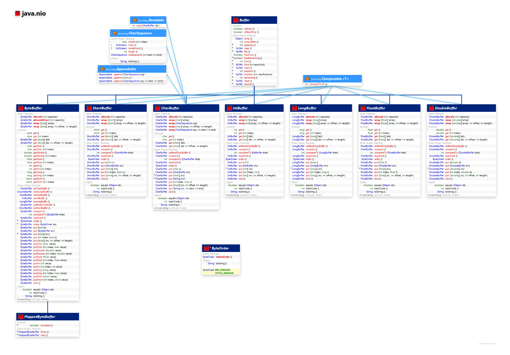

>图片来此 <http://www.falkhausen.de/Java-8/java.nio/Buffer.html>

### 3.1 缓冲区的基本属性

Buffer 中的重要概念：

- **容量(capacity)** ：表示Buffer 最大数据容量，缓冲区容量不能为负，并且创建后不能更改。
- **限制(limit)**：第一个不应该读取或写入的数据的索引，即位于limit 后的数据不可读写。缓冲区的限制不能为负，并且不能大于其容量。
- **位置(position)**：下一个要读取或写入的数据的索引。缓冲区的位置不能为负，并且不能大于其限制，position 最大可以到 capacity-1.
- **标记(mark)与重置(reset)**：标记是一个索引，通过Buffer 中的 mark() 方法指定 Buffer 中一个特定的 position，之后可以通过调用 reset() 方法恢复到这个position.

标记、位置、限制、容量遵守不变式：`0 <= mark <= position <= limit <= capacity`，理解这些属性是理解 Buffer 的关键，Buffer 作为一个缓存区自然是由于存储数据的，我们可以从 Buffer 中写入数据，也可以从 Buffer 中读取数据，即 Buffer 存在读写的模式，而同一时刻只能是写或者读模式，这个模式的切换就是基于修改这些属性来实现的。

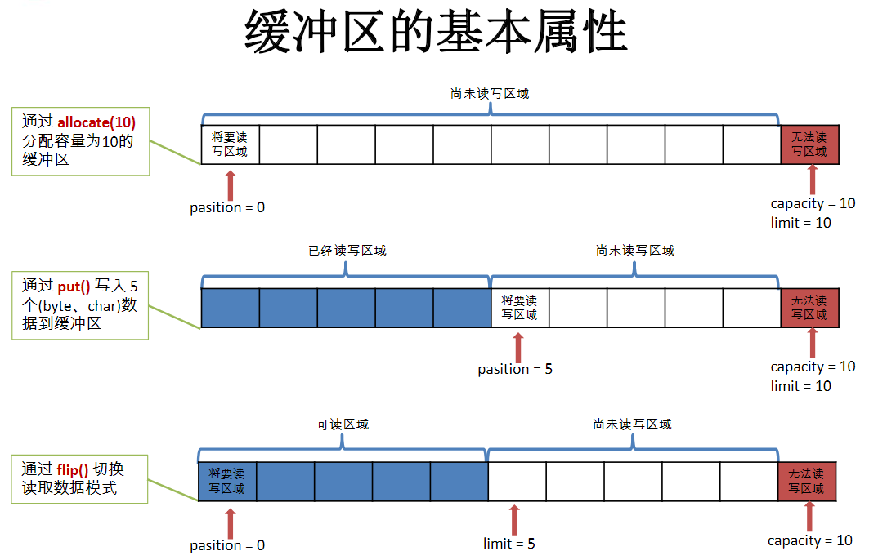

Buffer 的常用方法:

方法 | 描述
---|---
`Buffer clear()` | 清空缓冲区并返回对缓冲区的引用
`Buffer flip()` | 将缓冲区的界限设置为当前位置，并将当前位置重置为 0
`int capacity()` | 返回 Buffer 的 capacity 大小
`boolean hasRemaining()` | 判断缓冲区中是否还有元素
`int limit()` | 返回Buffer 的界限(limit) 的位置
`Bufferlimit(int n)` | 将设置缓冲区界限为n, 并返回一个具有新 limit 的缓冲区对象
`Buffer mark()` | 对缓冲区设置标记
`int position()` | 返回缓冲区的当前位置 position
`Buffer position(int n)` | 将设置缓冲区的当前位置为 n，并返回修改后的 Buffer 对象
`int remaining()` | 返回 position 和 limit 之间的元素个数
`Buffer reset()` | 将位置 position 转到以前设置的 mark 所在的位置
`Buffer rewind()` | 将位置设为 0，取消设置的 mark

### 3.2 缓冲区的数据操作

#### put 和 get 方法

获取 ByteBuffer 中的数据：

- `byte get()` ：读取单个数据，比如 ByteBuffer 就是读取一个字节。
- `get(byte[] dst)`：批量读取多个字节到 dst 中
- `get(int index)`：读取指定索引位置的字节(不会移动position)

放入数据到 ByteBuffer 中：

- `put(byte b)`：将给定单个字节写入缓冲区的当前位置
- `put(byte[] src)`：将src 中的字节写入缓冲区的当前位置
- `put(int index, byte b)`：将指定字节写入缓冲区的索引位置(不会移动position)

Buffer 的每个子类都定义了两种 get 和 put 操作：

- 相对操作(比如 `put(byte)`)：读取或写入一个或多个元素，它从当前位置开始，然后将位置增加所传输的元素数。如果请求的传输超出限制，则相对获取操作将抛出 BufferUnderflowException，相对放置操作将抛出 BufferOverflowException，这两种情况下，都没有数据被传输。
- 绝对操作(比如 `put(int index,byte b)`)：采用显式元素索引，该操作不影响位置。如果索引参数超出限制，绝对获取操作和放置操作将抛出 IndexOutOfBoundsException。

#### Buffer 的使用步骤以及`clear、flip、rewind`方法总结

Buffer 的一般使用步骤：

1. 把数据写入 buffer。
2. 调用`buffer.flip()` 切换到读模式。
3. 从 Buffer 中读取数据。
4. 调用 `buffer.clear()` 充值标志位，又可以开始写了。

Buffer 的 `clear、flip、rewind`方法总结：

方法 | 调用后 Buffer 用于 | position 变为| limit 变为 | mark 变为
---|---|---|---|---|---
`Buffer clear()`| 将数据`read()/put()`进缓存区 | 0 | capacity | 未定义 |
`Buffer flip()`| 从缓存区`write()/get()` | 0 | position | 未定义 |
`Buffer rewind()`| 从缓存区`rewrite()/get()` | 0 | 没有改变 | 未定义 |

rewind 操作会将 position 设置为 0，并使 mark 值无效，这适用于一种场景：在读取完数据后，希望将所有的数据都写入 logger 中。

```java
public void testByteBuffer() {
    String str = "abcde";

    //1. 分配一个指定大小的缓冲区
    ByteBuffer buf = ByteBuffer.allocate(1024);
    System.out.println("-----------------allocate()----------------");
    System.out.println(buf.position());
    System.out.println(buf.limit());
    System.out.println(buf.capacity());

    //2. 利用 put() 存入数据到缓冲区中
    buf.put(str.getBytes());
    System.out.println("-----------------put()----------------");
    System.out.println(buf.position());
    System.out.println(buf.limit());
    System.out.println(buf.capacity());

    //3. 切换读取数据模式
    buf.flip();
    System.out.println("-----------------flip()----------------");
    System.out.println(buf.position());
    System.out.println(buf.limit());
    System.out.println(buf.capacity());

    //4. 利用 get() 读取缓冲区中的数据
    byte[] dst = new byte[buf.limit()];
    buf.get(dst);
    System.out.println(new String(dst, 0, dst.length));
    System.out.println("-----------------get()----------------");
    System.out.println(buf.position());
    System.out.println(buf.limit());
    System.out.println(buf.capacity());

    //5. rewind() : position复位之后可重复读
    buf.rewind();
    System.out.println("-----------------rewind()----------------");
    System.out.println(buf.position());
    System.out.println(buf.limit());
    System.out.println(buf.capacity());

    //6. clear() : 清空缓冲区. 但是缓冲区中的数据依然存在，但是处于“被遗忘”状态
    //“被遗忘”状态即数据依然存在，但是buffer的指标已经复位了
    buf.clear();

    System.out.println("-----------------clear()----------------");
    System.out.println(buf.position());
    System.out.println(buf.limit());
    System.out.println(buf.capacity());
    //证明数据依然存在，不建议的操作，clear之后的buffer用于put
    System.out.println((char) buf.get());
}
```

示例输出如下：

```log
-----------------allocate()----------------
0
1024
1024
-----------------put()----------------
5
1024
1024
-----------------flip()----------------
0
5
1024
abcde
-----------------get()----------------
5
5
1024
-----------------rewind()----------------
0
5
1024
-----------------clear()----------------
0
1024
1024
a
```

#### 压缩 Buffer 中的数据

`compact()` 方法会将 position 与 limit 之间的数据复制到缓冲区的开始位置，从而为后续的 `put()` 调用让出空间，position 的值将设置为要复制的数据长度，limit 的值将设置为 capacity，mark 将置为无效。

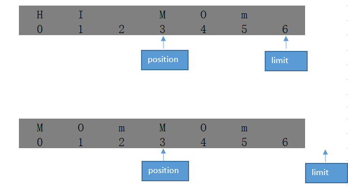

当调用 `compact()`，可 `put()` 的剩余空间变大了，这是一种空间优化手段。

应用场景：例如，有一个发送者不断地向 ByteBuffer 类的对象中填充数据，而另外一个接收者从相同的 ByteBuffer 类的对象中不断地获取数据。发送者可能用数据填充满了 ByteBuffer 类的对象中读写限制范围之内的全部可用空间，而接收者却暂时只读取了 ByteBuffer 类的对象中的一部分数据。接收者在完成读取之后要使用 compact 方法进行压缩操作。压缩操作就是把 ByteBuffer 类的对象中当前读写位置到读写限制范围内的数据复制到内部存储空间中的最前面，然后再把读写位置移动到紧接着复制完成的数据的下一个位置，读写限制也被设置成 ByteBuffer 类的对象的容量。经过压缩之后，发送者的下次写入操作就不会覆盖接收者还没读取的内容，而接收者每次总是可以从 ByteBuffer 类的对象的起始位置进行读取。

```java
public void compact() {
    ByteBuffer buffer = ByteBuffer.allocate(32);
    buffer.put(new byte[16]);
    buffer.flip();
    buffer.getInt();//当前读取位置为4
    buffer.compact();
    int pos = buffer.position();//值为12
}
```

#### Buffer 视图

ByteBuffer 类的另外一个常见的使用方式是在一个已有的 ByteBuffer 类的对象上创建出各种不同的视图。这些视图和它所基于的 ByteBuffer 类的对象共享同样的存储空间，但是提供额外的实用功能。因为视图与原缓冲区共享存储空间的特性，在视图中对数据所做的修改会反映在原始的 ByteBuffer 类的对象中。

- 最常见的 ByteBuffer 类的视图是转换成对基本数据类型进行操作的缓冲区对象。这些缓冲区包括 CharBuffer、ShortBuffer、IntBuffer、LongBuffer、FloatBuffer 和 DoubleBuffer 等 Java 类。ByteBuffer类提供了对应的方法来完成相应的转换，如 `asIntBuffer` 方法在当前ByteBuffer 类的对象的基础上创建一个新的 IntBuffer 类的视图。新创建的视图和原始的 ByteBuffer 类的对象所共享的不一定是全部的空间，而只是从 ByteBuffer 类的对象中的当前读写位置到读写限制之间的可用空间。在这个空间范围内，不论是在 ByteBuffer 类的对象中还是在作为视图的新缓冲区中，对数据所做的修改，对另一个来说都是可见的。除了数据本身之外，两者的读写位置、读写限制和标记位置等都是相互独立的。
- 除了基本类型的缓冲区视图之外，另外一类视图是类型相同的 ByteBuffer 类的对象。通过 `slice` 方法可以创建一个当前 ByteBuffer 类的对象的视图，其行为类似于通过 asIntBuffer 方法创建的视图，只不过得到的是 ByteBuffer 类的对象。
- `duplicate()` 方法则用来完全复制一个 ByteBuffer 类的对象。这个方法与 slice 方法的区别在于，duplicate 方法并不考虑 ByteBuffer 类的对象的当前读写位置和读写限制，只是简单地全部复制。（slice 和 asXXBuffer 方法所创建的视图不是完整的数据空间，而只是从 ByteBuffer 类的对象中的当前读写位置到读写限制之间的可用空间）
- `asReadOnlyBuffer` 的行为类似于 duplicate 方法，只不过得到的 ByteBuffer 类的对象是只读的，不能执行写入操作。

```java
public void viewBuffer(){
    ByteBuffer buffer=ByteBuffer.allocate(32);
    buffer.putInt(1);//读取位置为4
    IntBuffer intBuffer=buffer.asIntBuffer();
    intBuffer.put(2);
    int value = buffer.getInt();//值为2
}
```

注意：`IntBuffer.allocate(32)` 创建的整型缓冲区的容量是 32 个整数，而不是 32 个字节。另外，不能直接创建出除 ByteBuffer 类之外的其他类型的直接缓冲区，只能先创建 ByteBuffer 类型的直接缓冲区，再创建相应的基本类型的视图。

### 3.3 ByteOrder

由于 ByteBuffer 类支持对基本数据类型的处理，因此必须要考虑字节顺序。同样的字节序列按照不同的顺序去解释，所得到的结果是不同的。ByteOrder 用于设置缓冲区的字节顺序，可以设置的字节顺序为：

- ByteOrder.BIT_ENDIAN 大端表示（java 默认）
- ByteOrder.LITTLE_ENDIAN 小端表示

ByteOrder 类中的静态方法 nativeOrder 可以获取到底层操作系统平台采用的字节顺序。

通讯的双方必须采用一直的字节顺序，否则会出现数据错乱问题。

```java
public void byteOrder(){
    ByteBuffer buffer=ByteBuffer.allocate(4);
    buffer.putInt(1);
    buffer.order(ByteOrder.LITTLE_ENDIAN);
    buffer.getInt(0);//值为16777216
}
```

### 3.4 直接与非直接缓冲区

**什么是非直接缓冲区**：非直接缓冲区即缓冲区分配在 JVM 中，IO操作需要经历：`用户地址空间（JVM内存）-> 内核空间地址 -> 物理磁盘`。参考下图：

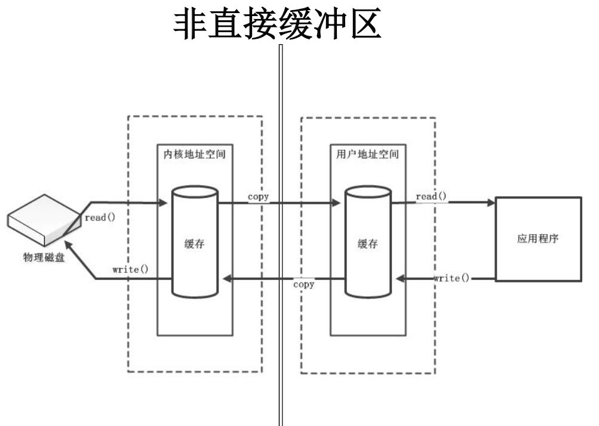

**什么是直接缓冲区**：直接缓冲区是内核地址空间和用户地址空间之间形成了一个物理内存映射文件，可以减少了IO的copy过程。

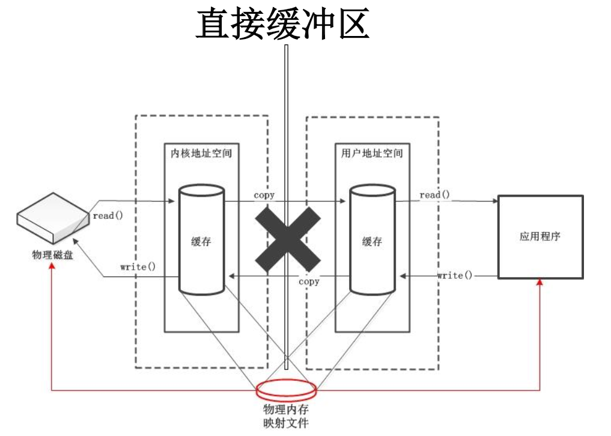

- 字节缓冲区要么是直接的，要么是非直接的。如果为直接字节缓冲区，则Java 虚拟机会尽最大努力直接在此缓冲区上执行本机I/O 操作。也就是说，在每次调用基础操作系统的一个本机I/O 操作之前（或之后），虚拟机都会尽量避免将缓冲区的内容复制到中间缓冲区中（或从中间缓冲区中复制内容）。
- 直接字节缓冲区可以通过调用 `allocateDirect()` 工厂方法来创建。此方法返回的**缓冲区进行分配和取消分配所需成本通常高于非直接缓冲区**。直接缓冲区的内容可以驻留在常规的垃圾回收堆之外，因此，它们对应用程序的内存需求量造成的影响可能并不明显。所以，**建议将直接缓冲区主要分配给那些易受基础系统的本机I/O 操作影响的大型、持久的缓冲区**。一般情况下，最好仅在直接缓冲区能在程序性能方面带来明显好处时分配它们。
- 直接字节缓冲区还可以通过 `FileChannel.map()` 方法将文件区域直接映射到内存中来创建。该方法返回MappedByteBuffer。Java 平台的实现有助于通过JNI 从本机代码创建直接字节缓冲区。如果以上这些缓冲区中的某个缓冲区实例指的是不可访问的内存区域，则试图访问该区域不会更改该缓冲区的内容，并且将会在访问期间或稍后的某个时间导致抛出不确定的异常。
- 字节缓冲区是直接缓冲区还是非直接缓冲区可通过调用其 `isDirect()` 方法来确定。提供此方法是为了能够在性能关键型代码中执行显式缓冲区管理。

---

## 4 通道（Channel）

JDK 中关于 Channel 的描述：

- 通道表示`到实体`，如硬件设备、文件、网络套接字或可以执行一个或多个不同 I/O 操作（如读取或写入）的程序组件的**开放的连接**。
- 通道可处于打开或关闭状态。创建通道时它处于打开状态，一旦将其关闭，则保持关闭状态。一旦关闭了某个通道，试图对其调用 I/O 操作就会导致 ClosedChannelException 被抛出。通过调用通道的 isOpen 方法可测试通道是否处于打开状态。
- 正如扩展和实现此接口的各个接口和类规范中所描述的，**一般情况下通道对于多线程的访问是安全的**。

通道是 Java NIO 对 I/O 操作提供的另外一种新的抽象方式。通道不是从 I/O 操作所处理的数据这个层次上去抽象，而是表示为一个已经建立好的到支持 I/O 操作的实体的连接。这个连接一旦建立，就可以在这个连接上进行各种 I/O 操作。只不过 Channel 本身不能直接访问数据，Channel 只能与 Buffer 进行交互。借助通道，可以用最小的总开销来访问操作系统本身的 I/O 服务。

### 4.1 I/O 调度的衍进

早期 I/O 直接由 CPU 负责调度

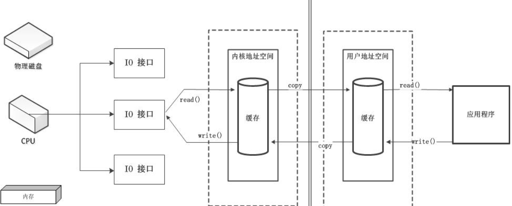

DMA（直接存储器）：内存与 I/O 接口直接交互，这就是传统 I/O 的方式，但是大量 IO操作容易造成 DMA 总线冲突

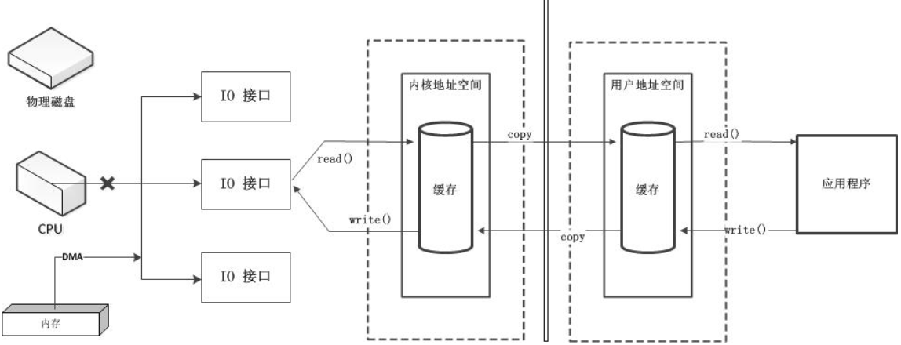

通道：完全独立的处理器，附属于CPU，专门用于IO操作

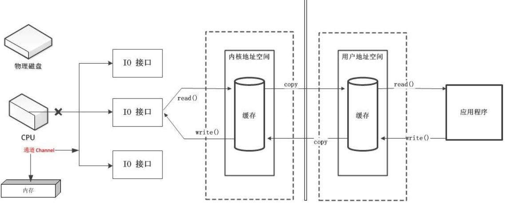

### 4.2  通道（Channel）API

```java
public interface Channel extends Closeable {
    public boolean isOpen();
    public void close() throws IOException;
}
```

从接口看来，所有的通道都有这两种操作：检查通道的开启状态和关闭通道。Java 为 Channel 接口提供的最主要的接口和类如下：

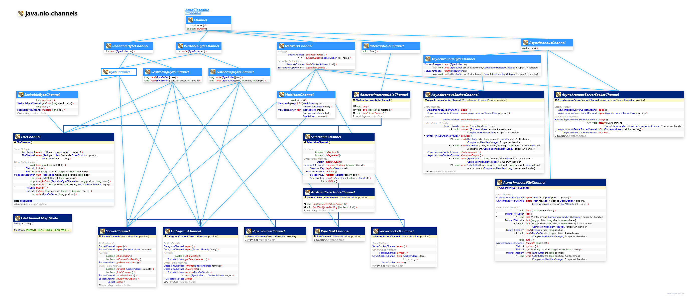

>图片来自：<http://www.falkhausen.de/Java-8/java.nio/channels/Channel-Hierarchy-Expanded.html>

Channel 简要说明：

- **ReadableByteChannel**：可读取字节的通道。
- **WritableByteChannel**：可写入字节的通道。
- **ByteChannel**：可读取和写入字节的信道。此接口只是统一了 ReadableByteChannel 和 WritableByteChannel，它没有指定任何新操作。
- **InterruptibleChannel**：表示可被异步关闭和中断的通道。
- **SelectableChannel**：该通道可通过 Selector 实现多路复用的通道。
- **FileChannel**：用于读取、写入、映射和操作文件的通道。
- **DatagramChannel**：针对面向数据报套接字的可选择通道（UDP）。
- **SocketChannel**：针对面向流的连接套接字的可选择通道(TCP 客户端)。
- **ServerSocketChannel**：针对面向流的连接套接字的可选择通道(TCP 服务端)。
- **Pipe.SourceChannel 和 Pipe.SinkChannel**：用于实现管道通道。

上面类图中，一部分于 Java7 中被引入，参考[NIO.2](04-NIO2.md)。

- **SeekableByteChannel**：一个通道接口，表示除了支持读写操作之外，还支持移动读写操作的位置。该接口中的 position 方法用来获取和设置当前的读写位置，而 truncate 方法则将通道对应的实体截断。如果调用 truncate 方法时指定的新的长度值小于实体的当前长度，那么实体被截断成指定的新长度。另外的一个方法 size 可以获取实体的当前长度。
- **AsynchronousChannel**：用于支持异步 IO。
- **NetworkChannel**：通于统一网络套接字通道。

获取通道的一种方式是对支持通道的对象调用 `getChannel()` 方法。支持通道的类如下：

- FileInputStream
- FileOutputStream
- RandomAccessFile
- DatagramSocket
- Socket
- ServerSocket

获取通道的其他方式是使用 Files 类的静态方法 `newByteChannel()` 获取字节通道。或者通过通道实现类的静态方法 `open()` 打开并返回指定通道。广义上来说通道可以被分为两类：`File I/O` 和 `Stream I/O`。

**通道的双向数据传输**：

- 通道既可以是单向的也可以是双向的：只实现 ReadableByteChannel 接口中的 `read()` 方法或者只实现 WriteableByteChannel 接口中的 `write()` 方法的通道皆为单向通道，同时实现 ReadableByteChannel 和 WriteableByteChannel 为双向通道
- 双向传输体现在将 Buffer 中数据写入 Channel 以及从 Channel 读取数据到 Buffer。

### 4.3 Channels 工具类

Channels 定义了几种静态工厂方法以便更容易的和流打交道：

方法 | 描述
---|---
`ReadableByteChannel newChannel(InputStream in)` | 返回一个将从给定的输入流读取数据的通道。
`WritableByteChannel newChannel(OutputStream out)` | 返回一个将向给定的输出流写入数据的通道。
`InputStream newInputStream(ReadableByteChannel ch)` | 返回一个将从给定的通道读取字节的流。
`OutputStream newOutputStream(WritableByteChannel ch)` | 返回一个将向给定的通道写入字节的流。
`Reader newReader(ReadableByteChannel ch, CharsetDecoder dec, int minBufferCap)` | 返回一个reader，它将从给定的通道读取字节并依据提供的字符集名称对读取到的字节进行解码。
`Reader newReader(ReadableByteChannel ch, String csName)` | 返回一个reader，它将从给定的通道读取字节并依据提供的字符集名称将读取到的字节解码成字符。
`Writer newWriter(WritableByteChannel ch, CharsetEncoder dec, int minBufferCap)` | 返回一个writer，它将使用提供的字符集名称对字符编码并写到给定的通道中。
`Writer newWriter(WritableByteChannel ch, String csName)` | 返回一个writer，它将依据提供的字符集名称对字符编码并写到给定的通道中。

### 4.4 通道的分散（Scatter）和聚集（Gather）操作

分散和聚集对应的接口为：ScatteringByteChannel 和 GatheringByteChannel。

**分散读取**（Scattering Reads）是指从 Channel 中读取的数据“分散”到多个Buffer 中。按照缓冲区的顺序，从 Channel 中读取的数据依次将Buffer 填满。

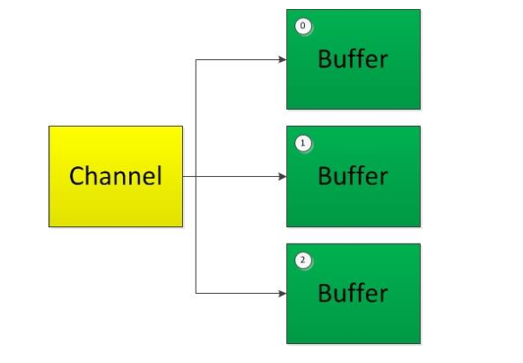

**聚集写入**（Gathering Writes）是指将多 个Buffer 中的数据“聚集”到Channel。按照缓冲区的顺序，写入 position 和 limit 之间的数据到Channel。

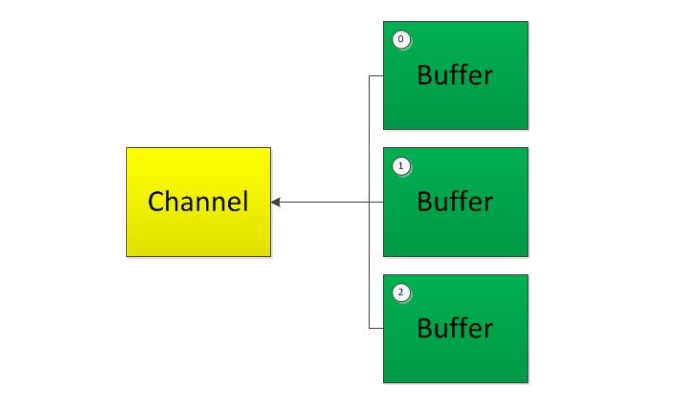

如果我们需要在 channel 读取的过程中，将不同片段写入到相应的 Buffer 里面（类似二进制消息分拆成消息头、消息体等），可以采用 NIO 分散-scatter 机制来写入不同 buffer。

```java
public void testScatter() throws IOException {
    RandomAccessFile randomAccessFile = new RandomAccessFile("file/text.txt", "rw");

    //1. 获取通道
    FileChannel channel1 = randomAccessFile.getChannel();

    //2. 分配指定大小的缓冲区
    ByteBuffer buf1 = ByteBuffer.allocate(200);
    ByteBuffer buf2 = ByteBuffer.allocate(10 * 1024);

    //3. 分散读取
    ByteBuffer[] bufs = {buf1, buf2};
    channel1.read(bufs);

    for (ByteBuffer byteBuffer : bufs) {
        byteBuffer.flip();//切换到读模式
    }

    System.out.println(new String(bufs[0].array(), 0, bufs[0].limit()));
    System.out.println("-----------------");
    System.out.println(new String(bufs[1].array(), 0, bufs[1].limit()));

    //4. 聚集写入
    RandomAccessFile raf2 = new RandomAccessFile("file/text_copy.txt", "rw");
    FileChannel channel2 = raf2.getChannel();
    channel2.write(bufs);
}
```

---

## 5 文件通道

FileChannel 类的对象既可以通过直接打开文件的方式来创建，也可以从已有的流中得到。通过直接打开文件来创建文件通道的方式是 Java7 中新增的。

FileChannel 的常用方法：

方法 | 描述
---|---
`int read(ByteBuffer dst)` | 从 Channel 中读取数据到 ByteBuffer
`long read(ByteBuffer[] dsts)` | 将Channel 中的数据“分散”到 ByteBuffer[]
`int write(ByteBuffer src)` | 将 ByteBuffer 中的数据写入到 Channel
`long write(ByteBuffer[] srcs)` | 将 ByteBuffer[] 中的数据“聚集”到 Channel
`long position()` | 返回此通道的文件位置
`FileChannel position(long p)` | 设置此通道的文件位置
`long size()` | 返回此通道的文件的当前大小
`FileChannel truncate(long s)` | 将此通道的文件截取为给定大小
`void force(boolean metaData)` | 强制将所有对此通道的文件更新写入到存储设备中

### 5.1 基本用法

基于文件创建 FileChannel：

```java
public void openAndWrite() throws IOException{
  File Channel channel=File Channel.open(Paths.get("my.txt")，StandardOpenOption.CREATE, StandardOpenOption.WRITE)；
  ByteBuffer buffer=ByteBuffer.allocate(64)；
  buffer.putChar('A').flip()；
  channel.write(buffer)；
}
```

在打开文件通道时可以选择的选项有很多，其中最常见的是读取和写入模式的选择，这些选项定义在 StandardOpenOption 中：

- `CREATE` 表示当目标文件不存在时，需要创建一个新文件；
- `CREATE_NEW` 同样会创建新文件，区别在于如果文件已经存在，则会产生错误；
- `APPEND` 表示对文件的写入操作总是发生在文件的末尾处，即在文件的末尾添加新内容；
- `TRUNCATE_EXISTING` 表示如果文件已经存在，那么它的内容将被清空；
- `DELETE_ON_CLOSE` 用在需要创建临时文件的时候。声明了这个选项之后，当文件通道关闭时，Java 虚拟机会尽力尝试去删除这个文件。

另外一种创建文件通道的方式是从已有的 FileInputStream 类、FileOutputStream 类和 RandomAccessFile 类的对象中得到。这 3 个类都有一个getChannel 方法来获取对应的 FileChannel 类的对象，所得到的 FileChannel 类的对象的能力取决于其来源流的特征。对 InputStream 类的对象来说，它所得到的 FileChannel 类的对象是只读的，而 FileOutputStream 类的对象所得到的通道是可写的，RandomAccessFile 类的对象所得到的通道的能力则取决于文件打开时的选项。

### 5.2 在任意绝对位置进行 File 读写操作

JDK7 NIO.2 中引入了 SeekableByteChannel 接口，表示除了支持读写操作之外，还支持移动读写操作的位置，而 FileChannel 实现了 SeekableByteChannel，这表示我们可以在任意绝对位置进行文件读写操作，只需额外传入一个参数来指定读写的位置即可，对于一个新创建的文件，同样可以指定任意的写入位置，文件的大小会根据写入的位置自动变化。

```java
public void readWriteAbsolute() throws IOException{
    FileChannel channel=FileChannel.open(Paths.get("absolute.txt")，StandardOpenOption.READ, StandardOpenOption.CREATE, StandardOpenOption.WRITE);
    ByteBuffer writeBuffer=ByteBuffer.allocate(4).putChar('A').putChar('B');
    writeBuffer.flip();
    channel.write(writeBuffer，1024);
    ByteBuffer readBuffer=ByteBuffer.allocate(2);
    channel.read(readBuffer，1026);
    readBuffer.flip();
    char result=readBuffer.getChar();//值为'B'
}
```

### 5.3 复制文件：`transferFrom, transferTo`

使用 `transferFrom()` 与 `transferTo()` 可以将数据从源通道传输到其他 Channel 中，使用它们传输数据非常方便，采用的也是直接缓冲区的方式，所以性能也更好。

我们可以使用 ByteBuffer 作为缓冲区，配合 FileChannel 复制文件：

```java
public void copyUseByteBuffer() throws IOException {
    ByteBuffer buffer = ByteBuffer.allocateDirect(32 * 1024);

    try (FileChannel src = FileChannel.open(Paths.get(SOURCE), StandardOpenOption.READ);
            FileChannel dest = FileChannel.open(Paths.get(TARGET), StandardOpenOption.WRITE, StandardOpenOption.CREATE)) {

        //使用ByteBuffer类的时候并不需要记录每次实际读取的字节数，但是要注意flip和compact方法的使用。
        while (src.read(buffer) > 0 || buffer.position() != 0) {
            buffer.flip();
            dest.write(buffer);
            buffer.compact();
        }

    }
}
```

而使用 transferFrom 或 transferTo 更简单也更高效：

```java
//使用 transferFrom 复制文件
public void testFileTransfer() throws IOException {
    long start = System.currentTimeMillis();

    FileChannel inChannel = FileChannel.open(Paths.get(SOURCE), StandardOpenOption.READ);
    FileChannel outChannel = FileChannel.open(Paths.get(TARGET), StandardOpenOption.WRITE, StandardOpenOption.READ, StandardOpenOption.CREATE);
    //inChannel.transferTo(0, inChannel.size(), outChannel);
    outChannel.transferFrom(inChannel, 0, inChannel.size());
    inChannel.close();
    outChannel.close();

    System.out.println("耗费时间为：" + (System.currentTimeMillis() - start));
}

//使用通道保存网络数据
public void loadWebPage(String url)throws IOException{

    try(FileChannel destChannel=FileChannel.open(Paths.get("content.txt")，
        StandardOpenOption.WRITE, StandardOpenOptionCREATE)){

            InputStream input=new URL(url).openStream();
            ReadableByteChannel srcChannel=Channels.newChannel(input);
            destChannel.transferFrom(srcChannel，0，Integer.MAX_VALUE);
        }

}
```

### 5.4 内存映射文件

在对大文件进行操作时，性能问题一直比较难处理。通过操作系统的内存映射文件支持，可以比较快速地对大文件进行操作。内存映射文件的原理在于把系统的内存地址映射到要操作的文件上。读取这些内存地址就相当于读取文件的内容，而改变这些内存地址的值就相当于修改文件中的内容。被映射到内存地址上的文件在使用上类似于操作系统中使用的虚拟内存文件。通过内存映射的方式对文件进行操作时，不再需要通过I/O操作来完成，而是直接通过内存地址访问操作来完成，这就大大提高了操作文件的性能，因为I/O操作比访问内存地址要慢得多。

FileChannel 类的 map 方法可以把一个文件的全部或部分内容映射到内存中，所得到的是一个 ByteBuffer 类的子类 MappedByteBuffer 的对象，程序只需要对这个 MappedByteBuffer 类的对象进行操作即可。对这个 MappedByteBuffer 类的对象所做的修改会自动同步到文件内容中。

在进行内存映射时需要指定映射的模式，一共有3种可用的模式，由 FileChannel.MapMode 枚举类型来表示：

- READ_ONLY 表示只能对映射之后的 MappedByteBuffer 类的对象进行读取操作；
- READ_WRITE 表示是可读可写的；
- PRIVATE 的含义是通过 MappedByteBuffer 类的对象所做的修改不会被同步到文件中，而是被同步到一个私有的复本中。这些修改对其他同样映射了该文件的程序是不可见的。

如果希望对 MappedByteBuffer 类的对象所做的修改被立即同步到文件中，可以使用 force 方法。

```java
public void mapFile() throws IOException {
    try (FileChannel channel = FileChannel.open(Paths.get("src.data"), StandardOpenOption.READ, StandardOpenOption.WRITE)) {
        MappedByteBuffer buffer = channel.map(FileChannel.MapMode.READ_WRITE, 0, channel.size());
        byte b = buffer.get(1024 * 1024);
        buffer.put(5 * 1024 * 1024, b);
        buffer.force();
    }

}
```

**把文件的内容加载到物理内存**：如果希望更加高效地处理映射到内存中的文件，把文件的内容加载到物理内存中是一个好办法。通过MappedByteBuffer类的load方法可以把该缓冲区所对应的文件内容加载到物理内存中，以提高文件操作时的性能。由于物理内存的容量受限，不太可能直接把一个大文件的全部内容一次性地加载到物理内存中。可以每次只映射文件的部分内容，把这部分内容完全加载到物理内存中进行处理。完成处理之后，再映射其他部分的内容。

**使用 force 方法保证数据不会丢失**：由于I/O操作一般比较耗时，出于性能考虑，很多操作在操作系统内部都是使用缓存的。在程序中通过文件通道API所做的修改不一定会立即同步到文件系统中。如果在没有同步之前发生了程序错误，可能导致所做的修改丢失。因此，在执行完某些重要文件内容的更新操作之后，应该调用FileChannel类的force方法来强制要求把这些更新同步到底层文件中。可以强制同步的更新有两类，一类是文件的数据本身的更新，另一类是文件的元数据的更新。在使用force方法时，可以通过参数来声明是否在同步数据的更新时也同步元数据的更新。

#### 5.5 对文件进行加锁

文件可用于多个进程间的通信，只要两个进程约定好相关的数据格式即可，但是这种方式会遇到并发安全问题，而对于进程来说，没有比较好多方式来保证同步操作，最好的办法是对文件进行加锁。在一个程序完成操作之前，阻止另外一个程序对该文件的访问。通过 FileChannel 类的 lock 和 tryLock 方法可以对当前文件通道所对应的文件进行加锁。加锁时既可以选择锁定文件的全部内容，也可以锁定指定的范围区间中的部分内容。

- 当成功加锁之后，会得到一个 FileLock 类对象。在完成对锁定文件的操作之后，通过 FileLock 类的 release 方法可以解除锁定状态，允许其他程序来访问。
- FileLock类表示的锁分共享锁和排它锁两类。
  - 共享锁不允许其他程序获取到与当前锁定范围相重叠的排它锁，而获取共享锁是允许的；
  - 排它锁不允许其他程序获取到与锁定范围相重叠的共享锁和排它锁。
  - FileLock 的 isShared 方法用于判断其是否为共享锁。
- 对 FileLock 类表示的共享锁和排它锁的限制只发生在待锁定的文件范围与当前已有锁的范围发生重叠的时候。不同程序可以同时在一个文件上加上自己的排它锁，只要这些锁的锁定范围不互相重叠即可。
- 对文件进行加锁操作的主体是当前的Java虚拟机，即这个加锁的功能用来协同当前 Java 虚拟机上运行的 Java 程序和操作系统上运行的其他程序。对于Java虚拟机上运行的多线程程序，不能用这种机制来协同不同线程对文件的访问。

---

## 6 NIO 的非阻塞模式与网络套接字通道

### 6.1 阻塞与非阻塞

- 传统的IO 流都是阻塞式的。也就是说，当一个线程调用 `read()` 或 `write()` 时，该线程被阻塞，直到有一些数据被读取或写入，该线程在此期间不能执行其他任务。因此，在完成网络通信进行IO 操作时，由于线程会阻塞，所以服务器端必须为每个客户端都提供一个独立的线程进行处理，当服务器端需要处理大量客户端时，性能急剧下降。
- Java NIO 支持非阻塞模式 IO 操作。当线程从某通道进行读写数据时，若没有数据可用时，该线程可以进行其他任务。线程通常将非阻塞 IO 的空闲时间用于在其他通道上执行IO 操作，所以单独的线程可以管理多个输入和输出通道。因此，NIO 可以让服务器端使用一个或有限几个线程来同时处理连接到服务器端的所有客户端。

关于阻塞与非阻塞、同步与异步IO可以参考

- [IO - 同步，异步，阻塞，非阻塞](https://blog.csdn.net/historyasamirror/article/details/5778378)。
- [怎样理解阻塞非阻塞与同步异步的区别？](https://www.zhihu.com/question/19732473)

### 6.2 通道的阻塞与非阻塞工作模式

通道支持阻塞式或非阻塞式的工作模式：

- 在阻塞模式下，以传统 I/O 一致，若数据还没有准备好，调用的线程会挂起。
- 在非阻塞模式下，调用的线程不会挂起，操作的操作会立刻返回，除 FileChannel 不能运行在非阻塞模式下，其余的通道都可阻塞运行也可以以非阻塞的方式运行（主要在于该通道是否实现了 SelectableChannel 接口）。

非阻塞模式：只有实现了 SelectableChannel 的 Channel 才支持非阻塞操作。SelectableChannel 要么处于阻塞模式，要么处于非阻塞模式。

- 在阻塞模式中，每一个 I/O 操作完成之前都会阻塞在其通道上调用的其他 I/O 操作。
- 在非阻塞模式中，永远不会阻塞 I/O 操作，并且传输的字节可能少于请求的数量，或者可能根本不传输字节。可通过调用可选择通道的 isBlocking 方法来确定其阻塞模式。
- 新创建的可选择通道总是处于阻塞模式。在结合使用基于选择器的多路复用时，非阻塞模式是最有用的。向选择器注册某个通道前，必须将该通道置于非阻塞模式，并且在注销之前可能无法返回到阻塞模式。

实现非阻塞网络 IO 的三要素

1. 通道
2. 缓冲区
3. Selector + SelectableChannel 的多路复用器

### 6.3 SelectableChannel

SelectableChannel 是一个抽象类，表示可通过注册到一个 Selector 以实现多路复用的通道。其定义了用于配合 Selector 一起使用以实现非阻塞 I/O 的相关方法。

**SelectableChannel 方法详解**：

方法 | 描述
---|---
`Object blockingLock()` | 获取其 configureBlocking 和 register 方法实现同步的对象。
`SelectableChannel configureBlocking(boolean block)` | 调整此通道的阻塞模式。
`boolean isBlocking()` | 判断此通道上的每个 I/O 操作在完成前是否被阻塞。
`boolean isRegistered()` | 判断此通道当前是否已向任何选择器注册。
`SelectorProvider keyFor(Selector sel)` | 获取表示通道向给定选择器注册的键。
`SelectorProvider provider()` | 返回创建此通道的提供者
`SelectionKey register(Selector sel, int ops)` | 向给定的选择器注册此通道，返回一个选择键。
`SelectionKey register(Selector sel, int ops,  Object att)` | 向给定的选择器注册此通道，返回一个选择键。
`int validOps()` | 返回一个操作集，标识此通道所支持的操作。此整数值中设置的各位正好表示对此通道有效的操作。对于给定的具体通道类，此方法始终返回相同的值。

**`register(Selector sel, int ops,  Object att)` 详解**：

参数：

- sel 要向其注册此通道的选择器
- ops 所得键的可用操作集
- att 所得键的附件，可能为 null，这个附件将可以从返回的 SelectionKey 中获取

注意事项：

- 如果尚未向给定的选择器注册此通道，则注册该通道并返回得到的新键。该键的初始可用操作集是 ops，并且其附件是 att。
- 如果当前已向给定的选择器注册了此通道，则返回表示该注册的选择键。该键的相关操作集将更改为 ops，就像调用 `SelectionKey.interestOps(int)` 方法一样。如果 att 参数不为 null，则将该键的附件设置为该值。如果此通道当前已向给定的选择器注册，但是相应的键已经被取消（调用了返回的   SelectionKey 的`cancel()` 方法），则抛出 CancelledKeyException。
- 可在任意时间调用此方法。如果调用此方法的同时正在进行另一个此方法或 configureBlocking 方法的调用，则在另一个操作完成前将首先阻塞该调用。然后此方法将在选择器的键集上实现同步，因此如果调用此方法时并发地调用了涉及同一选择器的另一个注册或选择操作，则可能阻塞此方法的调用。
- 如果正在进行此操作时关闭了此通道，则此方法返回的键是已取消的，因此返回键无效。
- 注意一个通道至多只能在任意特定选择器上注册一次（可以多次调用 register 方法，当调用 register 方法返回的 SelectorKey 的 cancel 方法后，就不允许再次 register 到同一个 Selector）。

### 6.4 选择器（Selector）

选择器（Selector）是 SelectableChannle 对象的多路复用器，Selector 可以同时监控多个 SelectableChannel 的 I/O 状况，也就是说，利用 Selector 可使一个单独的线程管理多个 Channel。从而大量的减少线程之间上下文切换的开销，**Selector 是非阻塞 I/O 的核心**。从 SelectableChannel 扩展出的类可以和 Selector 结合使用，进而充分利用多路复用的 I/O（multiplexed I/O）来提高性能。

需要注意的是 Channel 不能被重复使用，一个打开的 Channle 代表着与一个特定 I/O 服务进行连接并封装了该连接的状态，通道一旦关闭，该连接便会断开。通道的 `close()` 比较特殊，无论在通道时在阻塞模式下还是非阻塞模式下，由于 `close()` 方法的调用而导致底层 I/O 的关闭都可能会造成线程的**暂时阻塞**。

SelectableChannle 的继承结构如下：

```java
    SelectableChannel
        |——AbstractSelectableChannel
            |——SocketChannel(TCP Client)
            |——ServerSocketChannel(TCP Server)
            |——DatagramChannel(UDP)
            |——SinkChannel(管道)
            |——SourceChannel(管道)
```

Selector 会监听注册到它上面的 Channel 的状态，当客户端数据完全准备就绪后，Selector 才会把任务交给服务端的一个或多个线程上，Selector 的 `select()` 方法会阻塞等待，直到有一个或更多的  Channel 数量。 准备好了 IO 操作或者超时，select 方法返回的是可进行 I/O 操作的 Channel 数量。

Selector 非阻塞 I/O 编程步骤：

1. 创建 Selector ：通过调用 `Selector.open()` 方法创建一个Selector。
2. 向选择器注册通道：`SelectableChannel.register(Selector sel, int ops)`
3. 当调用 `register(Selector sel, int ops)` 将通道注册选择器时，选择器对通道的监听事件，需要通过第二个参数 ops 指定。 SelectionKey的四个常量表示可以监听的事件类型，若注册时不止监听一个事件，则可以使用“位或”操作符连接
   1. 读: SelectionKey.OP_READ
   2. 写: SelectionKey.OP_WRITE
   3. 连接: SelectionKey.OP_CONNECT
   4. 接收: SelectionKey.OP_ACCEPT
4. 循环调用 Selector 的 select() 方法获取准备就绪的 Channel，Channel封装在 SelectionKey 中
5. 一个 SelectionKey 被处理完后，需要进行 remove，否则其仍然保留在集合中，从而造成下一次迭代时有无用的操作来调用它

#### SelectionKey

SelectionKey 表示 SelectableChannel 和 Selector 之间的注册关系。每次向选择器注册通道时就会选择一个事件(选择键)。通过调用某个键的 cancel 方法、关闭其通道，或者通过关闭其选择器来取消该键之前，它一直保持有效。取消某个键不会立即从其选择器中移除它；相反，会将该键添加到选择器的已取消键集，以便在下一次进行选择操作时移除它。可通过调用某个键的 isValid 方法来测试其有效性。

**操作集**：SelectionKey 包含两个表示为整数值的操作集。操作集的每一位都表示该键的通道所支持的一类可选择操作：

- interest 集合 确定了下一次调用某个选择器的选择方法时，将测试哪类操作的准备就绪信息。创建该键时使用给定的值初始化 interest 集合；之后可通过 `interestOps(int)` 方法对其进行更改。
- ready 集合 标识了这样一类操作，即某个键的选择器检测到该键的通道已为此类操作准备就绪。创建该键时 ready 集合被初始化为零；可以在之后的选择操作中通过选择器对其进行更新，但不能直接更新它。

线程安全：

- 多个并发线程可安全地使用选择键。一般情况下，读取和写入 interest 集合的操作将与选择器的某些操作保持同步。

方法 | 描述
---|---
`int interestOps()` |  获取此键的 interest 集合。
`SelectionKey interestOps(int ops)` | 将此键的 interest 集合设置为给定值。
`int readyOps()` |  获取通道已经准备就绪的操作的集合，可保证返回的集合仅包含对于此键的通道而言有效的操作位。
`SelectableChannel channel()` |  返回为之创建此键的通道。
`Selector selector()` |  返回为此选择器创建的键。
`boolean isReadable()` | 检测Channal 中读事件是否就绪
`boolean isWritable()` | 检测Channal 中写事件是否就绪
`boolean isConnectable()` | 检测 Channel 中连接是否就绪
`boolean isAcceptable()` | 检测 Channel 中接收是否就绪
`boolean isValid()` | 判断此键是否有效。
`void cancel()` | 请求取消此键的通道到其选择器的注册。一旦返回，该键就是无效的，并且将被添加到其选择器的已取消键集中。在进行下一次选择操作时，将从所有选择器的键集中移除该键。

#### Channel 附件

在调用重载的 `SelectionKey register(Selector sel, int ops, Object att)` 方法时，第三个参数用于设置一个与 SelectionKey 关联的附件，然后在之后的操作中，通过 SelectionKey 的 `attachment()` 方法获取该附件。另外使用 SelectionKey 的 `attach(Object obj)`也可以设置一个与之关联的附件，Channel 附件可以让每个 Channel 维护自身独立的状态。

#### Selector 的常用方法

方法 | 描述
---|---
`Selector open()` | 打开一个选择器。通过调用系统级默认 SelectorProvider 对象的 openSelector 方法来创建新的选择器。
`Set<SelectionKey> keys()` | 所有的 SelectionKey 集合。代表注册在该 Selector 上的
`Channel selectedKeys()` | 被选择的 SelectionKey 集合。返回此 Selector 上已经就绪的通道。
`int select()` | 监控所有注册的 Channel，当它们中间有需要处理的IO 操作时，该方法返回，并将对应得的SelectionKey 加入被选择的 SelectionKey 集合中，该方法返回这些 Channel 的数量。
`int select(long timeout)` | 可以设置超时时长的 `select()` 操作
`int selectNow()` | 执行一个立即返回的 `select()` 操作，该方法不会阻塞线程
`Selector wakeup()` | 唤醒一个处理 select 状态的选择器。如果另一个线程目前正阻塞在 `select()` 或 `select(long)` 方法的调用中，则该调用将立即返回。如果当前未进行选择操作，那么在没有同时调用 `selectNow()` 方法的情况下，对上述方法的下一次调用将立即返回。在任一情况下，该调用返回的值可能是非零的。如果未同时再次调用此方法，则照常阻塞 `select()` 或 `select(long)` 方法的后续调用。
`void close()` | 关闭该选择器

Selector 注意事项：

- 注册到选择器的通道必须为非阻塞状态。
- FileChannel 不能用于 Selector，因为 FileChannel 不同切换非阻塞模式，套接字通道才可以。

### 6.5 套接字通道（`SocketChannel, ServerSocketChannel`）

- Java NIO中的 SocketChannel 是一个连接到 TCP 网络套接字的通道。
- Java NIO中的 ServerSocketChannel 是一个可以监听新进来的 TCP 连接的通道，就像标准 IO 中的 ServerSocket 一样。

ServerSocketChannel 是一个可以监听新进来的 TCP 连接的通道, 类似 ServerSocket 一样。要注意的是和 DatagramChannel 和 SocketChannel不同，ServerSocketChannel 本身不具备传输数据的能力，而只是负责监听传入的连接和创建新的 SocketChannel。

- 在 JDK 1.7 之前，ServerSocketChannel没有 `bind()` 方法，因此需要通过它关联的的socket对象的 `socket()` 来绑定。从 JDK 1.7 及以后，可以直接通过 ServerSocketChannel 的 `socket()` 方法来绑定端口号。
- 通过 `ServerSocketChannel.accept()` 方法监听新进来的连接。在阻塞模式下当 `accept()` 方法返回的时候,它返回一个包含新进来的连接的 SocketChannel，否则 `accept()` 方法会一直阻塞到有新连接到达。在非阻塞模式下，在没有新连接的情况下，`accept()` 会立即返回 null，该模式下通常不会仅仅只监听一个连接,因此需在 while 循环中调用 `accept()`方法.

SocketChannel 是一个连接到TCP网络套接字的通道，它是 Socket 类的对等类，通常 SocketChannel 用在客户端以向服务器发起连接请求。每个 SocketChannel 对象创建时都关联一个对等的 Socket 对象。同样 SocketChannel 可以运行在非阻塞模式下。SocketChannel 对象会在下面两种情况下被创建：

- 调用 `SocketChannel.open()` 方法并连接到互联网上的某台服务器。
- 一个新连接到达 ServerSocketChannel 时，会创建一个 SocketChannel。

关于 SocketChannel 需要注意：

- 通过 SocketChannel 的静态方法 `open()`创建 SocketChannel 对象.此时通道虽打开，但并未连接，此时如果进行 I/O 操作会抛出NotYetConnectedException异常。
- 通过 SocketChannel 对象的 `connect()`连接指定地址。该通道一旦连接它将保持连接状态直到被关闭。可通过 `isConnected()`来确定某个 SocketChannel 当前是否已连接。
- 如果 SocketChannel 在非阻塞模式下，调用 `connect()` 方法可能在连接建立之前就会返回了。为了确定连接是否建立，可以通过 `while(! socketChannel.finishConnect() )`的方式。
- 非阻塞模式下，`write()` 方法在尚未写出任何内容时可能就返回了。因为`write()`只会写出其能够发送的的数据，而不阻塞会等待所有数据发送完， 对于这种情况不应该在循环中调用 `write()`，而是通过 Buffer 的 `boolean hasRemaining()` 方法判断是否写完了，如果没有写完，则可以继续向 Selector 注册 `OP_WRITE` 事件
- 非阻塞模式下，`read()` 方法在尚未读取到任何数据时可能就返回了。所以需要判断它的返回值。读取的字节数，可能为零，如果该通道已到达流的末尾，则返回 `-1`。

如果程序对网络操作的并发性和吞吐量的要求比较高，那么阻塞式的套接字通道就不能比较简单地满足程序的需求。这时比较好的办法是通过非阻塞式的套接字通道实现多路复用或者使用 NIO2 中的异步套接字通道，关于异步 I/O，将会在 [NIO.2](04-NIO2.md) 中介绍。

#### 阻塞 `SocketChannel, ServerSocketChannel` 示例

```java
public class BlockingNIOSample2 {

    //客户端
    @Test
    public void client() throws IOException {

        SocketChannel sChannel = SocketChannel.open(new InetSocketAddress("127.0.0.1", 9898));
        FileChannel inChannel = FileChannel.open(Paths.get("file/text.txt"), StandardOpenOption.READ);
        ByteBuffer buf = ByteBuffer.allocate(1024);

        while (inChannel.read(buf) != -1) {
            buf.flip();
            sChannel.write(buf);
            buf.clear();
        }

        sChannel.shutdownOutput();//关闭输出，Server的read就会认为Client没有更多数据了，Server的read将返回 -1

        //接收服务端的反馈
        int len;
        while ((len = sChannel.read(buf)) != -1) {
            buf.flip();
            System.out.println(new String(buf.array(), 0, len));
            buf.clear();
        }

        inChannel.close();
        sChannel.close();
    }

    //服务端
    @Test
    public void server() throws IOException {

        ServerSocketChannel ssChannel = ServerSocketChannel.open();
        FileChannel outChannel = FileChannel.open(Paths.get("file/text_copy.txt"), StandardOpenOption.WRITE, StandardOpenOption.CREATE);
        ssChannel.bind(new InetSocketAddress(9898));
        SocketChannel sChannel = ssChannel.accept();
        ByteBuffer buf = ByteBuffer.allocate(1024);

        while (sChannel.read(buf) != -1) {
            buf.flip();
            outChannel.write(buf);
            buf.clear();
        }

        //发送反馈给客户端
        buf.put("服务端接收数据成功".getBytes());
        buf.flip();
        sChannel.write(buf);

        sChannel.close();
        outChannel.close();
        ssChannel.close();
    }

}
```

#### 非阻塞 `SocketChannel, ServerSocketChannel` 示例

```java
public class LoadWebPageUseSelector {

    public void load(Set<URL> urls) throws IOException {

        Map<SocketAddress, String> mapping = urlToSocketAddress(urls);
        Selector selector = Selector.open();

        for (SocketAddress address : mapping.keySet()) {
            register(selector, address);
        }

        int finished = 0, total = mapping.size();
        ByteBuffer buffer = ByteBuffer.allocate(32 * 1024);

        int len = -1;

        while (finished < total) {

            selector.select();
            Iterator<SelectionKey> iterator = selector.selectedKeys().iterator();

            while (iterator.hasNext()) {

                SelectionKey key = iterator.next();
                iterator.remove();

                if (key.isValid() && key.isReadable()) {

                    SocketChannel channel = (SocketChannel) key.channel();
                    InetSocketAddress address = (InetSocketAddress) channel.getRemoteAddress();
                    String filename = address.getHostName() + ".txt";
                    FileChannel destChannel = FileChannel.open(Paths.get(filename), StandardOpenOption.APPEND, StandardOpenOption.CREATE);
                    buffer.clear();

                    while ((len = channel.read(buffer)) > 0 || buffer.position() != 0) {
                        buffer.flip();
                        destChannel.write(buffer);
                        buffer.compact();
                    }

                    if (len == -1) {
                        finished++;
                        key.cancel();
                    }

                } else if (key.isValid() && key.isConnectable()) {
                    //以连接完成的事件来说，这次连接可能成功也可能失败。
                    // 通过SocketChannel类的对象的finishConnect方法可以完成连接，
                    // 同时判断连接是否成功建立。如果连接建立失败，
                    // 那么通过SelectionKey类的对象的cancel方法可以取消选择器对此通道的管理；
                    // 如果连接建立成功，那么应该向通道中写入HTTP的请求头信息，相当于向HTTP服务器发送HTTP请求。
                    SocketChannel channel = (SocketChannel) key.channel();
                    boolean success = channel.finishConnect();
                    if (!success) {
                        finished++;
                        key.cancel();
                    } else {
                        InetSocketAddress address = (InetSocketAddress) channel.getRemoteAddress();
                        String path = mapping.get(address);
                        String request = "GET" + path + "HTTP/1.0\r\n\r\nHost:" + address.getHostString() + "\r\n\r\n";
                        ByteBuffer header = ByteBuffer.wrap(request.getBytes(StandardCharsets.UTF_8));
                        channel.write(header);
                    }
                }
            }
        }
    }

    private void register(Selector selector, SocketAddress address) throws IOException {
        SocketChannel channel = SocketChannel.open();
        channel.configureBlocking(false);
        channel.connect(address);
        channel.register(selector, SelectionKey.OP_CONNECT | SelectionKey.OP_READ);
    }

    private Map<SocketAddress, String> urlToSocketAddress(Set<URL> urls) {
        Map<SocketAddress, String> mapping = new HashMap<>();
        for (URL url : urls) {
            int port = url.getPort() != -1 ? url.getPort() : url.getDefaultPort();
            SocketAddress address = new InetSocketAddress(url.getHost(), port);
            String path = url.getPath();
            if (url.getQuery() != null) {
                path = path + "?" + url.getQuery();
            }
            mapping.put(address, path);
        }
        return mapping;
    }

}
```

### 6.6 数据报通道（`DatagramChannel`）

Java NIO 中的 DatagramChannel 是一个能收发 UDP 包的通道。

---

### 7 管道通道(Pipe)

Java NIO 管道是 2 个线程之间的单向数据连接。Pipe 有一个 source 通道和一个 sink 通道。数据会被写到 sink 通道，从 source 通道读取。

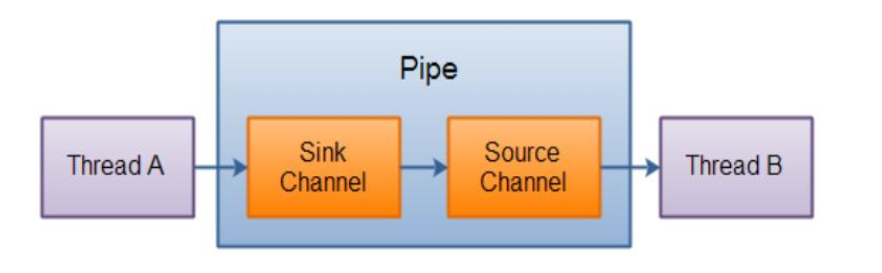

---

## 8 内存映射文件说明

- 内存映射文件在处理大文件时是比较理想的提高效率的手段。
- 内存映射文件只支持 ByteBuffer。
- 内存映射文件不需要通道，因为读写就是直接针对物理内存。
- 内存映射文件写到文件系统不受程序控制，相对不稳定。
- 内存映射文件属于 JVM 中的直接缓冲区，相比基础的 IO 操作来说就是少了中间缓冲区的数据拷贝开销。同时直接内存属于JVM堆外内存，不受JVM堆内存大小的限制。

### 8.1 传统的文件IO操作

传统的文件IO操作中需要赋值两次：

1. 调用操作系统提供的底层标准IO系统调用函数 `read()、write()`
2. 用户态切换到内核态，然后OS的内核代码负责将相应的文件数据读取到内核的IO缓冲区。
3. 把数据从内核IO缓冲区拷贝到进程的私有地址空间。

为什么需要多拷贝一次？

- 为了减少磁盘的IO操作。
- 局部性原理：程序访问一般都带有局部性。
- OS根据局部性原理会在一次 `read()` 系统调用过程中预读更多的文件数据缓存在内核IO缓冲区中，以便可以在内存中直接处理接下来的应用程序读取操作。

扩展：

- Java IO 中的 BufferedInputStream 也是使用类似预读更多数据的方式来提高IO效率

### 8.2 内存映射文件

内存映射文件和标准 IO 操作最大的不同之处就在于它虽然最终也是要从磁盘读取数据，但是它并不需要将数据读取到OS内核缓冲区，而是直接将进程的用户私有地址空间中的一部分区域与文件对象建立起映射关系，就好像直接从内存中读、写文件一样，速度当然快

---

## 9 NIO 主要类图

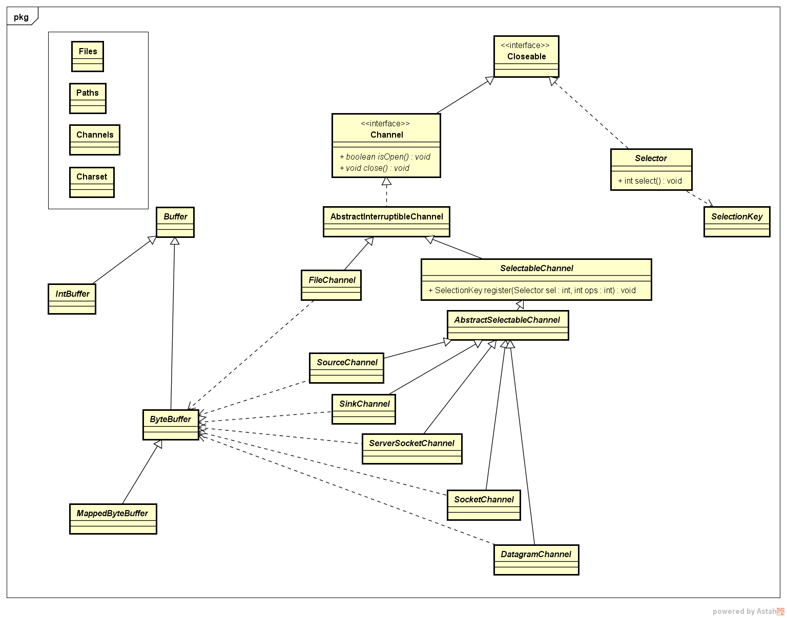

## 10 引用

DOCs:

- [JSR-000051 New I/O APIs for Java(TM) Platform Specification 0.60 Proposed Final Draft](https://download.oracle.com/otndocs/jcp/7847-newio-0.6-pfd-spec-oth-JSpec/)
- [Java(TM) 2 SDK, Standard Edition Documentation 1.4.2](https://www.oracle.com/java/technologies/java-archive-142docs-downloads.html)

Tutorial：

- [Java IO Tutorial-Java Asynchronous I/O](http://www.java2s.com/Tutorials/Java/Java_io/index.htm)
- [Jenkov Java NIO Tutorials](http://tutorials.jenkov.com/java-nio/index.html)
- [尚硅谷 NIO 教程](JavaNIO-尚硅谷.pdf)

Books：

- 《深入理解 Java7 核心技术与最佳实践》【推荐】
- [《Java NIO》](JavaNIO-RonHitchens.pdf)

Blogs：

- [IO - 同步，异步，阻塞，非阻塞](https://blog.csdn.net/historyasamirror/article/details/5778378)。
- [怎样理解阻塞非阻塞与同步异步的区别？](https://www.zhihu.com/question/19732473)
- [Java NIO浅析](https://tech.meituan.com/2016/11/04/nio.html)
- [JavaGuide：BIO-NIO-AIO](https://github.com/Snailclimb/JavaGuide/blob/master/docs/java/BIO-NIO-AIO.md)
- [JAVA NIO之浅谈内存映射文件原理与DirectMemory](https://blog.csdn.net/szwangdf/article/details/10588489)
- [通俗编程——白话 NIO 之 Channel](https://gold.xitu.io/entry/57a4aac3a633bd00603e83e5)
- [通俗编程——白话 NIO 之 Selector](https://blog.csdn.net/dd864140130/article/details/50299687)
