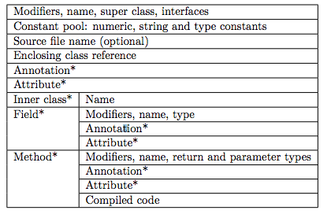
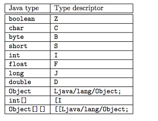
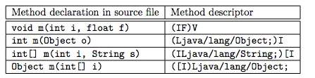

# ASM 入门

---

## 1 ASM 介绍

程序分析、程序生成和程序转换：

- 程序分析，既可能只是简单的语法分析（syntaxic  parsing），也可能是完整的语义分析（sematic analysis），可用于查找应用程序中的潜在bug、检测未被用到的代码、对代码实施逆向工程，等等。
- 程序生成，在编译器中使用。这些编译器不仅包括传统编译器，还包括用于分布式程序设计的 stub 编译器或 skeleton 编译器，以及 JIT（即时）编译器，等等。
- 程序转换，用于优化或混淆（obfuscate）程序、向应用程序中插入调试或性能监视代码，用于面向方面的程序设计，等等

这些技术都可用于 Java 源代码或编译后的 Java 类，而实现对编译后的 class 文件应用这些技术，有如下好处：

1. 应用这些技术不需要源代码。因此，程序转换可用于任何应用程序，既包括保密的源代码，也包含商业应用程序。
2. 在 class 被加载到 JVM 之前，我们可以实现对类进行分析、转换或生成，以实现诸如 stub 编译器或方面编织器等工具对用户变为透明。

[ASM](http://asm.ow2.io/index.html) 用于进行时类的转换与生成，ASM 是一个通用的 Java 字节码操作和分析框架。它可以用来修改现有的类或直接以二进制形式动态生成类。ASM 提供了一些常用的字节码转换和分析算法，从中可以构建自定义的复杂转换和代码分析工具。ASM 提供与其他 Java 字节码框架相似的功能，但它更专注于性能。因为它的设计和实施尽可能地小和尽可能快，它非常适合在动态系统中使用（但当然也可以静态方式使用，例如在编译器中）。

>ASM并不是惟一可生成和转换已编译Java类的工具，但它是最新、最高效的工具之一。

ASM 被用于许多项目，包括：

- OpenJDK
- Groovy 编译器和 Kotlin 编译器
- Cobertura 和 Jacoco
- CGLIB，动态生成代理类
- Mockito 和 EasyMock
- Gradle

使用 gralde 在项目中集成 ASM，代码如下：

```groovy
    compile 'org.ow2.asm:asm:5.1'
    compile 'org.ow2.asm:asm-commons:5.1'
    compile 'org.ow2.asm:asm-util:5.1'
```

### ASM 的作用范围

ASM 库的范围严格限制于类的读、写、转换和分析。其不处理类的加载过程，但是可以在类的加载过程中应用 ASM。

### ASM 的 API 模型

ASM 提供了两套 API：

1. **基于事件模型的 API**：类是用一系列事件来表示的，每个事件表示类的一个元素，比如它的一个标头、一个字段、一个方法声明、一条指令，等等。这类似于 XML 解析中的 SAX 解析，不需要一次性将所有的 XML 加载到内存中，同样基于事件模型的 API 也不需要在内存中创建和存储用于表示类的对象树，因此其具有更快的速度和更少的内存占用，缺点是在进行类转换的实现可能要更难一些，因为在任意给定时刻，类中只有一个元素可供使用（也就是与当前事件对应的元素）。
2. **基于对象模型的 API**：类用一个对象树表示，每个对象表示类的一部分，比如类本身、一个字段、一个方法、一条指令，等等。这类似于 XML 解析中的 DOM 解析，一次性将整个文档加载到内存，因此使用基于对象的 API 时，可以在内存中获得整个类。

### 认识 ASM 类库

ASM 库划分为几个包，以几个 jar 文件的形式进行分发：

- `org.objectweb.asm` 和 `org.objectweb.asm.signature` 包定义了基于事件的 API，并提供了类分析器和写入器组件。它们包含在 asm.jar 存档文件中。
- `org.objectweb.asm.util` 包，位于 `asm-util.jar` 存档文件中，提供各种基于核心 API 的工具，可以在开发和调试 ASM 应用程序时使用。
- `org.objectweb.asm.commons` 包提供了几个很有用的预定义类转换器，它们大多是基于核心 API 的。这个包包含在 asm-commons.jar 存档文件中。
- `org.objectweb.asm.tree` 包，位于 asm-tree.jar 存档文件中，定义了基于对象的 API，并提供了一些工具，用于在基于事件和基于对象的表示方法之间进行转换。
- `org.objectweb.asm.tree.analysis` 包提供了一个类分析框架和几个预定义的类分析器，它们以树 API 为基础。这个包包含在 asm-analysis.jar 存档文件中。

---

## 2 类的结构简介

JVM 运行的是 class 文件，class 文件中存储着类名、方法、字段、常量、指令等信息，通过编辑这些信息，我们就可以修改类的行为。既然我们操作的是 class 文件，那么有必要了解一下 class 文件的结构。

>关于类文件结构可以参考《深入理解Java虚拟机》、《Java虚拟机规范》

### 类结构

为了更好的使用 ASM API，需要对类的结构有一个基本的掌握，字节码中包括：

- 类的作用域（例如 public 或 private），名字，父类，接口和注解。
- 类中的每一个变量。包括每一个变量的作用域，名称，类型和注解。
- 类中的每一个方法和构造函数。每一个部分包括作用域，名称，返回值，参数和注解。并且也包括方法编译后的字节码。

字节码与类文件的不同：

- 一个字节码文件仅描述一个类
- 字节码文件并不包含注释
- 字节码不包含 package 和 import 的部分，所以所有的类型引用名称都要用完整的名称。
- 字节码中包含常量池。常量池是一个包括所有这个类中的 numeric，string 或者其他类型的常量的 array。这些常量仅仅被定义一次，并且被类的全局持有引用。



### 类型的内部名称

一种类型只能是类或接口类型。这些类型在字节码中用`内部名称`表示。内部名称就是一个类的标准名称，点会被替换为斜杠。比如 String 会被替换为 `java/lang/String`。

### 类型描述符与方法描述符

类型描述符，用于描述变量的类型：



方法描述符，用于描述方法的类型：



---

## 3 ASM 核心 API

### 3.1 核心组件介绍

我们使用 ASM ，主要是通过 ClassVisitor、ClassWriter、ClassReader 这个三个核心类来实现对 class 的编辑等操作。

#### ClassReader

`ClassReader` 用于从字节数组或由 class 文件间接读取类的字节码数据，通过调用它的 `accept`方法，传入一个实现了 `ClassVisitor` 接口的对象实例作为参数，以访问者的模式来访问类结构的每一个部分。`ClassReader` 会将相应的 class 结构传递给 ClassVistor 实例中相应的 visitXXX 方法，如果仅仅是查看类的结构，只需要使用 ClassReader即可。

#### ClassVisitor

ClassVisitor 类中的每一个方法都对应字节码中的一个结构。`ClassVisitor` 是类结构的访问者抽象，它定义了不同的 visit 方法，开发者可以通过实现这些方法来访问类的特定部分。我们访问这些特定部分时，主要有两种形式：

- 简单的部分只需一个方法调用就能访问，这个调用返回void，其参数描述了这些部分的内容。
- 有些部分的内容会产生一些**子过程**，比如 `visitMethod` 方法会要求返回一个实现 `MethordVisitor` 接口的实例，`visitField` 方法会要求返回一个实现 `FieldVisitor`接口的实例，但这并不是必须的，如果我们对这些部分的细节不感兴趣，可以返回 null，完成子过程后控制返回到父过程，继续访问下一节点。

ClassVisitor 定义，按照 class 文件格式，ClassVisitor 都定义对应的方法来访问，并且按次序访问类文件每一部分：

```java
public abstract class ClassVisitor {

    public ClassVisitor(int api);
    public ClassVisitor(int api, ClassVisitor cv);

    //访问开始
    public void visit(int version, int access, String name,String signature, String superName, String[] interfaces);

    public void visitSource(String source, String debug);
    public void visitOuterClass(String owner, String name, String desc);
    public void visitAttribute(Attribute attr);
    public void visitInnerClass(String name, String outerName,String innerName, int access);

    //返回 FieldVisitor 继续子过程
    public FieldVisitor visitField(int access, String name, String desc,String signature, Object value);

    //返回 MethodVisitor 继续子过程
    public MethodVisitor visitMethod(int access, String name, String desc,String signature, String[] exceptions);

    //返回 AnnotationVisitor 继续子过程
    public AnnotationVisitor visitAnnotation(String desc, boolean visible);

    //整个过程结束
    void visitEnd();
}
```

#### ClassVisitor 调用流程

ClassVisitor 中方法的顺序必须按照顺序调用，Java 文档中规定：

```java
visit visitSource? visitOuterClass? ( visitAnnotation | visitAttribute )* ( visitInnerClass | visitField | visitMethod )* visitEnd
```

- visit 方法会被最先调用
- 然后多数情况会调用 visitSource
- 然后多数情况会调用 visitOuterClass
- 然后调用任意数量的 visitAnnotation 和 visitAttribute 方法
- 然后调用任意数量的 visitInnerClass，visitField 和 visitMethod 方法
- 最后会调用一次 visitEnd 方法

**不管是 ClassVisitor 还是其他的 Visitor，最终都以一个 `visitEnd()` 方法结束该部分的访问**

#### ClassWriter

`ClassWriter` 继承自 `ClassVistor` 抽象类，负责将对象化的 class 文件内容重构成一个二进制格式的 class 字节码文件，`ClassWriter` 可以看作是一个事件消费者。继承自 `ClassVistor` 抽象类的自定义类负责 class 文件各个区域内容的修改和生成，它可以看作是一个事件过滤器，一次生产消费过程中这样的事件过滤器可以有`N个（0<=N）`。

**ClassWriter 提供了字节码的改写功能，用来编译修改好的字节码。它生产了一个包含了编译好的类的二进制的数组，ClassWriter 可以单独使用，用来构造出一个全新的类**。

#### 组织方式

ASM 基于 ClassVisitor API 提供了三种核心组件去构造和更改字节码：

- ClassReader 会将字节码转化为一个 byte 数组，它是事件的生产者，可以把使用 push 给 ClassVisitor。
- ClassWriter 是 ClassVisitor 抽象类的子类，用来编译修改好的字节码。它生产了一个包含了编译好的类的二进制的数组，可以用 toByteArray 方法获取。ClassWriter 是事件的消费者。
- ClassVisitor 代理了所有来自其它 ClassVisitor 实例的方法调用，ClassVisitor是事件过滤器

这些核心类分工明确，通过组合这三个类就可以实现对类结构的访问、修改，甚至是创建新的类等操作。ClassReader 读取原有的字节码信息，传递给 ClassVisitor，一般 ClassVisitor 是由调用者根据自己的需求来实现的，也就是在这里我们实现对类结构的访问与修改，然后 ClassVisitor 再调用 ClassWriter 来实现类的生成。在这个过程中，我们还可以插入更多的 ClassVisitor 来实现额外的逻辑，比如以我们看得懂的形式打印出修改后的类；比如随意验证我们操作的后的类是否还符合虚拟机规范。其实这就像一个链条一样，起点就是 ClassReader，然后中间连接着一个或多个 ClassVisitor，然后在链条的最终终端是 ClassWriter，负责生成最终的类。

### 3.2 示例

只了解 API 是非常抽象的，通过示例可以很好的掌握 ASM 的基本用法。（在实践中，我们可以配合使用 `jdk instrumentation` 机制调试）

#### 解析一个类

解析一个类可以理解为遍历一个类的结构，而不去修改该类，此时只需要使用 ClassReader 和 ClassVisitor 即可。下面代码演示通过 ClassVisitor 打印一个类的结构：

```java
/**
 * 类的解析过程：遍历一个类的结构
 */
public class ClassPrinter extends ClassVisitor {

    //程序入口
    public static void main(String... args) throws IOException {
        ClassPrinter cp = new ClassPrinter();
        ClassReader cr = new ClassReader("java.lang.Runnable");
        cr.accept(cp, 0);
    }

    private ClassPrinter() {
        super(Opcodes.ASM5);
    }

    public void visit(int version, int access, String name, String signature, String superName, String[] interfaces) {
        System.out.println(name + " extends " + superName + " {");
    }

    public void visitSource(String source, String debug) {
    }

    public void visitOuterClass(String owner, String name, String desc) {
    }

    public AnnotationVisitor visitAnnotation(String desc, boolean visible) {
        return null;
    }

    public void visitAttribute(Attribute attr) {
    }

    public void visitInnerClass(String name, String outerName, String innerName, int access) {
    }

    public FieldVisitor visitField(int access, String name, String desc, String signature, Object value) {
        System.out.println("    " + desc + " " + name);
        return null;
    }

    public MethodVisitor visitMethod(int access, String name, String desc, String signature, String[] exceptions) {
        System.out.println(" " + name + desc);
        return null;
    }

    public void visitEnd() {
        System.out.println("}");
    }

}
```

最终的执行结果为：

```java
java/lang/Runnable extends java/lang/Object {
 run()V
}
```

#### 创建一个类

构造一个类，只需要用到 ClassWriter，通过调用不同的 visitXXX 方法来创建类的各个部分，下面代码创建一个接口：

```java
package pkg;
public interface Comparable  {
    int LESS = -1;
    int EQUAL = 0;
    int GREATER = 1;
    int compareTo(Object o);
}
```

>即使我们对类的结构很了解，但是将其转换成各种 visit 操作还是很繁琐的，不过我们可以借助 IDEA 插件 ASM Outline View 来帮我们生成。

下面是生成这个类的具体代码，从代码可以看出，生成类就是调用各种 visit 方法已实现写入对应的类结构，然后下面示例还通过一个自定义的类加载器来加载了这个类的字节码：

```java
/**
 * 类的创建：构建一个新的类
 */
public class AsmCreateClass {

    public static void main(String... args) throws ClassNotFoundException {

        final byte[] aClass = createClass();

        Class exampleClass = new ClassLoader() {
            @SuppressWarnings("unchecked")
            protected Class findClass(String name) {
                return defineClass(name, aClass, 0, aClass.length);
            }
        }.loadClass("pkg.Comparable");

        System.out.println(exampleClass);
    }

    private static byte[] createClass() {

        ClassWriter cw = new ClassWriter(0);

        //类的声明，V1_5表示 java 字节码的版本
        cw.visit(V1_5, ACC_PUBLIC + ACC_ABSTRACT + ACC_INTERFACE,
                "pkg/Comparable",
                null,
                "java/lang/Object",
                null);

        //创建字段，每一个部分都是一个子过程，所以也对于这一个visitEnd方法
        cw.visitField(ACC_PUBLIC + ACC_FINAL + ACC_STATIC, "LESS", "I",
                null, -1).visitEnd();
        cw.visitField(ACC_PUBLIC + ACC_FINAL + ACC_STATIC, "EQUAL", "I",
                null, 0).visitEnd();
        cw.visitField(ACC_PUBLIC + ACC_FINAL + ACC_STATIC, "GREATER", "I",
                null, 1).visitEnd();

        //创建方法
        cw.visitMethod(ACC_PUBLIC + ACC_ABSTRACT, "compareTo",
                "(Ljava/lang/Object;)I", null, null).visitEnd();

        //创建结束
        cw.visitEnd();

        //返回字节码
        return cw.toByteArray();
    }

}
```

#### 修改现有的类

修改现有的类包括：

- 修改类或字段的名称
- 添加/删除字段
- 添加/删除方法

一般 ClassReader 作为事件事件源，解析一个类的每一个部分，一个或多个 ClassVisitor(以及其子过程) 构成一个链条，以访问者模式去遍历类的每一个部分，这个过程可以有过滤(删除类的某一个部分)、转换(修改类的某一个部分)、添加(添加新的部分)，最后 ClassWriter 作为链条的最后一部分，把修改好的类重新组合编程成字节码，通过其 `toByteArray()`方法获取。下面代码演示了这个链条的组成：

```java
byte[] b1 = ...;//某一个类的原始字节码

ClassWriter cw = new ClassWriter(0);//事件消费者

// cv forwards all events to cw
ClassVisitor cv = new ClassVisitor(ASM4, cw) { };//事件的处理：过滤、修改、新增

ClassReader cr = new ClassReader(b1);//事件消费者

cr.accept(cv, 0);//调用过程

byte[] b2 = cw.toByteArray(); //处理完成，返回新的字节码
```

修改的类只由 ClassWriter 生成，ClassWriter 最终收到了什么样的类信息，就会生成什么样的类，ClassWriter 处理访问链的最后端，那么它前面的 ClassVisitor 可以对访问信息做各种过滤或修改。

- 修改类的信息：在把事件转发到下一个访问者时，修改传给下一个访问者的参数。
- 移除类的成员：在把事件转发到下一个访问者时，过滤某些类结构(方法或字段等)，这样 ClassWriter 就收不到这部分结构的信息，就不会把它写入到新的类中。
- 添加类的成员：一般选择在 visitEnd 函数中添加变量，这总会添加成功，这个方法总会被调用，而且只被调用一次。

下面演示如何创建一个 ClassVisitor 用来给类添加字段：

```java
public class AddFieldAdapter extends ClassVisitor {

    private int fAcc;
    private String fName; //字段名称
    private String fDesc; //字段类型
    private boolean isFieldPresent;

    public AddFieldAdapter(ClassVisitor cv, int fAcc, String fName, String fDesc) {
        super(ASM5, cv);
        this.fAcc = fAcc;
        this.fName = fName;
        this.fDesc = fDesc;
    }

    @Override
    public FieldVisitor visitField(int access, String name, String desc, String signature, Object value) {
        if (name.equals(fName)) {
            isFieldPresent = true;
        }
        return cv.visitField(access, name, desc, signature, value);
    }

    //对于每一个类的遍历visitEnd方法只会被调用一次
    @Override
    public void visitEnd() {
        // 不存在这个字段就添加这个字段
        if (!isFieldPresent) {
            FieldVisitor fv = cv.visitField(fAcc, fName, fDesc, null, null);
            if (fv != null) {
                fv.visitEnd();
            }
        }
        cv.visitEnd();
    }
}
```

### 3.3 工具类

除了 ClassVisitor 和 ClassReader 等组件，ASM 在 `org.objectweb.asm.util` 包中提供了很多在开发时提供帮助的工具去初始化和适配一个类。

#### Type

ASM API 公开了存储在字节码中的类型，即内部名称和类型描述符。而没有使用更加接近源码的方式去暴露它们，让它们有更好的可读性。在使用 ASM 时我们需要使用 Java 类型的内部名称，不过 ASM 提供了 Type 类来帮助我们做转换。

一个 Type 对象代表一个 Java 类型，它可以从一个类型描述符或者一个 Class 对象构建获得。Type 类也包含静态的表示原始类型的常量。例如Type.INT_TYPE 是表示 int 类型的对象。

- **getInternalName**：方法返回了一个 Type 的内部名称。例如，`Type.getType(String.class).getInternalName()` 提供了 String 类的内部名称，即`java/lang/String`。
- **getDescriptor**：返回了 Type 的描述符。所以，可以用 `Type.getType(String.class).getDescriptor()`来替代 `Ljava/lang/String;`，可以用 `Type.INT_TYPE.getDescriptor()` 代替`I`

Type 对象也可以表示一个方法类型。一个 Type 对象可以从一个方法描述符或者一个 Method 对象构建获得。

- **getDescriptor**：返回方法描述符的类型。
- **getArgumentTypes**：获取参数类型，例如 `Type.getArgumentTypes(“(I)V”)` 返回的是 Type.INT_TYPE
- **getReturnType**：获取返回值类型，例如 `Type.getReturnType(“(I)V”)` 返回的是 Type.VOID_TYPE

#### TraceClassVisitor

TraceClassVisitor 可以检查一个构建和转换的类是否符合你的期望，TraceClassVisitor 可以将字节码转换为文字表示：

```java
ClassWriter cw = new ClassWriter(0);
PrintWriter printWriter = new PrintWriter(System.out);
TraceClassVisitor cv = new TraceClassVisitor(cw, printWriter);
cv.visit(...);
...
cw.toByteArray();
```

#### CheckClassAdapter

ClassWriter 类并不能检查一个方法是否用正确的顺序和参数被调用，因此，可能会因为初始化一个错误的类从而被 Java 虚拟机验证拒绝，为了避免这些错误。可以使用 CheckClassAdaoter 类。TraceClassVisitor 也继承自 ClasVisitor，并且分发所有的请求给另一个 ClassVisitor 实例。这个类的作用是在分发给下一个 visitor 之前检查方法调用顺序和参数，如果出错就会抛出 IllegalStateException 或者 IllegalArgumentException 异常。

```java
//为了检查一个类，打印这个类，最后获取这个类的byte数组
ClassWriter cw = new ClassWriter(0);
PrintWriter printWriter = new PrintWriter(System.out);
TraceClassVisitor tcv = new TraceClassVisitor(cw, printWriter);
CheckClassAdapter cv = new CheckClassAdapter(tcv);
cv.visit(...);
...
cv.visitEnd();
byte b[] = cw.toByteArray();

//或者把检测流程放到最后
ClassWriter cw = new ClassWriter(0);
CheckClassAdapter cca = new CheckClassAdapter(cw);
TraceClassVisitor cv = new TraceClassVisitor(cca, printWriter);
```

#### ASMifier

通过 ASMifier 可以获取一个已存在的类的 ASM 代码。ASMifier类可以使用下面的命令行来调用：

```shell
java -classpath asm.jar:asm-util.jar \
  org.objectweb.asm.util.ASMifier \
  java.lang.Runnable
```

之后会产生出下面的代码：

```java
package asm.java.lang;
import org.objectweb.asm.*;

public class RunnableDump implements Opcodes {

    public static byte[] dump() throws Exception {

        ClassWriter cw = new ClassWriter(0);
        FieldVisitor fv;
        MethodVisitor mv;
        AnnotationVisitor av0;

        cw.visit(V1_5, ACC_PUBLIC + ACC_ABSTRACT + ACC_INTERFACE, "java/lang/Runnable", null, "java/lang/Object", null);
        {
            mv = cw.visitMethod(ACC_PUBLIC + ACC_ABSTRACT, "run", "()V", null, null);
            mv.visitEnd();
        }
        cw.visitEnd();
        return cw.toByteArray();
    }

}
```

---

## 4 深入字节码指令、使用 ASM API 生成和转换已编译的方法

### 4.1 字节码指令

想要很好的理解和使用 ASM 的相关 API，必须对 Java 字节码指令有一定的了解， ASM 操作类的 API 是完全基于字节码指令设计的。关于字节码指令可以参考各个版本《深入理解Java虚拟机》的第六、七章以及《Java 虚拟机规范》。

>对于一个已经编译好的 class，我们可以使用 javap -v xxx.class 来查看其内部结构。

### 4.2 MethodVisitor

ClassVisitor 主要负责访问类成员信息。其中包括（标记在类上的注解，类的构造方法，类的字段，类的方法，静态代码块），ClassVisitor 中每个方法都对应类的一个结构：

```log
  class————ClassVisitor
    |-->Annotation————AnnotationVisitor
    |
    |-->Field————FieldVisitor
    |
    |-->Method————MethodVisitor
```

ClassVisitor 方法方法说明：

```java
//当扫描类时第一个调用的方法，主要访问用于类声明。参数说明列表：类版本、修饰符、类名泛型信息、继承的父类、实现的接口
public void visit(int version, int access, String name, String signature,String superName, String[] interfaces)

//当扫描器扫描到类注解声明时进行调用，参数列表：注解类型、注解是否可以在 JVM 中可见
public AnnotationVisitor visitAnnotation(String desc, boolean visible)

//当扫描器扫描到类中字段时进行调用，参数列表：修饰符 、 字段名、字段类型、泛型描述、默认值
public FieldVisitor visitField(int access, String name, String desc, String signature, Object value)

//当扫描器扫描到类的方法时进行调用。参数列表：修饰符 、方法名 、方法签名、泛型信息 、抛出的异常
public MethodVisitor visitMethod(int access, String name, String desc, String signature, String[] exceptions)
```

MethodVisitor 是用于生成和转换已编译方法的 ASM API，MethodVisitor 中每个方法都对应字节码指令，如果需要查看一个类的字节码指令，可以使用 javap 命令反编译，下面是 MethodVisitor 的方法列表。

```java
abstract class MethodVisitor {

    MethodVisitor(int api);
    MethodVisitor(int api, MethodVisitor mv);

    AnnotationVisitor visitAnnotationDefault();
    AnnotationVisitor visitAnnotation(String desc, boolean visible);
    AnnotationVisitor visitParameterAnnotation(int parameter, String desc, boolean visible);

    void visitAttribute(Attribute attr);
    void visitCode();
    void visitFrame(int type, int nLocal, Object[] local, int nStack, Object[] stack);
    void visitInsn(int opcode);
    void visitIntInsn(int opcode, int operand);
    void visitVarInsn(int opcode, int var);
    void visitTypeInsn(int opcode, String desc);
    void visitFieldInsn(int opc, String owner, String name, String desc);
    void visitMethodInsn(int opc, String owner, String name, String desc);
    void visitInvokeDynamicInsn(String name, String desc, Handle bsm, Object... bsmArgs);
    void visitJumpInsn(int opcode, Label label);
    void visitLabel(Label label);
    void visitLdcInsn(Object cst);
    void visitIincInsn(int var, int increment);
    void visitTableSwitchInsn(int min, int max, Label dflt, Label[] labels);
    void visitLookupSwitchInsn(Label dflt, int[] keys, Label[] labels);
    void visitMultiANewArrayInsn(String desc, int dims);
    void visitTryCatchBlock(Label start, Label end, Label handler, String type);
    void visitLocalVariable(String name, String desc, String signature, Label start, Label end, int index);
    void visitLineNumber(int line, Label start);
    void visitMaxs(int maxStack, int maxLocals);
    void visitEnd();
}
```

这些方法必须按以下顺序调用（在 MethodVisitor 接口的 Javadoc 中还规定了其他一些约束条件）：

```java
visitAnnotationDefault?
( visitAnnotation | visitParameterAnnotation | visitAttribute )*
( visitCode
    ( visitTryCatchBlock | visitLabel | visitFrame | visitXxxInsn | visitLocalVariable | visitLineNumber )*
visitMaxs )?
visitEnd
```

可以将 ClassVisitor 和 MethodVisitor类 合并，生成完整的类：

```java
ClassVisitor cv = ...;
//访问类
cv.visit(...);

//方法方法1
MethodVisitor mv1 = cv.visitMethod(..., "m1", ...);
mv1.visitCode();
mv1.visitInsn(...);
...
mv1.visitMaxs(...);
mv1.visitEnd();

//访问方法2
MethodVisitor mv2 = cv.visitMethod(..., "m2", ...);
mv2.visitCode();
mv2.visitInsn(...);
...
mv2.visitMaxs(...);
mv2.visitEnd();

//完成
cv.visitEnd();
```

如果要操作方法，在原有的 ClassReader、ClassVisitor、ClassWriter 主流程中，要插入 MethodVisitor 子流程。这是我们需要关注 ClassWriter 构造参数，我们知道，虚拟机为每个方法调用创建一个栈帧，栈帧中有局部变量表和操作数栈，而且这两个值是在编译器确定的，所以我们利用 ASM 生成的方法也需要计算两个参数，默认 ASM 不会帮我们计算，我们需要调用 visitMaxs 来设置，不过 ASM 也为我们提供了自动计算的方式，而是否自动计算就通过 ClassWriter 的构造参数来指定。

- 在使用 `new ClassWriter(0)` 时，不会自动计算任何东西。必须自行计算帧、局部变量与操作数栈的大小。
- 在使用 `new ClassWriter(ClassWriter.COMPUTE_MAXS)`时，将为你计算局部变量与操作数栈部分的大小。还是必须调用 visitMaxs，但可以使用任何参数：它们将被忽略并重新计算。使用这一选项时，仍然必须自行计算这些帧。
- 在 `newClassWriter(ClassWriter.COMPUTE_FRAMES)` 时，一切都是自动计算。不再需要调用 visitFrame，但仍然必须调用 visitMaxs（参数将被忽略并重新计算）。

### 4.3 具体操作

#### 生成方法

通过实现一系列完整的 visit 方法调用，即可实现方法生成，比如：

生成中的 getF 方法的指令如下：

```java
package pkg;

public class Bean {
    private int f;

    public int getF() {
        return this.f;
    }

    public void setF(int f) {
        this.f = f;
    }
}
```

指令：

```java
mv.visitCode();
mv.visitVarInsn(ALOAD, 0);
mv.visitFieldInsn(GETFIELD, "pkg/Bean", "f", "I");
mv.visitInsn(IRETURN);
mv.visitMaxs(1, 1);
mv.visitEnd();
```

1. visitCode 调用启动字节代码的生成过程。
2. 然后是三个调用，生成这一方法的三条指令。
3. 对visitMaxs的调用必须在已经访问了所有这些指令后执行。它用于为这个方法的执行帧定义局部变量和操作数栈部分的大小。
4. 最后是 visitEnd 调用，结束字节代码的生成过程。

#### 转换方法

- [ ] todo

---

## 5 Tree API

- [ ] todo

---

## 6 使用插件

使用 IDEA 插件可以帮助我们快速地生成 ASM 代码，下面两个都是可以使用的插件：

- ASM ByteCode Outline 2017
- ASM ByteCode Viewer

---

## 引用

- [ASM Website](https://asm.ow2.io/index.html)
- [ASM 6 Developer Guide](https://asm.ow2.io/developer-guide.html)
- [AOP 的利器：ASM 3.0 介绍](https://www.ibm.com/developerworks/cn/java/j-lo-asm30/index.html)
