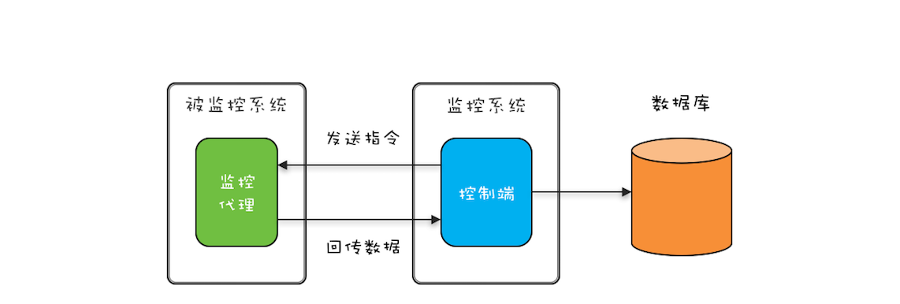

# 并发设计模式：生产者消费者模式

生产者-消费者模式在编程领域的应用非常广泛，**Java 线程池本质上就是用生产者-消费者模式实现的**。除了在线程池中的应用，为了提升性能，并发编程领域很多地方也都用到了生产者-消费者模式，比如：Log4j2 中异步 Appender 内部也用到了生产者-消费者模式。

## 1 生产者-消费者模式的优点

生产者与消费者核心：任务队列，生产者线程生产任务，并将任务添加到任务队列中，而消费者线程从任务队列中获取任务并执行。

1. 解耦：解耦的一个关键就是组件之间的依赖关系和通信方式必须受限。在生产者-消费者模式中，生产者和消费者没有任何依赖关系，它们彼此之间的通信只能通过任务队列。
2. 支持异步：生产者-消费者模式支持异步，并且能够平衡生产者和消费者的速度差异。在生产者-消费者模式中，生产者线程只需要将任务添加到任务队列而无需等待任务被消费者线程执行完，也就是说任务的生产和消费是异步的，这是与传统的方法之间调用的本质区别，传统的方法之间调用是同步的。

**任务队列的作用**：主要还是用于平衡生产者和消费者的速度差异。

## 2 支持批量执行以提升性能

**需求场景**：要在数据库里 INSERT 1000 条数据，有两种方案：

- 第一种方案是用 1000 个线程并发执行，每个线程 INSERT 一条数据；
- 第二种方案是用 1 个线程，执行一个批量的 SQL，一次性把 1000 条数据 INSERT 进去。

这两种方案，显然是第二种方案效率更高，其实这样的应用场景就是我们上面提到的批量执行场景。[并发设计模式：两阶段终止模式](27-并发设计模式：两阶段终止模式.md) 中的监控系统动态采集的案例，其实最终回传的监控数据还是要存入数据库的（如下图）。但被监控系统往往有很多，如果每一条回传数据都直接 INSERT 到数据库，那么这个方案就是上面提到的第一种方案：每个线程 INSERT 一条数据。很显然，更好的方案是批量执行 SQL，那如何实现呢？这就要用到生产者-消费者模式了。



实现：将原来直接 INSERT 数据到数据库的线程作为生产者线程，生产者线程只需将数据添加到任务队列，然后消费者线程负责将任务从任务队列中批量取出并批量执行。

```java
//任务队列
BlockingQueue<Task> bq=new LinkedBlockingQueue<>(2000);

//启动5个消费者线程，执行批量任务  
void start() {
  ExecutorService es=executors.newFixedThreadPool(5);
  for (int i=0; i<5; i++) {
    es.execute(()->{
      try {
        while (true) {
          //获取批量任务
          List<Task> ts=pollTasks();
          //执行批量任务
          execTasks(ts);
        }
      } catch (Exception e) {
        e.printStackTrace();
      }
    });
  }
}

//从任务队列中获取批量任务
List<Task> pollTasks() throws InterruptedException{
  List<Task> ts=new LinkedList<>();
  //阻塞式获取一条任务
  Task t = bq.take();
  while (t != null) {
    ts.add(t);
    //非阻塞式获取一条任务
    t = bq.poll();
  }
  return ts;
}

//批量执行任务
execTasks(List<Task> ts) {
  //省略具体代码无数
}
```

创建了 5 个消费者线程负责批量执行 SQL，这 5 个消费者线程以 `while(true){}` 循环方式批量地获取任务并批量地执行。需要注意的是，从任务队列中获取批量任务的方法 `pollTasks()` 中，首先是以阻塞方式获取任务队列中的一条任务，而后则是以非阻塞的方式获取任务；之所以首先采用阻塞方式，是因为如果任务队列中没有任务，这样的方式能够避免无谓的循环。

## 3 支持分阶段提交以提升性能

利用生产者-消费者模式还可以轻松地支持一种**分阶段提交的应用场景**。我们知道写文件如果同步刷盘性能会很慢，所以对于不是很重要的数据，我们往往采用异步刷盘的方式。

比如我们自己实现日志组件，采用异步刷盘方式，一般刷盘的时机是：

1. ERROR 级别的日志需要立即刷盘；
2. 数据积累到 500 条需要立即刷盘；
3. 存在未刷盘数据，且 5 秒钟内未曾刷盘，需要立即刷盘。

这个日志组件的异步刷盘操作本质上其实就是一种分阶段提交。

实现：在下面的示例代码中，可以通过调用 info()和error() 方法写入日志，这两个方法都是创建了一个日志任务 LogMsg，并添加到阻塞队列中，调用 info()和error() 方法的线程是生产者；而真正将日志写入文件的是消费者线程，在 Logger 这个类中，我们只创建了 1 个消费者线程，在这个消费者线程中，会根据刷盘规则执行刷盘操作

```java

class Logger {

  //任务队列  
  final BlockingQueue<LogMsg> bq = new BlockingQueue<>();

  //flush批量  
  static final int batchSize=500;

  //只需要一个线程写日志
  ExecutorService es = Executors.newFixedThreadPool(1);

  //启动写日志线程
  void start(){
    File file=File.createTempFile("foo", ".log");

    final FileWriter writer = new FileWriter(file);

    this.es.execute(()->{
      try {
        //未刷盘日志数量
        int curIdx = 0;
        long preFT=System.currentTimeMillis();

        while (true) {
          LogMsg log = bq.poll(5, TimeUnit.SECONDS);
          //写日志
          if (log != null) {
            writer.write(log.toString());
            ++curIdx;
          }
          //如果不存在未刷盘数据，则无需刷盘
          if (curIdx <= 0) {
            continue;
          }
          //根据规则刷盘
          if (log!=null && log.level==LEVEL.ERROR || curIdx == batchSize || System.currentTimeMillis()-preFT>5000){
            writer.flush();
            curIdx = 0;
            preFT=System.currentTimeMillis();
          }
        }
      }catch(Exception e){
        e.printStackTrace();
      } finally {
        try {
          writer.flush();
          writer.close();
        }catch(IOException e){
          e.printStackTrace();
        }
      }
    });  
  }

  //写INFO级别日志
  void info(String msg) {
    bq.put(new LogMsg(LEVEL.INFO, msg));
  }

  //写ERROR级别日志
  void error(String msg) {
    bq.put(new LogMsg(LEVEL.ERROR, msg));
  }

}

//日志级别
enum LEVEL {
  INFO, ERROR
}

class LogMsg {
  LEVEL level;
  String msg;
  //省略构造函数实现
  LogMsg(LEVEL lvl, String msg){}
  //省略toString()实现
  String toString(){}
}
```

## 4 总结

1. Java 语言提供的线程池本身就是一种生产者-消费者模式的实现，但是线程每次只能从任务队列中消费一个任务来执行，如果面对需要批量执行以及分阶段提交的场景，还需要自行实现。
2. 生产者-消费者模式在分布式计算中的应用也非常广泛，在分布式场景下，可以借助分布式消息队列（MQ）来实现生产者-消费者模式。MQ 一般都会支持两种消息模型，一种是点对点模型，一种是发布订阅模型。这两种模型的区别在于，点对点模型里一个消息只会被一个消费者消费，和 Java 的线程池非常类似（Java 线程池的任务也只会被一个线程执行）；而发布订阅模型里一个消息会被多个消费者消费，本质上是一种消息的广播，在多线程编程领域，你可以结合观察者模式实现广播功能。

## 5 思考题

在日志组件异步刷盘的示例代码中，写日志的线程以 `while(true){}` 的方式执行，你有哪些办法可以优雅地终止这个线程呢？

答：在应用系统中，日志系统一般都是最后关闭的，因为它要为其他系统关闭提供写日志服务。所以日志系统关闭时需要把队列中所有日志都消费掉才能关闭。可以在关闭日志系统时投入一个毒丸，表示没有新的日志写入。线程池在消费到毒丸时知道没有日志写入，将所有的日志刷盘，break 循环体。

```java
class Logger {

  //用于终止日志执行的“毒丸”
  final LogMsg poisonPill = new LogMsg(LEVEL.ERROR, "");

  //任务队列  
  final BlockingQueue<LogMsg> bq = new BlockingQueue<>();

  //只需要一个线程写日志
  ExecutorService es = Executors.newFixedThreadPool(1);

  //启动写日志线程
  void start(){
    File file=File.createTempFile("foo", ".log");
    final FileWriter writer=new FileWriter(file);

    this.es.execute(()->{
      try {
        while (true) {
          LogMsg log = bq.poll(5, TimeUnit.SECONDS);
          //如果是“毒丸”，终止执行  
          if(poisonPill.equals(logMsg)){
            break;
          }  
          //省略执行逻辑
        }
      } catch(Exception e){
      } finally {
        try {
          writer.flush();
          writer.close();
        }catch(IOException e){}
      }
    });  
  }

  //终止写日志线程
  public void stop() {
    //将“毒丸”对象加入阻塞队列
    bq.add(poisonPill);
    es.shutdown();
  }
}
```
