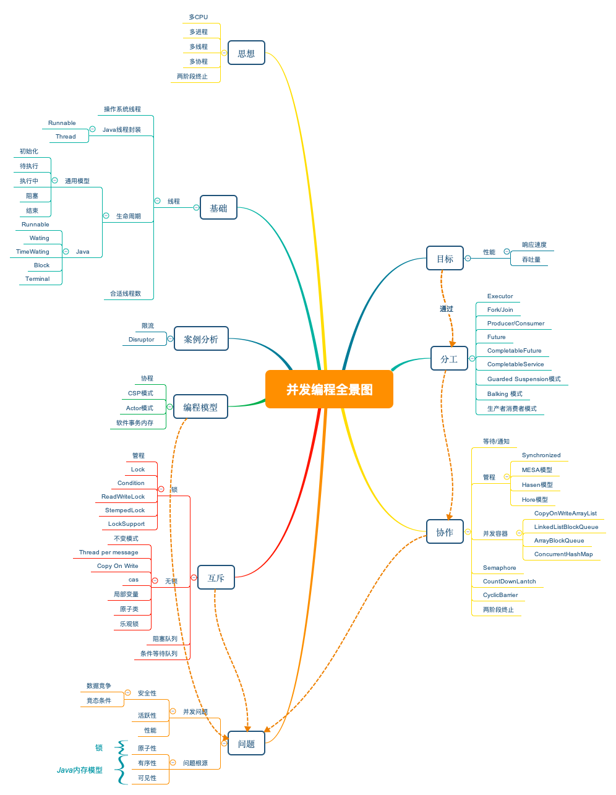

# 极客时间 [Java并发编程实战——全面系统提升你的并发编程能力](https://time.geekbang.org/column/intro/159) 整理

>内容全部整理自 [Java并发编程实战——全面系统提升你的并发编程能力](https://time.geekbang.org/column/intro/159) 专栏。

## 1 第一部分，并发理论基础

- [01-可见性、原子性和有序性问题：并发编程Bug的源头](01-可见性、原子性和有序性问题：并发编程Bug的源头.md)：从硬件的核心矛盾CPU 与内存、I/O 的速度差异，引入引入了可见性、原子性和有序性问题。
- [02-Java内存模型：看Java如何解决可见性和有序性问题](02-Java内存模型：看Java如何解决可见性和有序性问题.md)：Java 针对三大问题提供的方案：Java 内存模型和互斥锁。
- [03-互斥锁](03-互斥锁.md)：如何使用互斥锁。
- [04-解决死锁](04-解决死锁.md)：避免使用互斥锁造成的死锁问题。
- [05-用“等待-通知”机制优化循环等待](05-用“等待-通知”机制优化循环等待.md)：线程之间如何协作。
- [06-安全性、活跃性以及性能问题](06-安全性、活跃性以及性能问题.md)：站在宏观的角度重新审视并发编程相关的概念和理论。
- [07-管程](07-管程.md)：管程，是 Java 并发编程技术的基础，是解决并发问题的万能钥匙。并发编程里两大核心问题——互斥和同步，都可以用管程来解决。
- [08-Java线程](08-Java线程.md)：
  - 线程的生命周期
  - 如何计算合适的线程数
  - 线程内部是如何执行的
- [09-用面向对象思想写好并发程序](09-用面向对象思想写好并发程序.md)：在 Java 语言里，面向对象思想能够让并发编程变得更简单。

## 2 第二部分，并发工具类

并发工具：

- [10-Lock和Condition](10-Lock和Condition.md)
  - 有了 synchronized，为什么还要 Lock/Condition。
  - 可重入锁、可重入函数、公平锁与非公平锁。
  - 同步与异步。
- [11-并发工具](11-并发工具.md)：
  - Semaphore
  - ReadWriteLock
  - StampedLock
  - CountDownLatch
  - CyclicBarrier

并发容器：

- [12-并发容器](12-并发容器.md)
  - 同步容器与并发容器。
  - 分类：List、Map、Set、Queue。

原子类：

- [13-原子类](13-原子类.md)：无锁方案的实现原理——CAS。

线程池框架：

- [14-ThreadPoolExecutor](14-ThreadPoolExecutor.md)：使用生产者-消费者模式实现线程池。
- [15-Futrue](15-Futrue.md)：如何获取任务执行结果。
- [16-CompletableFuture](16-CompletableFuture.md)：Java 在 1.8 版本提供了 CompletableFuture 来支持异步编程。
- [17-CompletionService](17-CompletionService.md)：当需要批量提交异步任务的时候建议你使用 CompletionService。CompletionService 将线程池 Executor 和阻塞队列 BlockingQueue 的功能融合在了一起，能够让批量异步任务的管理更简单。除此之外，CompletionService 能够让异步任务的执行结果有序化，先执行完的先进入阻塞队列，利用这个特性，你可以轻松实现后续处理的有序性，避免无谓的等待，同时还可以快速实现诸如 Forking Cluster 这样的需求。
- [18-ForkJoin](18-ForkJoin.md)：分治算法实现。

总结：

- [19-并发工具总结](19-并发工具总结.md)

## 3 第三部分，并发模式设计

避免共享的设计模式：

- [20-并发设计模式：Immutability模式](20-并发设计模式：Immutability模式.md)
- [21-并发设计模式：Copy-on-Write](21-并发设计模式：Copy-on-Write.md)
- [22-并发设计模式：使用ThreadLocal实现线程本地存储模式](22-并发设计模式：使用ThreadLocal实现线程本地存储模式.md)

多线程版本 IF 的设计模式：

- [23-并发设计模式：保护性暂停](23-并发设计模式：保护性暂停.md)
- [24-并发设计模式：Balking模式](24-并发设计模式：Balking模式.md)

三种最简单的分工模式：

- [25--并发设计模式：Thread-Per-Message](25--并发设计模式：Thread-Per-Message.md)
- [26-并发设计模式：WorkerThread模式](26-并发设计模式：WorkerThread模式.md)
- [28-并发设计模式：生产者消费者模式](28-并发设计模式：生产者消费者模式.md)

优雅终止线程与线程池：

- [27-并发设计模式：两阶段终止模式](27-并发设计模式：两阶段终止模式.md)

总结：

- [29-并发设计模式总结](29-并发设计模式总结.md)

其他并发模型：

- [30-软件并发模型：Actor模型](30-软件并发模型：Actor模型.md)
- [31-软件并发模型：软件事务内存](31-软件并发模型：软件事务内存.md)
- [32-软件并发模型：协程](32-软件并发模型：协程.md)
- [33-软件并发模型：CSP模型](33-软件并发模型：CSP模型.md)

## 思维导图

## 推荐阅读

- 《Java 安全编码标准》
- 《Java 并发编程实战》
- 《Java 并发编程的艺术》
- 《图解 Java 多线程设计模式》
- [Rules](https://wiki.sei.cmu.edu/confluence/display/java/2+Rules)
