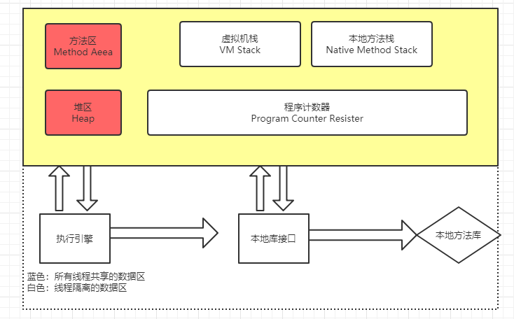
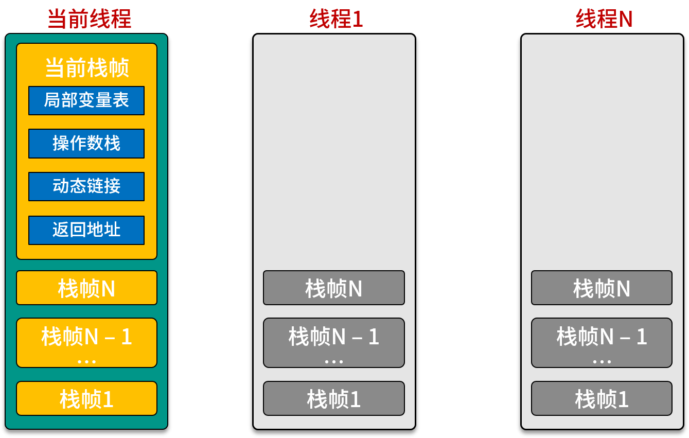
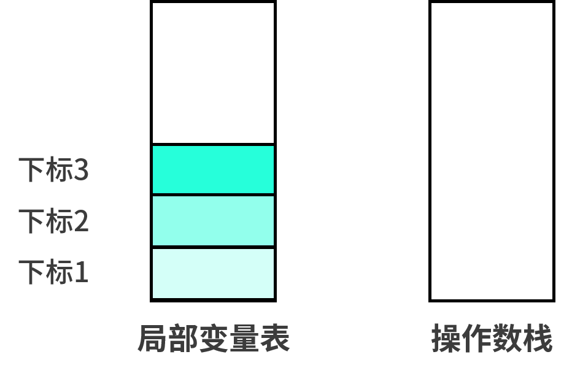

# Java 内存区域与内存异常异常

**Java与C++之间有一堵内存动态分配和垃圾收集技术所围成的高墙，墙外的人想进去，墙外的人想出来** 。

---

## 1 Java内存区域划分

Java虚拟机在执行Java程序的过程中，会把它所管理的内存划分位若干个不同的数据区域，这些区域各有用途、以及创建和销毁的时间，有的区域随着虚拟机进程的启动而存在，有些区域则依赖着用户线程的启动和结束而建立和销毁。

根据《Jav虚拟机规范 SE 7版》的规定，Java虚拟机所管理的内存将会包括以下几个运行时数据区域：



### 1.1 程序计数器

**程序计数器(Program Counter Resister)**是一块较小的内存空间，可以看作是当前线程所执行字节码的的行号指示器。

学过计算机组成原理的人都会知道在 CPU 的寄存器中有一个 PC 寄存器，存放下一条指令地址，这里，虚拟机不使用 CPU 的程序计数器，自己在内存中设立一片区域来模拟 CPU 的程序计数器。只有一个程序计数器是不够的，当多个线程切换执行时，那就单个程序计数器就没办法了，虚拟机规范中指出，**每一条线程都有一个独立的程序计数器**。注意，Java 虚拟机中的程序计数器指向正在执行的字节码地址，而不是下一条。

注意：

1. Java虚拟机规范没有在这个内存区域规定任何的异常。
2. 当一个线程正在执行一个 Java 方法的时候，这个计数器记录的是正在执行的虚拟机字节码指令的地址。如果正在执行的是 Native 方法，这个计数器值则为空（Undefined）。

### 1.2 Java 虚拟机栈

Java虚拟机栈(Java Virtual Machine Stacks)也是线程所私有的，其生命周期与线程的生命周期相同，虚拟机栈描述的是 Java 方法执行的内存模型：每个方法执行的时候都会创建一个**栈帧(Stack Frame)**（我觉得可以把它看作是一个快照，记录下进入方法前的一些参数，实际上是**方法运行时的基础数据结构**），用于存放局部变量表，操作数栈，动态链接，方法出口等信息。**每一个方法从调用直到执行完成的过程都对应着一个栈帧在虚拟机中的入栈到出栈的过程**。我们平时把内存分为堆内存和栈内存，其中的栈内存就指的是虚拟机栈的局部变量表部分。局部变量表存放了编译期可以知道的基本数据类型，对象引用，和返回后所指向的字节码的地址。

局部变量表所需的内存空间在编译期完成分配，**当进入一个方法需要在栈上分配多大的局部变量空间是完全确定的**。在方法的运行期不会改变局部变量表的大小。

Java虚拟机规范在这个区域规定了两种异常状况：

1. 如果线程的栈深度大于虚拟机允许的深度，将抛出 StackOverflowError 异常
2. 如果虚拟机栈可以动态扩展，当扩展到无法申请到足够的内存，就会抛出 OutOfMemoryError 异常

#### 栈帧

栈帧（Stack Frame）是用于支持虚拟机进行方法调用和方法执行的数据结构，每一个线程在执行某个方法时，都会为这个方法创建一个栈帧。我们可以这样理解：一个线程包含多个栈帧，而每个栈帧内部包含**局部变量表、操作数栈、动态连接、返回地址**等。



#### 局部变量表

局部变量表用于存储栈中的变量，调用方法时传递的参数和方法内部声明的布局变量都存储在局部变量表中，在 Java 编译成 class 文件的时候，就会在方法的 Code 属性表中的 max_locals 数据项中，确定该方法需要分配的最大局部变量表的容量。即局部变量表的大小是编译期确定的：

```java
public class Chapter01_Test{

    public static int add(int a) {
        int j  = 1;
        int k = 2;
        return j + k + a;
    }

}
```

对于上面代码，使用 javac 编译后，再使用 javap 查看 class 信息：

```shell
λ javap -v Chapter01_Test.class

  ...
  public static int add(int);
    descriptor: (I)I
    flags: ACC_PUBLIC, ACC_STATIC
    Code:
      stack=2, locals=3, args_size=1
         0: iconst_1
         1: istore_1
         2: iconst_2
         3: istore_2
         4: iload_1
         5: iload_2
         6: iadd
         7: iload_0
         8: iadd
         9: ireturn
      LineNumberTable:
        line 5: 0
        line 6: 2
        line 7: 4
}
SourceFile: "Chapter01_Test.java"
```

可以发现 locals = 3，即局部变量表长度，分别用于存储 a, j, k 三个变量。

#### 操作数栈

操作数栈（Operand Stack）也常称为操作栈，它是一个后入先出栈（LIFO）。同局部变量表一样，操作数栈的最大深度也在编译的时候写入方法的 Code 属性表中的 max_stacks 数据项中。栈中的元素可以是任意 Java 数据类型，当一个方法刚刚开始执行的时候，这个方法的操作数栈是空的。在方法执行的过程中，会有各种字节码指令被压入和弹出操作数栈（比如：iadd 指令就是将操作数栈中栈顶的两个元素弹出，执行加法运算，并将结果重新压回到操作数栈中）。

布局变量表用于存储方法中声明的局部变量和方法参数，而操作数栈用于存储当前操作需要的数据。随着指令执行，操作数栈会不断的出栈也压栈，而局部变量表会不断地被读写。



字节码指令说明：

```java
0: iconst_1    （把常量 1 压入操作数栈栈顶）
1: istore_1    （把操作数栈栈顶的出栈放入局部变量表索引为 1 的位置）
2: iconst_2    （把常量 2 压入操作数栈栈顶）
3: istore_2    （把操作数栈栈顶的出栈放入局部变量表索引为 2 的位置）
4: iload_1     （把局部变量表索引为 1 的值放入操作数栈栈顶）
5: iload_2     （把局部变量表索引为 2 的值放入操作数栈栈顶）
6: iadd        （将操作数栈栈顶的和栈顶下面的一个进行加法运算后放入栈顶）
7: istore_3    （把操作数栈栈顶的出栈放入局部变量表索引为 3 的位置）
8: iload_3     （把局部变量表索引为 3 的值放入操作数栈栈顶）
9: bipush 10   （把常量 10 压入操作数栈栈顶）
11: iadd       （将操作数栈栈顶的和栈顶下面的一个进行加法运算后放入栈顶）
12: ireturn    （结束）
```

#### 返回地址

方法返回的方式有两种：

1. 方法正常执行完毕或者执行到 return 时返回：方法正常退出时，调用者的 PC 计数值可以作为返回地址，栈帧中可能保存此计数值。
2. 方法发生异常返回：方法异常退出时，返回地址是通过异常处理器表确定的，栈帧中一般不会保存此部分信息。

### 1.3 本地方法栈

**`本地方法区`** 与 **`虚拟机栈`** 所发挥的作用很类似，但是要注意一下，虚拟机规范中没有对本地方法区中的方法作强制规定，虚拟机可以自由实现，即可以不是字节码。但是也可以是字节码，这样虚拟机栈和本地方法区就可以合二为一，事实上，`OpenJDK`和`SunJDK`所自带的`HotSpot虚拟机`就直接将虚拟机栈和本地方法区合二为一。

### 1.4 Java 堆

**`堆区`**是理解 Java GC 机制最重要的区域，没有之一。在 JVM 所管理的内存中，堆区是最大的一块，堆区也是 Java GC 机制所管理的主要内存区域，堆区**由所有线程共享**，在虚拟机启动时创建。堆区的存在是为了**存储对象实例**，原则上讲，所有的对象都在堆区上分配内存（不过现代技术里，也不是这么绝对的，也有栈上直接分配的）。

根据 Java 虚拟机规范的规定，Java 堆可以处于物理上不连续的内存空间中，只要逻辑上是连续的即可，当堆中没有足够的内存来完成实例分配时，将会抛出 OutOfMemoryError 异常。

Java 堆进一步划分又可以分为新生代和老边年代，新生代又可以分为 Eden 区和 Survivor 区，这与垃圾回收算法相关。

### 1.5 方法区

**`方法区`** 也是各个线程共享的区域，它用于存储已经被虚拟机加载过的类信息，常量，静态变量，及时编译期编译后的代码（类方法）等数据。

>注意，class 常量与仅使用 final 修饰的变量没有关系，仅使用 final 修饰的变量依然是实例对象的数据，存储在堆中。static 关键字在 Java 里是一种 storage modifier（存储修饰符），它会影响变量的存储种类；final 在 Java 里则不是一种存储修饰符，不影响变量的存储种类。

当虚拟机装载一个 class 文件时，它会从这个 Class 文件包含的二进制数据中解析类型信息，然后把这些类型信息（包括类信息、常量、静态变量等）放到方法区中，该内存区域被所有线程共享。

#### 永久区 和 metaspace 是方法区的一种实现

1. 方法区是 JVM 规范中规定的一块区域，但是并不是实际实现，切忌将规范跟实现混为一谈，不同的 JVM 厂商可以有不同版本的“方法区”的实现。
2. HotSpot 在 JDK 1.7 以前使用“永久区”（或者叫 Perm 区）来实现方法区，在 JDK 1.8 之后“永久区”就已经被移除了，取而代之的是一个叫作“元空间（metaspace）”的实现方式。

方法区是规范，每种虚拟机都可以有自己的实现，而永久区或元空间就是一种实现。

#### 运行时常量池

运行时常量池是方法区的一部分

Java 中的常量池，实际上分为两种形态：**静态常量池**和**运行时常量池**。

- 所谓**静态常量池**，即`*.class`文件中的常量池，Class 文件中的除了有类的版本、方法、字段、接口等描述信息外，还有一项信息是常量池，用于存放编译期生成的各种字面量和符号引用，这部分内存将在类加载后进入方法区的运行时常量池进行存放。
- 而**运行时常量池**，则是 jvm 虚拟机在完成类装载操作后，将 class 文件中的常量池载入到内存，并保存在**方法区**中，我们常说的常量池，就是指方法区中的运行时常量池。

运行时常量池相对于 Class 文件的另外一个重要的特征是具备动态性，运行期间也可以将新的常量放入池中，比如 String 的 `intern()` 方法。

**关于intern方法**：

- 在 JDK1.6 中：intern 方法会把首次遇到的字符串实例复制到永久代中去，返回的也是永久代中这个字符串实例的引用。
- 在 JDK1.7 中(以及部分虚拟机实现)：intern 方法不会再复制实例，只是在常量池中记录首次出现的实例引用。

>除了字符串常量池，还有整型常量池、浮点型常量池等等，但都大同小异，只不过数值类型的常量池不可以手动添加常量，**程序启动时常量池中的常量就已经确定了**，比如整型常量池中的常量范围：-128~127，只有这个范围的数字可以用到常量池。

当方法区的常量池无法再申请到更多的内存时会抛出 OutOfMemoryError 异常

### 1.6 直接内存

在 JDK1.4 版本中加入了 NIO 类，引入了基于通道（Channel）与缓冲区（Buffer）的 I/O 方式，也就是说通过这种方式，不会在运行时数据区域分配内存，这样就避免了在运行时数据区域来回复制数据，直接调用外部内存。虽然不受 Java 虚拟机内存分配的限制，但是还是会受到本机总内存大小的限制，所以也有可能发生 OutOfMemoryError 异常。

---

## 2 JVM 内存划分与计算机内存架构

### 2.1 Java 内存模型

Java内存模型将内存分为`共享内存`和`本地内存`。共享内存又称为堆内存，指的就是线程之间共享的内存，包含所有的**实例域、静态域和数组元素**。而每个线程都有一个私有的，只对自己可见的内存，称之为**本地内存**。本地内存涵盖：缓存、写缓冲区、寄存器以及其他的硬件和编译器优化。所有线程拥有的资源是由 cpu 分配的

### 2.2 JVM 中内存划分与实际的计算机系统内存架构有何关联

#### 什么是内存模型

多处理器系统中，处理器都会有多级缓存，就像前面说的这些高速缓存离处理器很近并且可以存储一部分数据，所以高速缓存可以改善处理器获取数据的速度和减少对共享内存数据总线的占用。虽然缓存能极大的提高性能，但是同时也带来了挑战。比如：当两个处理器同时操作同一个内存地址的时候，该如何处理？这两个处理器在什么条件下才能看到相同的值？

而内存模型就是：**定义一些充分必要的规范，这些规范使得其他处理器对内存的写操作对当前处理器可见，或者当前处理器的写操作对其他处理器可见。**

#### Java 内存模型和操作系统内存模型的关系

JMM源于物理机器 CPU 架构的内存模型，最初用于解决 MP (多处理器架构)系统中的缓存一致性问题，**而 JVM 为了屏蔽各个硬件平台和操作系统对内存访问机制的差异化**，提出了 JMM 的概念。

JMM 规定了所有的变量都存储在主内存（Main Memory）中。每个线程还有自己的工作内存（Working Memory），线程的工作内存中保存了该线程使用到的变量的主内存的副本拷贝，线程对变量的所有操作（读取、赋值等）都必须在工作内存中进行，而不能直接读写主内存中的变量。不同的线程之间也无法直接访问对方工作内存中的变量，线程之间值的传递都需要通过主内存来完成。

JMM 只是一个规范，与实际的操作系统内存模型并没有直接的关系，Java 中的线程如何访问内存是由 JVM 根据 JMM 规范实现的，JVM 屏蔽了各个硬件平台和操作系统中 Java 线程对内存访问机制的差异化，Java 线程中的本地内存是概念上的东西。它既可以在 CPU 寄存器和缓存中，也可以在物理主内存中。当然 JVM 会根据各种内存区域的特点来优化各种内存分配。

- JMM 是 Java 内存模型。
- JVM 中是实现了 JMM 规范，把内存分成各个区域。
- JVM 屏蔽各个硬件平台和操作系统对内存访问机制的差异化


## 引用

- 《深入理解Java虚拟机：JVM高级特性与最佳实践》
- [触摸常量池](http://www.cnblogs.com/iyangyuan/p/4631696.html)
- [Java的永久代去哪了](http://www.infoq.com/cn/articles/Java-PERMGEN-Removed)
- [Java Memory Model](http://tutorials.jenkov.com/java-concurrency/java-memory-model.html#javas-logic-memory-model)
- [程序运行时，内存到底是如何进行分配的](https://kaiwu.lagou.com/course/courseInfo.htm?courseId=67#/detail/pc?id=1855)
