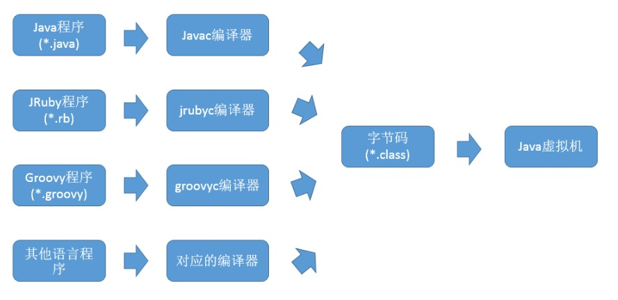
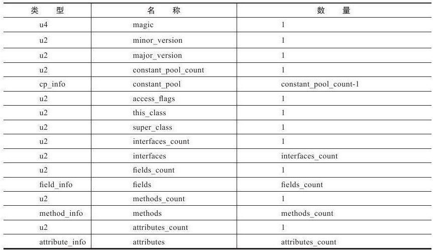

# 类文件结构

>代码编译的结果从本地机器码转变为字节码，是存储格式发展的一小步，却是编程语言发展的一大步。

---
## 1 无关性的基石

Java 诞生之初层提出一个著名的口号：**Write Once, Run Anywhere**，Java虚拟机一开始就不是与 Java语言绑定的，1997 年Java语言发布第一版时，Java虚拟机规范中就承诺过：**在未来，我们会对Java虚拟机进行适当的扩展，以便更好的支持其他语言运行在JVM之上。**当虚拟机发展到 `JDK 1.7-1.8` 的时候，JVM 设计者通过 JSR- 292 基本兑现了这个承诺。时至今日，商业机构和开源机构已经在Java语言之外发展了一大批在 Java虚拟机之上运行的语言，比如Clojure、Groovy、JRuby、Jython、Scala等。



**实现语言无关性的基础仍然是虚拟机和字节码存储格式**。Java 虚拟机不和包括 Java 在内的任何语言绑定，它只与 Class文件这种特定的二进制文件格式所关联。可以将其他的语言编译成 class文件，这样就可以实现 JVM 的多语言支持。**Java语言中的各种变量、关键字和运算符的语义最终都是由多条字节码命令组合而成的**，因此字节码命令所能提供的语义描述能力肯定会比Java语言本身更加强大。因此有一些Java语言不支持的语言特性不代表字节码本身无法有效支持。

---
## 2 Class类文件的结构

任何一个 Class 文件都对应着唯一一个类或接口的定义信息，但反过来说，类或接口并不一定都得定义在文件里（动态生成的类），**Class 文件是一组以 8 位字节为基础单位的二进制流。**

根据 Java 虚拟机规范的规定， Class 文件格式采用一种类似于 C 语言结构体的伪结构来存储数据，这种伪结构中只有两种数据类型：**无符号数和表**，后面的解析都要以这两种数据类型为基础。



- 无符号数：属于基本数据类型，以`u1、u2、u4、u8`来分别表示一个字节、两个字节、四个字节、八个字节的无符号数，无符号数可以描述数字、索引引用、数量值或按照UTF-8编码构成的字符串值。
- 表：有多个无符号数或其他表作为数据项的符合数据类型，所有表都习惯性以 `_info`结尾。

Class类文件的结构结构包括：
- 模式与Class文件版本
- 常量池
    - 类和即可的全限定类名(Full Qualified Name)
    - 字段的名称和描述符(Descriptor)
    - 方法的名称和描述符
- 访问标志
- 类索引、父类索引与接口所索引集合
- 字段表集合
- 方法表集合
- 属性表集合


---
## 3 字节码指令简介

Java虚拟机指令是由（占用一个字节长度、代表某种特定操作含义的数字）操作码Opcode，以及跟随在其后的零至多个代表此操作所需参数的称为操作数 Operands 构成的。由于Java虚拟机是面向操作数栈而不是寄存器的架构，所以大多数指令没有操作数，只有一个操作码。

字节码指令集是一种具有鲜明特点、优劣势都很突出的指令集架构：

1. 由于限定了Java虚拟机操作码的长度为1个字节，指令集的操作码不能超过256条。
2. Class文件格式放弃了编译后代码中操作数长度对齐，这就意味者虚拟机处理那些超过一个字节数据的时候，不得不在运行的时候从字节码中重建出具体数据的结构。这种操作在某种程度上会造成解释执行时损失一些性能。但这样做的优势也非常的明显：
    - 放弃了操作数长度对齐，就意味着可以省略很多填充和间隔符号
    - 用一个字节来表示操作码，也是为了获取短小精悍的代码。

如果不考虑异常处理，那么 Java虚拟机的解释执行可以使用下面这个伪代码当作最基本的执行模型来理解：

```
    do{  
        计算PC寄存器的值+1;  
        根据PC寄存器只是位置，从字节码流中取出操作码;  
        if(存在操作数) 从字节码中取出操作数;  
        执行操作码定义的操作;  
    }while(字节码长度>0);  
```

### 字节码与数据类型

在Java虚拟机指令集中，大多数的指令都包含了其操作所对应的数据类型信息。例如，`iload` 指令用于从局部变量表中加载 int 型的数据到操作数栈中。与之类似的还有 `fload`，对于大部分与数据类型修改的字节码指令，它们的操作码助记符中都由特殊的字符表示专门为哪种类型服务，i->int、l->long、s->short、b->byte、c->char、f->float、d->double、a->reference。

由于虚拟机操作码长度只有一个字节，所以包含了数据类型的操作码就为指令集的设计带来了很大的压力：如果每一种数据类型相关的指令都支持Java虚拟机所有运行时数据类型的话，那指令集的数据就会超过256个了。因此虚拟机只提供了有限的指令集来支持所有的数据类型。

如load 操作， 只有`iload、lload、fload、dload、aload`用来支持int、long、float、double、reference 类型的入栈，而对于 boolean 、byte、short 和char 则没有专门的指令来进行运算。编译器会在编译期或运行期将 byte 和 short 类型的数据带符号扩展为 int 类型的数据，将 boolean 和 char 类型的数据零位扩展为相应的int 类型数据。与之类似，在处理 boolean、byte、short 和 char 类型的数组时，也会发生转换。因此，大多数对于boolean、byte、short 和char 类型数据的擦操作，实际上都是使用相应的int 类型作为运算类型。

### 加载和存储指令

加载和存储指令用于将数据从栈帧的局部变量表和操作数栈之间来回传输。

- 将一个局部变量加载到操作数栈的指令包括：`iload、iload_<n>、lload、lload_<n>、float、 fload_<n>、dload、dload_<n>、aload、aload_<n>`
- 将一个数值从操作数栈存储到局部变量表的指令：`istore、istore_<n>、lstore、lstore_<n>、fstore、fstore_<n>、dstore、dstore_<n>、astore、astore_<n>`
- 将常量加载到操作数栈的指令：`bipush、sipush、ldc、ldc_w、ldc2_w、aconst_null、iconst_ml、iconst_<i>、lconst_<l>、fconst_<f>、dconst_<d>`
- 局部变量表的访问索引指令：`wide`

一部分以尖括号结尾的指令代表了一组指令、如`iload_<i>`，代表了`iload_0、iload_1`等，这几组指令都是带有一个操作数的通用指令。

### 运算指令

算术指令用于对两个操作数栈上的值进行某种特定运算，并把结果重新存入到操作栈顶。

- 加法指令：`iadd、ladd、fadd、dadd`
- 减法指令：`isub、lsub、fsub、dsub`
- 乘法指令：`imul、lmul、fmul、dmul`
- 除法指令：`idiv、ldiv、fdiv、ddiv`
- 求余指令：`irem、lrem、frem、drem`
- 取反指令：`ineg、leng、fneg、dneg`
- 位移指令：`ishl、ishr、iushr、lshl、lshr、lushr`
- 按位或指令：`ior、lor`
- 按位与指令：`iand、land`
- 按位异或指令：`ixor、lxor`
- 局部变量自增指令：`iinc`
- 比较指令：`dcmpg、dcmpl、fcmpg、fcmpl、lcmp`

### 类型转换指令

类型转换指令将两种Java虚拟机数值类型相互转换，这些操作一般用于实现用户代码的显式类型转换操作。

JVM直接支持宽化类型转换(小范围类型向大范围类型转换)：

- int 类型到 long、float、double 类型
- long 类型到 float、double 类型
- float  到 double 类型

但在处理窄化类型转换时，必须显式使用转换指令来完成，这些指令包括：`i2b、i2c、i2s、l2i、f2i、f2l、d2i、d2l和 d2f`。将int 或 long 窄化为整型T的时候，仅仅简单的把除了低位的N个字节以外的内容丢弃，N是T的长度。这有可能导致转换结果与输入值有不同的正负号。在将一个浮点值窄化为整数类型T（仅限于 int 和 long 类型），将遵循以下转换规则：

- 如果浮点值是 NaN ， 呐转换结果就是 int 或 long 类型的 0
- 如果浮点值不是无穷大，浮点值使用 IEEE 754 的向零舍入模式取整，获得整数 v， 如果 v 在 T 表示范围之内，那就过就是 v
- 否则，根据 v 的符号， 转换为 T 所能表示的最大或者最小正数


### 对象创建与访问指令

虽然类实例和数组都是对象，Java虚拟机对类实例和数组的创建与操作使用了不同的字节码指令。这些指令如下：

- 创建实例的指令：`new`
- 创建数组的指令：`newarray、anewarray、multianewarray`
- 访问字段指令：`getfield、putfield、getstatic、putstatic`
- 把数组元素加载到操作数栈指令：`baload、caload、saload、iaload、laload、faload、daload、aaload`
- 将操作数栈的数值存储到数组元素中执行：`bastore、castore、castore、sastore、iastore、fastore、dastore、aastore`
- 取数组长度指令：`arraylength`
- 检查实例类型指令：`instanceof、checkcast`

### 操作数栈管理指令

如同操作一个普通数据结构中的堆栈那样，Java 虚拟机提供了一些用于直接操作操作数栈的指令，包括：

- 将操作数栈的栈顶一个或两个元素出栈：`pop、pop2`
- 复制栈顶一个或两个数值并将复制值或双份的复制值重新压入栈顶：`dup、dup2、dup_x1、dup2_x1、dup_x2、dup2_x2`
- 将栈最顶端的两个数值互换：`swap`

### 控制转移指令

控制转移指令可以让JVM有条件或无条件**从指定指令**而**不是控制转移指令的下一条指令**继续执行程序。控制转移指令包括：

- 条件分支：`ifeq、iflt、ifle、ifne、ifgt、ifge、ifnull、ifnotnull、if_cmpeq、if_icmpne、if_icmlt、if_icmpgt、if_cmple、if_icmpge、if_acmpeq、if_acmpne`
- 复合条件分支：`tableswitch、lookupswitch`
- 无条件分支：`goto、goto_w、jsr、jsr_w、ret`

在JVM中有专门的指令集处理int和reference类型的条件分支比较操作，为了可以无明显标示一个实体值是否是null，有专门的指令检测null 值。与算术运算符规则一致，boolean类型和byte类型，char类型和short类型的条件分支比较操作，都使用int类型的比较指令完成，而 long、float、double条件分支比较操作，由相应类型的比较运算指令，运算指令会返回一个整型值到操作数栈中，随后再执行int类型的条件比较操作完成整个分支跳转。各种类型的比较都最终会转化为int类型的比较操作。

### 方法调用和返回指令

- `invokevirtual`指令用于调用对象的实例方法，根据对象的实际类型进行分派(虚拟机分派)。
- `invokeinterface`指令用于调用接口方法，在运行时搜索一个实现这个接口方法的对象，找出合适的方法进行调用。
- `invokespecial`指令用于调用需要特殊处理的实例方法，包括实例初始化方法，私有方法和父类方法
- `invokestatic`指令用于调用类方法(static)
- `invokeddynamic`指令用于在运行时期动态解析出调用点限定符所引用的方法，并执行该方法。
- 方法返回指令是根据返回值的类型区分的，包括 `ireturn(返回值是boolean、byte、char、short 和 int时使用)、lreturn、freturn、drturn和areturn`，另外一个 `return` 供 void 方法、实例初始化方法和类和接口的类初始化方法使用。

### 异常处理指令

在 Java 程序中显式抛出异常的操作（throw语句）都由 `athrow` 指令来实现，除了用 throw 语句显示抛出异常情况外，Java虚拟机规范还规定了许多运行时异常会在其他Java虚拟机指令检测到异常状况时自动抛出。在Java虚拟机中，处理异常（catch语句）不是由字节码指令来实现的，而是采用异常表来完成的。

### 同步指令

Java虚拟机可以支持方法级别的同步和方法内部一段指令序列的同步，这两种同步结构都是使用管程（Monitor）来支持的。

方法级的同步是隐式的，无需通过字节码指令来控制，它实现在方法调用和返回操作中。虚拟机从方法常量池中的方法标结构中的 `ACC_SYNCHRONIZED` 标志区分是否是同步方法。方法调用时，调用指令会检查该标志是否被设置，若设置，执行线程持有moniter，然后执行方法，最后完成方法时释放moniter。

同步一段指令集序列，通常由 `synchronized` 块标示，JVM指令集中有 `monitorenter` 和 `monitorexit` 来支持 synchronized 语义。结构化锁定是指方法调用期间每一个 monitor 退出都与前面 monitor 进入相匹配的情形。正确实现 synchronized 关键字需要javac编译器与Java虚拟机两者共同协作支持，编译器必须包装无论通过何种方法，方法中调用过的每条 `monitorenter` 指令都必须执行与其对于的 `monitorexit`指令，无论这个方法是否正常结束。参考下面代码：

```
public class Test{

    void onlyMe(Object o){
        synchronized(o){
            doSomething();
        }
    }

    void doSomething(){

    }

}
```
使用 `javap -c -v`反编译后，onlyMe的指令如下：

```
void onlyMe(java.lang.Object);
    descriptor: (Ljava/lang/Object;)V
    flags:
    Code:
      stack=2, locals=4, args_size=2
         0: aload_1        //o入栈
         1: dup        //赋值栈顶元素，即o的引用
         2: astore_2    //将栈顶元素存储到局部变量表 Slot2 中
         3: monitorenter    //以栈顶元素o为锁，开始同步
         4: aload_0        //将栈顶元素 Slot0 (即this) 的元素入站
         5: invokevirtual #2                  // Method doSomething:()V     //调用doSomething方法
         8: aload_2        //将局部变量表中 Slot2 的元素（即o的引用)入栈
         9: monitorexit        //退出同步
        10: goto          18    //方法正常结束，跳到18行
        13: astore_3    //从这步开始是异常路径
        14: aload_2        //将局部变量表中 Slot2 的元素（即o的引用)入栈
        15: monitorexit        //退出同步
        16: aload_3        //将局部变量表中 Slot3 的元素（即异常对象)入栈
        17: athrow        //将异常对象重新抛出给onlyMe发的调用者
        18: return        //方法正常返回
      Exception table:
         from    to  target type
             4    10    13   any
            13    16    13   any
```


---
## 4 共有设计和私有实现

只要优化后 Class 文件依然可以被正确读取，并且包含在其中的语义能得到完整的保持，那实现者就可以选择任何方式去实现这些语义，虚拟机后台如何处理 Class 文件完全是实现者自己的事情，只要它在外部接口上看起来与规范描述的一致即可。

---
## 5 Class文件结构的发展

Class文件几乎没有变过，Class文件格式所具备的平台中立（不依赖于特定硬件及操作系统）、紧凑、稳定和可扩展的特点，是Java技术体系实现平台无关、语言无关两项特性的重要支柱。

---
## 6 常见字节码指令说明

参考下面代码：

```
public class Test{

    public static final String CONST_S1 = "CONST_S1";

    private int mIntA = 21;

    public static void main(String[] args) {
            new Test().start();
    }

    public void start(){
        int a = 1 + 1;
        System.out.println(a);
    }

    public int add(int a,int b){
        return a+b;
    }

    public int getIntA(){
        return mIntA;
    }

    public String getConstS1(){
        return CONST_S1;
    }

}
```

通过 javac 然后 javap -c 命名后，查看反编译的代码如下：

```
public class Test {
  public static final java.lang.String CONST_S1;

  public Test();
    Code:
       0: aload_0
       1: invokespecial #1                  // Method java/lang/Object."<init>":()V
       4: aload_0
       5: bipush        21
       7: putfield      #2                  // Field mIntA:I
      10: return

  public static void main(java.lang.String[]);
    Code:
       0: new           #3                  // class Test
       3: dup
       4: invokespecial #4                  // Method "<init>":()V
       7: invokevirtual #5                  // Method start:()V
      10: return

  public void start();
    Code:
       0: iconst_2
       1: istore_1
       2: getstatic     #6                  // Field java/lang/System.out:Ljava/io/PrintStream;
       5: iload_1
       6: invokevirtual #7                  // Method java/io/PrintStream.println:(I)V
       9: return

  public int add(int, int);
    Code:
       0: iload_1
       1: iload_2
       2: iadd
       3: ireturn

  public int getIntA();
    Code:
       0: aload_0
       1: getfield      #2                  // Field mIntA:I
       4: ireturn

  public java.lang.String getConstS1();
    Code:
       0: ldc           #8                  // String CONST_S1
       2: areturn
}
```

反编译的结果就是 Java的字节码指令，这些指令都有特殊的意义，有的指令后面需要操作参数，有的指令不需要操作参数。在 Java 中每一个方法在执行的时候 JVM 都会为其分配一个**栈帧**，栈帧用来存储方法中计算所需要的所有数据。其中第 0 个元素就是 this，如果方法有参数传入会排在它的后面。而JVM 通过字节码指令操作栈帧中的数据。下面是一些指令说明：

- **aload_0** 指令是 load系列指令中的一个，它的意思表示装载局部变量表中第 0 个中的元素到栈中。代码上相当于 this。这个数据元素的类型是一个引用类型。
- **invokespecial** 指令是调用系列指令中的一个。其目的是调用对象类的方法。该指令后面需要方法完整签名。比如`#4`的意思是引用 .class 文件常量表中第4个元素。
- **getstatic** 指令是GET系列指令中的一个，其作用是获取静态字段内容并推到堆栈中。这一系列指令包括了：`getfield、getstatic`。分别用于获取动态字段和静态字段。
- **idc** 指令的功能是从常量表中装载一个数据到堆栈中。
- **invokevirtual** 是一种调用指令，这个指令区别与 invokespecial 的是它是根据引用调用对象类的方法。具体参考虚拟机的方法调用机制

其他指令的作用可以参考[JVM虚拟机字节指令表](https://segmentfault.com/a/1190000008722128)