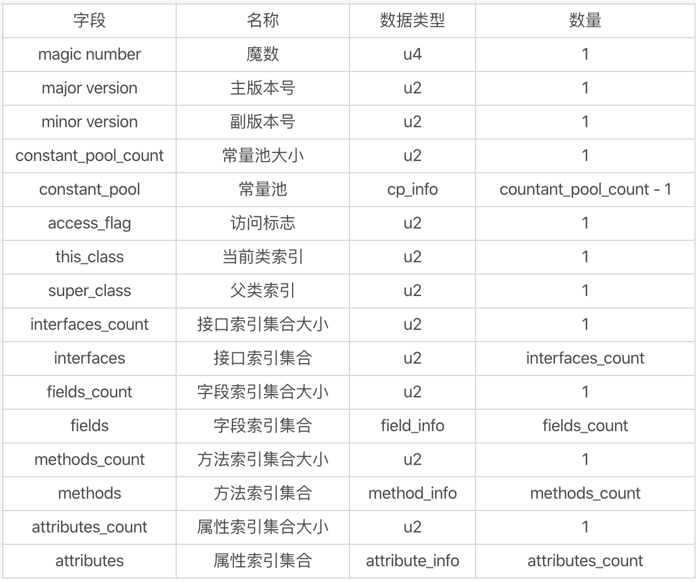
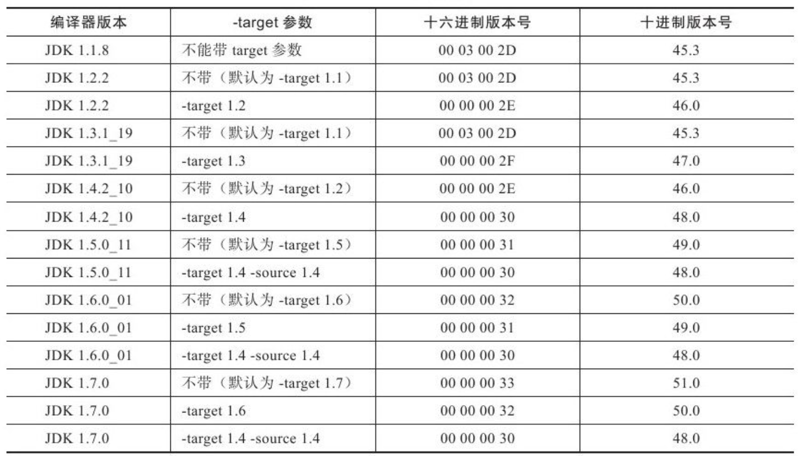

# 类文件结构

>代码编译的结果从本地机器码转变为字节码，是存储格式发展的一小步，却是编程语言发展的一大步。

---

## 1 无关性的基石

Java 诞生之初层提出一个著名的口号：**Write Once, Run Anywhere**，Java虚拟机一开始就不是与 Java 语言绑定的，1997 年 Java 语言发布第一版时，Java 虚拟机规范中就承诺过：**在未来，我们会对 Java 虚拟机进行适当的扩展，以便更好的支持其他语言运行在 JVM 之上**。当虚拟机发展到 `JDK 1.7-1.8` 的时候，JVM 设计者通过 JSR-292 基本兑现了这个承诺。时至今日，商业机构和开源机构已经在 Java 语言之外发展了一大批在 Java 虚拟机之上运行的语言，比如 Clojure、Groovy、JRuby、Jython、Scala 等。


**实现语言无关性的基础仍然是虚拟机和字节码存储格式**。Java 虚拟机不和包括 Java 在内的任何语言绑定，它只与 Class 文件这种特定的二进制文件格式所关联。可以将其他的语言编译成 class 文件，这样就可以实现 JVM 的多语言支持。**Java 语言中的各种变量、关键字和运算符的语义最终都是由多条字节码命令组合而成的**，因此字节码命令所能提供的语义描述能力肯定会比 Java 语言本身更加强大。因此有一些 Java 语言不支持的语言特性不代表字节码本身无法有效支持。

---

## 2 Class类文件的结构

任何一个 Class 文件都对应着唯一一个类或接口的定义信息，但反过来说，类或接口并不一定都得定义在文件里（动态生成的类），**Class 文件是一组以 8 位字节为基础单位的二进制流**。

根据 Java 虚拟机规范的规定， Class 文件格式采用一种类似于 C 语言结构体的伪结构来存储数据，这种伪结构中只有两种数据类型：**无符号数和表**，后面的解析都要以这两种数据类型为基础。

- 无符号数：属于基本数据类型，以`u1、u2、u4、u8`来分别表示一个字节、两个字节、四个字节、八个字节的无符号数，无符号数可以描述数字、索引引用、数量值或按照 UTF-8 编码构成的字符串值。
- 表：有多个无符号数或其他表作为数据项的符合数据类型，所有表都习惯性以 `_info`结尾。（这说明一张表内可用包含另一张表）

Class 类文件的结构结构包括：

- 魔术与Class文件版本
- 常量池
  - 类和接口的全限定类名(Full Qualified Name)
  - 字段的名称和描述符(Descriptor)
  - 方法的名称和描述符
- 访问标志
- 类索引、父类索引与接口所索引集合
- 字段表集合
- 方法表集合
- 属性表集合

这些结构按照预先规定好的顺序紧密的从前向后排列，相邻的项之间没有任何间隙。

当 JVM 加载某个 class 文件时，JVM 就是根据上图中的结构去解析 class 文件，加载 class 文件到内存中，并在内存中分配相应的空间。具体某一种结构需要占用大多空间，可以参考下图：



下面以 Test.java 类进行分析：

```java
import java.io.Serializable;

public class Test implements Serializable, Cloneable{
      private int num = 1;

      public int add(int i) {
          int j = 10;
          num = num + i;
          return num;
     }
}
```

被编译之后的 class 数据如下（以 16 进制展示）：

```binary
cafe babe 0000 0034 0017 0a00 0400 1109
0003 0012 0700 1307 0014 0700 1507 0016
0100 036e 756d 0100 0149 0100 063c 696e
6974 3e01 0003 2829 5601 0004 436f 6465
0100 0f4c 696e 654e 756d 6265 7254 6162
6c65 0100 0361 6464 0100 0428 4929 4901
000a 536f 7572 6365 4669 6c65 0100 0954
6573 742e 6a61 7661 0c00 0900 0a0c 0007
0008 0100 1b63 6f6d 2f7a 7469 616e 792f
6261 7369 632f 7072 696e 742f 5465 7374
0100 106a 6176 612f 6c61 6e67 2f4f 626a
6563 7401 0014 6a61 7661 2f69 6f2f 5365
7269 616c 697a 6162 6c65 0100 136a 6176
612f 6c61 6e67 2f43 6c6f 6e65 6162 6c65
0021 0003 0004 0002 0005 0006 0001 0002
0007 0008 0000 0002 0001 0009 000a 0001
000b 0000 0026 0002 0001 0000 000a 2ab7
0001 2a04 b500 02b1 0000 0001 000c 0000
000a 0002 0000 0005 0004 0007 0001 000d
000e 0001 000b 0000 0032 0003 0003 0000
0012 100a 3d2a 2ab4 0002 1b60 b500 022a
b400 02ac 0000 0001 000c 0000 000e 0003
0000 000a 0003 000b 000d 000c 0001 000f
0000 0002 0010
```

### 魔数与Class文件的版本

每个 Class 文件的头 4 个字节称为魔数（Magic Number），**它的唯一作用是确定这个文件是否为一个能被虚拟机接受的 Class 文件**。很多文件存储标准中都使用魔数来进行身份识别，譬如图片格式，如 gif 或者 jpeg 等在文件头中都存有魔数。使用魔数而不是扩展名来进行识别主要是基于安全方面的考虑，因为文件扩展名可以随意地改动。Java Class 文件的魔数就是 `cafe babe`，很多人称其为“咖啡宝贝”。

魔数之后的 4 个字节存储的是 Class 文件的版本号：第 5 和第 6 个字节是次版本号（Minor Version），第 7 和第 8 个字节是主版本号（Major Version）。这里 Class 文件版本号为 `0000 0034`，对应的十进制值为 52，也就是说当前 class 文件的主版本号为 52，次版本号为 0。所以综合版本号是 52.0，也就是  jdk1.8.0。（参考下图），JDK 中会记录支持运行 Class 的最高版本，如果 Class 的版本比 JDK 还要大，JDK 就会拒绝执行该 Class 文件。

Java的版本号是从 45 开始的：



### 常量池

紧接着主次版本号之后的是常量池入口，常量池可以理解为 Class 文件之中的资源仓库，它是 Class 文件结构中与其他项目关联最多的数据类型，也是占用 Class 文件空间最大的数据项目之一。

在常量池中保存了类的各种相关信息，比如类的名称、父类的名称、类中的方法名、参数名称、参数类型等，这些信息都是以各种表的形式保存在常量池中的。常量池中主要存放两大类常量：

1. 字面量（Literal）:类似 Java 语言层面的常量概念，如`文本字符串`、`声明为final的常量值`等。
2. 符号引用（Symbolic References）：
   1. 包括：类和接口的全限定名（Fully Qualified Name）、字段的名称和描述符（Descriptor）、方法的名称和描述符。
   2. 符号引用属于编译原理方面的概念，虚拟机加载 Class 文件的时候是进行动态连接的，虚拟机运行时，需要从常量池获得对应的符号引用，再在类创建时或运行时解析、翻译到具体的内存地址之中。

到目前为止，JDK 中一共定义了 14 种常量，如下表所示，这 14 种表都有一个共同的特点，就是表开始的第一位是一个 u1 类型的标志位，代表当前这个常量属于哪种常量类型：


#### constant_pool_count

class 中常量数量是不确定的，所以需要一个类似 header 的数据来描述常量池的长度，这个数据就是 constant_pool_count，紧跟在版本号之后，单位为 u2，需要注意的是这个容量计数是从 1 而不是 0 开始的。

>设计者将第 0 项常量空出来是有特殊考虑的，这样做的目的在于满足后面某些指向常量池的索引值的数据在特定情况下需要表达“不引用任何一个常量池项目”的含义，这种情况就可以把索引值置为 0 来表示。

对应到 Test.class，constant_pool_count 为 `0017`，换算成 10 进制即 23，这说明常量池中有 22 项常量，索引从 1-22。

#### 常量结构

JDK 定义的 14 种常量类型各自均有自己的结构，比如 CONSTANT_Class_info 的结构如下：

```java
table CONSTANT_Class_info {
    //标识位：占用一个字节大小。比如值为 7，说明是 CONSTANT_Class_info 类型表
    u1  tag = 7;
    //指是一个索引值，可以将它理解为一个指针，指向常量池中索引为 name_index 的常量表。比如 name_index = 2，则它指向常量池中第 2 个常量。
    u2  name_index;
}
```

CONSTANT_Utf8_info 的结构如下：

```java
table CONSTANT_utf8_info {
    //标识位：值为1，表示是 CONSTANT_Utf8_info 类型表。
    u1  tag;
    //length 表示 u1[] 的长度，比如 length=5，则表示接下来的数据是 5 个连续的 u1 类型数据。
    u2  length;
    //u1 类型数组，长度为上面第 2 个参数 length 的值。
    u1[] bytes;
}
```

java 代码中声明的 String 字符串在 class 种就是使用 `table CONSTANT_utf8_info` 表示的，其最长长度为 2 个字节，即 65536 个，由于需要两个字节来表示 null 值，所以我们编写 java 代码时，支持的最长字符串长度为 65534 字节。

>其他常量具体结构可参考[《Java虚拟机规范》](http://icyfenix.iteye.com/) 滴 4 章第 4 节。

#### 常量解析

constant_pool_count 之后就是常量数据了，第一个常量的 tag 为 `0a`，换算成 10 进制就是 10，查表可知其表示一个 CONSTANT_Methodref_info，而 CONSTANT_Methodref_info 的结构如下：

```java
CONSTANT_Methodref_info {
    u1 tag = 10;
    //指向此方法的所属类
    u2 class_index;
    //指向此方法的名称和类型
    u2 name_type_index;
}
```

`0a`之后的 u2 数据为 `00 04`，表示我们需要去找第 4 个常量，在之后就是 `0011`，表示我们需要去找第 11 个常量。

通过 javap 命令，我们可以清晰地查看 class 文件中的常量：

```java
Constant pool:
   #1 = Methodref          #4.#17         // java/lang/Object."<init>":()V
   #2 = Fieldref           #3.#18         // com/ztiany/basic/print/Test.num:I
   #3 = Class              #19            // com/ztiany/basic/print/Test
   #4 = Class              #20            // java/lang/Object
   #5 = Class              #21            // java/io/Serializable
   #6 = Class              #22            // java/lang/Cloneable
   #7 = Utf8               num
   #8 = Utf8               I
   #9 = Utf8               <init>
  #10 = Utf8               ()V
  #11 = Utf8               Code
  #12 = Utf8               LineNumberTable
  #13 = Utf8               add
  #14 = Utf8               (I)I
  #15 = Utf8               SourceFile
  #16 = Utf8               Test.java
  #17 = NameAndType        #9:#10         // "<init>":()V
  #18 = NameAndType        #7:#8          // num:I
  #19 = Utf8               com/ztiany/basic/print/Test
  #20 = Utf8               java/lang/Object
  #21 = Utf8               java/io/Serializable
  #22 = Utf8               java/lang/Cloneable
```

### 其他结构

在常量池之后，还有很多数据，其中包括：

1. 访问标志。
2. 类索引、父类索引与接口索引集合。
3. 字段表集合。
4. 方法表集合。
5. 属性表集合：
   - Code 属性：Java程序方法体中的代码经过Javac编译器处理后，最终变为字节码指令存储在Code属性内。
   - Exceptions 属性：是在方法表中与Code属性平级的一项属性。
   - LineNumberTable 属性：用于描述Java源码行号与字节码行号（字节码的偏移量）之间的对应关系。它并不是运行时必需的属性，但默认会生成到Class文件之中，可以在Javac中分别使用`-g:none`或`-g:lines`选项来取消或要求生成这项信息。
   - LocalVariableTable 属性：用于描述栈帧中局部变量表中的变量与Java源码中定义的变量之间的关系，它也不是运行时必需的属性，但默认会生成到Class文件之中，可以在Javac中分别使用`-g:none`或`-g:vars`选项来取消或要求生成这项信息。如果没有生成这项属性，最大的影响就是当其他人引用这个方法时，所有的参数名称都将会丢失，IDE将会使用诸如arg0、arg1之类的占位符代替原有的参数名。
   - SourceFile 属性：用于记录生成这个Class文件的源码文件名称。这个属性也是可选的，可以分别使用Javac的`-g:none`或`-g:source`选项来关闭或要求生成这项信息。
   - ConstantValue 属性：作用是通知虚拟机自动为静态变量赋值。只有被static关键字修饰的变量（类变量）才可以使用这项属性。
   - InnerClasses 属性：用于记录内部类与宿主类之间的关联。
   - Deprecated 属性：用于表示某个类、字段或者方法，已经被程序作者定为不再推荐使用，它可以通过在代码中使用@deprecated注释进行设置。
   - Synthetic 属性：代表此字段或者方法并不是由Java源码直接产生的，而是由编译器自行添加的。
   - StackMapTable 属性。
   - Signature 属性：在 JDK 1.5 发布后增加到了 Class 文件规范之中，用于记录泛型签名信息。Java 的反射 API 能够获取泛型类型，最终的数据来源也就是这个属性。
   - BootstrapMethods 属性。

具体可以参考[《Java虚拟机规范》](http://icyfenix.iteye.com/)  和 《深入理解Java虚拟机：JVM高级特性与最佳实践》。

---

## 3 字节码指令简介

Java 虚拟机指令是由（占用一个字节长度、代表某种特定操作含义的数字）操作码 Opcode，以及跟随在其后的零至多个代表此操作所需参数的称为操作数 Operands 构成的。由于 Java 虚拟机是面向操作数栈而不是寄存器的架构，所以大多数指令没有操作数，只有一个操作码。

Java 虚拟机操作码限定了一个指令的长度为 1 个字节，所以 Java 虚拟机指令集的操作码不能超过 256 条。

如果不考虑异常处理，那么 Java 虚拟机的解释执行可以使用下面这个伪代码当作最基本的执行模型来理解：

```java
    do{  
        计算 PC 寄存器的值 +1;  
        根据 PC 寄存器指示位置，从字节码流中取出操作码;  
        if(存在操作数){
            从字节码中取出操作数;  
             执行操作码定义的操作;  
        }
    }while(字节码长度>0);  
```

### 字节码与数据类型

在 Java 虚拟机指令集中，大多数的指令都包含了其操作所对应的数据类型信息。例如，`iload` 指令用于从局部变量表中加载 int 型的数据到操作数栈中。与之类似的还有 `fload`，对于大部分与数据类型修改的字节码指令，它们的操作码助记符中都由特殊的字符表示专门为哪种类型服务，`i->int、l->long、s->short、b->byte、c->char、f->float、d->double、a->reference`。

由于虚拟机操作码长度只有一个字节，所以包含了数据类型的操作码就为指令集的设计带来了很大的压力：如果每一种数据类型相关的指令都支持 Java 虚拟机所有运行时数据类型的话，那指令集的数据就会超过 256 个了。因此虚拟机只提供了有限的指令集来支持所有的数据类型。

如 load 操作，只有 `iload、lload、fload、dload、aload` 用来支持 `int、long、float、double、reference` 类型的入栈，而对于 `boolean 、byte、short 和 char` 则没有专门的指令来进行运算。编译器会在编译期或运行期将 `byte 和 short` 类型的数据带符号扩展为 `int` 类型的数据，将 `boolean 和 char` 类型的数据零位扩展为相应的 `int` 类型数据。与之类似，在处理 `boolean、byte、short 和 char` 类型的数组时，也会发生转换。因此，大多数对于 `boolean、byte、short 和 char` 类型数据的擦操作，实际上都是使用相应的 `int` 类型作为运算类型。

### 加载和存储指令

加载和存储指令用于将数据从栈帧的局部变量表和操作数栈之间来回传输。

- 将一个局部变量加载到操作数栈的指令包括：`iload、iload_<n>、lload、lload_<n>、float、 fload_<n>、dload、dload_<n>、aload、aload_<n>`
- 将一个数值从操作数栈存储到局部变量表的指令：`istore、istore_<n>、lstore、lstore_<n>、fstore、fstore_<n>、dstore、dstore_<n>、astore、astore_<n>`
- 将常量加载到操作数栈的指令：`bipush、sipush、ldc、ldc_w、ldc2_w、aconst_null、iconst_ml、iconst_<i>、lconst_<l>、fconst_<f>、dconst_<d>`
- 局部变量表的访问索引指令：`wide`

一部分以尖括号结尾的指令代表了一组指令、如`iload_<i>`，代表了`iload_0、iload_1`等，这几组指令都是带有一个操作数的通用指令。

### 运算指令

算术指令用于对两个操作数栈上的值进行某种特定运算，并把结果重新存入到操作栈顶。

- 加法指令：`iadd、ladd、fadd、dadd`
- 减法指令：`isub、lsub、fsub、dsub`
- 乘法指令：`imul、lmul、fmul、dmul`
- 除法指令：`idiv、ldiv、fdiv、ddiv`
- 求余指令：`irem、lrem、frem、drem`
- 取反指令：`ineg、leng、fneg、dneg`
- 位移指令：`ishl、ishr、iushr、lshl、lshr、lushr`
- 按位或指令：`ior、lor`
- 按位与指令：`iand、land`
- 按位异或指令：`ixor、lxor`
- 局部变量自增指令：`iinc`
- 比较指令：`dcmpg、dcmpl、fcmpg、fcmpl、lcmp`

### 类型转换指令

类型转换指令将两种 Java 虚拟机数值类型相互转换，这些操作一般用于实现用户代码的显式类型转换操作。

JVM 直接支持宽化类型转换(小范围类型向大范围类型转换)：

- int 类型到 long、float、double 类型
- long 类型到 float、double 类型
- float 到 double 类型

但在处理窄化类型转换时，必须显式使用转换指令来完成，这些指令包括：`i2b、i2c、i2s、l2i、f2i、f2l、d2i、d2l和 d2f`。将 int 或 long 窄化为整型 T 的时候，仅仅简单的把除了低位的N个字节以外的内容丢弃，N是T的长度。这有可能导致转换结果与输入值有不同的正负号。在将一个浮点值窄化为整数类型 T（仅限于 int 和 long 类型），将遵循以下转换规则：

- 如果浮点值是 NaN ， 呐转换结果就是 int 或 long 类型的 0
- 如果浮点值不是无穷大，浮点值使用 IEEE754 的向零舍入模式取整，获得整数 v， 如果 v 在 T 表示范围之内，那就过就是 v
- 否则，根据 v 的符号， 转换为 T 所能表示的最大或者最小正数

### 对象创建与访问指令

虽然类实例和数组都是对象，Java虚拟机对类实例和数组的创建与操作使用了不同的字节码指令。这些指令如下：

- 创建实例的指令：`new`
- 创建数组的指令：`newarray、anewarray、multianewarray`
- 访问字段指令：`getfield、putfield、getstatic、putstatic`
- 把数组元素加载到操作数栈指令：`baload、caload、saload、iaload、laload、faload、daload、aaload`
- 将操作数栈的数值存储到数组元素中执行：`bastore、castore、castore、sastore、iastore、fastore、dastore、aastore`
- 取数组长度指令：`arraylength`
- 检查实例类型指令：`instanceof、checkcast`

### 操作数栈管理指令

如同操作一个普通数据结构中的堆栈那样，Java 虚拟机提供了一些用于直接操作操作数栈的指令，包括：

- 将操作数栈的栈顶一个或两个元素出栈：`pop、pop2`
- 复制栈顶一个或两个数值并将复制值或双份的复制值重新压入栈顶：`dup、dup2、dup_x1、dup2_x1、dup_x2、dup2_x2`
- 将栈最顶端的两个数值互换：`swap`

### 控制转移指令

控制转移指令可以让 JVM 有条件或无条件**从指定指令**而**不是控制转移指令的下一条指令**继续执行程序。控制转移指令包括：

- 条件分支：`ifeq、iflt、ifle、ifne、ifgt、ifge、ifnull、ifnotnull、if_cmpeq、if_icmpne、if_icmlt、if_icmpgt、if_cmple、if_icmpge、if_acmpeq、if_acmpne`
- 复合条件分支：`tableswitch、lookupswitch`
- 无条件分支：`goto、goto_w、jsr、jsr_w、ret`

在 JVM 中有专门的指令集处理 int 和 reference 类型的条件分支比较操作，为了可以无明显标示一个实体值是否是 null，有专门的指令检测 null 值。与算术运算符规则一致，boolean 类型和 byte 类型，char 类型和 short 类型的条件分支比较操作，都使用 int 类型的比较指令完成，而 long、float、double 条件分支比较操作，由相应类型的比较运算指令，运算指令会返回一个整型值到操作数栈中，随后再执行 int 类型的条件比较操作完成整个分支跳转。各种类型的比较都最终会转化为 int 类型的比较操作。

### 方法调用和返回指令

- `invokevirtual`指令用于调用对象的实例方法，根据对象的实际类型进行分派(虚拟机分派)。
- `invokeinterface`指令用于调用接口方法，在运行时搜索一个实现这个接口方法的对象，找出合适的方法进行调用。
- `invokespecial`指令用于调用需要特殊处理的实例方法，包括实例初始化方法，私有方法和父类方法。
- `invokestatic`指令用于调用类方法(static)。
- `invokeddynamic`指令用于在运行时期动态解析出调用点限定符所引用的方法，并执行该方法。
- 方法返回指令是根据返回值的类型区分的，包括 `ireturn(返回值是boolean、byte、char、short 和 int时使用)、lreturn、freturn、drturn和areturn`，另外一个 `return` 供 void 方法、实例初始化方法和类和接口的类初始化方法使用。

### 异常处理指令

在 Java 程序中显式抛出异常的操作（throw语句）都由 `athrow` 指令来实现，除了用 throw 语句显示抛出异常情况外，Java虚拟机规范还规定了许多运行时异常会在其他Java虚拟机指令检测到异常状况时自动抛出。在Java虚拟机中，处理异常（catch语句）不是由字节码指令来实现的，而是采用异常表来完成的。

### 同步指令

Java虚拟机可以支持方法级别的同步和方法内部一段指令序列的同步，这两种同步结构都是使用管程（Monitor）来支持的。

方法级的同步是隐式的，无需通过字节码指令来控制，它实现在方法调用和返回操作中。虚拟机从方法常量池中的方法标结构中的 `ACC_SYNCHRONIZED` 标志区分是否是同步方法。方法调用时，调用指令会检查该标志是否被设置，若设置，执行线程持有moniter，然后执行方法，最后完成方法时释放moniter。

同步一段指令集序列，通常由 `synchronized` 块标示，JVM指令集中有 `monitorenter` 和 `monitorexit` 来支持 synchronized 语义。结构化锁定是指方法调用期间每一个 monitor 退出都与前面 monitor 进入相匹配的情形。正确实现 synchronized 关键字需要javac编译器与Java虚拟机两者共同协作支持，编译器必须包装无论通过何种方法，方法中调用过的每条 `monitorenter` 指令都必须执行与其对于的 `monitorexit`指令，无论这个方法是否正常结束。参考下面代码：

```java
public class Test{

    void onlyMe(Object o){
        synchronized(o){
            doSomething();
        }
    }

    void doSomething(){

    }

}
```

使用 `javap -c -v`反编译后，onlyMe 的指令如下：

```java
void onlyMe(java.lang.Object);
    descriptor: (Ljava/lang/Object;)V
    flags:
    Code:
      stack=2, locals=4, args_size=2
         0: aload_1 //o入栈
         1: dup //赋值栈顶元素，即o的引用
         2: astore_2 //将栈顶元素存储到局部变量表 Slot2 中
         3: monitorenter //以栈顶元素o为锁，开始同步
         4: aload_0 //将栈顶元素 Slot0 (即this) 的元素入站
         5: invokevirtual #2 // Method doSomething:()V     //调用doSomething方法
         8: aload_2 //将局部变量表中 Slot2 的元素（即o的引用)入栈
         9: monitorexit //退出同步
        10: goto          18 //方法正常结束，跳到18行
        13: astore_3 //从这步开始是异常路径
        14: aload_2 //将局部变量表中 Slot2 的元素（即o的引用)入栈
        15: monitorexit //退出同步
        16: aload_3 //将局部变量表中 Slot3 的元素（即异常对象)入栈
        17: athrow //将异常对象重新抛出给onlyMe发的调用者
        18: return //方法正常返回
      Exception table:
         from    to  target type
             4    10    13   any
            13    16    13   any
```

### 指令表

指令表参考 [《Java虚拟机规范》](http://icyfenix.iteye.com/)  第七章操作码助记符。

### 共有设计和私有实现

只要优化后 Class 文件依然可以被正确读取，并且包含在其中的语义能得到完整的保持，那实现者就可以选择任何方式去实现这些语义，虚拟机后台如何处理 Class 文件完全是实现者自己的事情，只要它在外部接口上看起来与规范描述的一致即可。

### Class文件结构的发展

Class文件几乎没有变过，Class文件格式所具备的平台中立（不依赖于特定硬件及操作系统）、紧凑、稳定和可扩展的特点，是Java技术体系实现平台无关、语言无关两项特性的重要支柱。

---

## 引用

- 《深入理解Java虚拟机：JVM高级特性与最佳实践》
- [《Java虚拟机规范》](http://icyfenix.iteye.com/)
- [字节码层面分析 class 类文件结构](https://kaiwu.lagou.com/course/courseInfo.htm?courseId=67#/detail/pc?id=1857)
