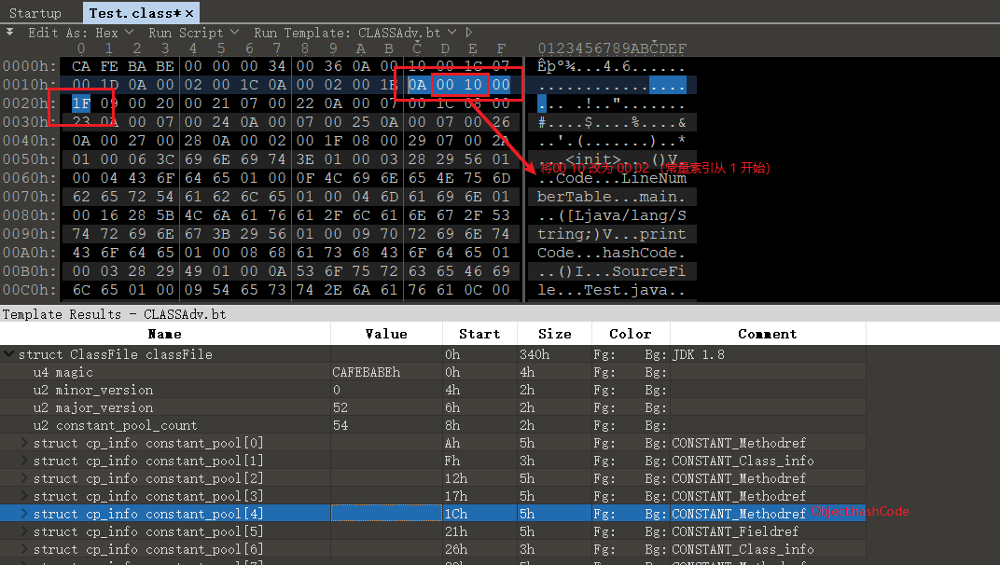
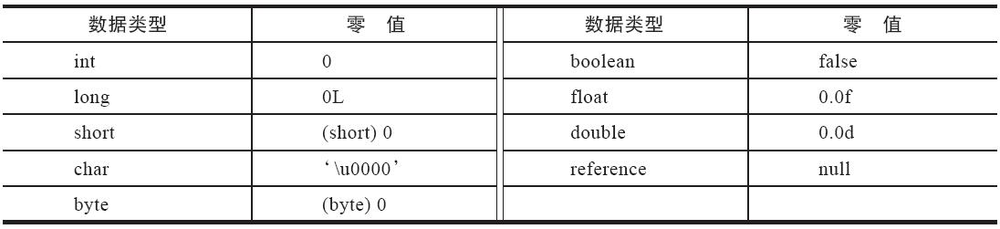
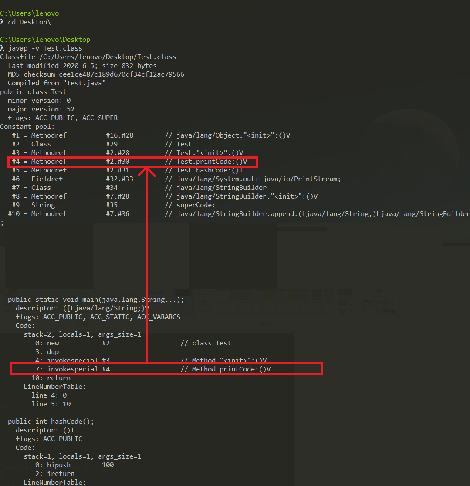

# Java类的加载

---

## 1 Java类的加载过程

Java编译器将 .java 原文件编译为虚拟机指令，虚拟机代码存储在以`.class`为扩展名的类文件中。每个类文件都包含某个类或者接口的定义和代码实现，**这些类文件必须由一个程序进行解释，该程序能够将虚拟机的指令集翻译成目标机器的机器语言**，这个程序就是Java虚拟机（JVM）。

JVM要执行`.class`文件就需要先将其加载到内存中，**JVM虚拟机把描述类的数据从Class文件加载到内存，并对数据进行校验、转换解析和初始化，最终形成可以被虚拟机直接使用的Java类型，这个过程被称作虚拟机的类加载机制**。

**类的生命周期**：一个类型从被加载到虚拟机内存中开始，到卸载出内存为止，它的整个生命周期将会经历七个阶段（连接（Linking）过程包含三个子过程）。

1. 加载（Loading）阶段
2. 连接（Linking）阶段
   1. 验证（Verification）阶段
   2. 准备（Preparation）阶段
   3. 解析（Resolution）阶段
3. 初始化（Initialization）阶段
4. 使用（Using）阶段
5. 卸载（Unloading）阶段


`加载、验证、准备、初始化和卸载`这五个阶段的顺序是确定的，类型的加载过程必须按照这种顺序按部就班地开始，而解析阶段则不一定：它在某些情况下可以在初始化阶段之后再开始，这是为了支持Java语言的运行时绑定特性（也称为动态绑定或晚期绑定）。类的加载过程时是按顺序开始的，但是开启之后，这些阶段通常都是互相交叉地混合进行的，会在一个阶段执行的过程中调用、激活另一个阶段。

---

## 2 类的加载时机

**加载阶段**：是类加载的第一个阶段，但是《Java虚拟机规范》中并没有进行强制约束，这点可以交给虚拟机的具体实现来自由把握。

**初始化阶段**：《Java虚拟机规范》严格规定了有且只有六种情况必须立即对类进行“初始化”（而加载、验证、准备自然需要在此之前开始）：

1. 遇到`new、getstatic、putstatic、invokestatic`这四条字节码指令时，如果类型没有进行过初始化，则需要先触发其初始化阶段。能够生成这四条指令的典型Java代码场景有：
   1. 使用new关键字实例化对象的时候。
   2. 读取或设置一个类型的静态字段（被final修饰、已在编译期把结果放入常量池的静态字段除外）的时候。
   3. 调用一个类型的静态方法的时候。
2. 使用 `java.lang.reflect` 包的方法对类型进行反射调用的时候，如果类型没有进行过初始化，则需要先触发其初始化。
3. 当初始化类的时候，如果发现其父类还没有进行过初始化，则需要先触发其父类的初始化。（但是一个接口在初始化时，并不要求其父接口全部都完成了初始化，只有在真正使用到父接口的时候（如引用接口中定义的常量）才会初始化）
4. 当虚拟机启动时，用户需要指定一个要执行的主类（包含main()方法的那个类），虚拟机会先初始化这个主类。
5. 当使用JDK 7新加入的动态语言支持时，如果一个`java.lang.invoke.MethodHandle`实例最后的解析结果为`REF_getStatic、REF_putStatic、REF_invokeStatic、REF_newInvokeSpecial`四种类型的方法句柄，并且这个方法句柄对应的类没有进行过初始化，则需要先触发其初始化。
6. 当一个接口中定义了`JDK 8`新加入的默认方法（被default关键字修饰的接口方法）时，如果有这个接口的实现类发生了初始化，那该接口要在其之前被初始化。

以上这六种场景中的行为称为对一个类型进行**主动引用**。除此之外称的所有引用类型的方式都不会触发初始化，被称为**被动引用**。

以下面代码为例，对于类的加载时机，还有以下几点需要注意：

```java
package com.ztiany.basic.classloader.timing;

public class SuperClass {

    static {
        System.out.println("SuperClass init!");
    }

    public static int value = 123;
}

public class SubClass extends SuperClass {

    static {
        System.out.println("SubClass init!");
    }
}

public class ConstClass {

    static {
        System.out.println("ConstClass init!");
    }

    public static final String HELLOWORLD = "hello world";
}
```

- 1 对于静态字段(`static`)，只有直接定义这个字段的类才会被初始化，因此通过其子类来引用父类中定义的静态字段，只会触发父类的初始化而不会触发子类的初始化。至于是否要触发子类的加载和验证阶段，在《Java虚拟机规范》中并未明确规定。对此，如果我们使用的是 HotSpot 虚拟机，我们可以通过`-XX:+TraceClassLoading`参数观察类加载的信息。

```java
/**
 * 非主动使用类字段演示
 **/
public class NotInitialization {

    public static void main(String[] args) {
        /*
         * 被动使用类字段演示一：
         * 通过子类引用父类的静态字段，不会导致子类初始化
         */
        //不会导致 SubClass 初始化。
        System.out.println(SubClass.value);
    }

}
```

输出：

```log
SuperClass init!
123
```

- 2 创建一个类型的数组类型，不会导致该类被初始化，下面代码没有打印`"SubClass init!"`，但是会触发`[Com.ztiany.basic.classloader.timing.SuperClass”`的类的初始化阶段，它是一个由虚拟机自动生成的、直接继承于 `java.lang.Object` 的子类，创建动作由字节码指令 newarray 触发，数组中应有的属性和方法（用户可直接使用的只有被修饰为public的length属性和clone()方法）都实现在这个类里。

```java
public class NotInitialization {

    public static void main(String[] args) {
        //这里不会导致 SuperClass 被初始化。
       SuperClass[] sca = new SuperClass[10];
    }

}
```

- 3 下面代码不会输出`“ConstClass init！”`，这是因为虽然在 Java 源码中确实引用了 ConstClass 类的常量 HELLOWORLD，但其实在编译阶段通过常量传播优化，已经将此常量的值 “hello world” 直接存储在 NotInitialization 类的常量池中，以后 NotInitialization 对常量 ConstClass.HELLOWORLD 的引用，实际都被转化为 NotInitialization 类对自身常量池的引用了。

```java
public class NotInitialization {

    public static void main(String[] args) {
         /*
         * 被动使用类字段演示三：
         * 常量在编译阶段会存入调用类的常量池中，本质上没有直接引用到定义常量的类，因此不会触发定义常量的类的初始化
         */
        System.out.println(ConstClass.HELLOWORLD);
    }

}
```

---

## 2 加载阶段

加载阶段是整个类加载过程中的一个阶段，Java 虚拟机需要完成以下三件事情：

1. 通过一个类的全限定名来获取定义此类的二进制字节流。（这个阶段由 Java 类加载器完成，具体参考[Java类加载器](08-Java类加载器.md)）
2. 将这个字节流所代表的静态存储结构转化为方法区的运行时数据结构。
3. 在内存中生成一个代表这个类的 `java.lang.Class` 对象，作为方法区这个类的各种数据的访问入口。

对于一般的类，加载阶段是可控性最强的阶段。我们既可以使用 Java 虚拟机里内置的引导类加载器来完成，也可以自定义的类加载器去完成，通过定义自己的类加载器去控制字节流的获取方式可以实现根据自己的想法来赋予应用程序获取运行代码的动态性。因此加载阶段的可定制性，衍生处理很多 Java技术：

1. 从JAR、EAR、WAR中加载类。
2. 从网络中获取类，这种场景最典型的应用就是Web Applet。
3. 运行时计算生成类，这种场景使用得最多的就是动态代理技术。比如`java.lang.reflect.Proxy`、ASM、CGlib 等。
4. 由其他文件生成类，比如 JSP 技术。
5. 类的加密技术。

对于数组类，其本身不通过类加载器创建，它是由Java虚拟机直接在内存中动态构造出来的。对此还要区分数组的组件类型（Component Type）是引用类似还是基本类型。

- 如果数组的组件类型是引用类型，那就递归采用本节中定义的加载过程去加载这个组件类型，数组类将被标识在加载该组件类型的类加载器的类名称空间上。
- 如果数组的组件类型不是引用类型，Java 虚拟机将会把数组类标记为与引导类加载器关联。

>数组的 Component Type 是数组去掉一个维度的类型，`int[]` 的 Component Type 是 int，`int[][]` 的 Component Type 是 `int[]`。

加载阶段结束后，Java虚拟机外部的二进制字节流就按照虚拟机所设定的格式存储在方法区之中了，之后会在Java堆内存中实例化一个 `java.lang.Class` 类的对象，这个对象将作为程序访问方法区中的类型数据的外部接口。

---

## 3 链接阶段

### 验证阶段

验证阶段目的是为了确保 .class 文件的字节流中包含的信息符合当前虚拟机的要求，并且不会危及虚拟机本身的安全。

1. **文件格式检验**：检验字节流是否符合 class 文件格式的规范，并且能被当前版本的虚拟机处理。比如会检测类是否以魔数`CACF BABE`开头；主、次版本号是否在当前Java虚拟机接受范围之内等。
2. **元数据检验**：对字节码描述的信息进行语义分析，以保证其描述的内容符合 Java 语言规范的要求。
3. **字节码检验**：通过数据流和控制流分析，确定程序语义是合法、符合逻辑的。
4. **符号引用检验**：符号引用检验可以看作是对类自身以外（常量池中的各种符号引用）的信息进行匹配性校验。符号引用验证的主要目的是确保解析行为能正常执行，如果无法通过符号引用验证，Java 虚拟机将会抛出一个 `java.lang.IncompatibleClassChangeError` 的子类异常，典型的如：`java.lang.IllegalAccessError、java.lang.NoSuchFieldError、java.lang.NoSuchMethodError`等。

参考下面代码：

```java
public class Test {

    public static void main(String... args) {
        new Test().printCode();
    }

    private void printCode() {
        int superCode = super.hashCode();
        System.out.println("superCode: " + superCode);
        int selfCode = hashCode();
        System.out.println("selfCode: " + selfCode);
    }

    @Override
    public int hashCode() {
        return 100;
    }

}
```

编译后的 class 的部分数据为：

```class
cafe babe 0000 0034 0036 0a00 1000 1c07
001d 0a00 0200 1c0a 0002 001e 0a00 1000
1f09 0020 0021 0700 220a 0007 001c 0800
230a 0007 0024 0a00 0700 250a 0007 0026
0a00 2700 280a 0002 001f 0800 2907 002a
0100 063c 696e 6974 3e01 0003 2829 5601
0004 436f 6465 0100 0f4c 696e 654e 756d
...
```

命令行运行：

```java
C:\Users\lenovo\Desktop
λ java Test
superCode: 705927765
selfCode: 100
```

**体验验证过程**：

测试1，修改魔数，将 `cafe babe` 改为 `cafe babb`，再次运行，无法通过验证：

```shell
λ java Test
Error: A JNI error has occurred, please check your installation and try again
Exception in thread "main" java.lang.ClassFormatError: Incompatible magic value 3405691579 in class file Test
        at java.lang.ClassLoader.defineClass1(Native Method)
        ...
```

测试2，修改版本，将 `0000 0034` 改为 `0000 0036`，再次运行，无法通过验证：

```shell
Error: A JNI error has occurred, please check your installation and try again
Exception in thread "main" java.lang.UnsupportedClassVersionError: Test has been compiled by a more recent version of the Java Runtime (class file version 54.0), this version of the Java Runtime only recognizes class file versions up to 52.0
        at java.lang.ClassLoader.defineClass1(Native Method)
        ...
```

测试3，修改常量池数量，将 `0036` 改为 `0032`，再次运行，无法通过验证：

```shell
λ java Test
Error: A JNI error has occurred, please check your installation and try again
Exception in thread "main" java.lang.ClassFormatError: Invalid constant pool index 50 in class file Test
```

虽说 JVM 会检查各种对 class 字节码文件的篡改行为，但是依然无法百分百保证 class 文件的安全性，只要我们修改后的 class 文件还符合 JVM 规范，就可以通过验证。比如上面 `Test.print()` 打印了父类对象和自己的 hashCode 值，我们可以修改字节码，让父类对象的 hashCode 也返回 100。

我们通过 `javap -v Test.class` 命令查看 Test.class 的类解构：

```java
λ javap -v Test.class
Classfile /C:/Users/lenovo/Desktop/Test.class
  Last modified 2020-6-5; size 832 bytes
  MD5 checksum 90ea99db2e6812d23444a16881c98133
  Compiled from "Test.java"
public class Test
  minor version: 0
  major version: 52
  flags: ACC_PUBLIC, ACC_SUPER
Constant pool:
   #1 = Methodref          #16.#28        // java/lang/Object."<init>":()V
   #2 = Class              #29            // Test
   #3 = Methodref          #2.#28         // Test."<init>":()V
   #4 = Methodref          #2.#30         // Test.printCode:()V
   #5 = Methodref          #16.#31        // java/lang/Object.hashCode:()I
   #6 = Fieldref           #32.#33        // java/lang/System.out:Ljava/io/PrintStream;
   #7 = Class              #34            // java/lang/StringBuilder
   #8 = Methodref          #7.#28         // java/lang/StringBuilder."<init>":()V
   #9 = String             #35            // superCode:
  #10 = Methodref          #7.#36         // java/lang/StringBuilder.append:(Ljava/lang/String;)Ljava/lang/StringBuilder;
  #11 = Methodref          #7.#37         // java/lang/StringBuilder.append:(I)Ljava/lang/StringBuilder;
  #12 = Methodref          #7.#38         // java/lang/StringBuilder.toString:()Ljava/lang/String;
  #13 = Methodref          #39.#40        // java/io/PrintStream.println:(Ljava/lang/String;)V
  #14 = Methodref          #2.#31         // Test.hashCode:()I
  #15 = String             #41            // selfCode:
  #16 = Class              #42            // java/lang/Object
```

通过输出我们可以知道：

1. Test 类的引用是常量池中的第 2 个常量。
2. Object.hashCode 函数引用是常量池中的第 5 个常量。

而常量池中函数引用的结构为：

```java
CONSTANT_Method_info{
    u1 tag = 10;//常量类型标识
    u2 class_index;//指向该方法所属类
    u2 name_type_index;//此方法的名词和类型
}
```

找了的方法引用的位置，我们只需要将 Object.hashCode 函数常量中的 class_index 修改为指向 Test 即可。利用 010 Edtor 二进制编辑工具可以很快地帮我找到要修改的常量：



再次运行：

```shell
C:\Users\lenovo\Desktop
λ java Test
superCode: 100
selfCode: 100
```

### 准备阶段

**准备阶段是正式为类中定义的变量（即静态变量，被static修饰的变量）分配内存并设置类变量初始值的阶段**，这些变量所使用的内存都应当在方法区中进行分配，但必须注意到方法区本身是一个逻辑上的区域，在不同的版本的虚拟机有不同的实现：

- 在JDK 7及之前，HotSpot使用永久代来实现方法区时，实现是完全符合这种逻辑概念的。
- 在JDK 8及之后，类变量则会随着Class对象一起存放在Java堆中。

还需要明确的是：

1. 首先是这时候进行内存分配的仅包括类变量，而不包括实例变量。
2. 其次是这里所说的初始值“通常情况”下是数据类型的零值。

```java
public static int value1 = 100;
```

在准备阶段，JVM 会为 value1 分配内存，并将其设置为 0。因为这时尚未开始执行任何 Java 方法，而把 value 赋值为 123 的 `putstatic` 指令是程序被编译后，存放于类构造器 `<clinit>()` 方法之中，所以把 value 赋值为 123 的动作要到类的初始化阶段才会被执行。

不同的类型，在准备阶段将设置的 0 值是不一致的，参考下图：



还需要注意特殊情况，对于下面静态常量 value2，这个类字段的字段属性表中存在 `ConstantValue` 属性，那在准备阶段变量值就会被初始化为 `ConstantValue` 属性所指定的初始值，

```java
//编译时 Javac 将会为 value2 生成 ConstantValue 属性，在准备阶段虚拟机就会根据 ConstantValue 的设置将 value 赋值为 123。
public static final int value2 = 100;
```

### 解析阶段

**解析阶段是Java虚拟机将常量池内的符号引用替换为直接引用的过程**，在Class文件中符号引用以`CONSTANT_Class_info、CONSTANT_Fieldref_info、CONSTANT_Methodref_info`等类型的常量出现。

- **符号引用**（Symbolic References）：符号引用以一组符号来描述所引用的目标，符号可以是任何形式的字面量，只要使用时能无歧义地定位到目标即可。
- **直接引用**（Direct References）：直接引用是可以直接指向目标的指针、相对偏移量或者是一个能间接定位到目标的句柄。直接引用是和虚拟机实现的内存布局直接相关的，同一个符号引用在不同虚拟机实例上翻译出来的直接引用一般不会相同。**如果有了直接引用，那引用的目标必定已经在虚拟机的内存中存在**。

符号引用一中标识，可以定位到一个目标，直接引用，可以用来直接或间接地找到对象内存地址的引用。



在 main 方法中通过 `invokevirtual` 指令调用了 print 方法，`Test.print:()V` 就是一个符号引用，当 main 方法执行到此处时，会将符号引用`Test.print:()V`解析成直接引用，我们可以将直接引用理解为方法真正的内存地址，所引用的东西已经被加载到了内存中了。

---

## 4 初始化

类的初始化阶段是类加载过程的最后一个步骤，上面的几个类加载的动作里，除了在`加载阶段用户应用程序可以通过自定义类加载器的方式局部参与外`，其余动作都完全由 Java 虚拟机来主导控制。直到初始化阶段，Java 虚拟机才真正开始执行类中编写的 Java 程序代码，将主导权移交给应用程序。

我们可以以两种方式去理解初始化阶段：

- 理论上是：变量已经赋过一次系统要求的初始零值，而在初始化阶段，则会根据程序员通过程序编码制定的主观计划去初始化类变量和其他资源。
- 其实就是：就是执行类构造器 `<clinit>()` 方法的过程。

关于 `clinit()` 方法：

- `<clinit>()`是 Javac 编译器的自动生成物，是由编译器自动收集类中的所有类变量的赋值动作和静态语句块（`static{}`块）中的语句合并产生的。
- 编译器收集的顺序是由语句在源文件中出现的顺序决定的，静态语句块中只能访问到定义在静态语句块之前的变量，定义在它之后的变量，在前面的静态语句块可以赋值，但是不能访问。
- `<clinit>()`方法对于类或接口来说并不是必需的，如果一个类中没有静态语句块，也没有对变量的赋值操作，那么编译器可以不为这个类生成`<clinit>()`方法。
- 不同于对象的构造方法`<init>()`，不需要显式地调用父类构造器，Java 虚拟机会保证在子类的 `<clinit>()` 方法执行前，父类的 `<clinit>()` 方法已经执行完毕。

```java
public class Test {
    static {
        i = 0;  //  给变量复制可以正常编译通过
        System.out.print(i);  // 这句编译器会提示“非法向前引用”
    }
    static int i = 1;
}
```

`<clint>` 方法是线程安全的： Java 虚拟机必须保证一个类的 `<clinit>()` 方法在多线程环境中被正确地加锁同步，如果多个线程同时去初始化一个类，那么只会有其中一个线程去执行这个类的 `<clinit>()` 方法，其他线程都需要阻塞等待，直到活动线程执行完毕 `<clinit>()`方法。

对此我们需要注意两点：

1. 有一种单例设计模式就是利用 `<clinit>()` 方法线程安全的特性，比如静态内部类模式。
2. 如果在一个类的`<clinit>()`方法中有耗时很长的操作，那就可能造成多个进程阻塞 ，在实际应用中这种阻塞往往是很隐蔽，第一次，在静态代码块中涉及到线程耗时或其他操作，我们谨慎对待。

---

## 5 扩展阅读

- [JVM符号引用转换直接引用的过程?](https://www.zhihu.com/question/50258991)
- [JVM里的符号引用如何存储？](https://www.zhihu.com/question/30300585/answer/51335493)
- [大话Java对象在虚拟机中是什么样子？](https://mp.weixin.qq.com/s/fyvoraVu9yjgqX-xhn6EHQ)
- [JVM源码分析之Java类的加载过程](https://www.jianshu.com/p/252e27863822)

---

## 6 引用

- 《深入理解Java虚拟机：JVM高级特性与最佳实践》
- [Class 对象在执行引擎中的初始化过程](https://kaiwu.lagou.com/course/courseInfo.htm?courseId=67#/detail/pc?id=1860)
