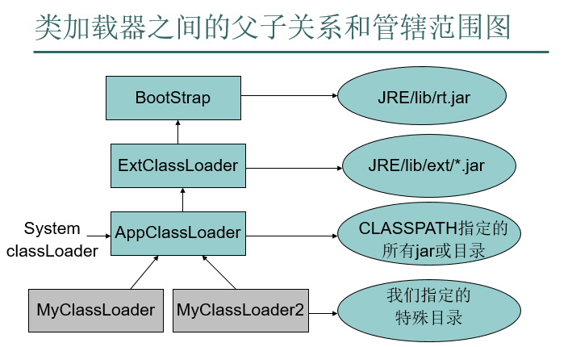

# Java 类的加载与类加载器

>Java虚拟机设计团队有意把类加载阶段中的“**通过一个类的全限定名来获取描述该类的二进制字节流**”这个动作放到Java虚拟机外部去实现，以便让应用程序自己决定如何去获取所需的类。实现这个动作的代码被称为“类加载器”（Class Loader）。——《深入理解Java虚拟机：JVM高级特性与最佳实践 3E》

---

## 1 类加载器分类

java 程序拥有至少三种类加载器：

- 引导类加载器(BootstrapClassLoader )
- 扩展类加载器(ExtClassLoader )，JDK1.9 之后，改名为 PlatformClassLoader。
- 系统类加载器(APPClassLoader)

**引导类加载器** 负责加载系统类(由系统属性 `sun.boot.class.path` 配置，通常就是从 `rt.jar` 中加载类文件)，它是虚拟机不可分割的一部分，**所有的系统类只能由引导类加载器进行加载**。而且通常是用`c或c++`来实现的，引导类加载器在Java中没有对应的ClassLoader对象，比如：`ClassLoader cl = String.class.getClassLoader();` 返回值 cl 是 null。

**扩展类加载器**用于加载系统属性 `java.ext.dirs` 配置下的类文件（一般为`jre/lib/ext`目录），将 jar 文件放入到该目录，扩展类加载器就可以找到其中的各个类。

**系统类加载器**用于应用程序的类，其路径由系统属性 `java.class.path` 配置，也就是 `CLASS_PATH` 环境变量配置的路径，同时还可以用 `-classpath`指定。

在Oracle的Java语言实现中，扩展类加载器和系统类加载器都是用java来实现的，它们都是 URLClassLoader 类的实例。ClassLoader的继承结构如下

```java
ClassLoader
   |
   |——SecureClassLoader
       |
       |——URLClassLoader
           |
           |——ExtClassLoader
           |——AppClassLoader
```

获取类加载器：

```java
public class Main {
    public static void main(String... args) {
        System.out.println(String.class.getClassLoader());
        System.out.println(Main.class.getClassLoader());
        try {
            Class<?> aClass = Class.forName("com.sun.java.accessibility.AccessBridge");
            System.out.println(aClass.getClassLoader());
        } catch (ClassNotFoundException e) {
            e.printStackTrace();
        }
    }
}
```

打印结果为：

- `null` 加载 String 类的是 BootstrapClassLoader，但 BootstrapClassLoader 由 C/C++ 语言编写的，它本身属于虚拟机的一部分。因此我们无法在 Java 代码中直接获取它的引用。
- `sun.misc.Launcher$AppClassLoader@42a57993` 加载我们自己编写的的类加载器就是 AppClassLoader。
- `sun.misc.Launcher$ExtClassLoader@6b2fc6ca` 这是扩展类加载器。

---

## 2 双亲委派模式

类加载器有一种**父子关系**，除了引导类加载器之外，其他的类加器去都有一个父类加载器。根据规定：**类加载器会为它的父类加载器提供一个机会，以便加载任何给定的类，并且只有在父类加载器加载失败的时候，它才会加载该类**，这个关系也称为**双亲委派模式**

>**系统类加载器的父类加载器是扩展类加载器**。

双亲委派模式的好处：

- 防止了类的重复加载，如果一个类已经加载了，就没有必要再次加载了。
- 这是java的一种安全机制：比如系统加载`java.util.ArrayList`时，首先它要求扩展的类加载器加载该类，而扩展的类加载器则要求引导类加载器去加载该类，然后引导类加载器加载到了`java.util.ArrayList`类，则其他类加载器就没有机会加载该类了，这样就防止了Java核心API被随意的替换。

某些程序使用插件架构，其中的代码的某些部分作为可选的插件打包，如果插件被打包到JAR文件，那就可以直接使用URLClassLoader类的实例去加载这些类:

```java
private static void testURLClassLoader() {
    try {
        URLClassLoader urlClassLoader = new URLClassLoader(new URL[]{
                new URL("file:///C:/Users/Administrator/Desktop/okhttp-2.0.0.jar")
        }, null);
        Class<?> aClass = urlClassLoader.loadClass("com.squareup.okhttp.OkHttpClient");
        System.out.println(aClass);
        System.out.println(aClass.getClassLoader());
        System.out.println(aClass.getClassLoader().getParent());
    } catch (MalformedURLException | ClassNotFoundException e) {
        e.printStackTrace();
    }
}
```

打印结果为：

```java
class com.squareup.okhttp.OkHttpClient
java.net.URLClassLoader@6d6f6e28
null
```



### 2.1 双亲委派机制的原理

双亲委派模式要求除了顶层的启动类加载器外，其余的类加载器都应当有自己的父类加载器。其工作过程是：如果一个类加载器收到了类加载请求，它并不会自己先去加载，而是把这个请求委托给父类的加载器去执行，如果父类加载器还存在其父类加载器，则进一步向上委托，于是请求最终将到达顶层的启动类加载器，如果父类加载器可以完成类加载任务，就成功返回，倘若父类加载器无法完成此加载任务，子加载器才会尝试自己去加载，这就是双亲委派模式。工作方向是**先向上委托加载，然后再向下传递结果**。

ClassLoader的loadClass方法用于根据类的全限定名加载一个类，该方法中实现了双亲委派机制的主要逻辑：

```java
public Class<?> loadClass(String name) throws ClassNotFoundException {
        //调用受保护的loadClass方法
        return loadClass(name, false);
}

protected Class<?> loadClass(String name, boolean resolve)
        throws ClassNotFoundException
    {
        synchronized (getClassLoadingLock(name)) {
            // 第一步, 检查这个类是否已经被加载过了
            Class<?> c = findLoadedClass(name);

            //第二步，如果该类没有被加载过，就执行加载逻辑
            if (c == null) {
                long t0 = System.nanoTime();
                try {
                    //如果有父类加载器，先让父类加载器加载
                    if (parent != null) {
                        c = parent.loadClass(name, false);
                    } else {
                    //如果没有父类，则委托给启动加载器去加载
                        c = findBootstrapClassOrNull(name);
                    }
                } catch (ClassNotFoundException e) {
                    // ClassNotFoundException thrown if class not found
                    // from the non-null parent class loader
                }
                //如果父类加载器或者引导类加载器没有加载到，则自己去加载
                if (c == null) {
                    // If still not found, then invoke findClass in order
                    // to find the class.
                    long t1 = System.nanoTime();
                    c = findClass(name);

                    // this is the defining class loader; record the stats
                    sun.misc.PerfCounter.getParentDelegationTime().addTime(t1 - t0);
                    sun.misc.PerfCounter.getFindClassTime().addElapsedTimeFrom(t1);
                    sun.misc.PerfCounter.getFindClasses().increment();
                }
            }
            if (resolve) {
            //调用resolveClass方法，解析该类
                resolveClass(c);
            }
            return c;
        }
    }
```

上面代码为loadClass的全部逻辑，可以看出，并不是很复杂，但涉及到以下几个方法需要掌握。

#### loadClass方法

公共的loadClass方法，该方法在JDK1.2之后不再建议用户重写，但用户可以直接调用该方法，如果用户需要完全定义自己的类加载逻辑，则可以重写该方法。

受保护的loadClass方法，该实现了双亲委派机制的主要逻辑。

#### findClass方法

在JDK1.2之前，在自定义类加载时，总会去继承ClassLoader类并重写loadClass方法，从而实现自定义的类加载类，但是在JDK1.2之后已不再建议用户去覆盖loadClass()方法，而是建议把自定义的类加载逻辑写在findClass()方法中。findClass()方法是在loadClass()方法中被调用的，当loadClass()方法中父加载器加载失败后，则会调用自己的findClass()方法来完成类加载，这样就可以保证自定义的类加载器也符合双亲委托模式。默认的findClass方法是抛出异常的，这说明子类需要实现自己的逻辑。

#### defineClass方法

defineClass()方法是用来将byte字节流解析成JVM能够识别的Class对象(ClassLoader中已实现该方法逻辑)，通过这个方法不仅能够通过class文件实例化class对象，也可以通过其他方式实例化class对象，如通过网络接收一个类的字节码，然后转换为byte字节流创建对应的Class对象，**defineClass()方法通常与findClass()方法一起使用**，一般情况下，在自定义类加载器时，会直接覆盖ClassLoader的findClass()方法并编写加载规则，取得要加载类的字节码后转换成流，然后调用defineClass()方法生成类的Class对象。

示例：

```java
    protected Class<?> findClass(String name) throws ClassNotFoundException {
        try {
            byte[] classBytes = null;
            //loadClassBytes用于加载二进制
            classBytes = loadClassBytes(name);
            Class<?> cl = defineClass(name, classBytes, 0, classBytes.length);
            if (cl == null) throw new ClassNotFoundException(name);
            return cl;
        } catch (IOException e) {
            throw new ClassNotFoundException(name);
        }
    }
```

需要注意的是，如果直接调用defineClass()方法生成类的Class对象，这个类的Class对象并没有解析(也可以理解为链接阶段，毕竟解析是链接的最后一步)，其解析操作需要等待初始化阶段进行。

#### resolveClass方法

使用该方法可以使用类的Class对象创建完成也同时被解析。

### 2.2 类加载器间的关系

#### 继承关系

Java中ClassLoader有如下继承结构：

```java
ClassLoader
   |
   |——SecureClassLoader
       |
       |——URLClassLoader
           |
           |——ExtClassLoader
           |——AppClassLoader
```

- **ClassLoader**为抽象类，实现了类加载的整体过程，而具体的细节都没有实现，比如 findClass()、findResource()等
- **SecureClassLoader**在ClassLoader的基础上加上了安全检查，一般我们不会直接跟这个类打交道
- **URLClassLoader**是一个具体的ClassLoader实现，在创建URLClassLoader对象时需要传入对应的URL路径，然后URLClassLoader可以从URL中加载指定的类。
- 拓展类加载器ExtClassLoader和系统类加载器AppClassLoader，这两个类都继承自URLClassLoader，是`sun.misc.Launcher`的静态内部类。`sun.misc.Launcher`主要被系统用于启动主应用程序，ExtClassLoader和AppClassLoader都是由`sun.misc.Launcher`创建的。

#### 双亲委派机制中的继承关系

- 启动类加载器，由 C++ 实现，顶层的类加载器。
- 拓展类加载器(ExtClassLoader)，由Java语言实现，父类加载器为 null。
- 系统类加载器(AppClassLoader)，由Java语言实现，父类加载器为 ExtClassLoader。
- 自定义类加载器，**父类加载器为AppClassLoader**。

---

## 3 类与类加载器

### 3.1 类加载器也是命名空间

包命名是为了消除类名字冲突，然而其实在同一个 java 虚拟机中，可以有两个类名和包名都是一样的类。因为**类是由它的全名和加载它的类加载器来确定的**。

### 3.2 类的显示加载与隐式加载的概念

- 显示加载即通过`Class.forName、this.getClass().getClassLoader().loadClass()`等方式获取Class。
- 隐式加载属于类的解析过程，即一个被加载的类依赖了另一个类，则被依赖的类也会被加载，这个过程是虚拟机自动进行的。

---

## 4 线程上下文类加载器

>在Java应用中存在着很多服务提供者接口（Service Provider Interface，SPI），这些接口允许第三方为它们提供实现，如常见的 SPI 有 JDBC、JNDI等，这些 SPI 的接口属于 Java 核心库，一般存在rt.jar包中，由Bootstrap类加载器加载，而 SPI 的第三方实现代码则是作为Java应用所依赖的 jar 包被存放在classpath路径下，由于SPI接口中的代码经常需要加载具体的第三方实现类并调用其相关方法，但SPI的核心接口类是由引导类加载器来加载的，而Bootstrap类加载器无法直接加载SPI的实现类，同时由于双亲委派模式的存在，Bootstrap类加载器也无法反向委托AppClassLoader加载器SPI的实现类。在这种情况下，我们就需要一种特殊的类加载器来加载第三方的类库，而线程上下文类加载器就是很好的选择。

线程上下文类加载器（ContextClassLoader）是从`JDK 1.2`开始引入的，每个线程都有一个上下文类加载器，主线程的上下文类加载器是系统类加载器，如果不做任何特殊的操作，任何新建的线程的上下文类加载器都是系统类加载器，但我们可以指定线程的上下文类加载器：

```java
//获取类加载器
Thread.currentThread().getContextClassLoader()

//设置类加载器
ClassLoader classLoader = ...;
Thread.currentThread().setContextClassLoader(classLoader)
```

在线程中运行的代码可以通过线程类加载器来加载类和资源，**这样就破坏了双亲委派机制**：

```java
    //创建线程
    private static Thread thread = new Thread(() -> {
        System.out.println(Thread.currentThread() + "   " + Thread.currentThread().getContextClassLoader());
        Class<?> aClass = null;
        try {
            aClass = Thread.currentThread().getContextClassLoader().loadClass("com.squareup.okhttp.OkHttpClient");
        } catch (ClassNotFoundException e) {
            e.printStackTrace();
        }
        System.out.println(aClass);
        System.out.println(aClass.getClassLoader());
    });

    public static void start() {
        //指定类加载器
        URLClassLoader urlClassLoader = null;
        try {
            urlClassLoader = new URLClassLoader(new URL[]{new URL("file:///C:/Users/Administrator/Desktop/okhttp-2.0.0.jar")}, null);
        } catch (MalformedURLException e) {
            e.printStackTrace();
        }
        thread.setContextClassLoader(urlClassLoader);
        thread.start();
    }
```

---

## 5 编写自己的类加载器

出于特殊的目的我肯可以实现自己的类加载器，比如

- 对被加载的类进行加密，需要用带加密功能的类来加载被加密的类。
- 从网络加载类。
- 在插件架构中，给插件指定特定的类加载器。

编写自己的类加载器只需要继承ClassLoader类，然后覆盖`findClass(String className)`方法，ClassLoader的`loadClass`方法用于将加载类的操作委托给其父类加载器去进行，只有当该类没有被父类加载器加载到时，才会调用到`loadClass`方法。

实现`loadClass`方法需要做到下面两点：

1. 为来自本地文件系统或者其他源的类加载器加载其字节码
2. 调用ClassLoader超类的defineClass方法，将加载到的字节码提供给java虚拟机

示例代码：

```java
class CustomClassLoader extends ClassLoader {

    public CustomClassLoader() {
    }

    protected Class<?> findClass(String name) throws ClassNotFoundException {
        try {
            byte[] classBytes = null;
            classBytes = loadClassBytes(name);
            Class<?> cl = defineClass(name, classBytes, 0, classBytes.length);
            if (cl == null) throw new ClassNotFoundException(name);
            return cl;
        } catch (IOException e) {
            throw new ClassNotFoundException(name);
        }
    }

    private byte[] loadClassBytes(String name) throws IOException {
        // here need transform name to path
        byte[] bytes = Files.readAllBytes(Paths.get(name));
        return bytes;
    }
}
```

---

## 6 总结

- Java虚拟机中可以安装多个类加载器，系统默认三个主要类加载器，每个类负责加载特定位置的类：BootStrap、ExtClassLoader、AppClassLoader
- 类加载器也是Java类，因为其他是java类的类加载器本身也要被类加载器加载，显然必须有第一个类加载器不是不是java类，这正是BootStrap。
- Java虚拟机中的所有类装载器采用具有父子关系的**树形结构**进行组织，在实例化每个类装载器对象时，需要为其指定一个父级类装载器对象或者**默认采用系统类装载器为其父级类加载**。

**当Java虚拟机要加载一个类时，到底派出哪个类加载器去加载呢**？

1. 首先当前线程的类加载器去加载线程中的第一个类。
2. 如果类A中引用了类B，Java虚拟机将使用加载类A的类装载器来加载类B
3. 还可以直接调用ClassLoader.loadClass()方法来指定某个类加载器去加载某个类。

每个类加载器加载类时，又先委托给其上级类加载器。当所有祖宗类加载器没有加载到类，回到发起者类加载器，还加载不了，则抛出ClassNotFoundException，不是再去找发起者类加载器的儿子，因为没有getChild方法，即使有，那有多个儿子，找哪一个呢？这就可能引发类加载倒置问题。

---

## 引用

- [深入理解Java类加载器(ClassLoader)](http://blog.csdn.net/javazejian/article/details/73413292)
- 《Java核心技术 卷2》第九章
