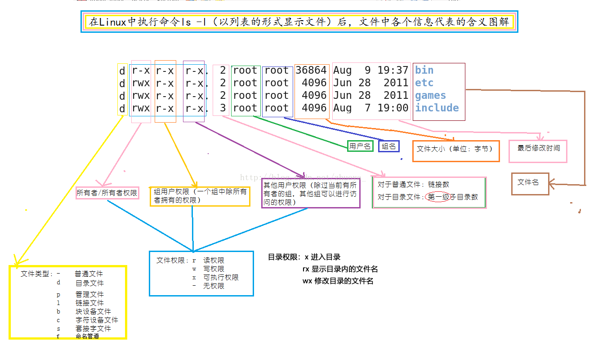
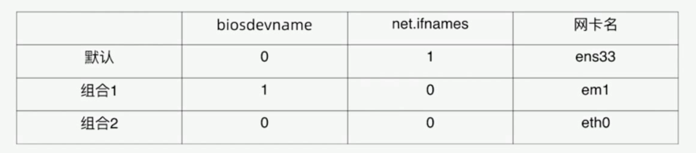

# Linux 常用命令

---

## 1 用户、权限管理

用户是 Unix/Linux 系统工作中重要的一环，用户管理包括用户与组账号的管理。在 Unix/Linux 系统中，不论是由本机或是远程登录系统，每个系统都必须拥有一个账号，并且对于不同的系统资源拥有不同的使用权限。Unix/Linux 系统中的 root 账号通常用于系统的维护和管理，它对 Unix/Linux 操作系统的所有部分具有不受限制的访问权限。在 Unix/Linux 安装的过程中，系统会自动创建许多用户账号，而这些默认的用户就称为“标准用户”。在大多数版本的 Unix/Linux 中，都不推荐直接使用 root 账号登录系统。

### 查看 Linux 内核版本命令

```shell
# 方式1
cat /proc/version

# 方式2
uname -a
```

### 查看 Linux 发行版本

```shell
# 这个命令适用于所有的Linux发行版，包括Redhat、SuSE、Debian…等发行版。
lsb_release -a

# 这种方法只适合Redhat系的Linux
cat /etc/redhat-release

# 此命令也适用于所有的Linux发行版。
cat /etc/issue
```

参考[如何查看LINUX发行版的名称及其版本号](https://www.qiancheng.me/post/coding/show-linux-issue-version)

### 查看当前用户：whoami

whoami该命令用户查看当前系统当前账号的用户名。可通过`cat /etc/passwd`查看系统用户信息。

### 查看登录用户：who

who命令用于查看当前所有登录系统的用户信息。

选项

- -m 或 am i 只显示运行who命令的用户名、登录终端和登录时间
- -q 或 --count 只显示用户的登录账号和登录用户的数量
- -u 或 --heading 显示列标题

### 显示用户信息：id

Print user and group information for the specified USER。

```shell
id root
```

### 添加用户账号：useradd

在Unix/Linux中添加用户账号可以使用adduser或useradd命令，因为adduser命令是指向useradd命令的一个链接，因此，这两个命令的使用格式完全一样。

参数：

- -d 指定用户登录系统时的主目录，如果不使用该参数，系统自动在/home目录下建立与用户名同名目录为主目录。
- -m 自动建立目录。
- -g 指定组名称。

相关说明：

- Linux每个用户都要有一个主目录，主目录就是第一次登陆系统，用户的默认当前目录(/home/用户)。
- 每一个用户必须有一个主目录，所以用useradd创建用户的时候，一定给用户指定一个主目录。
- 用户的主目录一般要放到根目录的home目录下，用户的主目录和用户名是相同的。
- 如果创建用户的时候，不指定组名，那么系统会自动创建一个和用户名一样的组名。
- 创建的用户会被记录在 `/etc/passwd` 文件中以及 `etc/shadow`（用户密码相关） 文件中。

```shell
useradd -d/home/abc abc -m创建abc用户，如果/home/abc目录不存在，就自动创建这个目录，同时用户属于abc组

useradd -d/home/a a -g test-m创建一个用户名字叫a，主目录在/home/a，如果主目录不存在，就自动创建主目录，同时用户属于test组

cat /etc/passwd查看系统当前用户名
```

### 设置用户密码：passwd

超级用户可以使用passwd命令为普通用户设置或修改用户口令。用户也可以直接使用该命令来修改自己的口令，而无需在命令后面使用用户名

```shell
passwd username
```

### 删除用户：userdel

```shell
userdel abc(用户名)删除abc用户，但不会自动删除用户的主目录
userdel -r abc(用户名)删除用户，同时删除用户的主目录
```

### 修改用户属性：usermod

```shell
# 修改用户所在组
usermod -g 用户组 用户名
```

为创建的普通用户添加sudo权限，新创建的用户，默认不能sudo，需要进行一下操作

```shell
sudo usermod -a -G adm 用户名
sudo usermod -a -G sudo 用户名
```

### 修改用户属性：chage

chage命令是用来修改帐号和密码的有效期限。

### 查看有哪些用户组

```shell
# 方法一
cat /etc/group
# 方法二
groupmod +二次tab键
```

### 添加、删除组账号：groupadd、groupdel

```shell
# 新建组账号
groupadd

# 组账号
groupdel

# 查看用户组
cat /etc/group
```

### 查看用户在哪些组：groups

```shell
groups username
```

### 切换用户：su、sudo

可以通过su命令切换用户，su后面可以加“-”。`su`和`su –`命令不同之处在于，`su -`切换到对应的用户时会将当前的工作目录自动转换到切换后的用户主目录：

注意：如果是ubuntu平台，需要在命令前加“sudo”，如果在某些操作需要管理员才能操作，ubuntu无需切换到root用户即可操作，只需加“sudo”即可。sudo是ubuntu平台下允许系统管理员让普通用户执行一些或者全部的root命令的一个工具，减少了 root 用户的登陆和管理时间，提高了安全性。

```shell
su 切换到root用户su root切换到root用户
su - 切换到root用户，同时切换目录到/root
su - root 切换到root用户，同时切换目录到/root
su 普通用户切换到普通用户
su - 普通用户切换到普通用户，同时切换普通用户所在的目录
sudo -s 切换到root用户(ubantu)
visudo 用于配置用户可以执行的管理员命令
```

### 获取 root 权限

Ubuntu 的默认 root 密码是随机的，即每次开机都有一个新的 root 密码，对此：

1. 我们可以在终端输入命令 `sudo passwd`，然后根据提示设置设置 root 密码。修改成功后，输入命令 `su root`，再输入新的密码就 ok 了。
2. 直接输入 `sudo su root` 切换到 root 用户。

### 用户和用户组的配置文件：`etc/passwd`, `etc/shadow`, `etc/group`

Linux `/etc/group` 文件与 `/etc/passwd` 和 `/etc/shadow` 文件都是有关于系统管理员对用户和用户组管理时相关的文件。

- `etc/passwd`，配置用户，格式：`用户名:是否需要密码进行验证:uid:gid:注释:home目录:命令解释器`。
- `etc/shadow`，配置用户密码，格式：`用户名:加密过的秘密`。
- `etc/group`，用户组配置，格式：`组名称:是否需要密码进行验证:gid:组内用户列表`。

### 修改文件权限：chmod

chmod 修改文件权限有两种使用格式：字母法与数字法。

字母法：`chmod u/g/o/a +/-/= rwx 文件`

- `u`： user 表示该文件的所有者
- `g`： group 表示与该文件的所有者属于同一组( group )者，即用户组
- `o`： other 表示其他以外的人
- `a`： all 表示这三者皆是
- `[ +-= ]`的含义：+增加权限、-撤销权限、=设定权限
- `r`：read 表示可读取，对于一个目录，如果没有r权限，那么就意味着不能通过ls查看这个目录的内容。
- `w`：write 表示可写入，对于一个目录，如果没有w权限，那么就意味着不能在目录下创建新的文件。
- `x`：excute 表示可执行，对于一个目录，如果没有x权限，那么就意味着不能通过cd进入这个目录。

数字法：`“rwx” 这些权限也可以用数字来代替`

- r读取权限，数字代号为 "4"
- w写入权限，数字代号为 "2"
- x执行权限，数字代号为 "1"
- -不具任何权限，数字代号为 "0"

执行：`chmod u=rwx,g=rx,o=r filename` 就等同于：`chmod u=7,g=5,o=4 filename` 或者 `chmod 754 filename`。如果想递归所有目录加上相同权限，需要加上参数`-R`。如：`chmod 777 test/ -R` 递归 test 目录下所有文件加 777 权限。

### 修改文件所有者：chown

```shell
sudo chown username filename

#将这个目录的所有者和组分别改为xxx和组xxx
sudo chown username:group filename
```

### 修改文件所属组：chgrp

```shell
sudo chgrp username filename
```

### 退出登录账户：exit

- 如果是图形界面，退出当前终端；
- 如果是使用ssh远程登录，退出登陆账户；
- 如果是切换后的登陆用户，退出则返回上一个登陆账号。

### 关机重启：`reboot`、`shutdown`、`init`

```shell
reboot 重新启动操作系统
shutdown –r now 重新启动操作系统，
shutdown 会给别的用户提示
shutdown -h now立刻关机，其中now相当于时间为0的状态
shutdown -h 20:25系统在今天的20:25 会关机
shutdown -h +10系统再过十分钟后自动关机
init 0 关机
init 6 重启
```

---

## 2 文件管理

### 查看文件信息：ls

Linux文件或者目录名称最⻓可以有265个字符，`.`代表当前目录，`..`代表上一级目录，以`.`开头的文件为隐藏文件，需要用`-a`参数才能显示。

- -a 显示指定⽬录下所有⼦⽬录与⽂件，包括隐藏⽂件。
- -l 以列表⽅式显示⽂件的详细信息。
- -h 配合 -l 以⼈性化的⽅式显示⽂件⼤⼩。
- -R 递归显示。
- -r 倒序显示。



linux 还支持通配符：

通配符|含义
---|---
`*` | 文件代表文件名中所有字符
`ls te*` | 查找以te开头的文件
`ls *html` | 查找结尾为html的文件
`？` | 代表文件名中任意一个字符
`ls ?.c` | 只找第一个字符任意，后缀为.c的文件
`ls a.?` | 只找只有3个字符，前2字符为a.，最后一个字符任意的文件
`[][”和“]”` | 将字符组括起来，表示可以匹配字符组中的任意一个。“-”用于表示字符范围。
`[abc]` | 匹配a、b、c中的任意一个
`[a-f]` | 匹配从a到f范围内的的任意一个字符
`ls [a-f]*` | 找到从a到f范围内的的任意一个字符开头的文件
`ls a-f` | 查找文件名为a-f的文件,当“-”处于方括号之外失去通配符的作用
`\` | 如果要使通配符作为普通字符使用，可以在其前面加上转义字符。
`“?”和“*”` | 处于方括号内时不用使用转义字符就失去通配符的作用。
`ls \*a` | 查找文件名为`*a`的文件

创建新文件有默认权限，根据 umask 计算。

### 特殊文件权限：suid, sigd, sbit

- suid 用于二进制可执行文件，执行命令时取得文件属主权限，比如`usr/bin/passwd`。
- sigd 用于目录，在该目录下创建新的文件和目录，权限自动更改为该目录的属组。
- sbit 用于目录，该目录下新建的文件和目录，仅 root 和自己可以删除。如 `temp`。

具体参考[Linux 特殊权限 SUID,SGID,SBIT](https://www.cnblogs.com/sparkdev/p/9651622.html)

### 用来设置限制新建文件权限的掩码：umask

```shell
#则在此目录常见的文件的权限为555
umask 222
```

### 输出重定向命令：>

Linux 允许将命令执行结果重定向到一个文件，本应显示在终端上的内容保存到指定文件中。

```shell
ls > test.txt ( test.txt如果不存在，则创建，存在则覆盖其内容)
>输出重定向会覆盖原来的内容，>>输出重定向则会追加到文件的尾部。
```


### 切换工作目录：cd

```shell
    cd ~ 切换到当前⽤户的主⽬录(/home/用户目录)
    cd . 切换到当前⽬录
    cd .. 切换到上级⽬录
    cd - 可进⼊上次所在的⽬录
```

### 显示当前路径：pwd

```shell
pwd
```

### 创建目录：mkdir

通过 mkdir 命令可以创建一个新的目录。参数 -p 可递归创建目录。需要注意的是新建目录的名称不能与当前目录中已有的目录或文件同名，并且目录创建者必须对当前目录具有写权限。

```shell
# 创建单级目录
mkdir a

# 创建多级目录
mkdir -p a/b/c/d/e
```

### 删除目录：rmdir

可使用 rmdir 命令删除一个目录。必须离开目录，并且目录必须为空目录，不然提示删除失败。

### 删除文件：rm

可通过rm删除文件或目录。使用rm命令要小心，因为文件删除后不能恢复。为了防止文件误删，可以在rm后使用-i参数以逐个确认要删除的文件。

- -i 以进行交互式方式执行。
- -f 强制删除，忽略不存在的文件，无需提示。
- -r 递归地删除目录下的内容，删除文件夹时必须加此参数。

### 建立链接文件：ln

Linux链接文件类似于Windows下的快捷方式。链接文件分为软链接和硬链接。软链接：软链接不占用磁盘空间，源文件删除则软链接失效。硬链接：硬链接只能链接普通文件，不能链接目录

```shell
ln 源文件链接文件
ln -s 源文件链接文件
```

### 查看或者合并文件内容：cat, tac

```shell
# 查看
cat a.txt

# 合并文件内容
cat a.txt b.txt > c.txt

# 用于将文件已行为单位的反序输出，即第一行最后显示，最后一行先显示。
tac a.txt
```

### 创建文件：touch

**touch命令** 有两个功能：

- 一是用于把已存在文件的时间标签更新为系统当前的时间（默认方式），它们的数据将原封不动地保留下来；
- 二是用来创建新的空文件。

实例：

```shell
#在当前目录下建立一个空文件ex2
touch ex2
```

### 文本搜索：grep

grep命令是一种强大的文本搜索工具，grep允许对文本文件进行模式查找。如果找到匹配模式，grep打印包含模式的所有行。

```shell
grep [-选项] ‘搜索内容串’文件名
```

选项

- -v显示不包含匹配文本的所有行（相当于求反）。
- -n显示匹配行及行号。
- -i忽略大小写。

grep搜索内容串可以是正则表达式。

参数|含义
---|---
`^a` | 行首,搜寻以 m 开头的行；grep -n '^a' 1.txt
`ke$` | 行尾,搜寻以 ke 结束的行；grep -n 'ke$' 1.txt
`[Ss]igna[Ll]` | 匹配 [] 里中一系列字符中的一个；搜寻匹配单词signal、signaL、Signal、SignaL的行；grep -n '[Ss]igna[Ll]' 1.txt
`.` | (点)匹配一个非换行符的字符；匹配 e 和 e 之间有任意一个字符，可以匹配 eee，eae，eve，但是不匹配 ee，eaae；grep -n 'e.e'1.txt课程介绍49Linux命令-文件、磁盘管理

### 查找文件：find

find命令功能非常强大，通常用来在特定的目录下搜索符合条件的文件，也可以用来搜索特定用户属主的文件。

常用用法：

命令|含义
---|---
`find ./ -name test.sh` | 查找当前目录下所有名为test.sh的文件
`find ./ -name '*.sh'` | 查找当前目录下所有后缀为.sh的文件
`find ./ -name "[A-Z]*"` | 查找当前目录下所有以大写字母开头的文件
`find /tmp -size 2M` | 查找在/tmp 目录下等于2M的文件
`find /tmp -size +2M` | 查找在/tmp 目录下大于2M的文件
`find /tmp -size -2M` | 查找在/tmp 目录下小于2M的文件
`find ./ -size +4k -size -5M` | 查找当前目录下大于4k，小于5M的文件
`find ./ -perm 0777` | 查找当前目录下权限为 777 的文件或目录

### 拷⻉文件：cp

cp命令的功能是将给出的文件或目录复制到另一个文件或目录中，相当于DOS下的copy命令。

选项：

- -a该选项通常在复制目录时使用，它保留链接、文件属性，并递归地复制目录，简单而言，保持文件原有属性。
- -f已经存在的目标文件而不提示。
- -i交互式复制，在覆盖目标文件之前将给出提示要求用户确认。
- -r若给出的源文件是目录文件，则cp将递归复制该目录下的所有子目录和文件，目标文件必须为一个目录名。
- -v显示拷⻉进度课程介绍51Linux命令-文件、磁盘管理。

实例

```shell
# 将文件file复制到目录`/usr/men/tmp`下，并改名为file1
cp file /usr/men/tmp/file1
#将目录`/usr/men`下的所有文件及其子目录复制到目录`/usr/zh`中
cp -r /usr/men /usr/zh
```

### 移动文件：mv

用户可以使用mv命令来移动文件或目录，也可以给文件或目录重命名。

选项：

- -f禁止交互式操作，如有覆盖也不会给出提示。
- -i确认交互方式操作，如果mv操作将导致对已存在的目标文件的覆盖，系统会询问是否重写，要求用户回答以避免误覆盖文件。
- -v显示移动进度。

### 归档管理：tar

计算机中的数据经常需要备份，tar是Unix/Linux中最常用的备份工具，此命令可以把一系列文件归档到一个大文件中，也可以把档案文件解开以恢复数据。

tar命令很特殊，其参数前面可以使用“-”，也可以不使用，格式：`tar [参数] 打包文件名文件`。

常用参数：

- -c生成档案文件，创建打包文件
- -v列出归档解档的详细过程，显示进度
- -f指定档案文件名称，f后面一定是.tar文件，所以必须放选项最后
- -t列出档案中包含的文件
- -x解开档案文件

```shell
# 归档
tar -cvf xxx.tar file1 file2

# 解开归档
tar -xvf xxx.tar
```

### 文件压缩解压：gzip

tar与gzip命令结合使用实现文件打包、压缩。 tar只负责打包文件，但不压缩，用gzip压缩tar打包后的文件，其扩展名一般用`xxxx.tar.gz`，格式：`gzip  [选项]  被压缩文件`

常用参数：

- -d解压。
- -r压缩所有子目录。

tar这个命令并没有压缩的功能，它只是一个打包的命令，但是在tar命令中增加一个选项(-z)可以调用gzip实现了一个压缩的功能，实行一个先打包后压缩的过程。

```shell
压缩用法：tar -zcvf xxx.tar.gz 文件1 文件2 ...
解压用法：tar -zxvf xxx.tar.gz
解压到指定目录：-C （大写字母“C”）
```

### 文件压缩解压：bzip2

将文件压缩成bz2格式

```shell
压缩用法：tar -jcvf 压缩包包名文件...(tar jcvf bk.tar.bz2 *.c)
解压用法：tar -jxvf 压缩包包名 (tar jxvf bk.tar.bz2)
```

### 文件压缩解压：zip、unzip

通过zip压缩文件的目标文件不需要指定扩展名，默认扩展名为zip。

```shell
压缩文件：zip [-r] 目标文件(没有扩展名)
源文件解压文件：unzip -d 解压后目录文件压缩文件
```

---

## 3 文本操作

- [ ] todo

---

## 4 系统管理

### 4.1 网络管理

- 网络状态查看
- 网络配置
- 路由命令
- 网络故障排除
- 网络服务管理
- 常用网络配置文件

#### 4.1.1 网络状态查看

net-tools(CentOS7前) 和 iprote(CentOS7后)

net-tools：

- ifconfig
- route
- netstat

iproute2:

- ip
- ss

##### ifconfig

- eth0 第一块网卡(网络接口)
- 你的第一个网络接口可能叫做下面的名字
  - eno1 板载网卡
  - ens33 PCI-E 网卡
  - enp0s3 无法获取物理信息的PCI-E网卡
  - CentOS7 使用了一致性网络设备命名，以上都不匹配则使用 eth0

```shell
# 第一块网卡
eth1: flags=4163<UP,BROADCAST,RUNNING,MULTICAST>  mtu 1500
        # ip、掩码、广播地址
        inet 172.17.251.129  netmask 255.255.255.240  broadcast 172.17.251.143
        inet6 fe80::a556:e4e7:6cce:f4e5  prefixlen 64  scopeid 0xfd<compat,link,site,host>
        # mac地址
        ether 00:15:5d:b9:a6:b5  (Ethernet)
        # 收到的包
        RX packets 0  bytes 0 (0.0 B)
        RX errors 0  dropped 0  overruns 0  frame 0
        # 发送的包
        TX packets 0  bytes 0 (0.0 B)
        TX errors 0  dropped 0 overruns 0  carrier 0  collisions 0

# 本地回环
lo: flags=73<UP,LOOPBACK,RUNNING>  mtu 1500
        inet 127.0.0.1  netmask 255.0.0.0
        inet6 ::1  prefixlen 128  scopeid 0xfe<compat,link,site,host>
        loop  (Local Loopback)
        RX packets 0  bytes 0 (0.0 B)
        RX errors 0  dropped 0  overruns 0  frame 0
        TX packets 0  bytes 0 (0.0 B)

...
```

网络接口命名修改：恢复 CentOS7 之前的 eth0 命名方式：

1. 网卡命名规则受 biosdevname 和 net.ifnames 两个参数影响。
2. 编辑`/etc/default/grub`文件，增加`biosdevname=0 net.ifnames=0`。`grub` 文件是系统启动时读取的文件。
3. 更新 grub：`grub2-mkconfig-o /boot/grub2/grub.cfg`。（`/etc/default/grub`是给用户编辑的，`/boot/grub2/grub.cfg`是系统启动时真正运行的，这个命令将修改转化到 `/boot/grub2/grub.cfg` 中）
4. 重启PC。



##### 查看网卡物理连接情况：nii-tool

```shell
mil-tool eth0
```

##### 查看网关：route

- route -n
- 使用 -n 参数不解析主机名（速度快）

```shell
Kernel IP routing table
Destination     Gateway         Genmask         Flags Metric Ref    Use Iface
172.17.251.128  0.0.0.0         255.255.255.240 U     256    0        0 eth1
172.17.251.129  0.0.0.0         255.255.255.255 U     256    0        0 eth1
172.17.251.143  0.0.0.0         255.255.255.255 U     256    0        0 eth1
224.0.0.0       0.0.0.0         240.0.0.0       U     256    0        0 eth1
255.255.255.255 0.0.0.0         255.255.255.255 U     256    0        0 eth1
127.0.0.0       0.0.0.0         255.0.0.0       U     256    0        0 lo
127.0.0.1       0.0.0.0         255.255.255.255 U     256    0        0 lo
127.255.255.255 0.0.0.0         255.255.255.255 U     256    0        0 lo
224.0.0.0       0.0.0.0         240.0.0.0       U     256    0        0 lo
255.255.255.255 0.0.0.0         255.255.255.255 U     256    0        0 lo
```

#### 4.1.2 网络配置命令

网络配置命令1：

- 设置网卡 ip 地址：`ifconfig <接口> <IP地址> [netmask 子网掩码]`
- 开启网卡：`ifup <接口>`, `ifconfig <接口> up`
- 关闭网卡：`ifdown <接口>`
- 添加网关
  - `route add default gw <网关ip>`
  - `route add -host <指定ip> gw <网关ip>`
  - `route add -net <指定网段> netmask <子网掩码> gw <网关ip>`

网络配置命令2：（用 ip 命令可以实现上述所有功能）

- `ip addr ls` = `ifconfig`
- `ip link set dev etho up` = `ifup etho`
- `ip addr add 10.0.0.1/24 dev eth1` = `ifconfig eth1 10.0.0.1 netmask 255.255.255.0`
- `ip route add 10.0.0/24 via 192.168.0.1` = `route add-net 10.0.0.0 netmask 255.255.255.0 gw 192.168.0.1`

修改网关的步骤：

1. 先删除默认网关 `route del default gw .....`
2. 再添加默认网关 `route add default gw .....`

```shell
# 修改默认网关
route del default gw ip_address
route add default gw ip_address

# 为某个id设定网关
route add -host ip_address gw gw_address
```

#### 4.1.3 网络故障排除

##### 测试远程主机连通性：ping

```shell
ping www.baidu.com
```

##### 检测当前主机到目标主机的网络状况：traceroute

```shell
# w 表示等待，1 表示等待 1 秒。
traceroute -w 1 www.baidu.com
```

##### 检测当前主机到目标主机的网络状况：mtr

```shell
mtr
```

##### 通过域名查看 ip：nslookup

```shell
nslookup www.baidu.com
```

##### 检测端口连接状态：telnet

```shell
telnet www.baidu.com 80
```

##### 数据包分析：tcpdump

```shell
# 抓取所有网卡、-n 解析成 ip、port 指定端口
tcpdump -i any -n port 80
# host 指定主机
tcpdump -i any -n host 10.0.0.1
# -w 保存到文件
tcpdump -i any -n host 10.0.0.1 and port 80 -w /temp/filename
```

##### 查看服务监听地址：netstat

```shell
# n 显示ip、t 查看tcp协议的、p 表示展示进程、l 表示 listen 状态
netstat -ntpl
```

##### 查看服务监听地址：ss

```shell
ss -ntpl
```

##### 网络服务管理与常用网络配置文件

>上面网配置命令所进行的网络都是临时的，如果系统重启或者网络服务重启，这些配置就会丢失，如果需要将配置持久化，就需要操作网络配置文件。

**网络服务管理程序分为两种**：

- SysV：Ubuntu 6.10 及以前版本使用 Sysvinit，其主要就是一个 Shell 脚本，并且是放置在 `/etc/init.d` 文件夹下。然后通过 `update-rc.d` 命令进行运行级别的操作来达到服务的启动，对应命令 `service`，
- Systemd：Ubuntu 15.04 开始预设使用 Systemd，其包含是一组命令，涉及到系统管理的方方面面。主命令就是 systemctl。

关于 SysV 和 systemd，参考

- [[Linux]systemd和sysV 的历史](https://www.cnblogs.com/aaronLinux/p/10654523.html)
- [Systemd 入门教程：命令篇](http://www.ruanyifeng.com/blog/2016/03/systemd-tutorial-commands.html)
- [Linux 服务管理两种方式service和systemctl](https://www.cnblogs.com/shijingjing07/p/9301590.html)
- [systemctl 命令完全指南](https://linux.cn/article-5926-1.html)

**网络服务管理相关命令**：

- `service network start|stop|restart` (CentOS)
- `service networking start|stop|restart` (Ubuntu)
- `service network-manager start|stop|restart`
- `chkconfig -list network` (CentOS)
- `systemctl list-unit-files NetworkManager.service`
- `systemctl start|stop|restart NetworkManger`
- `systemctl enable|disable NetworkManger`

命令说明：

- systemctl 是系统服务管理器指令，它实际上将 service 和 chkconfig 这两个命令组合到一起。
- service 命令是 Redhat Linux 兼容的发行版中用来控制系统服务的实用工具，它以启动、停止、重新启动和关闭系统服务，还可以显示所有系统服务的当前状态。
- chkconfig命令检查、设置系统的各种服务。这是 Red Hat 公司遵循 GPL 规则所开发的程序，它可查询操作系统在每一个执行等级中会执行哪些系统服务，其中包括各类常驻服务。chkconfig 在 ubuntu 中已经被不可用了，可以使用 `systemctl`, `sysv-rc-conf` 代替。具体参考[how-do-i-install-chkconfig-on-ubuntu](https://stackoverflow.com/questions/20680050/how-do-i-install-chkconfig-on-ubuntu)。

**`network` 和 `NetworkManager`**：

Linux 中有两套网络服务脚本：`network` 和 `NetworkManager`，不建议同时使用，选定一个时，可以关掉另一个。

- 在个人电脑上建议使用`NetworkManager`，NetworkManager 主要用于图形化环境。
- 服务器开发建议继续使用`network`，network 主要用于命令行环境。

```shell
# 查看网络状态(centos)
service network status
# 查看网络状态(ubuntu)
service network-manager status
# 重启（重置配置）
service network restart

# 查看 NetworkManager 服务是否可用
systemctl list-unit-files NetworkManager.service
# 关掉 NetworkManager
systemctl disable NetworkManager
# 开启 NetworkManager
systemctl enbale NetworkManager

# 查看 network 开启状态
chkconfig --list network
# 关掉 network，参考文档可了解 2345 所指的意义
chkconfig --level 2345 network off
# 开启 network
chkconfig --level 2345 network on
```

**网络服务读取的配置文件**：

- 网卡文件：
  - `/etc/sysconfig/network-scripts`（CentOS），包含`ifcfg-eth0`、`ifcfg-eth1`...`ifcfg-ethn`等。
  - `/etc/network/interfaces`（debain），参考[where-is-the-equivalent-of-etc-sysconfig-networking-devices-directory-in-ubunt](https://askubuntu.com/questions/320537/where-is-the-equivalent-of-etc-sysconfig-networking-devices-directory-in-ubunt)
- 主机名配置文件：`/etc/hosts`

```shell
# 修改完配置文件后，需要重启才能生效
service netowrk restart
systemctl restart NetworkManager.service
```

修改主机名：

```shell
# 展示主机名，主机名分为主机名称和域名
hostname
# 修改主机名
host xxxx
# 永久修改
hostnamectl set-hostname xxxx

# 修改了主机名后，由于很多服务需要依赖主机名进行工作，因此需要在 hosts 中加上新主机名与 127.0.0.1 的对应关系
vim /etc/hosts
# 加上 127.0.0.1 xxxx
```

#### 4.1.4 网络开放端口号配置

1. Ubuntu 默认有装 iptables，可通过 `which iptables` 确认
2. Ubuntu 默认没有 iptables 配置文件，可通过`iptables-save > /etc/iptables.up.rules`生成
3. 读取配置并生效可以通过  `iptables-restore < /etc/iptables.up.rules`

```shell
#查看哪些端口被打开  
netstat -anp
#查看当前防火墙配置并显示规则行号
iptables -L --line-numbers

#关闭端口号（DROP表示关闭）：
iptables -I INPUT -p tcp --dprop 端口号 -j DROP
iptables -I OUTPUT -p tcp --dport 端口号 -j DROP

#打开端口号（ACCEPT 表示打开）：
iptables -I INPUT -ptcp --dport  端口号 -j ACCEPT
#将修改永久保存到防火墙中：
iptables-save

#关闭/打开防火墙（需要重启系统）
  #开启：
  chkconfig iptables on
  #关闭：
  chkconfig iptables off
```

配置开机启动：vim  `/etc/network/interfaces` 增加

```shell
#启动时应用防火墙  
pre-up iptables-restore < /etc/iptables.up.rules
#关闭时保存防火墙设置,以便下次启动时使用
post-down iptables-save > /etc/iptables.up.rules
```

### 4.2 进程管理

#### 4.2.1 进程的概念与查看进程

进程一运行中的程序，从程序开始运行到终止的整个生命周期是可管理的，C程序的启动是从main函数开始的`int main(int agrc, char *argv[)`。终止的方式并不唯一，分为正常终止和异常终止：

- 正常终止也分为从main返回、调用exit等方式
- 异常终止分为调用abort、接收信号等

##### 查看进程信息：ps

进程是一个具有一定独立功能的程序，它是操作系统动态执行的基本单元。ps 命令可以查看进程的详细状况。单纯使用 ps 只能查看当前终端下能够查看到的进程。

常用选项(选项可以不加`-`)：

- -a 显示终端上的所有进程，包括其他用户的进程
- -u 显示进程的详细状态
- -x 显示没有控制终端的进程
- -w 显示加宽，以便显示更多的信息
- -r 只显示正在运行的进程
- -f 显示UID、PPIP、C与STIME栏位。

输出项：

```shell
ps -ef

UID        PID  PPID  C STIME TTY          TIME CMD
root         1     0  0 21:14 ?        00:00:00 /init ro
root         7     1  0 21:14 tty1     00:00:00 /init ro
ztiany       8     7  0 21:14 tty1     00:00:00 -bash
ztiany      20     8  0 21:16 tty1     00:00:00 ps -ef

```

- UID 进程由哪个用户启动，即有效用户 id（可修改）
- PID 进程id
- PPID 父进程id
- tty 当前执行程序的终端
- TIME 进程运行时间，不具备参考价值
- CMD 进程名称

##### 查看进程信息：pstree

进程是树形的结构，使用 pstree 可以查看进程树。

##### 动态显示进程：top

top 命令用来动态显示运行中的进程。top 命令能够在运行后，在指定的时间间隔更新显示信息。可以在使用 top 命令时加上 -d 来指定显示信息更新的时间间隔。

在 top 命令执行后，可以按下按键得到对显示的结果进行排序：

- M 根据内存使用量来排序P根据CPU占有率来排序
- T 根据进程运行时间的⻓短来排序
- U 可以根据后面输入的用户名来筛选进程
- K 可以根据后面输入的PID来杀死进程。
- q 退出
- h 获得帮助

#### 4.2.2 进程的控制命令

##### 优先级调整

- nice：范围从 -20 到 19，值越小优先级越高，抢占资源就越多。
- renice 重新设置优先级。

写一个空转脚本`a.sh`，之后运行：

```shell
#!/bin/bash

# 展示进程id
echo $$

while:
do
  :
done
```

使用 top 查看该进程

```shell
top -p pid
```

优先级相关输出项：

- PR 进程优先级
- NI nice 值

发现该进程占用 cpu 较高，可以关掉该进程，使用 nice 命令设置其 nice 值并运行。

```shell
nice -n 10 ./a.sh
```

也可以不停止进程，使用 renice 跳转进程 nice 值

```shell
renice -n 10 pid
```

##### 进程的作业控制

- jobs 用于显示 Linux 中的任务列表及任务状态，包括后台运行的任务。
- `&` 让进程运行在后台。

```shell
# 让进程运行在后台
./a.sh &

# 查看任务
jobs

# 将进程调整到前台（1 为从 jobs 输出的进程序号）
fg 1
```

- Ctrl + C 终止进程
- Ctrl + Z 让进程挂起

```shell
# 让进程运行在前台
./a.sh

# 让进程挂起
Ctrl + Z

# 查看任务
jobs

# 让进程继续并在前台运行（1 为从 jobs 输出的进程序号）
fg 1

# 或者让进程继续并在后台运行（1 为从 jobs 输出的进程序号）
bg 1
```

#### 4.2.3 进程的通信方式：信号

信号是进程间通信方式之一，典型用法是：终端用户输入中断命令，通过信号机制停止一个程序的运行。

使用信号的常用快捷键和命令：

`kill -l` 用于查看所有信号：比如  

- SIGINT 通知前台进程组终止进程 `ctrl+c`
- SIGKILL 立即结束程序，不能被阻塞和处理 `kill-9 pid`

具体查看[Linux下查看支持的信号列表](http://blog.sina.com.cn/s/blog_864017a701018vtb.html)

`kill` 命令指定进程号的进程，需要配合`ps`使用

```shell
# signal 值从 0 到 15，其中 9 为绝对终止，可以处理一般信号无法终止的进程。
kill [-signal] pid
```

#### 4.2.4 守护进程

##### nohup 进程

- 使用 nohup 与 & 符号配合运行一个命令，该命令将在后台运行。
- nohup 命令使进程忽略 hangup (挂起)信号（不随终端关闭而停止）。
- nohup 的输出会保存到终端当前目录下的 `nohup.out` 文件中。
- 终端关闭后（即父进程结束），nohup 启动的进程由 1 号进程收留。

```shell
# 使用 nohup 命令启动一个进程，即使该终端关闭，该进程也一直在运行。
# 其中 tail -f /var/log/message 是原命令，f 表示一直观察该文件变化。
nohup tail -f /var/log/message &
```

实验：查看 nohup 进程相关信息

```shell

# 1 使用 nohup 命令启动一个进程
nohup tail -f /var/log/message &

# 2 使用 ps 命令查看该进程id
ps -el | grep tail
0 S  3940     8     7  0  80   0 -  4231 -      tty1     00:00:00 tail

# 3 系统为每个进程提供了相关信息，以文件形式展示在 /proc/pid/ 目录下。
cd /proc/3940/

# 4 查看当前目录下某个文件所挂载在的目录，由于 nohup tail 是 ztiany 启动的，所以其挂载在 /ztiany/home 下，被挂在的目录不能被卸载。
ls -l filename
lrwxrwxrwx 1 root root 0 Apr  9 23:42 cwd -> /ztiany/home

# 5 查看文件描述符（0 代表标准输入、1和2分别表示标准输出和错误输出）
ls -l fd
```

##### 守护进程(daemon)

守护进程是随着系统开机而启动（比如 windows 中的服务）的。守护进程和一般进程有什么差别呢?

1. 守护进程的运行输出会保存到日志文件当中。
2. 守护进程结束由 1 号进程收留。
3. 通常，我们在终端运行进程后，则该进程会占用终端所在当前目录，导致其不可卸载，而 deamon 是一直在后台运行的，为了防止其占用某个目录不能被卸载， 所以 deamon 进程启动时会将运行目录切换为根`/root`。

#### 4.2.5 系统日志

在远程终端操作时，可能因为网络断开，远程终端日志会丢失，此时可以使用 screen 命令，screen 会保存进程运行日志。

- 使用 screen 命令
  - `screen` 进入 screen 环境
  - `ctrl+ a d` detached 出 screen 环境
  - `exit` 然后 `ctrl + c` 结束 screen 环境
  - `screen -ls` 查看 screen 的会话
  - `screen -r sessionid` 恢复会话

具体参考[linux 技巧：使用 screen 管理你的远程会话](https://www.ibm.com/developerworks/cn/linux/l-cn-screen/index.html)

#### 4.2.6 服务管理工具：systemctl

- service：旧的服务管理工具，执行简单，但是每个服务的启动与停止都需要你编写脚本来控制。
- systemctl：新的服务管理工具，更加强大。

service 的启动脚本：

```shell
# 很复杂
vim etc/init.d
```

service 的启动脚本：

```shell
# 进入目软件包安装的服务单元
cd /usr/lib/systemd/system/
# 查看某个进程的脚本
vim sshd.service
```

systemctl 常见操作

```shell
# 各种服务操作，比如 systemctl start xxx.service
systemctl start | stop | restart | reload | enable | disable 服务名称

# 查看服务状态
systemctl status 服务名称
```

#### 4.2.7 SELinux 简介

- [ ] todo

### 4.3 磁盘管理

#### 4.3.1 检测磁盘空间：df

df命令用于检测文件系统的磁盘空间占用和空余情况，可以显示所有文件系统对节点和磁盘块的使用情况。

选项：

- -a显示所有文件系统的磁盘使用情况
- -m以1024字节为单位显示
- -t显示各指定文件系统的磁盘空间使用情况
- -T显示文件系统

#### 4.3.2 检测目录所占磁盘空间：du

du命令用于统计目录或文件所占磁盘空间的大小，该命令的执行结果与df类似，du更侧重于磁盘的使用状况。

选项：

- -a递归显示指定目录中各文件和子目录中文件占用的数据块
- -s显示指定文件或目录占用的数据块
- -b以字节为单位显示磁盘占用情况
- -l计算所有文件大小，对硬链接文件计算多次

---

## 5 其他

### 分屏显示：more

查看内容时，在信息过⻓无法在一屏上显示时，会出现快速滚屏，使得用户无法看清文件的内容，此时可以使用 more 命令，每次只显示一⻚，按下空格键可以显示下一⻚，按下 q 键退出显示，按下h键可以获取帮助。

### 清屏：clear

```shell
clear
```

### 重置：reset

```shell
reset
```

### 管道：|

管道：⼀个命令的输出可以通过管道做为另⼀个命令的输⼊。

### 查看命令位置：which

```shell
which ls
```

### 查看当前日历：cal

```shell
cal
call 2017
```

### 显示或设置时间：date

```shell
date
```

### echo

echo命令的功能是在显示器上显示一段文字，一般起到一个提示的作用。

命令的一般格式为：`echo [ -n ] 字符串`，其中选项n表示输出文字后不换行；字符串能加引号，也能不加引号。用echo命令输出加引号的字符串时，将字符串原样输出；用echo命令输出不加引号的字符串时，将字符串中的各个单词作为字符串输出，各字符串之间用一个空格分割。

功能说明：显示文字。

```shell
语 　 法：echo [-ne][字符串] 或 echo [--help][--version]
补充说明：echo会将输入的字符串送往标准输出。输出的字符串间以空白字符隔开, 并在最后加上换行号。
参　　 数：-n 不要在最后自动换行
-e 若字符串中出现以下字符，则特别加以处理，而不会将它当成一般
文字输出：
     \a 发出警告声；
     \b 删除前一个字符；
     \c 最后不加上换行符号；
     \f 换行但光标仍旧停留在原来的位置；
     \n 换行且光标移至行首；
     \r 光标移至行首，但不换行；
     \t 插入tab；
     \v 与\f相同；
     \\ 插入\字符；
     \nnn 插入nnn（八进制）所代表的ASCII字符；
–help 显示帮助
–version 显示版本信息
```

示例

```shell
     echo $PATH 查看执行文件路径
     echo $PATH >> path.txt 查看执行文件路径，但是重定向到path.txt中去
```

### export

功能：设置或显示环境变量。

```shell
语　　法： export [-fnp][变量名称]=[变量设置值]
补充说明： 在shell中执行程序时，shell会提供一组环境变量。 export可新增，修改或删除环境变量，供后续执行的程序使用。export的效力仅及于该此登陆操作。

参　　数：
     -f 　代表[变量名称]中为函数名称。
　-n 　删除指定的变量。变量实际上并未删除，只是不会输出到后续指令的执行环境中。
　-p 　列出所有的shell赋予程序的环境变量。
```

示例

```shell
# 将root加入PATH，但是只针对与当前shell
PATH = "$PATH":/root
# 将root加入PATH，其实是设置到etc/改profile中
export PATH = "$PATH":/root
```

### 创建可执行文件

- 如果是一个普通的文件(没有执行权限)，比如当前目录下有一个`studio.sh`，那么使用`. studio.sh`执行该文件
- 如果要创建一个可执行文件，比如创建一个`studio.sh`文件，那么使用`chmod a+x studio.sh`来修改权限，然后可以使用`./studio.sh`来执行改文件

### 其他

- nl 顺便显式行号
- more 一页一页查看
- less 与more类似
- head 只看头几行
- tail 只看末尾几行，常用参数，`-f`，文件内容更新后，显示信息同步。
- wc 统计文件内容信息
- od 已二进制形式读取文件内容
- file 查看文件类型
- type 查看命令目录
- whereis 文件护照目录名查找
- fdisk 磁盘分区
- mkfs 磁盘格式化
- fsck 磁盘检查
- mount 挂载、unmount 卸载
- dump 备份
- basename /ect/sysconfig/network 获取路径的文件名
- dirname /ect/sysconfig/network 获取路径的目录名称
- objdump
- od
- strace
