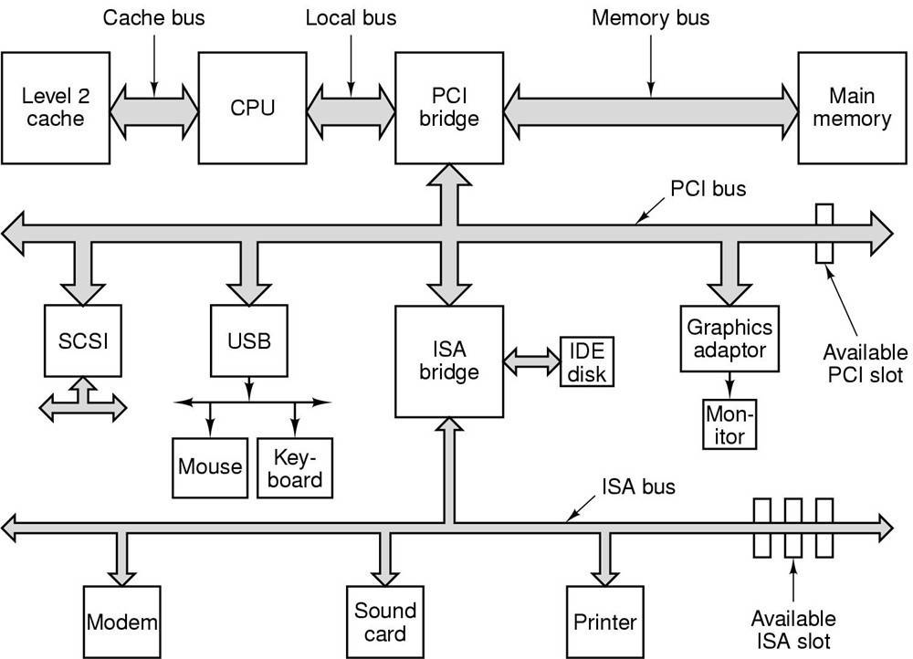

# 基础知识回顾

## 1 从 HelloWorld 引发的思考

```c
#include <stdio.h>

int main()
{
    printf("Hello World\n");
    return 0;
}
```

这是一个简单的问题，但是可以引出很多更深层次的问题，

1. 程序为什么要被编译器编译了之后才可以运行？
2. 编译器在把 C 语言程序转换成可以执行的机器码的过程中做了什么，怎么做的？
3. 最后编译出来的可执行文件里面是什么？除了机器码还有什么？它们怎么存放的，怎么组织的？
4. `#include <stdio.h>`是什么意思？把`stdio.h`包含进来意味着什么？C 语言库又是什么？它怎么实现的？
5. 不同的编译器（Microsoft VC、GCC）和不同的硬件平台（x86、SPARC、MIPS、ARM），以及不同的操作系统（Windows、Linux、UNIX、Solaris），最终编译出来的结果一样吗？为什么？
6. Hello World 程序是怎么运行起来的？操作系统是怎么装载它的？它从哪儿开始执行，到哪儿结束？main函数之前发生了什么？main 函数结束以后又发生了什么？
7. 如果没有操作系统，Hello World 可以运行吗？如果要在一台没有操作系统的机器上运行 Hello World 需要什么？应该怎么实现？
8. printf 是怎么实现的？它为什么可以有不定数量的参数？为什么它能够在终端上输出字符串？
9. Hello World 程序在运行时，它在内存中是什么样子的？

要真正地搞清楚这些问题，我们需要：从最基本的编译、静态链接到操作系统如何装载程序、动态链接及运行库和标准库的实现，甚至一些操作系统的机制，力争深入浅出地将这些问题层层剥开，最终使得这些程序运行背后的机制形成一个非常清晰而流畅的脉络。

## 2 计算机基本组成

1. 撇开计算机硬件中纷繁复杂的各种设备、芯片及外围接口等，站在软件开发者的角度看，我们只须抓住硬件的几个关键部件。对于系统程序开发者来说，计算机多如牛毛的硬件设备中，有三个部件最为关键，它们分别是中央处理器CPU、内存和I/O控制芯片，这三个部件几乎就是计算机的核心了。
2. 了解计算机硬件之间的组成架构，比如南桥、北桥、总线等。
3. 推荐阅读：[“Free Lunch is Over”](http://www.gotw.ca/publications/concurrency-ddj.htm)



## 3 分层架构

