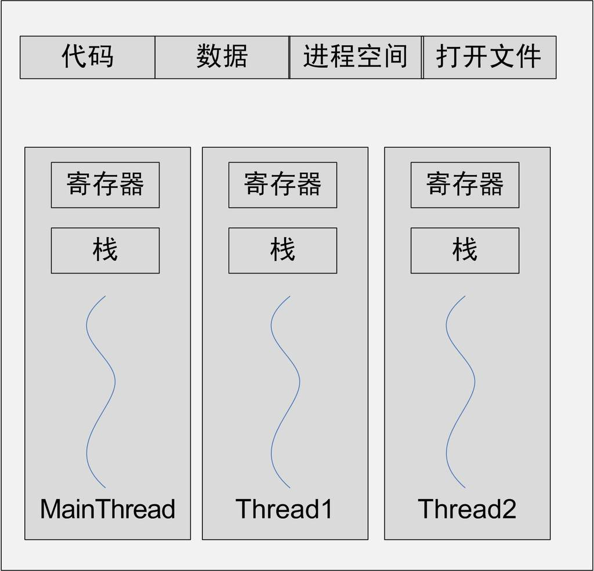
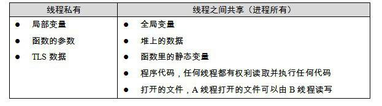

# 基础知识回顾

## 1 从 HelloWorld 引发的思考

```c
#include <stdio.h>

int main()
{
    printf("Hello World\n");
    return 0;
}
```

这是一个简单的问题，但是可以引出很多更深层次的问题，

1. 程序为什么要被编译器编译了之后才可以运行？
2. 编译器在把 C 语言程序转换成可以执行的机器码的过程中做了什么，怎么做的？
3. 最后编译出来的可执行文件里面是什么？除了机器码还有什么？它们怎么存放的，怎么组织的？
4. `#include <stdio.h>`是什么意思？把`stdio.h`包含进来意味着什么？C 语言库又是什么？它怎么实现的？
5. 不同的编译器（Microsoft VC、GCC）和不同的硬件平台（x86、SPARC、MIPS、ARM），以及不同的操作系统（Windows、Linux、UNIX、Solaris），最终编译出来的结果一样吗？为什么？
6. Hello World 程序是怎么运行起来的？操作系统是怎么装载它的？它从哪儿开始执行，到哪儿结束？main函数之前发生了什么？main 函数结束以后又发生了什么？
7. 如果没有操作系统，Hello World 可以运行吗？如果要在一台没有操作系统的机器上运行 Hello World 需要什么？应该怎么实现？
8. printf 是怎么实现的？它为什么可以有不定数量的参数？为什么它能够在终端上输出字符串？
9. Hello World 程序在运行时，它在内存中是什么样子的？

要真正地搞清楚这些问题，我们需要：从最基本的编译、静态链接到操作系统如何装载程序、动态链接及运行库和标准库的实现，甚至一些操作系统的机制，力争深入浅出地将这些问题层层剥开，最终使得这些程序运行背后的机制形成一个非常清晰而流畅的脉络。

## 2 计算机基本组成

1. 撇开计算机硬件中纷繁复杂的各种设备、芯片及外围接口等，站在软件开发者的角度看，我们只须抓住硬件的几个关键部件。对于系统程序开发者来说，计算机多如牛毛的硬件设备中，有三个部件最为关键，它们分别是中央处理器CPU、内存和I/O控制芯片，这三个部件几乎就是计算机的核心了。
2. 了解计算机硬件之间的组成架构，比如南桥、北桥、总线等。
3. 推荐阅读：[“Free Lunch is Over”](http://www.gotw.ca/publications/concurrency-ddj.htm)


## 3 分层架构

“Any problem in computer science can be solved by another layer of indirection.”——“计算机科学领域的任何问题都可以通过增加一个间接的中间层来解决”。

- 系统软件：管理计算机本身的软件，系统软件可以分成两块
  - 一块是平台性的，比如操作系统内核、驱动程序、运行库和数以千计的系统工具
  - 另外一块是用于程序开发的，比如编译器、汇编器、链接器等开发工具和开发库。
- 计算机系统软件体系结构采用一种层的结构。整个体系结构从上到下都是按照严格的层次结构设计的。
- 接口（Interface）：每个层次之间都须要相互通信，既然须要通信就必须有一个通信的协议，一般将其称为接口
- 计算机系统结构中除了硬件和应用程序，其他都是所谓的中间层，每个中间层都是对它下面的那层的包装和扩展。
- 最上层的是应用程序，它们都是操作系统应用程序编程接口（Application Programming Interface）的使用者。
- 操作系统内核层对于硬件层来说是硬件接口的使用者，硬件的生产厂商负责提供硬件规格。


## 4 操作系统

- 操作系统的一个功能是提供抽象的接口，另外一个主要功能是管理硬件资源。
- 一个计算机中的资源主要分CPU、存储器（包括内存和磁盘）和I/O设备。
- CPU分配方式演进：多道程序（Multiprogramming）--> 分时系统（Time-Sharing System）--> 抢占式（Preemptive）
  - 分时系统：每个程序运行一段时间以后都主动让出CPU给其他程序，使得一段时间内每个程序都有机会运行一小段时间。
  - 抢占式：操作系统可以强制剥夺CPU资源并且分配给它认为目前最需要的进程，操作系统分配给每个进程的时间都很短，即CPU在多个进程间快速地切换，从而造成了很多进程都在同时运行的假象。
- 当成熟的操作系统出现以后，硬件逐渐被抽象成了一系列概念。程序员逐渐从硬件细节中解放出来，可以更多地关注应用程序本身的开发。
- 操作系统的多任务功能使得 CPU 能够在多个进程之间很好地共享，从进程的角度看好像是它独占了 CPU 而不用考虑与其他进程分享 CPU 的事情。
- 操作系统的 I/O 抽象模型也很好地实现了 I/O 设备的共享和抽象。

## 5 内存划分

- 早期的计算机中，程序是直接运行在物理内存上的，也就是说，程序在运行时所访问的地址都是物理地址。这种方式有以下三个问题：
  - 地址空间不隔离，恶意程序可以轻易修改其他进程的内存数据。
  - 内存使用效率低，当内存不足时，需要将某些进程的内存数据暂时写入到磁盘中，内存数据的换入换出都是以进程为单位的，整个过程中有大量的数据在换入换出。
  - 程序运行的地址不确定，程序每次需要装入运行时，我们都需要给它从内存中分配一块足够大的空闲区域，这个空闲区域的位置是不确定的。
- 虚拟地址（Virtual Address）技术：把程序给出的地址看作是一种虚拟地址（Virtual Address），然后通过某些映射的方法，将这个虚拟地址转换成实际的物理地址，虚拟地址有效地做到了进程的隔离。
- 地址空间分两种：虚拟地址空间（Virtual Address Space）和物理地址空间（Physical Address Space）。
  - 物理地址空间是实实在在存在的，存在于计算机中，而且对于每一台计算机来说只有唯一的一个。
  - 虚拟地址空间是指虚拟的、人们想象出来的地址空间，其实它并不存在，每个进程都有自己独立的虚拟空间，而且每个进程只能访问自己的地址空间，这样就有效地做到了进程的隔离。
- 分段（Segmentation）：基本思路是把一段与程序所需要的内存空间大小的虚拟空间映射到某个地址空间。把这虚拟内存和实际内存相同大小的地址空间一一映射
  - 分段有效的解决了地址空间不隔离和程序运行的地址不确定的问题。
  - 分段对内存区域的映射还是按照程序为单位，如果内存不足，被换入换出到磁盘的都是整个程序，所有并没有有效解决内存使用效率低的问题。
- 分页（Paging）：分页的基本方法是把地址空间人为地等分成固定大小的页，每一页的大小由硬件决定，或硬件支持多种大小的页，由操作系统选择决定页的大小。比如Intel Pentium系列处理器支持4KB或4MB的页大小。
  - 分页解决内存使用效率低的问题：把进程的虚拟地址空间按页分割，把常用的数据和代码页装载到内存中，把不常用的代码和数据保存在磁盘里，当需要用到的时候再把它从磁盘里取出来即可。
  - 不同的页：虚拟空间的页就叫虚拟页（VP，Virtual Page），物理内存中的页叫做物理页（PP，Physical Page），磁盘中的页叫做磁盘页（DP，Disk Page）
  - 所有的硬件都采用一个叫 MMU（Memory Management Unit）的部件来进行页映射

进程虚拟空间、物理空间和磁盘之间的页映射关系：


虚拟地址到物理地址的转换：


## 6 线程

什么是线程：

- 线程（Thread），有时被称为轻量级进程（Lightweight Process, LWP），是程序执行流的最小单元。一个标准的线程由线程ID、当前指令指针（PC）、寄存器集合和堆栈组成。
- 一个进程由一个到多个线程组成，各个线程之间共享程序的内存空间（包括代码段、数据段、堆等）及一些进程级的资源（如打开文件和信号）。
- 线程是操作系统的概念，在不同的操作系统中的实现是不同的。

线程与进程的关系：



线程私有内存：

- 栈。
- 线程局部存储（Thread Local Storage, TLS）。线程局部存储是某些操作系统为线程单独提供的私有空间，但通常只具有很有限的容量。
- 寄存器（包括PC寄存器），寄存器是执行流的基本数据，因此为线程私有。



线程的状态：

- 运行（Running）：此时线程正在执行。
- 就绪（Ready）：此时线程可以立刻运行，但CPU已经被占用。
- 等待（Waiting）：此时线程正在等待某一事件（通常是I/O或同步）发生，无法执行。

时间片：

- 处于运行中线程拥有一段可以执行的时间，这段时间称为时间片（Time Slice）。
- 当时间片用尽的时候，该进程将进入就绪状态。如果在时间片用尽之前进程就开始等待某事件，那么它将进入等待状态。


线程优先级：

- 现在的线程调度策略使用的是优先级调度（Priority Schedule）。
- 优先级调度决定了线程按照什么顺序轮流执行。
- 线程的优先级改变一般有三种方式。
  - 用户指定优先级。
  - 根据进入等待状态的频繁程度提升或降低优先级。
  - 长时间得不到执行而被提升优先级（操作系统防止线程优先级较低的线程长时间得不到运行而饿死（Starvation））。

任务类型：

- 我们一般把频繁等待的线程称之为IO密集型线程（IO Bound Thread）。
- 把很少等待的线程称为CPU密集型线程（CPU Bound Thread）。
- IO密集型线程总是比CPU密集型线程容易得到优先级的提升。

抢占式和非抢占式：

- 抢占式：线程在用尽时间片之后会被强制剥夺继续执行的权利，而进入就绪状态，这个过程叫做抢占（Preemption），即之后执行的别的线程抢占了当前线程。
- 不可抢占线程：早期的一些系统线程是不可抢占的。线程需要主动放弃执行权才能让渡CPU执行其，线程主动放弃执行无非两种情况。
  - 当线程试图等待某事件时（I/O等）。
  - 线程主动放弃时间片。

Windows 多线程:

- Windows内核有明确的线程和进程的概念。
- 在Windows API中，可以使用明确的API：CreateProcess和CreateThread来创建进程和线程。

Linux 多线程：

- 线程对于Linux来说，线程并不是一个通用的概念。
- 在Linux内核中并不存在真正意义上的线程概念。Linux将所有的执行实体（无论是线程还是进程）都称为任务（Task），每一个任务概念上都类似于一个单线程的进程，具有内存空间、执行实体、文件资源等。
- Linux下不同的任务之间可以选择共享内存空间，因而在实际意义上，共享了同一个内存空间的多个任务构成了一个进程，这些任务也就成了这个进程里的线程。

Linux 下创建任务：


线程安全：

- 同步：所谓同步，既是指在一个线程访问数据未结束的时候，其他线程不得对同一个数据进行访问。如此，对数据的访问被原子化了。
- 锁：
  - 二元信号量（Binary Semaphore）
  - 多元信号量简称信号量（Semaphore）
  - 互斥量（Mutex）
  - 读写锁（Read-Write Lock）
  - 临界区（Critical Section）
  - 条件变量（Condition Variable）
  - 可重入函数：可重入是并发安全的强力保障，一个可重入的函数可以在多线程环境下放心使用。

三种线程模型：内核线程和用户态线程：用户态线程并不一定在操作系统内核里对应同等数量的内核线程。

一对一模型：一个用户使用的线程就唯一对应一个内核使用的线程（但反过来不一定，一个内核里的线程在用户态不一定有对应的线程存在），Linux，还有 Windows 操作系统的家族，都实现了一对一模型。

- 优点：
  - 线程之间的并发是真正的并发，一个线程因为某原因阻塞时，其他线程执行不会受到影响。
  - 一对一模型也可以让多线程程序在多处理器的系统上有更好的表现。
- 缺点：
  - 由于许多操作系统限制了内核线程的数量，因此一对一线程会让用户的线程数量受到限制。
  - 许多操作系统内核线程调度时，上下文切换的开销较大，导致用户线程的执行效率下降。

多对一模型：多对一模型将多个用户线程映射到一个内核线程上，线程之间的切换由用户态的代码来进行。

- 优点：
  - 相对于一对一模型，多对一模型的线程切换要快速许多。
  - 几乎无限制的用户态线程数量。
- 缺点：
  - 如果其中一个用户线程阻塞，那么所有的线程都将无法执行，因为此时内核里的线程也随之阻塞了。
  - 在多处理器系统上，处理器的增多对多对一模型的线程性能也不会有明显的帮助。

多对多模型：多对多模型结合了多对一模型和一对一模型的特点，将多个用户线程映射到少数但不止一个内核线程上。

- 多对多模型中，一个用户线程阻塞并不会使得所有的用户线程阻塞，因为此时还有别的线程可以被调度来执行。
- 多对多模型对用户线程的数量也没什么限制，在多处理器系统上，多对多模型的线程也能得到一定的性能提升。

创建一对一线程：

- 在Linux里使用clone（带有CLONE_VM参数）产生的线程就是一个一对一线程，因为此时在内核有一个唯一的线程与之对应。
- 在Windows里，使用API CreateThread即可创建一个一对一的线程。
